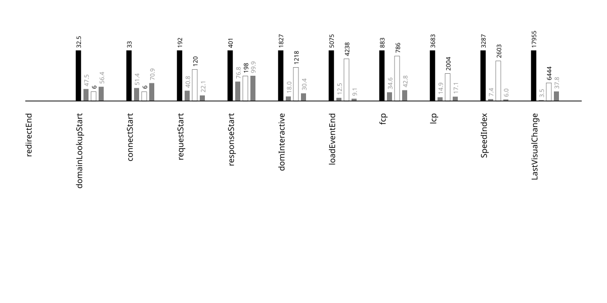

## metadata
{::nomarkdown}
<?xml version="1.0" encoding="utf-8"?>
<!DOCTYPE svg PUBLIC "-//W3C//DTD SVG 1.1//EN" "http://www.w3.org/Graphics/SVG/1.1/DTD/svg11.dtd">
<svg version="1.1"
     id="svg2" xml:space="preserve"
     xmlns="http://www.w3.org/2000/svg"
     xmlns:xlink="http://www.w3.org/1999/xlink"
     xmlns:html="http://www.w3.org/1999/xhtml"
x="0px" y="0px"
width="540.000000px" height="150.000000px"
viewBox="0 0 540.000000 150.000000" enable-background="new 0 0 540.000000 150.000000">

<g id="metadata">
<rect x="0.000000" y="0.000000" width="540.000000" height="150.000000"
 style="fill:rgb(200,200,200); fill-opacity:1; stroke:rgb(200,200,200); stroke-opacity:0; stroke-width:0.5" />
 <a href="https://bameethainoodle.com/">
<text x="270.000000" y="50.000000" font-family="Atkinson Hyperlegible" font-size="24.000000pt" text-anchor="middle" text-align="center" font-weight="600" font-style="normal"  style="fill:rgb(0,0,255); fill-opacity:1; stroke:rgb(255,255,255); stroke-opacity:0; stroke-width:0.5">bameethainoodle</text>
 </a>
<text x="270.000000" y="86.000000" font-family="Atkinson Hyperlegible" font-size="12.000000pt" text-anchor="middle" text-align="center" font-weight="500" font-style="normal"  style="fill:rgb(148,148,148); fill-opacity:1; stroke:rgb(255,255,255); stroke-opacity:0; stroke-width:0.5">2025-07-03</text>
<text x="275.000000" y="98.000000" font-family="Atkinson Hyperlegible" font-size="12.000000pt" text-anchor="middle" text-align="center" font-weight="500" font-style="normal"  style="fill:rgb(148,148,148); fill-opacity:1; stroke:rgb(255,255,255); stroke-opacity:0; stroke-width:0.5">android-15-ptablet-talkback</text>
<text x="337.500000" y="122.000000" font-family="Atkinson Hyperlegible" font-size="14.000000pt" text-anchor="start" text-align="left" font-weight="600" font-style="normal"  style="fill:rgb(255,255,255); fill-opacity:1; stroke:rgb(0,0,0); stroke-opacity:0; stroke-width:0.5">chrome</text>
<text x="202.500000" y="122.000000" font-family="Atkinson Hyperlegible" font-size="14.000000pt" text-anchor="end" text-align="right" font-weight="600" font-style="normal"  style="fill:rgb(0,0,0); fill-opacity:1; stroke:rgb(0,0,0); stroke-opacity:0; stroke-width:0.5">firefox</text>
</g>
</svg>

{:/}

---

## side by side video
{::nomarkdown}
<?xml version="1.0" encoding="utf-8"?>
<!DOCTYPE svg PUBLIC "-//W3C//DTD SVG 1.1//EN" "http://www.w3.org/Graphics/SVG/1.1/DTD/svg11.dtd">
<svg version="1.1"
     id="svg2" xml:space="preserve"
     xmlns="http://www.w3.org/2000/svg"
     xmlns:xlink="http://www.w3.org/1999/xlink"
     xmlns:html="http://www.w3.org/1999/xhtml"
x="0px" y="0px"
width="540.000000px" height="585.000000px"
viewBox="0 0 540.000000 585.000000" enable-background="new 0 0 540.000000 585.000000">

<g id="video_side_x_side">
<g>

<g id="video-wrapper" transform="scale(1,1)">

<foreignObject x="0.000000" y="0.000000" width="2160.000000" height="2340.000000">
 <video xmlns="http://www.w3.org/1999/xhtml"   width="540.000000" height="585.000000"  controls="" loop="false" muted="true"  >
<source src="../videos/2025-07-03-android-15-ptablet-talkback-bameethainoodle-side-by-side.mp4" type="video/mp4" />
</video>
 </foreignObject></g></g>
</g>
</svg>

{:/}

---

## % visually complete by millisecond (SpeedIndex)
{::nomarkdown}
<?xml version="1.0" encoding="utf-8"?>
<!DOCTYPE svg PUBLIC "-//W3C//DTD SVG 1.1//EN" "http://www.w3.org/Graphics/SVG/1.1/DTD/svg11.dtd">
<svg version="1.1"
     id="svg2" xml:space="preserve"
     xmlns="http://www.w3.org/2000/svg"
     xmlns:xlink="http://www.w3.org/1999/xlink"
     xmlns:html="http://www.w3.org/1999/xhtml"
x="0px" y="0px"
width="900.000000px" height="600.000000px"
viewBox="0 0 900.000000 600.000000" enable-background="new 0 0 900.000000 600.000000">

<title>
2025-07-03-android-15-ptablet-talkback-bameethainoodle_x_line_graph
</title>
<desc>
SpeedIndexProgress line graph for annotation
</desc>
 <g id="tic-x-annotation">
<text x="100.000000" y="512.000000" font-family="Apercu" font-size="7.000000pt" text-anchor="middle" text-align="center" dominant-baseline="central" font-weight="400" font-style="normal"  style="fill:rgb(118,118,118); fill-opacity:1; stroke:rgb(118,118,118); stroke-opacity:0; stroke-width:0.5">0.0s</text>
<text x="132.882375" y="512.000000" font-family="Apercu" font-size="7.000000pt" text-anchor="middle" text-align="center" dominant-baseline="central" font-weight="400" font-style="normal"  style="fill:rgb(118,118,118); fill-opacity:1; stroke:rgb(118,118,118); stroke-opacity:0; stroke-width:0.5">0.5s</text>
<text x="165.764750" y="512.000000" font-family="Apercu" font-size="7.000000pt" text-anchor="middle" text-align="center" dominant-baseline="central" font-weight="400" font-style="normal"  style="fill:rgb(118,118,118); fill-opacity:1; stroke:rgb(118,118,118); stroke-opacity:0; stroke-width:0.5">1.0s</text>
<text x="198.647125" y="512.000000" font-family="Apercu" font-size="7.000000pt" text-anchor="middle" text-align="center" dominant-baseline="central" font-weight="400" font-style="normal"  style="fill:rgb(118,118,118); fill-opacity:1; stroke:rgb(118,118,118); stroke-opacity:0; stroke-width:0.5">1.5s</text>
<text x="231.529500" y="512.000000" font-family="Apercu" font-size="7.000000pt" text-anchor="middle" text-align="center" dominant-baseline="central" font-weight="400" font-style="normal"  style="fill:rgb(118,118,118); fill-opacity:1; stroke:rgb(118,118,118); stroke-opacity:0; stroke-width:0.5">2.0s</text>
<text x="264.411875" y="512.000000" font-family="Apercu" font-size="7.000000pt" text-anchor="middle" text-align="center" dominant-baseline="central" font-weight="400" font-style="normal"  style="fill:rgb(118,118,118); fill-opacity:1; stroke:rgb(118,118,118); stroke-opacity:0; stroke-width:0.5">2.5s</text>
<text x="297.294250" y="512.000000" font-family="Apercu" font-size="7.000000pt" text-anchor="middle" text-align="center" dominant-baseline="central" font-weight="400" font-style="normal"  style="fill:rgb(118,118,118); fill-opacity:1; stroke:rgb(118,118,118); stroke-opacity:0; stroke-width:0.5">3.0s</text>
<text x="330.176625" y="512.000000" font-family="Apercu" font-size="7.000000pt" text-anchor="middle" text-align="center" dominant-baseline="central" font-weight="400" font-style="normal"  style="fill:rgb(118,118,118); fill-opacity:1; stroke:rgb(118,118,118); stroke-opacity:0; stroke-width:0.5">3.5s</text>
<text x="363.059000" y="512.000000" font-family="Apercu" font-size="7.000000pt" text-anchor="middle" text-align="center" dominant-baseline="central" font-weight="400" font-style="normal"  style="fill:rgb(118,118,118); fill-opacity:1; stroke:rgb(118,118,118); stroke-opacity:0; stroke-width:0.5">4.0s</text>
<text x="395.941375" y="512.000000" font-family="Apercu" font-size="7.000000pt" text-anchor="middle" text-align="center" dominant-baseline="central" font-weight="400" font-style="normal"  style="fill:rgb(118,118,118); fill-opacity:1; stroke:rgb(118,118,118); stroke-opacity:0; stroke-width:0.5">4.5s</text>
<text x="428.823750" y="512.000000" font-family="Apercu" font-size="7.000000pt" text-anchor="middle" text-align="center" dominant-baseline="central" font-weight="400" font-style="normal"  style="fill:rgb(118,118,118); fill-opacity:1; stroke:rgb(118,118,118); stroke-opacity:0; stroke-width:0.5">5.0s</text>
<text x="461.706126" y="512.000000" font-family="Apercu" font-size="7.000000pt" text-anchor="middle" text-align="center" dominant-baseline="central" font-weight="400" font-style="normal"  style="fill:rgb(118,118,118); fill-opacity:1; stroke:rgb(118,118,118); stroke-opacity:0; stroke-width:0.5">5.5s</text>
<text x="494.588501" y="512.000000" font-family="Apercu" font-size="7.000000pt" text-anchor="middle" text-align="center" dominant-baseline="central" font-weight="400" font-style="normal"  style="fill:rgb(118,118,118); fill-opacity:1; stroke:rgb(118,118,118); stroke-opacity:0; stroke-width:0.5">6.0s</text>
<text x="527.470876" y="512.000000" font-family="Apercu" font-size="7.000000pt" text-anchor="middle" text-align="center" dominant-baseline="central" font-weight="400" font-style="normal"  style="fill:rgb(118,118,118); fill-opacity:1; stroke:rgb(118,118,118); stroke-opacity:0; stroke-width:0.5">6.5s</text>
<text x="560.353251" y="512.000000" font-family="Apercu" font-size="7.000000pt" text-anchor="middle" text-align="center" dominant-baseline="central" font-weight="400" font-style="normal"  style="fill:rgb(118,118,118); fill-opacity:1; stroke:rgb(118,118,118); stroke-opacity:0; stroke-width:0.5">7.0s</text>
<text x="593.235626" y="512.000000" font-family="Apercu" font-size="7.000000pt" text-anchor="middle" text-align="center" dominant-baseline="central" font-weight="400" font-style="normal"  style="fill:rgb(118,118,118); fill-opacity:1; stroke:rgb(118,118,118); stroke-opacity:0; stroke-width:0.5">7.5s</text>
<text x="626.118001" y="512.000000" font-family="Apercu" font-size="7.000000pt" text-anchor="middle" text-align="center" dominant-baseline="central" font-weight="400" font-style="normal"  style="fill:rgb(118,118,118); fill-opacity:1; stroke:rgb(118,118,118); stroke-opacity:0; stroke-width:0.5">8.0s</text>
<text x="659.000376" y="512.000000" font-family="Apercu" font-size="7.000000pt" text-anchor="middle" text-align="center" dominant-baseline="central" font-weight="400" font-style="normal"  style="fill:rgb(118,118,118); fill-opacity:1; stroke:rgb(118,118,118); stroke-opacity:0; stroke-width:0.5">8.5s</text>
<text x="691.882751" y="512.000000" font-family="Apercu" font-size="7.000000pt" text-anchor="middle" text-align="center" dominant-baseline="central" font-weight="400" font-style="normal"  style="fill:rgb(118,118,118); fill-opacity:1; stroke:rgb(118,118,118); stroke-opacity:0; stroke-width:0.5">9.0s</text>
<text x="724.765126" y="512.000000" font-family="Apercu" font-size="7.000000pt" text-anchor="middle" text-align="center" dominant-baseline="central" font-weight="400" font-style="normal"  style="fill:rgb(118,118,118); fill-opacity:1; stroke:rgb(118,118,118); stroke-opacity:0; stroke-width:0.5">9.5s</text>
<text x="757.647501" y="512.000000" font-family="Apercu" font-size="7.000000pt" text-anchor="middle" text-align="center" dominant-baseline="central" font-weight="400" font-style="normal"  style="fill:rgb(118,118,118); fill-opacity:1; stroke:rgb(118,118,118); stroke-opacity:0; stroke-width:0.5">10.0s</text>
<text x="790.529876" y="512.000000" font-family="Apercu" font-size="7.000000pt" text-anchor="middle" text-align="center" dominant-baseline="central" font-weight="400" font-style="normal"  style="fill:rgb(118,118,118); fill-opacity:1; stroke:rgb(118,118,118); stroke-opacity:0; stroke-width:0.5">10.5s</text>
 </g> <g id="tic-y-annotation">
<text x="76.000000" y="460.000000" font-family="Apercu" font-size="7.000000pt" text-anchor="middle" text-align="center" dominant-baseline="central" font-weight="400" font-style="normal"  style="fill:rgb(118,118,118); fill-opacity:1; stroke:rgb(118,118,118); stroke-opacity:0; stroke-width:0.5">10%</text>
<text x="824.000000" y="460.000000" font-family="Apercu" font-size="7.000000pt" text-anchor="middle" text-align="center" dominant-baseline="central" font-weight="400" font-style="normal"  style="fill:rgb(118,118,118); fill-opacity:1; stroke:rgb(118,118,118); stroke-opacity:0; stroke-width:0.5">10%</text>
<text x="76.000000" y="420.000000" font-family="Apercu" font-size="7.000000pt" text-anchor="middle" text-align="center" dominant-baseline="central" font-weight="400" font-style="normal"  style="fill:rgb(118,118,118); fill-opacity:1; stroke:rgb(118,118,118); stroke-opacity:0; stroke-width:0.5">20%</text>
<text x="824.000000" y="420.000000" font-family="Apercu" font-size="7.000000pt" text-anchor="middle" text-align="center" dominant-baseline="central" font-weight="400" font-style="normal"  style="fill:rgb(118,118,118); fill-opacity:1; stroke:rgb(118,118,118); stroke-opacity:0; stroke-width:0.5">20%</text>
<text x="76.000000" y="380.000000" font-family="Apercu" font-size="7.000000pt" text-anchor="middle" text-align="center" dominant-baseline="central" font-weight="400" font-style="normal"  style="fill:rgb(118,118,118); fill-opacity:1; stroke:rgb(118,118,118); stroke-opacity:0; stroke-width:0.5">30%</text>
<text x="824.000000" y="380.000000" font-family="Apercu" font-size="7.000000pt" text-anchor="middle" text-align="center" dominant-baseline="central" font-weight="400" font-style="normal"  style="fill:rgb(118,118,118); fill-opacity:1; stroke:rgb(118,118,118); stroke-opacity:0; stroke-width:0.5">30%</text>
<text x="76.000000" y="340.000000" font-family="Apercu" font-size="7.000000pt" text-anchor="middle" text-align="center" dominant-baseline="central" font-weight="400" font-style="normal"  style="fill:rgb(118,118,118); fill-opacity:1; stroke:rgb(118,118,118); stroke-opacity:0; stroke-width:0.5">40%</text>
<text x="824.000000" y="340.000000" font-family="Apercu" font-size="7.000000pt" text-anchor="middle" text-align="center" dominant-baseline="central" font-weight="400" font-style="normal"  style="fill:rgb(118,118,118); fill-opacity:1; stroke:rgb(118,118,118); stroke-opacity:0; stroke-width:0.5">40%</text>
<text x="76.000000" y="300.000000" font-family="Apercu" font-size="7.000000pt" text-anchor="middle" text-align="center" dominant-baseline="central" font-weight="400" font-style="normal"  style="fill:rgb(118,118,118); fill-opacity:1; stroke:rgb(118,118,118); stroke-opacity:0; stroke-width:0.5">50%</text>
<text x="824.000000" y="300.000000" font-family="Apercu" font-size="7.000000pt" text-anchor="middle" text-align="center" dominant-baseline="central" font-weight="400" font-style="normal"  style="fill:rgb(118,118,118); fill-opacity:1; stroke:rgb(118,118,118); stroke-opacity:0; stroke-width:0.5">50%</text>
<text x="76.000000" y="260.000000" font-family="Apercu" font-size="7.000000pt" text-anchor="middle" text-align="center" dominant-baseline="central" font-weight="400" font-style="normal"  style="fill:rgb(118,118,118); fill-opacity:1; stroke:rgb(118,118,118); stroke-opacity:0; stroke-width:0.5">60%</text>
<text x="824.000000" y="260.000000" font-family="Apercu" font-size="7.000000pt" text-anchor="middle" text-align="center" dominant-baseline="central" font-weight="400" font-style="normal"  style="fill:rgb(118,118,118); fill-opacity:1; stroke:rgb(118,118,118); stroke-opacity:0; stroke-width:0.5">60%</text>
<text x="76.000000" y="220.000000" font-family="Apercu" font-size="7.000000pt" text-anchor="middle" text-align="center" dominant-baseline="central" font-weight="400" font-style="normal"  style="fill:rgb(118,118,118); fill-opacity:1; stroke:rgb(118,118,118); stroke-opacity:0; stroke-width:0.5">70%</text>
<text x="824.000000" y="220.000000" font-family="Apercu" font-size="7.000000pt" text-anchor="middle" text-align="center" dominant-baseline="central" font-weight="400" font-style="normal"  style="fill:rgb(118,118,118); fill-opacity:1; stroke:rgb(118,118,118); stroke-opacity:0; stroke-width:0.5">70%</text>
<text x="76.000000" y="180.000000" font-family="Apercu" font-size="7.000000pt" text-anchor="middle" text-align="center" dominant-baseline="central" font-weight="400" font-style="normal"  style="fill:rgb(118,118,118); fill-opacity:1; stroke:rgb(118,118,118); stroke-opacity:0; stroke-width:0.5">80%</text>
<text x="824.000000" y="180.000000" font-family="Apercu" font-size="7.000000pt" text-anchor="middle" text-align="center" dominant-baseline="central" font-weight="400" font-style="normal"  style="fill:rgb(118,118,118); fill-opacity:1; stroke:rgb(118,118,118); stroke-opacity:0; stroke-width:0.5">80%</text>
<text x="76.000000" y="140.000000" font-family="Apercu" font-size="7.000000pt" text-anchor="middle" text-align="center" dominant-baseline="central" font-weight="400" font-style="normal"  style="fill:rgb(118,118,118); fill-opacity:1; stroke:rgb(118,118,118); stroke-opacity:0; stroke-width:0.5">90%</text>
<text x="824.000000" y="140.000000" font-family="Apercu" font-size="7.000000pt" text-anchor="middle" text-align="center" dominant-baseline="central" font-weight="400" font-style="normal"  style="fill:rgb(118,118,118); fill-opacity:1; stroke:rgb(118,118,118); stroke-opacity:0; stroke-width:0.5">90%</text>
<text x="76.000000" y="100.000000" font-family="Apercu" font-size="7.000000pt" text-anchor="middle" text-align="center" dominant-baseline="central" font-weight="400" font-style="normal"  style="fill:rgb(118,118,118); fill-opacity:1; stroke:rgb(118,118,118); stroke-opacity:0; stroke-width:0.5">100%</text>
<text x="824.000000" y="100.000000" font-family="Apercu" font-size="7.000000pt" text-anchor="middle" text-align="center" dominant-baseline="central" font-weight="400" font-style="normal"  style="fill:rgb(118,118,118); fill-opacity:1; stroke:rgb(118,118,118); stroke-opacity:0; stroke-width:0.5">100%</text>
 </g> <g id="tic-y-lines-annotation">
<line x1="112.000000" y1="460.000000" x2="788.000000" y2="460.000000" style="fill:rgb(118,118,118); fill-opacity:0; stroke:rgb(230,230,230); stroke-opacity:1; stroke-width:1" />
<text x="132.882375" y="460.000000" font-family="Apercu" font-size="3.000000pt" text-anchor="middle" text-align="center" dominant-baseline="central" font-weight="400" font-style="normal"  style="fill:rgb(118,118,118); fill-opacity:1; stroke:rgb(118,118,118); stroke-opacity:0; stroke-width:0.5">10%</text>
<text x="165.764750" y="460.000000" font-family="Apercu" font-size="3.000000pt" text-anchor="middle" text-align="center" dominant-baseline="central" font-weight="400" font-style="normal"  style="fill:rgb(118,118,118); fill-opacity:1; stroke:rgb(118,118,118); stroke-opacity:0; stroke-width:0.5">10%</text>
<text x="198.647125" y="460.000000" font-family="Apercu" font-size="3.000000pt" text-anchor="middle" text-align="center" dominant-baseline="central" font-weight="400" font-style="normal"  style="fill:rgb(118,118,118); fill-opacity:1; stroke:rgb(118,118,118); stroke-opacity:0; stroke-width:0.5">10%</text>
<text x="231.529500" y="460.000000" font-family="Apercu" font-size="3.000000pt" text-anchor="middle" text-align="center" dominant-baseline="central" font-weight="400" font-style="normal"  style="fill:rgb(118,118,118); fill-opacity:1; stroke:rgb(118,118,118); stroke-opacity:0; stroke-width:0.5">10%</text>
<text x="264.411875" y="460.000000" font-family="Apercu" font-size="3.000000pt" text-anchor="middle" text-align="center" dominant-baseline="central" font-weight="400" font-style="normal"  style="fill:rgb(118,118,118); fill-opacity:1; stroke:rgb(118,118,118); stroke-opacity:0; stroke-width:0.5">10%</text>
<text x="297.294250" y="460.000000" font-family="Apercu" font-size="3.000000pt" text-anchor="middle" text-align="center" dominant-baseline="central" font-weight="400" font-style="normal"  style="fill:rgb(118,118,118); fill-opacity:1; stroke:rgb(118,118,118); stroke-opacity:0; stroke-width:0.5">10%</text>
<text x="330.176625" y="460.000000" font-family="Apercu" font-size="3.000000pt" text-anchor="middle" text-align="center" dominant-baseline="central" font-weight="400" font-style="normal"  style="fill:rgb(118,118,118); fill-opacity:1; stroke:rgb(118,118,118); stroke-opacity:0; stroke-width:0.5">10%</text>
<text x="363.059000" y="460.000000" font-family="Apercu" font-size="3.000000pt" text-anchor="middle" text-align="center" dominant-baseline="central" font-weight="400" font-style="normal"  style="fill:rgb(118,118,118); fill-opacity:1; stroke:rgb(118,118,118); stroke-opacity:0; stroke-width:0.5">10%</text>
<text x="395.941375" y="460.000000" font-family="Apercu" font-size="3.000000pt" text-anchor="middle" text-align="center" dominant-baseline="central" font-weight="400" font-style="normal"  style="fill:rgb(118,118,118); fill-opacity:1; stroke:rgb(118,118,118); stroke-opacity:0; stroke-width:0.5">10%</text>
<text x="428.823750" y="460.000000" font-family="Apercu" font-size="3.000000pt" text-anchor="middle" text-align="center" dominant-baseline="central" font-weight="400" font-style="normal"  style="fill:rgb(118,118,118); fill-opacity:1; stroke:rgb(118,118,118); stroke-opacity:0; stroke-width:0.5">10%</text>
<text x="461.706126" y="460.000000" font-family="Apercu" font-size="3.000000pt" text-anchor="middle" text-align="center" dominant-baseline="central" font-weight="400" font-style="normal"  style="fill:rgb(118,118,118); fill-opacity:1; stroke:rgb(118,118,118); stroke-opacity:0; stroke-width:0.5">10%</text>
<text x="494.588501" y="460.000000" font-family="Apercu" font-size="3.000000pt" text-anchor="middle" text-align="center" dominant-baseline="central" font-weight="400" font-style="normal"  style="fill:rgb(118,118,118); fill-opacity:1; stroke:rgb(118,118,118); stroke-opacity:0; stroke-width:0.5">10%</text>
<text x="527.470876" y="460.000000" font-family="Apercu" font-size="3.000000pt" text-anchor="middle" text-align="center" dominant-baseline="central" font-weight="400" font-style="normal"  style="fill:rgb(118,118,118); fill-opacity:1; stroke:rgb(118,118,118); stroke-opacity:0; stroke-width:0.5">10%</text>
<text x="560.353251" y="460.000000" font-family="Apercu" font-size="3.000000pt" text-anchor="middle" text-align="center" dominant-baseline="central" font-weight="400" font-style="normal"  style="fill:rgb(118,118,118); fill-opacity:1; stroke:rgb(118,118,118); stroke-opacity:0; stroke-width:0.5">10%</text>
<text x="593.235626" y="460.000000" font-family="Apercu" font-size="3.000000pt" text-anchor="middle" text-align="center" dominant-baseline="central" font-weight="400" font-style="normal"  style="fill:rgb(118,118,118); fill-opacity:1; stroke:rgb(118,118,118); stroke-opacity:0; stroke-width:0.5">10%</text>
<text x="626.118001" y="460.000000" font-family="Apercu" font-size="3.000000pt" text-anchor="middle" text-align="center" dominant-baseline="central" font-weight="400" font-style="normal"  style="fill:rgb(118,118,118); fill-opacity:1; stroke:rgb(118,118,118); stroke-opacity:0; stroke-width:0.5">10%</text>
<text x="659.000376" y="460.000000" font-family="Apercu" font-size="3.000000pt" text-anchor="middle" text-align="center" dominant-baseline="central" font-weight="400" font-style="normal"  style="fill:rgb(118,118,118); fill-opacity:1; stroke:rgb(118,118,118); stroke-opacity:0; stroke-width:0.5">10%</text>
<text x="691.882751" y="460.000000" font-family="Apercu" font-size="3.000000pt" text-anchor="middle" text-align="center" dominant-baseline="central" font-weight="400" font-style="normal"  style="fill:rgb(118,118,118); fill-opacity:1; stroke:rgb(118,118,118); stroke-opacity:0; stroke-width:0.5">10%</text>
<text x="724.765126" y="460.000000" font-family="Apercu" font-size="3.000000pt" text-anchor="middle" text-align="center" dominant-baseline="central" font-weight="400" font-style="normal"  style="fill:rgb(118,118,118); fill-opacity:1; stroke:rgb(118,118,118); stroke-opacity:0; stroke-width:0.5">10%</text>
<text x="757.647501" y="460.000000" font-family="Apercu" font-size="3.000000pt" text-anchor="middle" text-align="center" dominant-baseline="central" font-weight="400" font-style="normal"  style="fill:rgb(118,118,118); fill-opacity:1; stroke:rgb(118,118,118); stroke-opacity:0; stroke-width:0.5">10%</text>
<line x1="112.000000" y1="420.000000" x2="788.000000" y2="420.000000" style="fill:rgb(118,118,118); fill-opacity:0; stroke:rgb(230,230,230); stroke-opacity:1; stroke-width:1" />
<text x="132.882375" y="420.000000" font-family="Apercu" font-size="3.000000pt" text-anchor="middle" text-align="center" dominant-baseline="central" font-weight="400" font-style="normal"  style="fill:rgb(118,118,118); fill-opacity:1; stroke:rgb(118,118,118); stroke-opacity:0; stroke-width:0.5">20%</text>
<text x="165.764750" y="420.000000" font-family="Apercu" font-size="3.000000pt" text-anchor="middle" text-align="center" dominant-baseline="central" font-weight="400" font-style="normal"  style="fill:rgb(118,118,118); fill-opacity:1; stroke:rgb(118,118,118); stroke-opacity:0; stroke-width:0.5">20%</text>
<text x="198.647125" y="420.000000" font-family="Apercu" font-size="3.000000pt" text-anchor="middle" text-align="center" dominant-baseline="central" font-weight="400" font-style="normal"  style="fill:rgb(118,118,118); fill-opacity:1; stroke:rgb(118,118,118); stroke-opacity:0; stroke-width:0.5">20%</text>
<text x="231.529500" y="420.000000" font-family="Apercu" font-size="3.000000pt" text-anchor="middle" text-align="center" dominant-baseline="central" font-weight="400" font-style="normal"  style="fill:rgb(118,118,118); fill-opacity:1; stroke:rgb(118,118,118); stroke-opacity:0; stroke-width:0.5">20%</text>
<text x="264.411875" y="420.000000" font-family="Apercu" font-size="3.000000pt" text-anchor="middle" text-align="center" dominant-baseline="central" font-weight="400" font-style="normal"  style="fill:rgb(118,118,118); fill-opacity:1; stroke:rgb(118,118,118); stroke-opacity:0; stroke-width:0.5">20%</text>
<text x="297.294250" y="420.000000" font-family="Apercu" font-size="3.000000pt" text-anchor="middle" text-align="center" dominant-baseline="central" font-weight="400" font-style="normal"  style="fill:rgb(118,118,118); fill-opacity:1; stroke:rgb(118,118,118); stroke-opacity:0; stroke-width:0.5">20%</text>
<text x="330.176625" y="420.000000" font-family="Apercu" font-size="3.000000pt" text-anchor="middle" text-align="center" dominant-baseline="central" font-weight="400" font-style="normal"  style="fill:rgb(118,118,118); fill-opacity:1; stroke:rgb(118,118,118); stroke-opacity:0; stroke-width:0.5">20%</text>
<text x="363.059000" y="420.000000" font-family="Apercu" font-size="3.000000pt" text-anchor="middle" text-align="center" dominant-baseline="central" font-weight="400" font-style="normal"  style="fill:rgb(118,118,118); fill-opacity:1; stroke:rgb(118,118,118); stroke-opacity:0; stroke-width:0.5">20%</text>
<text x="395.941375" y="420.000000" font-family="Apercu" font-size="3.000000pt" text-anchor="middle" text-align="center" dominant-baseline="central" font-weight="400" font-style="normal"  style="fill:rgb(118,118,118); fill-opacity:1; stroke:rgb(118,118,118); stroke-opacity:0; stroke-width:0.5">20%</text>
<text x="428.823750" y="420.000000" font-family="Apercu" font-size="3.000000pt" text-anchor="middle" text-align="center" dominant-baseline="central" font-weight="400" font-style="normal"  style="fill:rgb(118,118,118); fill-opacity:1; stroke:rgb(118,118,118); stroke-opacity:0; stroke-width:0.5">20%</text>
<text x="461.706126" y="420.000000" font-family="Apercu" font-size="3.000000pt" text-anchor="middle" text-align="center" dominant-baseline="central" font-weight="400" font-style="normal"  style="fill:rgb(118,118,118); fill-opacity:1; stroke:rgb(118,118,118); stroke-opacity:0; stroke-width:0.5">20%</text>
<text x="494.588501" y="420.000000" font-family="Apercu" font-size="3.000000pt" text-anchor="middle" text-align="center" dominant-baseline="central" font-weight="400" font-style="normal"  style="fill:rgb(118,118,118); fill-opacity:1; stroke:rgb(118,118,118); stroke-opacity:0; stroke-width:0.5">20%</text>
<text x="527.470876" y="420.000000" font-family="Apercu" font-size="3.000000pt" text-anchor="middle" text-align="center" dominant-baseline="central" font-weight="400" font-style="normal"  style="fill:rgb(118,118,118); fill-opacity:1; stroke:rgb(118,118,118); stroke-opacity:0; stroke-width:0.5">20%</text>
<text x="560.353251" y="420.000000" font-family="Apercu" font-size="3.000000pt" text-anchor="middle" text-align="center" dominant-baseline="central" font-weight="400" font-style="normal"  style="fill:rgb(118,118,118); fill-opacity:1; stroke:rgb(118,118,118); stroke-opacity:0; stroke-width:0.5">20%</text>
<text x="593.235626" y="420.000000" font-family="Apercu" font-size="3.000000pt" text-anchor="middle" text-align="center" dominant-baseline="central" font-weight="400" font-style="normal"  style="fill:rgb(118,118,118); fill-opacity:1; stroke:rgb(118,118,118); stroke-opacity:0; stroke-width:0.5">20%</text>
<text x="626.118001" y="420.000000" font-family="Apercu" font-size="3.000000pt" text-anchor="middle" text-align="center" dominant-baseline="central" font-weight="400" font-style="normal"  style="fill:rgb(118,118,118); fill-opacity:1; stroke:rgb(118,118,118); stroke-opacity:0; stroke-width:0.5">20%</text>
<text x="659.000376" y="420.000000" font-family="Apercu" font-size="3.000000pt" text-anchor="middle" text-align="center" dominant-baseline="central" font-weight="400" font-style="normal"  style="fill:rgb(118,118,118); fill-opacity:1; stroke:rgb(118,118,118); stroke-opacity:0; stroke-width:0.5">20%</text>
<text x="691.882751" y="420.000000" font-family="Apercu" font-size="3.000000pt" text-anchor="middle" text-align="center" dominant-baseline="central" font-weight="400" font-style="normal"  style="fill:rgb(118,118,118); fill-opacity:1; stroke:rgb(118,118,118); stroke-opacity:0; stroke-width:0.5">20%</text>
<text x="724.765126" y="420.000000" font-family="Apercu" font-size="3.000000pt" text-anchor="middle" text-align="center" dominant-baseline="central" font-weight="400" font-style="normal"  style="fill:rgb(118,118,118); fill-opacity:1; stroke:rgb(118,118,118); stroke-opacity:0; stroke-width:0.5">20%</text>
<text x="757.647501" y="420.000000" font-family="Apercu" font-size="3.000000pt" text-anchor="middle" text-align="center" dominant-baseline="central" font-weight="400" font-style="normal"  style="fill:rgb(118,118,118); fill-opacity:1; stroke:rgb(118,118,118); stroke-opacity:0; stroke-width:0.5">20%</text>
<line x1="112.000000" y1="380.000000" x2="788.000000" y2="380.000000" style="fill:rgb(118,118,118); fill-opacity:0; stroke:rgb(230,230,230); stroke-opacity:1; stroke-width:1" />
<text x="132.882375" y="380.000000" font-family="Apercu" font-size="3.000000pt" text-anchor="middle" text-align="center" dominant-baseline="central" font-weight="400" font-style="normal"  style="fill:rgb(118,118,118); fill-opacity:1; stroke:rgb(118,118,118); stroke-opacity:0; stroke-width:0.5">30%</text>
<text x="165.764750" y="380.000000" font-family="Apercu" font-size="3.000000pt" text-anchor="middle" text-align="center" dominant-baseline="central" font-weight="400" font-style="normal"  style="fill:rgb(118,118,118); fill-opacity:1; stroke:rgb(118,118,118); stroke-opacity:0; stroke-width:0.5">30%</text>
<text x="198.647125" y="380.000000" font-family="Apercu" font-size="3.000000pt" text-anchor="middle" text-align="center" dominant-baseline="central" font-weight="400" font-style="normal"  style="fill:rgb(118,118,118); fill-opacity:1; stroke:rgb(118,118,118); stroke-opacity:0; stroke-width:0.5">30%</text>
<text x="231.529500" y="380.000000" font-family="Apercu" font-size="3.000000pt" text-anchor="middle" text-align="center" dominant-baseline="central" font-weight="400" font-style="normal"  style="fill:rgb(118,118,118); fill-opacity:1; stroke:rgb(118,118,118); stroke-opacity:0; stroke-width:0.5">30%</text>
<text x="264.411875" y="380.000000" font-family="Apercu" font-size="3.000000pt" text-anchor="middle" text-align="center" dominant-baseline="central" font-weight="400" font-style="normal"  style="fill:rgb(118,118,118); fill-opacity:1; stroke:rgb(118,118,118); stroke-opacity:0; stroke-width:0.5">30%</text>
<text x="297.294250" y="380.000000" font-family="Apercu" font-size="3.000000pt" text-anchor="middle" text-align="center" dominant-baseline="central" font-weight="400" font-style="normal"  style="fill:rgb(118,118,118); fill-opacity:1; stroke:rgb(118,118,118); stroke-opacity:0; stroke-width:0.5">30%</text>
<text x="330.176625" y="380.000000" font-family="Apercu" font-size="3.000000pt" text-anchor="middle" text-align="center" dominant-baseline="central" font-weight="400" font-style="normal"  style="fill:rgb(118,118,118); fill-opacity:1; stroke:rgb(118,118,118); stroke-opacity:0; stroke-width:0.5">30%</text>
<text x="363.059000" y="380.000000" font-family="Apercu" font-size="3.000000pt" text-anchor="middle" text-align="center" dominant-baseline="central" font-weight="400" font-style="normal"  style="fill:rgb(118,118,118); fill-opacity:1; stroke:rgb(118,118,118); stroke-opacity:0; stroke-width:0.5">30%</text>
<text x="395.941375" y="380.000000" font-family="Apercu" font-size="3.000000pt" text-anchor="middle" text-align="center" dominant-baseline="central" font-weight="400" font-style="normal"  style="fill:rgb(118,118,118); fill-opacity:1; stroke:rgb(118,118,118); stroke-opacity:0; stroke-width:0.5">30%</text>
<text x="428.823750" y="380.000000" font-family="Apercu" font-size="3.000000pt" text-anchor="middle" text-align="center" dominant-baseline="central" font-weight="400" font-style="normal"  style="fill:rgb(118,118,118); fill-opacity:1; stroke:rgb(118,118,118); stroke-opacity:0; stroke-width:0.5">30%</text>
<text x="461.706126" y="380.000000" font-family="Apercu" font-size="3.000000pt" text-anchor="middle" text-align="center" dominant-baseline="central" font-weight="400" font-style="normal"  style="fill:rgb(118,118,118); fill-opacity:1; stroke:rgb(118,118,118); stroke-opacity:0; stroke-width:0.5">30%</text>
<text x="494.588501" y="380.000000" font-family="Apercu" font-size="3.000000pt" text-anchor="middle" text-align="center" dominant-baseline="central" font-weight="400" font-style="normal"  style="fill:rgb(118,118,118); fill-opacity:1; stroke:rgb(118,118,118); stroke-opacity:0; stroke-width:0.5">30%</text>
<text x="527.470876" y="380.000000" font-family="Apercu" font-size="3.000000pt" text-anchor="middle" text-align="center" dominant-baseline="central" font-weight="400" font-style="normal"  style="fill:rgb(118,118,118); fill-opacity:1; stroke:rgb(118,118,118); stroke-opacity:0; stroke-width:0.5">30%</text>
<text x="560.353251" y="380.000000" font-family="Apercu" font-size="3.000000pt" text-anchor="middle" text-align="center" dominant-baseline="central" font-weight="400" font-style="normal"  style="fill:rgb(118,118,118); fill-opacity:1; stroke:rgb(118,118,118); stroke-opacity:0; stroke-width:0.5">30%</text>
<text x="593.235626" y="380.000000" font-family="Apercu" font-size="3.000000pt" text-anchor="middle" text-align="center" dominant-baseline="central" font-weight="400" font-style="normal"  style="fill:rgb(118,118,118); fill-opacity:1; stroke:rgb(118,118,118); stroke-opacity:0; stroke-width:0.5">30%</text>
<text x="626.118001" y="380.000000" font-family="Apercu" font-size="3.000000pt" text-anchor="middle" text-align="center" dominant-baseline="central" font-weight="400" font-style="normal"  style="fill:rgb(118,118,118); fill-opacity:1; stroke:rgb(118,118,118); stroke-opacity:0; stroke-width:0.5">30%</text>
<text x="659.000376" y="380.000000" font-family="Apercu" font-size="3.000000pt" text-anchor="middle" text-align="center" dominant-baseline="central" font-weight="400" font-style="normal"  style="fill:rgb(118,118,118); fill-opacity:1; stroke:rgb(118,118,118); stroke-opacity:0; stroke-width:0.5">30%</text>
<text x="691.882751" y="380.000000" font-family="Apercu" font-size="3.000000pt" text-anchor="middle" text-align="center" dominant-baseline="central" font-weight="400" font-style="normal"  style="fill:rgb(118,118,118); fill-opacity:1; stroke:rgb(118,118,118); stroke-opacity:0; stroke-width:0.5">30%</text>
<text x="724.765126" y="380.000000" font-family="Apercu" font-size="3.000000pt" text-anchor="middle" text-align="center" dominant-baseline="central" font-weight="400" font-style="normal"  style="fill:rgb(118,118,118); fill-opacity:1; stroke:rgb(118,118,118); stroke-opacity:0; stroke-width:0.5">30%</text>
<text x="757.647501" y="380.000000" font-family="Apercu" font-size="3.000000pt" text-anchor="middle" text-align="center" dominant-baseline="central" font-weight="400" font-style="normal"  style="fill:rgb(118,118,118); fill-opacity:1; stroke:rgb(118,118,118); stroke-opacity:0; stroke-width:0.5">30%</text>
<line x1="112.000000" y1="340.000000" x2="788.000000" y2="340.000000" style="fill:rgb(118,118,118); fill-opacity:0; stroke:rgb(230,230,230); stroke-opacity:1; stroke-width:1" />
<text x="132.882375" y="340.000000" font-family="Apercu" font-size="3.000000pt" text-anchor="middle" text-align="center" dominant-baseline="central" font-weight="400" font-style="normal"  style="fill:rgb(118,118,118); fill-opacity:1; stroke:rgb(118,118,118); stroke-opacity:0; stroke-width:0.5">40%</text>
<text x="165.764750" y="340.000000" font-family="Apercu" font-size="3.000000pt" text-anchor="middle" text-align="center" dominant-baseline="central" font-weight="400" font-style="normal"  style="fill:rgb(118,118,118); fill-opacity:1; stroke:rgb(118,118,118); stroke-opacity:0; stroke-width:0.5">40%</text>
<text x="198.647125" y="340.000000" font-family="Apercu" font-size="3.000000pt" text-anchor="middle" text-align="center" dominant-baseline="central" font-weight="400" font-style="normal"  style="fill:rgb(118,118,118); fill-opacity:1; stroke:rgb(118,118,118); stroke-opacity:0; stroke-width:0.5">40%</text>
<text x="231.529500" y="340.000000" font-family="Apercu" font-size="3.000000pt" text-anchor="middle" text-align="center" dominant-baseline="central" font-weight="400" font-style="normal"  style="fill:rgb(118,118,118); fill-opacity:1; stroke:rgb(118,118,118); stroke-opacity:0; stroke-width:0.5">40%</text>
<text x="264.411875" y="340.000000" font-family="Apercu" font-size="3.000000pt" text-anchor="middle" text-align="center" dominant-baseline="central" font-weight="400" font-style="normal"  style="fill:rgb(118,118,118); fill-opacity:1; stroke:rgb(118,118,118); stroke-opacity:0; stroke-width:0.5">40%</text>
<text x="297.294250" y="340.000000" font-family="Apercu" font-size="3.000000pt" text-anchor="middle" text-align="center" dominant-baseline="central" font-weight="400" font-style="normal"  style="fill:rgb(118,118,118); fill-opacity:1; stroke:rgb(118,118,118); stroke-opacity:0; stroke-width:0.5">40%</text>
<text x="330.176625" y="340.000000" font-family="Apercu" font-size="3.000000pt" text-anchor="middle" text-align="center" dominant-baseline="central" font-weight="400" font-style="normal"  style="fill:rgb(118,118,118); fill-opacity:1; stroke:rgb(118,118,118); stroke-opacity:0; stroke-width:0.5">40%</text>
<text x="363.059000" y="340.000000" font-family="Apercu" font-size="3.000000pt" text-anchor="middle" text-align="center" dominant-baseline="central" font-weight="400" font-style="normal"  style="fill:rgb(118,118,118); fill-opacity:1; stroke:rgb(118,118,118); stroke-opacity:0; stroke-width:0.5">40%</text>
<text x="395.941375" y="340.000000" font-family="Apercu" font-size="3.000000pt" text-anchor="middle" text-align="center" dominant-baseline="central" font-weight="400" font-style="normal"  style="fill:rgb(118,118,118); fill-opacity:1; stroke:rgb(118,118,118); stroke-opacity:0; stroke-width:0.5">40%</text>
<text x="428.823750" y="340.000000" font-family="Apercu" font-size="3.000000pt" text-anchor="middle" text-align="center" dominant-baseline="central" font-weight="400" font-style="normal"  style="fill:rgb(118,118,118); fill-opacity:1; stroke:rgb(118,118,118); stroke-opacity:0; stroke-width:0.5">40%</text>
<text x="461.706126" y="340.000000" font-family="Apercu" font-size="3.000000pt" text-anchor="middle" text-align="center" dominant-baseline="central" font-weight="400" font-style="normal"  style="fill:rgb(118,118,118); fill-opacity:1; stroke:rgb(118,118,118); stroke-opacity:0; stroke-width:0.5">40%</text>
<text x="494.588501" y="340.000000" font-family="Apercu" font-size="3.000000pt" text-anchor="middle" text-align="center" dominant-baseline="central" font-weight="400" font-style="normal"  style="fill:rgb(118,118,118); fill-opacity:1; stroke:rgb(118,118,118); stroke-opacity:0; stroke-width:0.5">40%</text>
<text x="527.470876" y="340.000000" font-family="Apercu" font-size="3.000000pt" text-anchor="middle" text-align="center" dominant-baseline="central" font-weight="400" font-style="normal"  style="fill:rgb(118,118,118); fill-opacity:1; stroke:rgb(118,118,118); stroke-opacity:0; stroke-width:0.5">40%</text>
<text x="560.353251" y="340.000000" font-family="Apercu" font-size="3.000000pt" text-anchor="middle" text-align="center" dominant-baseline="central" font-weight="400" font-style="normal"  style="fill:rgb(118,118,118); fill-opacity:1; stroke:rgb(118,118,118); stroke-opacity:0; stroke-width:0.5">40%</text>
<text x="593.235626" y="340.000000" font-family="Apercu" font-size="3.000000pt" text-anchor="middle" text-align="center" dominant-baseline="central" font-weight="400" font-style="normal"  style="fill:rgb(118,118,118); fill-opacity:1; stroke:rgb(118,118,118); stroke-opacity:0; stroke-width:0.5">40%</text>
<text x="626.118001" y="340.000000" font-family="Apercu" font-size="3.000000pt" text-anchor="middle" text-align="center" dominant-baseline="central" font-weight="400" font-style="normal"  style="fill:rgb(118,118,118); fill-opacity:1; stroke:rgb(118,118,118); stroke-opacity:0; stroke-width:0.5">40%</text>
<text x="659.000376" y="340.000000" font-family="Apercu" font-size="3.000000pt" text-anchor="middle" text-align="center" dominant-baseline="central" font-weight="400" font-style="normal"  style="fill:rgb(118,118,118); fill-opacity:1; stroke:rgb(118,118,118); stroke-opacity:0; stroke-width:0.5">40%</text>
<text x="691.882751" y="340.000000" font-family="Apercu" font-size="3.000000pt" text-anchor="middle" text-align="center" dominant-baseline="central" font-weight="400" font-style="normal"  style="fill:rgb(118,118,118); fill-opacity:1; stroke:rgb(118,118,118); stroke-opacity:0; stroke-width:0.5">40%</text>
<text x="724.765126" y="340.000000" font-family="Apercu" font-size="3.000000pt" text-anchor="middle" text-align="center" dominant-baseline="central" font-weight="400" font-style="normal"  style="fill:rgb(118,118,118); fill-opacity:1; stroke:rgb(118,118,118); stroke-opacity:0; stroke-width:0.5">40%</text>
<text x="757.647501" y="340.000000" font-family="Apercu" font-size="3.000000pt" text-anchor="middle" text-align="center" dominant-baseline="central" font-weight="400" font-style="normal"  style="fill:rgb(118,118,118); fill-opacity:1; stroke:rgb(118,118,118); stroke-opacity:0; stroke-width:0.5">40%</text>
<line x1="112.000000" y1="300.000000" x2="788.000000" y2="300.000000" style="fill:rgb(118,118,118); fill-opacity:0; stroke:rgb(230,230,230); stroke-opacity:1; stroke-width:1" />
<text x="132.882375" y="300.000000" font-family="Apercu" font-size="3.000000pt" text-anchor="middle" text-align="center" dominant-baseline="central" font-weight="400" font-style="normal"  style="fill:rgb(118,118,118); fill-opacity:1; stroke:rgb(118,118,118); stroke-opacity:0; stroke-width:0.5">50%</text>
<text x="165.764750" y="300.000000" font-family="Apercu" font-size="3.000000pt" text-anchor="middle" text-align="center" dominant-baseline="central" font-weight="400" font-style="normal"  style="fill:rgb(118,118,118); fill-opacity:1; stroke:rgb(118,118,118); stroke-opacity:0; stroke-width:0.5">50%</text>
<text x="198.647125" y="300.000000" font-family="Apercu" font-size="3.000000pt" text-anchor="middle" text-align="center" dominant-baseline="central" font-weight="400" font-style="normal"  style="fill:rgb(118,118,118); fill-opacity:1; stroke:rgb(118,118,118); stroke-opacity:0; stroke-width:0.5">50%</text>
<text x="231.529500" y="300.000000" font-family="Apercu" font-size="3.000000pt" text-anchor="middle" text-align="center" dominant-baseline="central" font-weight="400" font-style="normal"  style="fill:rgb(118,118,118); fill-opacity:1; stroke:rgb(118,118,118); stroke-opacity:0; stroke-width:0.5">50%</text>
<text x="264.411875" y="300.000000" font-family="Apercu" font-size="3.000000pt" text-anchor="middle" text-align="center" dominant-baseline="central" font-weight="400" font-style="normal"  style="fill:rgb(118,118,118); fill-opacity:1; stroke:rgb(118,118,118); stroke-opacity:0; stroke-width:0.5">50%</text>
<text x="297.294250" y="300.000000" font-family="Apercu" font-size="3.000000pt" text-anchor="middle" text-align="center" dominant-baseline="central" font-weight="400" font-style="normal"  style="fill:rgb(118,118,118); fill-opacity:1; stroke:rgb(118,118,118); stroke-opacity:0; stroke-width:0.5">50%</text>
<text x="330.176625" y="300.000000" font-family="Apercu" font-size="3.000000pt" text-anchor="middle" text-align="center" dominant-baseline="central" font-weight="400" font-style="normal"  style="fill:rgb(118,118,118); fill-opacity:1; stroke:rgb(118,118,118); stroke-opacity:0; stroke-width:0.5">50%</text>
<text x="363.059000" y="300.000000" font-family="Apercu" font-size="3.000000pt" text-anchor="middle" text-align="center" dominant-baseline="central" font-weight="400" font-style="normal"  style="fill:rgb(118,118,118); fill-opacity:1; stroke:rgb(118,118,118); stroke-opacity:0; stroke-width:0.5">50%</text>
<text x="395.941375" y="300.000000" font-family="Apercu" font-size="3.000000pt" text-anchor="middle" text-align="center" dominant-baseline="central" font-weight="400" font-style="normal"  style="fill:rgb(118,118,118); fill-opacity:1; stroke:rgb(118,118,118); stroke-opacity:0; stroke-width:0.5">50%</text>
<text x="428.823750" y="300.000000" font-family="Apercu" font-size="3.000000pt" text-anchor="middle" text-align="center" dominant-baseline="central" font-weight="400" font-style="normal"  style="fill:rgb(118,118,118); fill-opacity:1; stroke:rgb(118,118,118); stroke-opacity:0; stroke-width:0.5">50%</text>
<text x="461.706126" y="300.000000" font-family="Apercu" font-size="3.000000pt" text-anchor="middle" text-align="center" dominant-baseline="central" font-weight="400" font-style="normal"  style="fill:rgb(118,118,118); fill-opacity:1; stroke:rgb(118,118,118); stroke-opacity:0; stroke-width:0.5">50%</text>
<text x="494.588501" y="300.000000" font-family="Apercu" font-size="3.000000pt" text-anchor="middle" text-align="center" dominant-baseline="central" font-weight="400" font-style="normal"  style="fill:rgb(118,118,118); fill-opacity:1; stroke:rgb(118,118,118); stroke-opacity:0; stroke-width:0.5">50%</text>
<text x="527.470876" y="300.000000" font-family="Apercu" font-size="3.000000pt" text-anchor="middle" text-align="center" dominant-baseline="central" font-weight="400" font-style="normal"  style="fill:rgb(118,118,118); fill-opacity:1; stroke:rgb(118,118,118); stroke-opacity:0; stroke-width:0.5">50%</text>
<text x="560.353251" y="300.000000" font-family="Apercu" font-size="3.000000pt" text-anchor="middle" text-align="center" dominant-baseline="central" font-weight="400" font-style="normal"  style="fill:rgb(118,118,118); fill-opacity:1; stroke:rgb(118,118,118); stroke-opacity:0; stroke-width:0.5">50%</text>
<text x="593.235626" y="300.000000" font-family="Apercu" font-size="3.000000pt" text-anchor="middle" text-align="center" dominant-baseline="central" font-weight="400" font-style="normal"  style="fill:rgb(118,118,118); fill-opacity:1; stroke:rgb(118,118,118); stroke-opacity:0; stroke-width:0.5">50%</text>
<text x="626.118001" y="300.000000" font-family="Apercu" font-size="3.000000pt" text-anchor="middle" text-align="center" dominant-baseline="central" font-weight="400" font-style="normal"  style="fill:rgb(118,118,118); fill-opacity:1; stroke:rgb(118,118,118); stroke-opacity:0; stroke-width:0.5">50%</text>
<text x="659.000376" y="300.000000" font-family="Apercu" font-size="3.000000pt" text-anchor="middle" text-align="center" dominant-baseline="central" font-weight="400" font-style="normal"  style="fill:rgb(118,118,118); fill-opacity:1; stroke:rgb(118,118,118); stroke-opacity:0; stroke-width:0.5">50%</text>
<text x="691.882751" y="300.000000" font-family="Apercu" font-size="3.000000pt" text-anchor="middle" text-align="center" dominant-baseline="central" font-weight="400" font-style="normal"  style="fill:rgb(118,118,118); fill-opacity:1; stroke:rgb(118,118,118); stroke-opacity:0; stroke-width:0.5">50%</text>
<text x="724.765126" y="300.000000" font-family="Apercu" font-size="3.000000pt" text-anchor="middle" text-align="center" dominant-baseline="central" font-weight="400" font-style="normal"  style="fill:rgb(118,118,118); fill-opacity:1; stroke:rgb(118,118,118); stroke-opacity:0; stroke-width:0.5">50%</text>
<text x="757.647501" y="300.000000" font-family="Apercu" font-size="3.000000pt" text-anchor="middle" text-align="center" dominant-baseline="central" font-weight="400" font-style="normal"  style="fill:rgb(118,118,118); fill-opacity:1; stroke:rgb(118,118,118); stroke-opacity:0; stroke-width:0.5">50%</text>
<line x1="112.000000" y1="260.000000" x2="788.000000" y2="260.000000" style="fill:rgb(118,118,118); fill-opacity:0; stroke:rgb(230,230,230); stroke-opacity:1; stroke-width:1" />
<text x="132.882375" y="260.000000" font-family="Apercu" font-size="3.000000pt" text-anchor="middle" text-align="center" dominant-baseline="central" font-weight="400" font-style="normal"  style="fill:rgb(118,118,118); fill-opacity:1; stroke:rgb(118,118,118); stroke-opacity:0; stroke-width:0.5">60%</text>
<text x="165.764750" y="260.000000" font-family="Apercu" font-size="3.000000pt" text-anchor="middle" text-align="center" dominant-baseline="central" font-weight="400" font-style="normal"  style="fill:rgb(118,118,118); fill-opacity:1; stroke:rgb(118,118,118); stroke-opacity:0; stroke-width:0.5">60%</text>
<text x="198.647125" y="260.000000" font-family="Apercu" font-size="3.000000pt" text-anchor="middle" text-align="center" dominant-baseline="central" font-weight="400" font-style="normal"  style="fill:rgb(118,118,118); fill-opacity:1; stroke:rgb(118,118,118); stroke-opacity:0; stroke-width:0.5">60%</text>
<text x="231.529500" y="260.000000" font-family="Apercu" font-size="3.000000pt" text-anchor="middle" text-align="center" dominant-baseline="central" font-weight="400" font-style="normal"  style="fill:rgb(118,118,118); fill-opacity:1; stroke:rgb(118,118,118); stroke-opacity:0; stroke-width:0.5">60%</text>
<text x="264.411875" y="260.000000" font-family="Apercu" font-size="3.000000pt" text-anchor="middle" text-align="center" dominant-baseline="central" font-weight="400" font-style="normal"  style="fill:rgb(118,118,118); fill-opacity:1; stroke:rgb(118,118,118); stroke-opacity:0; stroke-width:0.5">60%</text>
<text x="297.294250" y="260.000000" font-family="Apercu" font-size="3.000000pt" text-anchor="middle" text-align="center" dominant-baseline="central" font-weight="400" font-style="normal"  style="fill:rgb(118,118,118); fill-opacity:1; stroke:rgb(118,118,118); stroke-opacity:0; stroke-width:0.5">60%</text>
<text x="330.176625" y="260.000000" font-family="Apercu" font-size="3.000000pt" text-anchor="middle" text-align="center" dominant-baseline="central" font-weight="400" font-style="normal"  style="fill:rgb(118,118,118); fill-opacity:1; stroke:rgb(118,118,118); stroke-opacity:0; stroke-width:0.5">60%</text>
<text x="363.059000" y="260.000000" font-family="Apercu" font-size="3.000000pt" text-anchor="middle" text-align="center" dominant-baseline="central" font-weight="400" font-style="normal"  style="fill:rgb(118,118,118); fill-opacity:1; stroke:rgb(118,118,118); stroke-opacity:0; stroke-width:0.5">60%</text>
<text x="395.941375" y="260.000000" font-family="Apercu" font-size="3.000000pt" text-anchor="middle" text-align="center" dominant-baseline="central" font-weight="400" font-style="normal"  style="fill:rgb(118,118,118); fill-opacity:1; stroke:rgb(118,118,118); stroke-opacity:0; stroke-width:0.5">60%</text>
<text x="428.823750" y="260.000000" font-family="Apercu" font-size="3.000000pt" text-anchor="middle" text-align="center" dominant-baseline="central" font-weight="400" font-style="normal"  style="fill:rgb(118,118,118); fill-opacity:1; stroke:rgb(118,118,118); stroke-opacity:0; stroke-width:0.5">60%</text>
<text x="461.706126" y="260.000000" font-family="Apercu" font-size="3.000000pt" text-anchor="middle" text-align="center" dominant-baseline="central" font-weight="400" font-style="normal"  style="fill:rgb(118,118,118); fill-opacity:1; stroke:rgb(118,118,118); stroke-opacity:0; stroke-width:0.5">60%</text>
<text x="494.588501" y="260.000000" font-family="Apercu" font-size="3.000000pt" text-anchor="middle" text-align="center" dominant-baseline="central" font-weight="400" font-style="normal"  style="fill:rgb(118,118,118); fill-opacity:1; stroke:rgb(118,118,118); stroke-opacity:0; stroke-width:0.5">60%</text>
<text x="527.470876" y="260.000000" font-family="Apercu" font-size="3.000000pt" text-anchor="middle" text-align="center" dominant-baseline="central" font-weight="400" font-style="normal"  style="fill:rgb(118,118,118); fill-opacity:1; stroke:rgb(118,118,118); stroke-opacity:0; stroke-width:0.5">60%</text>
<text x="560.353251" y="260.000000" font-family="Apercu" font-size="3.000000pt" text-anchor="middle" text-align="center" dominant-baseline="central" font-weight="400" font-style="normal"  style="fill:rgb(118,118,118); fill-opacity:1; stroke:rgb(118,118,118); stroke-opacity:0; stroke-width:0.5">60%</text>
<text x="593.235626" y="260.000000" font-family="Apercu" font-size="3.000000pt" text-anchor="middle" text-align="center" dominant-baseline="central" font-weight="400" font-style="normal"  style="fill:rgb(118,118,118); fill-opacity:1; stroke:rgb(118,118,118); stroke-opacity:0; stroke-width:0.5">60%</text>
<text x="626.118001" y="260.000000" font-family="Apercu" font-size="3.000000pt" text-anchor="middle" text-align="center" dominant-baseline="central" font-weight="400" font-style="normal"  style="fill:rgb(118,118,118); fill-opacity:1; stroke:rgb(118,118,118); stroke-opacity:0; stroke-width:0.5">60%</text>
<text x="659.000376" y="260.000000" font-family="Apercu" font-size="3.000000pt" text-anchor="middle" text-align="center" dominant-baseline="central" font-weight="400" font-style="normal"  style="fill:rgb(118,118,118); fill-opacity:1; stroke:rgb(118,118,118); stroke-opacity:0; stroke-width:0.5">60%</text>
<text x="691.882751" y="260.000000" font-family="Apercu" font-size="3.000000pt" text-anchor="middle" text-align="center" dominant-baseline="central" font-weight="400" font-style="normal"  style="fill:rgb(118,118,118); fill-opacity:1; stroke:rgb(118,118,118); stroke-opacity:0; stroke-width:0.5">60%</text>
<text x="724.765126" y="260.000000" font-family="Apercu" font-size="3.000000pt" text-anchor="middle" text-align="center" dominant-baseline="central" font-weight="400" font-style="normal"  style="fill:rgb(118,118,118); fill-opacity:1; stroke:rgb(118,118,118); stroke-opacity:0; stroke-width:0.5">60%</text>
<text x="757.647501" y="260.000000" font-family="Apercu" font-size="3.000000pt" text-anchor="middle" text-align="center" dominant-baseline="central" font-weight="400" font-style="normal"  style="fill:rgb(118,118,118); fill-opacity:1; stroke:rgb(118,118,118); stroke-opacity:0; stroke-width:0.5">60%</text>
<line x1="112.000000" y1="220.000000" x2="788.000000" y2="220.000000" style="fill:rgb(118,118,118); fill-opacity:0; stroke:rgb(230,230,230); stroke-opacity:1; stroke-width:1" />
<text x="132.882375" y="220.000000" font-family="Apercu" font-size="3.000000pt" text-anchor="middle" text-align="center" dominant-baseline="central" font-weight="400" font-style="normal"  style="fill:rgb(118,118,118); fill-opacity:1; stroke:rgb(118,118,118); stroke-opacity:0; stroke-width:0.5">70%</text>
<text x="165.764750" y="220.000000" font-family="Apercu" font-size="3.000000pt" text-anchor="middle" text-align="center" dominant-baseline="central" font-weight="400" font-style="normal"  style="fill:rgb(118,118,118); fill-opacity:1; stroke:rgb(118,118,118); stroke-opacity:0; stroke-width:0.5">70%</text>
<text x="198.647125" y="220.000000" font-family="Apercu" font-size="3.000000pt" text-anchor="middle" text-align="center" dominant-baseline="central" font-weight="400" font-style="normal"  style="fill:rgb(118,118,118); fill-opacity:1; stroke:rgb(118,118,118); stroke-opacity:0; stroke-width:0.5">70%</text>
<text x="231.529500" y="220.000000" font-family="Apercu" font-size="3.000000pt" text-anchor="middle" text-align="center" dominant-baseline="central" font-weight="400" font-style="normal"  style="fill:rgb(118,118,118); fill-opacity:1; stroke:rgb(118,118,118); stroke-opacity:0; stroke-width:0.5">70%</text>
<text x="264.411875" y="220.000000" font-family="Apercu" font-size="3.000000pt" text-anchor="middle" text-align="center" dominant-baseline="central" font-weight="400" font-style="normal"  style="fill:rgb(118,118,118); fill-opacity:1; stroke:rgb(118,118,118); stroke-opacity:0; stroke-width:0.5">70%</text>
<text x="297.294250" y="220.000000" font-family="Apercu" font-size="3.000000pt" text-anchor="middle" text-align="center" dominant-baseline="central" font-weight="400" font-style="normal"  style="fill:rgb(118,118,118); fill-opacity:1; stroke:rgb(118,118,118); stroke-opacity:0; stroke-width:0.5">70%</text>
<text x="330.176625" y="220.000000" font-family="Apercu" font-size="3.000000pt" text-anchor="middle" text-align="center" dominant-baseline="central" font-weight="400" font-style="normal"  style="fill:rgb(118,118,118); fill-opacity:1; stroke:rgb(118,118,118); stroke-opacity:0; stroke-width:0.5">70%</text>
<text x="363.059000" y="220.000000" font-family="Apercu" font-size="3.000000pt" text-anchor="middle" text-align="center" dominant-baseline="central" font-weight="400" font-style="normal"  style="fill:rgb(118,118,118); fill-opacity:1; stroke:rgb(118,118,118); stroke-opacity:0; stroke-width:0.5">70%</text>
<text x="395.941375" y="220.000000" font-family="Apercu" font-size="3.000000pt" text-anchor="middle" text-align="center" dominant-baseline="central" font-weight="400" font-style="normal"  style="fill:rgb(118,118,118); fill-opacity:1; stroke:rgb(118,118,118); stroke-opacity:0; stroke-width:0.5">70%</text>
<text x="428.823750" y="220.000000" font-family="Apercu" font-size="3.000000pt" text-anchor="middle" text-align="center" dominant-baseline="central" font-weight="400" font-style="normal"  style="fill:rgb(118,118,118); fill-opacity:1; stroke:rgb(118,118,118); stroke-opacity:0; stroke-width:0.5">70%</text>
<text x="461.706126" y="220.000000" font-family="Apercu" font-size="3.000000pt" text-anchor="middle" text-align="center" dominant-baseline="central" font-weight="400" font-style="normal"  style="fill:rgb(118,118,118); fill-opacity:1; stroke:rgb(118,118,118); stroke-opacity:0; stroke-width:0.5">70%</text>
<text x="494.588501" y="220.000000" font-family="Apercu" font-size="3.000000pt" text-anchor="middle" text-align="center" dominant-baseline="central" font-weight="400" font-style="normal"  style="fill:rgb(118,118,118); fill-opacity:1; stroke:rgb(118,118,118); stroke-opacity:0; stroke-width:0.5">70%</text>
<text x="527.470876" y="220.000000" font-family="Apercu" font-size="3.000000pt" text-anchor="middle" text-align="center" dominant-baseline="central" font-weight="400" font-style="normal"  style="fill:rgb(118,118,118); fill-opacity:1; stroke:rgb(118,118,118); stroke-opacity:0; stroke-width:0.5">70%</text>
<text x="560.353251" y="220.000000" font-family="Apercu" font-size="3.000000pt" text-anchor="middle" text-align="center" dominant-baseline="central" font-weight="400" font-style="normal"  style="fill:rgb(118,118,118); fill-opacity:1; stroke:rgb(118,118,118); stroke-opacity:0; stroke-width:0.5">70%</text>
<text x="593.235626" y="220.000000" font-family="Apercu" font-size="3.000000pt" text-anchor="middle" text-align="center" dominant-baseline="central" font-weight="400" font-style="normal"  style="fill:rgb(118,118,118); fill-opacity:1; stroke:rgb(118,118,118); stroke-opacity:0; stroke-width:0.5">70%</text>
<text x="626.118001" y="220.000000" font-family="Apercu" font-size="3.000000pt" text-anchor="middle" text-align="center" dominant-baseline="central" font-weight="400" font-style="normal"  style="fill:rgb(118,118,118); fill-opacity:1; stroke:rgb(118,118,118); stroke-opacity:0; stroke-width:0.5">70%</text>
<text x="659.000376" y="220.000000" font-family="Apercu" font-size="3.000000pt" text-anchor="middle" text-align="center" dominant-baseline="central" font-weight="400" font-style="normal"  style="fill:rgb(118,118,118); fill-opacity:1; stroke:rgb(118,118,118); stroke-opacity:0; stroke-width:0.5">70%</text>
<text x="691.882751" y="220.000000" font-family="Apercu" font-size="3.000000pt" text-anchor="middle" text-align="center" dominant-baseline="central" font-weight="400" font-style="normal"  style="fill:rgb(118,118,118); fill-opacity:1; stroke:rgb(118,118,118); stroke-opacity:0; stroke-width:0.5">70%</text>
<text x="724.765126" y="220.000000" font-family="Apercu" font-size="3.000000pt" text-anchor="middle" text-align="center" dominant-baseline="central" font-weight="400" font-style="normal"  style="fill:rgb(118,118,118); fill-opacity:1; stroke:rgb(118,118,118); stroke-opacity:0; stroke-width:0.5">70%</text>
<text x="757.647501" y="220.000000" font-family="Apercu" font-size="3.000000pt" text-anchor="middle" text-align="center" dominant-baseline="central" font-weight="400" font-style="normal"  style="fill:rgb(118,118,118); fill-opacity:1; stroke:rgb(118,118,118); stroke-opacity:0; stroke-width:0.5">70%</text>
<line x1="112.000000" y1="180.000000" x2="788.000000" y2="180.000000" style="fill:rgb(118,118,118); fill-opacity:0; stroke:rgb(230,230,230); stroke-opacity:1; stroke-width:1" />
<text x="132.882375" y="180.000000" font-family="Apercu" font-size="3.000000pt" text-anchor="middle" text-align="center" dominant-baseline="central" font-weight="400" font-style="normal"  style="fill:rgb(118,118,118); fill-opacity:1; stroke:rgb(118,118,118); stroke-opacity:0; stroke-width:0.5">80%</text>
<text x="165.764750" y="180.000000" font-family="Apercu" font-size="3.000000pt" text-anchor="middle" text-align="center" dominant-baseline="central" font-weight="400" font-style="normal"  style="fill:rgb(118,118,118); fill-opacity:1; stroke:rgb(118,118,118); stroke-opacity:0; stroke-width:0.5">80%</text>
<text x="198.647125" y="180.000000" font-family="Apercu" font-size="3.000000pt" text-anchor="middle" text-align="center" dominant-baseline="central" font-weight="400" font-style="normal"  style="fill:rgb(118,118,118); fill-opacity:1; stroke:rgb(118,118,118); stroke-opacity:0; stroke-width:0.5">80%</text>
<text x="231.529500" y="180.000000" font-family="Apercu" font-size="3.000000pt" text-anchor="middle" text-align="center" dominant-baseline="central" font-weight="400" font-style="normal"  style="fill:rgb(118,118,118); fill-opacity:1; stroke:rgb(118,118,118); stroke-opacity:0; stroke-width:0.5">80%</text>
<text x="264.411875" y="180.000000" font-family="Apercu" font-size="3.000000pt" text-anchor="middle" text-align="center" dominant-baseline="central" font-weight="400" font-style="normal"  style="fill:rgb(118,118,118); fill-opacity:1; stroke:rgb(118,118,118); stroke-opacity:0; stroke-width:0.5">80%</text>
<text x="297.294250" y="180.000000" font-family="Apercu" font-size="3.000000pt" text-anchor="middle" text-align="center" dominant-baseline="central" font-weight="400" font-style="normal"  style="fill:rgb(118,118,118); fill-opacity:1; stroke:rgb(118,118,118); stroke-opacity:0; stroke-width:0.5">80%</text>
<text x="330.176625" y="180.000000" font-family="Apercu" font-size="3.000000pt" text-anchor="middle" text-align="center" dominant-baseline="central" font-weight="400" font-style="normal"  style="fill:rgb(118,118,118); fill-opacity:1; stroke:rgb(118,118,118); stroke-opacity:0; stroke-width:0.5">80%</text>
<text x="363.059000" y="180.000000" font-family="Apercu" font-size="3.000000pt" text-anchor="middle" text-align="center" dominant-baseline="central" font-weight="400" font-style="normal"  style="fill:rgb(118,118,118); fill-opacity:1; stroke:rgb(118,118,118); stroke-opacity:0; stroke-width:0.5">80%</text>
<text x="395.941375" y="180.000000" font-family="Apercu" font-size="3.000000pt" text-anchor="middle" text-align="center" dominant-baseline="central" font-weight="400" font-style="normal"  style="fill:rgb(118,118,118); fill-opacity:1; stroke:rgb(118,118,118); stroke-opacity:0; stroke-width:0.5">80%</text>
<text x="428.823750" y="180.000000" font-family="Apercu" font-size="3.000000pt" text-anchor="middle" text-align="center" dominant-baseline="central" font-weight="400" font-style="normal"  style="fill:rgb(118,118,118); fill-opacity:1; stroke:rgb(118,118,118); stroke-opacity:0; stroke-width:0.5">80%</text>
<text x="461.706126" y="180.000000" font-family="Apercu" font-size="3.000000pt" text-anchor="middle" text-align="center" dominant-baseline="central" font-weight="400" font-style="normal"  style="fill:rgb(118,118,118); fill-opacity:1; stroke:rgb(118,118,118); stroke-opacity:0; stroke-width:0.5">80%</text>
<text x="494.588501" y="180.000000" font-family="Apercu" font-size="3.000000pt" text-anchor="middle" text-align="center" dominant-baseline="central" font-weight="400" font-style="normal"  style="fill:rgb(118,118,118); fill-opacity:1; stroke:rgb(118,118,118); stroke-opacity:0; stroke-width:0.5">80%</text>
<text x="527.470876" y="180.000000" font-family="Apercu" font-size="3.000000pt" text-anchor="middle" text-align="center" dominant-baseline="central" font-weight="400" font-style="normal"  style="fill:rgb(118,118,118); fill-opacity:1; stroke:rgb(118,118,118); stroke-opacity:0; stroke-width:0.5">80%</text>
<text x="560.353251" y="180.000000" font-family="Apercu" font-size="3.000000pt" text-anchor="middle" text-align="center" dominant-baseline="central" font-weight="400" font-style="normal"  style="fill:rgb(118,118,118); fill-opacity:1; stroke:rgb(118,118,118); stroke-opacity:0; stroke-width:0.5">80%</text>
<text x="593.235626" y="180.000000" font-family="Apercu" font-size="3.000000pt" text-anchor="middle" text-align="center" dominant-baseline="central" font-weight="400" font-style="normal"  style="fill:rgb(118,118,118); fill-opacity:1; stroke:rgb(118,118,118); stroke-opacity:0; stroke-width:0.5">80%</text>
<text x="626.118001" y="180.000000" font-family="Apercu" font-size="3.000000pt" text-anchor="middle" text-align="center" dominant-baseline="central" font-weight="400" font-style="normal"  style="fill:rgb(118,118,118); fill-opacity:1; stroke:rgb(118,118,118); stroke-opacity:0; stroke-width:0.5">80%</text>
<text x="659.000376" y="180.000000" font-family="Apercu" font-size="3.000000pt" text-anchor="middle" text-align="center" dominant-baseline="central" font-weight="400" font-style="normal"  style="fill:rgb(118,118,118); fill-opacity:1; stroke:rgb(118,118,118); stroke-opacity:0; stroke-width:0.5">80%</text>
<text x="691.882751" y="180.000000" font-family="Apercu" font-size="3.000000pt" text-anchor="middle" text-align="center" dominant-baseline="central" font-weight="400" font-style="normal"  style="fill:rgb(118,118,118); fill-opacity:1; stroke:rgb(118,118,118); stroke-opacity:0; stroke-width:0.5">80%</text>
<text x="724.765126" y="180.000000" font-family="Apercu" font-size="3.000000pt" text-anchor="middle" text-align="center" dominant-baseline="central" font-weight="400" font-style="normal"  style="fill:rgb(118,118,118); fill-opacity:1; stroke:rgb(118,118,118); stroke-opacity:0; stroke-width:0.5">80%</text>
<text x="757.647501" y="180.000000" font-family="Apercu" font-size="3.000000pt" text-anchor="middle" text-align="center" dominant-baseline="central" font-weight="400" font-style="normal"  style="fill:rgb(118,118,118); fill-opacity:1; stroke:rgb(118,118,118); stroke-opacity:0; stroke-width:0.5">80%</text>
<line x1="112.000000" y1="140.000000" x2="788.000000" y2="140.000000" style="fill:rgb(118,118,118); fill-opacity:0; stroke:rgb(230,230,230); stroke-opacity:1; stroke-width:1" />
<text x="132.882375" y="140.000000" font-family="Apercu" font-size="3.000000pt" text-anchor="middle" text-align="center" dominant-baseline="central" font-weight="400" font-style="normal"  style="fill:rgb(118,118,118); fill-opacity:1; stroke:rgb(118,118,118); stroke-opacity:0; stroke-width:0.5">90%</text>
<text x="165.764750" y="140.000000" font-family="Apercu" font-size="3.000000pt" text-anchor="middle" text-align="center" dominant-baseline="central" font-weight="400" font-style="normal"  style="fill:rgb(118,118,118); fill-opacity:1; stroke:rgb(118,118,118); stroke-opacity:0; stroke-width:0.5">90%</text>
<text x="198.647125" y="140.000000" font-family="Apercu" font-size="3.000000pt" text-anchor="middle" text-align="center" dominant-baseline="central" font-weight="400" font-style="normal"  style="fill:rgb(118,118,118); fill-opacity:1; stroke:rgb(118,118,118); stroke-opacity:0; stroke-width:0.5">90%</text>
<text x="231.529500" y="140.000000" font-family="Apercu" font-size="3.000000pt" text-anchor="middle" text-align="center" dominant-baseline="central" font-weight="400" font-style="normal"  style="fill:rgb(118,118,118); fill-opacity:1; stroke:rgb(118,118,118); stroke-opacity:0; stroke-width:0.5">90%</text>
<text x="264.411875" y="140.000000" font-family="Apercu" font-size="3.000000pt" text-anchor="middle" text-align="center" dominant-baseline="central" font-weight="400" font-style="normal"  style="fill:rgb(118,118,118); fill-opacity:1; stroke:rgb(118,118,118); stroke-opacity:0; stroke-width:0.5">90%</text>
<text x="297.294250" y="140.000000" font-family="Apercu" font-size="3.000000pt" text-anchor="middle" text-align="center" dominant-baseline="central" font-weight="400" font-style="normal"  style="fill:rgb(118,118,118); fill-opacity:1; stroke:rgb(118,118,118); stroke-opacity:0; stroke-width:0.5">90%</text>
<text x="330.176625" y="140.000000" font-family="Apercu" font-size="3.000000pt" text-anchor="middle" text-align="center" dominant-baseline="central" font-weight="400" font-style="normal"  style="fill:rgb(118,118,118); fill-opacity:1; stroke:rgb(118,118,118); stroke-opacity:0; stroke-width:0.5">90%</text>
<text x="363.059000" y="140.000000" font-family="Apercu" font-size="3.000000pt" text-anchor="middle" text-align="center" dominant-baseline="central" font-weight="400" font-style="normal"  style="fill:rgb(118,118,118); fill-opacity:1; stroke:rgb(118,118,118); stroke-opacity:0; stroke-width:0.5">90%</text>
<text x="395.941375" y="140.000000" font-family="Apercu" font-size="3.000000pt" text-anchor="middle" text-align="center" dominant-baseline="central" font-weight="400" font-style="normal"  style="fill:rgb(118,118,118); fill-opacity:1; stroke:rgb(118,118,118); stroke-opacity:0; stroke-width:0.5">90%</text>
<text x="428.823750" y="140.000000" font-family="Apercu" font-size="3.000000pt" text-anchor="middle" text-align="center" dominant-baseline="central" font-weight="400" font-style="normal"  style="fill:rgb(118,118,118); fill-opacity:1; stroke:rgb(118,118,118); stroke-opacity:0; stroke-width:0.5">90%</text>
<text x="461.706126" y="140.000000" font-family="Apercu" font-size="3.000000pt" text-anchor="middle" text-align="center" dominant-baseline="central" font-weight="400" font-style="normal"  style="fill:rgb(118,118,118); fill-opacity:1; stroke:rgb(118,118,118); stroke-opacity:0; stroke-width:0.5">90%</text>
<text x="494.588501" y="140.000000" font-family="Apercu" font-size="3.000000pt" text-anchor="middle" text-align="center" dominant-baseline="central" font-weight="400" font-style="normal"  style="fill:rgb(118,118,118); fill-opacity:1; stroke:rgb(118,118,118); stroke-opacity:0; stroke-width:0.5">90%</text>
<text x="527.470876" y="140.000000" font-family="Apercu" font-size="3.000000pt" text-anchor="middle" text-align="center" dominant-baseline="central" font-weight="400" font-style="normal"  style="fill:rgb(118,118,118); fill-opacity:1; stroke:rgb(118,118,118); stroke-opacity:0; stroke-width:0.5">90%</text>
<text x="560.353251" y="140.000000" font-family="Apercu" font-size="3.000000pt" text-anchor="middle" text-align="center" dominant-baseline="central" font-weight="400" font-style="normal"  style="fill:rgb(118,118,118); fill-opacity:1; stroke:rgb(118,118,118); stroke-opacity:0; stroke-width:0.5">90%</text>
<text x="593.235626" y="140.000000" font-family="Apercu" font-size="3.000000pt" text-anchor="middle" text-align="center" dominant-baseline="central" font-weight="400" font-style="normal"  style="fill:rgb(118,118,118); fill-opacity:1; stroke:rgb(118,118,118); stroke-opacity:0; stroke-width:0.5">90%</text>
<text x="626.118001" y="140.000000" font-family="Apercu" font-size="3.000000pt" text-anchor="middle" text-align="center" dominant-baseline="central" font-weight="400" font-style="normal"  style="fill:rgb(118,118,118); fill-opacity:1; stroke:rgb(118,118,118); stroke-opacity:0; stroke-width:0.5">90%</text>
<text x="659.000376" y="140.000000" font-family="Apercu" font-size="3.000000pt" text-anchor="middle" text-align="center" dominant-baseline="central" font-weight="400" font-style="normal"  style="fill:rgb(118,118,118); fill-opacity:1; stroke:rgb(118,118,118); stroke-opacity:0; stroke-width:0.5">90%</text>
<text x="691.882751" y="140.000000" font-family="Apercu" font-size="3.000000pt" text-anchor="middle" text-align="center" dominant-baseline="central" font-weight="400" font-style="normal"  style="fill:rgb(118,118,118); fill-opacity:1; stroke:rgb(118,118,118); stroke-opacity:0; stroke-width:0.5">90%</text>
<text x="724.765126" y="140.000000" font-family="Apercu" font-size="3.000000pt" text-anchor="middle" text-align="center" dominant-baseline="central" font-weight="400" font-style="normal"  style="fill:rgb(118,118,118); fill-opacity:1; stroke:rgb(118,118,118); stroke-opacity:0; stroke-width:0.5">90%</text>
<text x="757.647501" y="140.000000" font-family="Apercu" font-size="3.000000pt" text-anchor="middle" text-align="center" dominant-baseline="central" font-weight="400" font-style="normal"  style="fill:rgb(118,118,118); fill-opacity:1; stroke:rgb(118,118,118); stroke-opacity:0; stroke-width:0.5">90%</text>
<line x1="112.000000" y1="100.000000" x2="788.000000" y2="100.000000" style="fill:rgb(118,118,118); fill-opacity:0; stroke:rgb(230,230,230); stroke-opacity:1; stroke-width:1" />
<text x="132.882375" y="100.000000" font-family="Apercu" font-size="3.000000pt" text-anchor="middle" text-align="center" dominant-baseline="central" font-weight="400" font-style="normal"  style="fill:rgb(118,118,118); fill-opacity:1; stroke:rgb(118,118,118); stroke-opacity:0; stroke-width:0.5">100%</text>
<text x="165.764750" y="100.000000" font-family="Apercu" font-size="3.000000pt" text-anchor="middle" text-align="center" dominant-baseline="central" font-weight="400" font-style="normal"  style="fill:rgb(118,118,118); fill-opacity:1; stroke:rgb(118,118,118); stroke-opacity:0; stroke-width:0.5">100%</text>
<text x="198.647125" y="100.000000" font-family="Apercu" font-size="3.000000pt" text-anchor="middle" text-align="center" dominant-baseline="central" font-weight="400" font-style="normal"  style="fill:rgb(118,118,118); fill-opacity:1; stroke:rgb(118,118,118); stroke-opacity:0; stroke-width:0.5">100%</text>
<text x="231.529500" y="100.000000" font-family="Apercu" font-size="3.000000pt" text-anchor="middle" text-align="center" dominant-baseline="central" font-weight="400" font-style="normal"  style="fill:rgb(118,118,118); fill-opacity:1; stroke:rgb(118,118,118); stroke-opacity:0; stroke-width:0.5">100%</text>
<text x="264.411875" y="100.000000" font-family="Apercu" font-size="3.000000pt" text-anchor="middle" text-align="center" dominant-baseline="central" font-weight="400" font-style="normal"  style="fill:rgb(118,118,118); fill-opacity:1; stroke:rgb(118,118,118); stroke-opacity:0; stroke-width:0.5">100%</text>
<text x="297.294250" y="100.000000" font-family="Apercu" font-size="3.000000pt" text-anchor="middle" text-align="center" dominant-baseline="central" font-weight="400" font-style="normal"  style="fill:rgb(118,118,118); fill-opacity:1; stroke:rgb(118,118,118); stroke-opacity:0; stroke-width:0.5">100%</text>
<text x="330.176625" y="100.000000" font-family="Apercu" font-size="3.000000pt" text-anchor="middle" text-align="center" dominant-baseline="central" font-weight="400" font-style="normal"  style="fill:rgb(118,118,118); fill-opacity:1; stroke:rgb(118,118,118); stroke-opacity:0; stroke-width:0.5">100%</text>
<text x="363.059000" y="100.000000" font-family="Apercu" font-size="3.000000pt" text-anchor="middle" text-align="center" dominant-baseline="central" font-weight="400" font-style="normal"  style="fill:rgb(118,118,118); fill-opacity:1; stroke:rgb(118,118,118); stroke-opacity:0; stroke-width:0.5">100%</text>
<text x="395.941375" y="100.000000" font-family="Apercu" font-size="3.000000pt" text-anchor="middle" text-align="center" dominant-baseline="central" font-weight="400" font-style="normal"  style="fill:rgb(118,118,118); fill-opacity:1; stroke:rgb(118,118,118); stroke-opacity:0; stroke-width:0.5">100%</text>
<text x="428.823750" y="100.000000" font-family="Apercu" font-size="3.000000pt" text-anchor="middle" text-align="center" dominant-baseline="central" font-weight="400" font-style="normal"  style="fill:rgb(118,118,118); fill-opacity:1; stroke:rgb(118,118,118); stroke-opacity:0; stroke-width:0.5">100%</text>
<text x="461.706126" y="100.000000" font-family="Apercu" font-size="3.000000pt" text-anchor="middle" text-align="center" dominant-baseline="central" font-weight="400" font-style="normal"  style="fill:rgb(118,118,118); fill-opacity:1; stroke:rgb(118,118,118); stroke-opacity:0; stroke-width:0.5">100%</text>
<text x="494.588501" y="100.000000" font-family="Apercu" font-size="3.000000pt" text-anchor="middle" text-align="center" dominant-baseline="central" font-weight="400" font-style="normal"  style="fill:rgb(118,118,118); fill-opacity:1; stroke:rgb(118,118,118); stroke-opacity:0; stroke-width:0.5">100%</text>
<text x="527.470876" y="100.000000" font-family="Apercu" font-size="3.000000pt" text-anchor="middle" text-align="center" dominant-baseline="central" font-weight="400" font-style="normal"  style="fill:rgb(118,118,118); fill-opacity:1; stroke:rgb(118,118,118); stroke-opacity:0; stroke-width:0.5">100%</text>
<text x="560.353251" y="100.000000" font-family="Apercu" font-size="3.000000pt" text-anchor="middle" text-align="center" dominant-baseline="central" font-weight="400" font-style="normal"  style="fill:rgb(118,118,118); fill-opacity:1; stroke:rgb(118,118,118); stroke-opacity:0; stroke-width:0.5">100%</text>
<text x="593.235626" y="100.000000" font-family="Apercu" font-size="3.000000pt" text-anchor="middle" text-align="center" dominant-baseline="central" font-weight="400" font-style="normal"  style="fill:rgb(118,118,118); fill-opacity:1; stroke:rgb(118,118,118); stroke-opacity:0; stroke-width:0.5">100%</text>
<text x="626.118001" y="100.000000" font-family="Apercu" font-size="3.000000pt" text-anchor="middle" text-align="center" dominant-baseline="central" font-weight="400" font-style="normal"  style="fill:rgb(118,118,118); fill-opacity:1; stroke:rgb(118,118,118); stroke-opacity:0; stroke-width:0.5">100%</text>
<text x="659.000376" y="100.000000" font-family="Apercu" font-size="3.000000pt" text-anchor="middle" text-align="center" dominant-baseline="central" font-weight="400" font-style="normal"  style="fill:rgb(118,118,118); fill-opacity:1; stroke:rgb(118,118,118); stroke-opacity:0; stroke-width:0.5">100%</text>
<text x="691.882751" y="100.000000" font-family="Apercu" font-size="3.000000pt" text-anchor="middle" text-align="center" dominant-baseline="central" font-weight="400" font-style="normal"  style="fill:rgb(118,118,118); fill-opacity:1; stroke:rgb(118,118,118); stroke-opacity:0; stroke-width:0.5">100%</text>
<text x="724.765126" y="100.000000" font-family="Apercu" font-size="3.000000pt" text-anchor="middle" text-align="center" dominant-baseline="central" font-weight="400" font-style="normal"  style="fill:rgb(118,118,118); fill-opacity:1; stroke:rgb(118,118,118); stroke-opacity:0; stroke-width:0.5">100%</text>
<text x="757.647501" y="100.000000" font-family="Apercu" font-size="3.000000pt" text-anchor="middle" text-align="center" dominant-baseline="central" font-weight="400" font-style="normal"  style="fill:rgb(118,118,118); fill-opacity:1; stroke:rgb(118,118,118); stroke-opacity:0; stroke-width:0.5">100%</text>
 </g> <g id="polyline-firefox">
<polyline points="100,500 141.498,500 240.802,272 295.453,272 297.689,232 302.095,232 306.436,220 422.642,220 423.628,216 434.545,216 435.795,212 457.497,212 458.615,208 460.785,104 785.598,104 800,100 " stroke-dasharray="1 2" stroke-linecap="triangle"  style="fill:rgb(46,46,46); fill-opacity:0; stroke:rgb(46,46,46); stroke-opacity:1; stroke-width:1" />
 </g> <g id="markers-firefox">
 <path id="triangle-3.000000-120.000000" d="M 102.598 501.5 L 100 497 L 97.4019 501.5 L 102.598 501.5 " style="fill:rgb(46,46,46); fill-opacity:1; stroke:rgb(46,46,46); stroke-opacity:1; stroke-width:1"  onmouseover="showTooltip(event, 'firefox_scrn_00000')"  onmouseout="hideTooltip('firefox_scrn_00000')"   >
<title>
firefox
0%, 0ms
</title>
 </path>
<path id="triangle-3.000000-120.000000" d="M 144.096 501.5 L 141.498 497 L 138.899 501.5 L 144.096 501.5 " style="fill:rgb(46,46,46); fill-opacity:1; stroke:rgb(46,46,46); stroke-opacity:1; stroke-width:1"  onmouseover="showTooltip(event, 'firefox_scrn_00631')"  onmouseout="hideTooltip('firefox_scrn_00631')"   >
<title>
firefox
0%, 631ms
</title>
 </path>
<path id="triangle-3.000000-120.000000" d="M 243.4 273.5 L 240.802 269 L 238.204 273.5 L 243.4 273.5 " style="fill:rgb(46,46,46); fill-opacity:1; stroke:rgb(46,46,46); stroke-opacity:1; stroke-width:1"  onmouseover="showTooltip(event, 'firefox_scrn_02141')"  onmouseout="hideTooltip('firefox_scrn_02141')"   >
<title>
firefox
57%, 2141ms
</title>
 </path>
<path id="triangle-3.000000-120.000000" d="M 298.051 273.5 L 295.453 269 L 292.855 273.5 L 298.051 273.5 " style="fill:rgb(46,46,46); fill-opacity:1; stroke:rgb(46,46,46); stroke-opacity:1; stroke-width:1"  onmouseover="showTooltip(event, 'firefox_scrn_02972')"  onmouseout="hideTooltip('firefox_scrn_02972')"   >
<title>
firefox
57%, 2972ms
</title>
 </path>
<path id="triangle-3.000000-120.000000" d="M 300.287 233.5 L 297.689 229 L 295.091 233.5 L 300.287 233.5 " style="fill:rgb(46,46,46); fill-opacity:1; stroke:rgb(46,46,46); stroke-opacity:1; stroke-width:1"  onmouseover="showTooltip(event, 'firefox_scrn_03006')"  onmouseout="hideTooltip('firefox_scrn_03006')"   >
<title>
firefox
67%, 3006ms
</title>
 </path>
<path id="triangle-3.000000-120.000000" d="M 304.693 233.5 L 302.095 229 L 299.497 233.5 L 304.693 233.5 " style="fill:rgb(46,46,46); fill-opacity:1; stroke:rgb(46,46,46); stroke-opacity:1; stroke-width:1"  onmouseover="showTooltip(event, 'firefox_scrn_03073')"  onmouseout="hideTooltip('firefox_scrn_03073')"   >
<title>
firefox
67%, 3073ms
</title>
 </path>
<path id="triangle-3.000000-120.000000" d="M 309.034 221.5 L 306.436 217 L 303.837 221.5 L 309.034 221.5 " style="fill:rgb(46,46,46); fill-opacity:1; stroke:rgb(46,46,46); stroke-opacity:1; stroke-width:1"  onmouseover="showTooltip(event, 'firefox_scrn_03139')"  onmouseout="hideTooltip('firefox_scrn_03139')"   >
<title>
firefox
70%, 3139ms
</title>
 </path>
<path id="triangle-3.000000-120.000000" d="M 425.24 221.5 L 422.642 217 L 420.044 221.5 L 425.24 221.5 " style="fill:rgb(46,46,46); fill-opacity:1; stroke:rgb(46,46,46); stroke-opacity:1; stroke-width:1"  onmouseover="showTooltip(event, 'firefox_scrn_04906')"  onmouseout="hideTooltip('firefox_scrn_04906')"   >
<title>
firefox
70%, 4906ms
</title>
 </path>
<path id="triangle-3.000000-120.000000" d="M 426.226 217.5 L 423.628 213 L 421.03 217.5 L 426.226 217.5 " style="fill:rgb(46,46,46); fill-opacity:1; stroke:rgb(46,46,46); stroke-opacity:1; stroke-width:1"  onmouseover="showTooltip(event, 'firefox_scrn_04921')"  onmouseout="hideTooltip('firefox_scrn_04921')"   >
<title>
firefox
71%, 4921ms
</title>
 </path>
<path id="triangle-3.000000-120.000000" d="M 437.143 217.5 L 434.545 213 L 431.947 217.5 L 437.143 217.5 " style="fill:rgb(46,46,46); fill-opacity:1; stroke:rgb(46,46,46); stroke-opacity:1; stroke-width:1"  onmouseover="showTooltip(event, 'firefox_scrn_05087')"  onmouseout="hideTooltip('firefox_scrn_05087')"   >
<title>
firefox
71%, 5087ms
</title>
 </path>
<path id="triangle-3.000000-120.000000" d="M 438.393 213.5 L 435.795 209 L 433.197 213.5 L 438.393 213.5 " style="fill:rgb(46,46,46); fill-opacity:1; stroke:rgb(46,46,46); stroke-opacity:1; stroke-width:1"  onmouseover="showTooltip(event, 'firefox_scrn_05106')"  onmouseout="hideTooltip('firefox_scrn_05106')"   >
<title>
firefox
72%, 5106ms
</title>
 </path>
<path id="triangle-3.000000-120.000000" d="M 460.095 213.5 L 457.497 209 L 454.899 213.5 L 460.095 213.5 " style="fill:rgb(46,46,46); fill-opacity:1; stroke:rgb(46,46,46); stroke-opacity:1; stroke-width:1"  onmouseover="showTooltip(event, 'firefox_scrn_05436')"  onmouseout="hideTooltip('firefox_scrn_05436')"   >
<title>
firefox
72%, 5436ms
</title>
 </path>
<path id="triangle-3.000000-120.000000" d="M 461.213 209.5 L 458.615 205 L 456.017 209.5 L 461.213 209.5 " style="fill:rgb(46,46,46); fill-opacity:1; stroke:rgb(46,46,46); stroke-opacity:1; stroke-width:1"  onmouseover="showTooltip(event, 'firefox_scrn_05453')"  onmouseout="hideTooltip('firefox_scrn_05453')"   >
<title>
firefox
73%, 5453ms
</title>
 </path>
<path id="triangle-3.000000-120.000000" d="M 463.383 105.5 L 460.785 101 L 458.187 105.5 L 463.383 105.5 " style="fill:rgb(46,46,46); fill-opacity:1; stroke:rgb(46,46,46); stroke-opacity:1; stroke-width:1"  onmouseover="showTooltip(event, 'firefox_scrn_05486')"  onmouseout="hideTooltip('firefox_scrn_05486')"   >
<title>
firefox
99%, 5486ms
</title>
 </path>
<path id="triangle-3.000000-120.000000" d="M 788.196 105.5 L 785.598 101 L 782.999 105.5 L 788.196 105.5 " style="fill:rgb(46,46,46); fill-opacity:1; stroke:rgb(46,46,46); stroke-opacity:1; stroke-width:1"  onmouseover="showTooltip(event, 'firefox_scrn_10425')"  onmouseout="hideTooltip('firefox_scrn_10425')"   >
<title>
firefox
99%, 10425ms
</title>
 </path>
<path id="triangle-3.000000-120.000000" d="M 802.598 101.5 L 800 97 L 797.402 101.5 L 802.598 101.5 " style="fill:rgb(46,46,46); fill-opacity:1; stroke:rgb(46,46,46); stroke-opacity:1; stroke-width:1"  onmouseover="showTooltip(event, 'firefox_scrn_10644')"  onmouseout="hideTooltip('firefox_scrn_10644')"   >
<title>
firefox
100%, 10644ms
</title>
 </path>
 </g> <g id="polyline-chrome">
<polyline points="100,500 226.137,280 281.905,280 287.364,232 290.784,232 291.77,228 292.888,228 294.006,232 295.058,228 331.426,228 334.517,120 361.875,120 362.993,104 395.086,104 464.731,100 " stroke-dasharray="3" stroke-linecap="round"  style="fill:rgb(148,148,148); fill-opacity:0; stroke:rgb(148,148,148); stroke-opacity:1; stroke-width:1" />
 </g> <g id="markers-chrome">
 <circle cx="100.000000" cy="500.000000" r="3.000000" style="fill:rgb(255,255,255); fill-opacity:1; stroke:rgb(148,148,148); stroke-opacity:1; stroke-width:1"  onmouseover="showTooltip(event, 'chrome_scrn_00000')"  onmouseout="hideTooltip('chrome_scrn_00000')"   >
<title>
chrome
0%, 0ms
</title>
 </circle>
<circle cx="226.136791" cy="280.000000" r="3.000000" style="fill:rgb(255,255,255); fill-opacity:1; stroke:rgb(148,148,148); stroke-opacity:1; stroke-width:1"  onmouseover="showTooltip(event, 'chrome_scrn_01918')"  onmouseout="hideTooltip('chrome_scrn_01918')"   >
<title>
chrome
55%, 1918ms
</title>
 </circle>
<circle cx="281.905299" cy="280.000000" r="3.000000" style="fill:rgb(255,255,255); fill-opacity:1; stroke:rgb(148,148,148); stroke-opacity:1; stroke-width:1"  onmouseover="showTooltip(event, 'chrome_scrn_02766')"  onmouseout="hideTooltip('chrome_scrn_02766')"   >
<title>
chrome
55%, 2766ms
</title>
 </circle>
<circle cx="287.363773" cy="232.000000" r="3.000000" style="fill:rgb(255,255,255); fill-opacity:1; stroke:rgb(148,148,148); stroke-opacity:1; stroke-width:1"  onmouseover="showTooltip(event, 'chrome_scrn_02849')"  onmouseout="hideTooltip('chrome_scrn_02849')"   >
<title>
chrome
67%, 2849ms
</title>
 </circle>
<circle cx="290.783540" cy="232.000000" r="3.000000" style="fill:rgb(255,255,255); fill-opacity:1; stroke:rgb(148,148,148); stroke-opacity:1; stroke-width:1"  onmouseover="showTooltip(event, 'chrome_scrn_02901')"  onmouseout="hideTooltip('chrome_scrn_02901')"   >
<title>
chrome
67%, 2901ms
</title>
 </circle>
<circle cx="291.770011" cy="228.000000" r="3.000000" style="fill:rgb(255,255,255); fill-opacity:1; stroke:rgb(148,148,148); stroke-opacity:1; stroke-width:1"  onmouseover="showTooltip(event, 'chrome_scrn_02916')"  onmouseout="hideTooltip('chrome_scrn_02916')"   >
<title>
chrome
68%, 2916ms
</title>
 </circle>
<circle cx="292.888012" cy="228.000000" r="3.000000" style="fill:rgb(255,255,255); fill-opacity:1; stroke:rgb(148,148,148); stroke-opacity:1; stroke-width:1"  onmouseover="showTooltip(event, 'chrome_scrn_02933')"  onmouseout="hideTooltip('chrome_scrn_02933')"   >
<title>
chrome
68%, 2933ms
</title>
 </circle>
<circle cx="294.006013" cy="232.000000" r="3.000000" style="fill:rgb(255,255,255); fill-opacity:1; stroke:rgb(148,148,148); stroke-opacity:1; stroke-width:1"  onmouseover="showTooltip(event, 'chrome_scrn_02950')"  onmouseout="hideTooltip('chrome_scrn_02950')"   >
<title>
chrome
67%, 2950ms
</title>
 </circle>
<circle cx="295.058249" cy="228.000000" r="3.000000" style="fill:rgb(255,255,255); fill-opacity:1; stroke:rgb(148,148,148); stroke-opacity:1; stroke-width:1"  onmouseover="showTooltip(event, 'chrome_scrn_02966')"  onmouseout="hideTooltip('chrome_scrn_02966')"   >
<title>
chrome
68%, 2966ms
</title>
 </circle>
<circle cx="331.426156" cy="228.000000" r="3.000000" style="fill:rgb(255,255,255); fill-opacity:1; stroke:rgb(148,148,148); stroke-opacity:1; stroke-width:1"  onmouseover="showTooltip(event, 'chrome_scrn_03519')"  onmouseout="hideTooltip('chrome_scrn_03519')"   >
<title>
chrome
68%, 3519ms
</title>
 </circle>
<circle cx="334.517099" cy="120.000000" r="3.000000" style="fill:rgb(255,255,255); fill-opacity:1; stroke:rgb(148,148,148); stroke-opacity:1; stroke-width:1"  onmouseover="showTooltip(event, 'chrome_scrn_03566')"  onmouseout="hideTooltip('chrome_scrn_03566')"   >
<title>
chrome
95%, 3566ms
</title>
 </circle>
<circle cx="361.875235" cy="120.000000" r="3.000000" style="fill:rgb(255,255,255); fill-opacity:1; stroke:rgb(148,148,148); stroke-opacity:1; stroke-width:1"  onmouseover="showTooltip(event, 'chrome_scrn_03982')"  onmouseout="hideTooltip('chrome_scrn_03982')"   >
<title>
chrome
95%, 3982ms
</title>
 </circle>
<circle cx="362.993236" cy="104.000000" r="3.000000" style="fill:rgb(255,255,255); fill-opacity:1; stroke:rgb(148,148,148); stroke-opacity:1; stroke-width:1"  onmouseover="showTooltip(event, 'chrome_scrn_03999')"  onmouseout="hideTooltip('chrome_scrn_03999')"   >
<title>
chrome
99%, 3999ms
</title>
 </circle>
<circle cx="395.086434" cy="104.000000" r="3.000000" style="fill:rgb(255,255,255); fill-opacity:1; stroke:rgb(148,148,148); stroke-opacity:1; stroke-width:1"  onmouseover="showTooltip(event, 'chrome_scrn_04487')"  onmouseout="hideTooltip('chrome_scrn_04487')"   >
<title>
chrome
99%, 4487ms
</title>
 </circle>
<circle cx="464.731304" cy="100.000000" r="3.000000" style="fill:rgb(255,255,255); fill-opacity:1; stroke:rgb(148,148,148); stroke-opacity:1; stroke-width:1"  onmouseover="showTooltip(event, 'chrome_scrn_05546')"  onmouseout="hideTooltip('chrome_scrn_05546')"   >
<title>
chrome
100%, 5546ms
</title>
 </circle>
 </g> <image  id="firefox_scrn_00000" href="../filmstrip/2025-07-03-android-15-ptablet-talkback-bameethainoodle-firefox_00000.webp" x="0.000000" y="0.000000" width="200.000000" height="320.000000"
 visibility="hidden" crossorigin="anonymous"  />
<image  id="firefox_scrn_00631" href="../filmstrip/2025-07-03-android-15-ptablet-talkback-bameethainoodle-firefox_00631.webp" x="0.000000" y="0.000000" width="200.000000" height="320.000000"
 visibility="hidden" crossorigin="anonymous"  />
<image  id="firefox_scrn_02141" href="../filmstrip/2025-07-03-android-15-ptablet-talkback-bameethainoodle-firefox_02141.webp" x="0.000000" y="0.000000" width="200.000000" height="320.000000"
 visibility="hidden" crossorigin="anonymous"  />
<image  id="firefox_scrn_02972" href="../filmstrip/2025-07-03-android-15-ptablet-talkback-bameethainoodle-firefox_02972.webp" x="0.000000" y="0.000000" width="200.000000" height="320.000000"
 visibility="hidden" crossorigin="anonymous"  />
<image  id="firefox_scrn_03006" href="../filmstrip/2025-07-03-android-15-ptablet-talkback-bameethainoodle-firefox_03006.webp" x="0.000000" y="0.000000" width="200.000000" height="320.000000"
 visibility="hidden" crossorigin="anonymous"  />
<image  id="firefox_scrn_03073" href="../filmstrip/2025-07-03-android-15-ptablet-talkback-bameethainoodle-firefox_03073.webp" x="0.000000" y="0.000000" width="200.000000" height="320.000000"
 visibility="hidden" crossorigin="anonymous"  />
<image  id="firefox_scrn_03139" href="../filmstrip/2025-07-03-android-15-ptablet-talkback-bameethainoodle-firefox_03139.webp" x="0.000000" y="0.000000" width="200.000000" height="320.000000"
 visibility="hidden" crossorigin="anonymous"  />
<image  id="firefox_scrn_04906" href="../filmstrip/2025-07-03-android-15-ptablet-talkback-bameethainoodle-firefox_04906.webp" x="0.000000" y="0.000000" width="200.000000" height="320.000000"
 visibility="hidden" crossorigin="anonymous"  />
<image  id="firefox_scrn_04921" href="../filmstrip/2025-07-03-android-15-ptablet-talkback-bameethainoodle-firefox_04921.webp" x="0.000000" y="0.000000" width="200.000000" height="320.000000"
 visibility="hidden" crossorigin="anonymous"  />
<image  id="firefox_scrn_05087" href="../filmstrip/2025-07-03-android-15-ptablet-talkback-bameethainoodle-firefox_05087.webp" x="0.000000" y="0.000000" width="200.000000" height="320.000000"
 visibility="hidden" crossorigin="anonymous"  />
<image  id="firefox_scrn_05106" href="../filmstrip/2025-07-03-android-15-ptablet-talkback-bameethainoodle-firefox_05106.webp" x="0.000000" y="0.000000" width="200.000000" height="320.000000"
 visibility="hidden" crossorigin="anonymous"  />
<image  id="firefox_scrn_05436" href="../filmstrip/2025-07-03-android-15-ptablet-talkback-bameethainoodle-firefox_05436.webp" x="0.000000" y="0.000000" width="200.000000" height="320.000000"
 visibility="hidden" crossorigin="anonymous"  />
<image  id="firefox_scrn_05453" href="../filmstrip/2025-07-03-android-15-ptablet-talkback-bameethainoodle-firefox_05453.webp" x="0.000000" y="0.000000" width="200.000000" height="320.000000"
 visibility="hidden" crossorigin="anonymous"  />
<image  id="firefox_scrn_05486" href="../filmstrip/2025-07-03-android-15-ptablet-talkback-bameethainoodle-firefox_05486.webp" x="0.000000" y="0.000000" width="200.000000" height="320.000000"
 visibility="hidden" crossorigin="anonymous"  />
<image  id="firefox_scrn_10425" href="../filmstrip/2025-07-03-android-15-ptablet-talkback-bameethainoodle-firefox_10425.webp" x="0.000000" y="0.000000" width="200.000000" height="320.000000"
 visibility="hidden" crossorigin="anonymous"  />
<image  id="firefox_scrn_10644" href="../filmstrip/2025-07-03-android-15-ptablet-talkback-bameethainoodle-firefox_10644.webp" x="0.000000" y="0.000000" width="200.000000" height="320.000000"
 visibility="hidden" crossorigin="anonymous"  />
 <image  id="chrome_scrn_00000" href="../filmstrip/2025-07-03-android-15-ptablet-talkback-bameethainoodle-chrome_00000.webp" x="0.000000" y="0.000000" width="200.000000" height="320.000000"
 visibility="hidden" crossorigin="anonymous"  />
<image  id="chrome_scrn_01918" href="../filmstrip/2025-07-03-android-15-ptablet-talkback-bameethainoodle-chrome_01918.webp" x="0.000000" y="0.000000" width="200.000000" height="320.000000"
 visibility="hidden" crossorigin="anonymous"  />
<image  id="chrome_scrn_02766" href="../filmstrip/2025-07-03-android-15-ptablet-talkback-bameethainoodle-chrome_02766.webp" x="0.000000" y="0.000000" width="200.000000" height="320.000000"
 visibility="hidden" crossorigin="anonymous"  />
<image  id="chrome_scrn_02849" href="../filmstrip/2025-07-03-android-15-ptablet-talkback-bameethainoodle-chrome_02849.webp" x="0.000000" y="0.000000" width="200.000000" height="320.000000"
 visibility="hidden" crossorigin="anonymous"  />
<image  id="chrome_scrn_02901" href="../filmstrip/2025-07-03-android-15-ptablet-talkback-bameethainoodle-chrome_02901.webp" x="0.000000" y="0.000000" width="200.000000" height="320.000000"
 visibility="hidden" crossorigin="anonymous"  />
<image  id="chrome_scrn_02916" href="../filmstrip/2025-07-03-android-15-ptablet-talkback-bameethainoodle-chrome_02916.webp" x="0.000000" y="0.000000" width="200.000000" height="320.000000"
 visibility="hidden" crossorigin="anonymous"  />
<image  id="chrome_scrn_02933" href="../filmstrip/2025-07-03-android-15-ptablet-talkback-bameethainoodle-chrome_02933.webp" x="0.000000" y="0.000000" width="200.000000" height="320.000000"
 visibility="hidden" crossorigin="anonymous"  />
<image  id="chrome_scrn_02950" href="../filmstrip/2025-07-03-android-15-ptablet-talkback-bameethainoodle-chrome_02950.webp" x="0.000000" y="0.000000" width="200.000000" height="320.000000"
 visibility="hidden" crossorigin="anonymous"  />
<image  id="chrome_scrn_02966" href="../filmstrip/2025-07-03-android-15-ptablet-talkback-bameethainoodle-chrome_02966.webp" x="0.000000" y="0.000000" width="200.000000" height="320.000000"
 visibility="hidden" crossorigin="anonymous"  />
<image  id="chrome_scrn_03519" href="../filmstrip/2025-07-03-android-15-ptablet-talkback-bameethainoodle-chrome_03519.webp" x="0.000000" y="0.000000" width="200.000000" height="320.000000"
 visibility="hidden" crossorigin="anonymous"  />
<image  id="chrome_scrn_03566" href="../filmstrip/2025-07-03-android-15-ptablet-talkback-bameethainoodle-chrome_03566.webp" x="0.000000" y="0.000000" width="200.000000" height="320.000000"
 visibility="hidden" crossorigin="anonymous"  />
<image  id="chrome_scrn_03982" href="../filmstrip/2025-07-03-android-15-ptablet-talkback-bameethainoodle-chrome_03982.webp" x="0.000000" y="0.000000" width="200.000000" height="320.000000"
 visibility="hidden" crossorigin="anonymous"  />
<image  id="chrome_scrn_03999" href="../filmstrip/2025-07-03-android-15-ptablet-talkback-bameethainoodle-chrome_03999.webp" x="0.000000" y="0.000000" width="200.000000" height="320.000000"
 visibility="hidden" crossorigin="anonymous"  />
<image  id="chrome_scrn_04487" href="../filmstrip/2025-07-03-android-15-ptablet-talkback-bameethainoodle-chrome_04487.webp" x="0.000000" y="0.000000" width="200.000000" height="320.000000"
 visibility="hidden" crossorigin="anonymous"  />
<image  id="chrome_scrn_05546" href="../filmstrip/2025-07-03-android-15-ptablet-talkback-bameethainoodle-chrome_05546.webp" x="0.000000" y="0.000000" width="200.000000" height="320.000000"
 visibility="hidden" crossorigin="anonymous"  />

</svg>

{:/}

---

## navigation, paint, visual metrics

---
