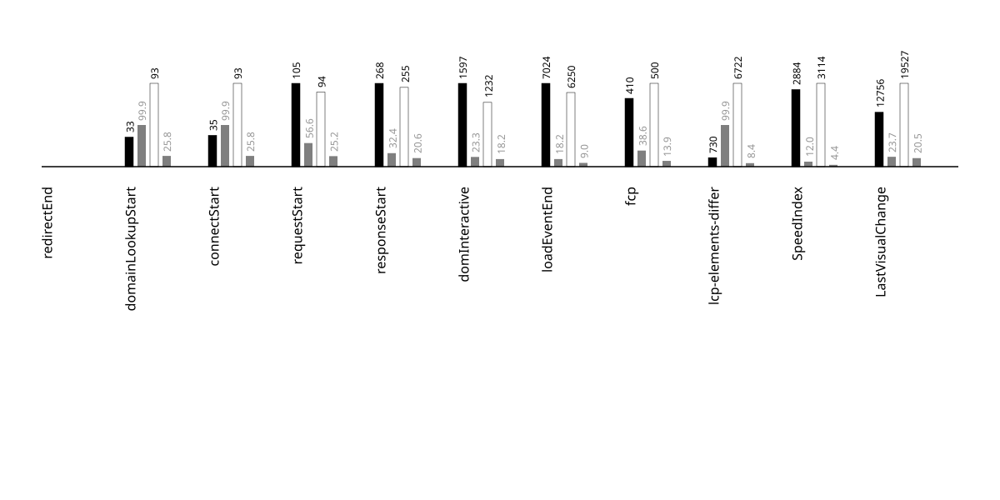

## metadata
{::nomarkdown}
<?xml version="1.0" encoding="utf-8"?>
<!DOCTYPE svg PUBLIC "-//W3C//DTD SVG 1.1//EN" "http://www.w3.org/Graphics/SVG/1.1/DTD/svg11.dtd">
<svg version="1.1"
     id="svg2" xml:space="preserve"
     xmlns="http://www.w3.org/2000/svg"
     xmlns:xlink="http://www.w3.org/1999/xlink"
     xmlns:html="http://www.w3.org/1999/xhtml"
x="0px" y="0px"
width="540.000000px" height="150.000000px"
viewBox="0 0 540.000000 150.000000" enable-background="new 0 0 540.000000 150.000000">

<g id="metadata">
<rect x="0.000000" y="0.000000" width="540.000000" height="150.000000"
 style="fill:rgb(200,200,200); fill-opacity:1; stroke:rgb(200,200,200); stroke-opacity:0; stroke-width:0.5" />
 <a href="https://www.esaiedukasi.com/">
<text x="270.000000" y="50.000000" font-family="Atkinson Hyperlegible" font-size="24.000000pt" text-anchor="middle" text-align="center" font-weight="600" font-style="normal"  style="fill:rgb(0,0,255); fill-opacity:1; stroke:rgb(255,255,255); stroke-opacity:0; stroke-width:0.5">esaiedukasi</text>
 </a>
<text x="275.000000" y="86.000000" font-family="Atkinson Hyperlegible" font-size="12.000000pt" text-anchor="middle" text-align="center" font-weight="400" font-style="normal"  style="fill:rgb(148,148,148); fill-opacity:1; stroke:rgb(255,255,255); stroke-opacity:0; stroke-width:0.5">preload</text>
<text x="270.000000" y="98.000000" font-family="Atkinson Hyperlegible" font-size="12.000000pt" text-anchor="middle" text-align="center" font-weight="500" font-style="normal"  style="fill:rgb(148,148,148); fill-opacity:1; stroke:rgb(255,255,255); stroke-opacity:0; stroke-width:0.5">2025-07-03</text>
<text x="275.000000" y="110.000000" font-family="Atkinson Hyperlegible" font-size="12.000000pt" text-anchor="middle" text-align="center" font-weight="500" font-style="normal"  style="fill:rgb(148,148,148); fill-opacity:1; stroke:rgb(255,255,255); stroke-opacity:0; stroke-width:0.5">android-15-ptablet-talkback</text>
<text x="337.500000" y="134.000000" font-family="Atkinson Hyperlegible" font-size="14.000000pt" text-anchor="start" text-align="left" font-weight="600" font-style="normal"  style="fill:rgb(255,255,255); fill-opacity:1; stroke:rgb(0,0,0); stroke-opacity:0; stroke-width:0.5">chrome</text>
<text x="202.500000" y="134.000000" font-family="Atkinson Hyperlegible" font-size="14.000000pt" text-anchor="end" text-align="right" font-weight="600" font-style="normal"  style="fill:rgb(0,0,0); fill-opacity:1; stroke:rgb(0,0,0); stroke-opacity:0; stroke-width:0.5">firefox</text>
</g>
</svg>

{:/}

---

## side by side video
{::nomarkdown}
<?xml version="1.0" encoding="utf-8"?>
<!DOCTYPE svg PUBLIC "-//W3C//DTD SVG 1.1//EN" "http://www.w3.org/Graphics/SVG/1.1/DTD/svg11.dtd">
<svg version="1.1"
     id="svg2" xml:space="preserve"
     xmlns="http://www.w3.org/2000/svg"
     xmlns:xlink="http://www.w3.org/1999/xlink"
     xmlns:html="http://www.w3.org/1999/xhtml"
x="0px" y="0px"
width="540.000000px" height="585.000000px"
viewBox="0 0 540.000000 585.000000" enable-background="new 0 0 540.000000 585.000000">

<g id="video_side_x_side">
<g>

<g id="video-wrapper" transform="scale(1,1)">

<foreignObject x="0.000000" y="0.000000" width="2160.000000" height="2340.000000">
 <video xmlns="http://www.w3.org/1999/xhtml"   width="540.000000" height="585.000000"  controls="" loop="false" muted="true"  >
<source src="../videos/2025-07-03-android-15-ptablet-talkback-esaiedukasi-side-by-side.mp4" type="video/mp4" />
</video>
 </foreignObject></g></g>
</g>
</svg>

{:/}

---

## % visually complete by millisecond (SpeedIndex)
{::nomarkdown}
<?xml version="1.0" encoding="utf-8"?>
<!DOCTYPE svg PUBLIC "-//W3C//DTD SVG 1.1//EN" "http://www.w3.org/Graphics/SVG/1.1/DTD/svg11.dtd">
<svg version="1.1"
     id="svg2" xml:space="preserve"
     xmlns="http://www.w3.org/2000/svg"
     xmlns:xlink="http://www.w3.org/1999/xlink"
     xmlns:html="http://www.w3.org/1999/xhtml"
x="0px" y="0px"
width="900.000000px" height="600.000000px"
viewBox="0 0 900.000000 600.000000" enable-background="new 0 0 900.000000 600.000000">

<title>
2025-07-03-android-15-ptablet-talkback-esaiedukasi_x_line_graph
</title>
<desc>
SpeedIndexProgress line graph for annotation
</desc>
 <g id="tic-x-annotation">
<text x="100.000000" y="512.000000" font-family="Apercu" font-size="7.000000pt" text-anchor="middle" text-align="center" dominant-baseline="central" font-weight="400" font-style="normal"  style="fill:rgb(118,118,118); fill-opacity:1; stroke:rgb(118,118,118); stroke-opacity:0; stroke-width:0.5">0.0s</text>
<text x="127.559055" y="512.000000" font-family="Apercu" font-size="7.000000pt" text-anchor="middle" text-align="center" dominant-baseline="central" font-weight="400" font-style="normal"  style="fill:rgb(118,118,118); fill-opacity:1; stroke:rgb(118,118,118); stroke-opacity:0; stroke-width:0.5">0.5s</text>
<text x="155.118110" y="512.000000" font-family="Apercu" font-size="7.000000pt" text-anchor="middle" text-align="center" dominant-baseline="central" font-weight="400" font-style="normal"  style="fill:rgb(118,118,118); fill-opacity:1; stroke:rgb(118,118,118); stroke-opacity:0; stroke-width:0.5">1.0s</text>
<text x="182.677165" y="512.000000" font-family="Apercu" font-size="7.000000pt" text-anchor="middle" text-align="center" dominant-baseline="central" font-weight="400" font-style="normal"  style="fill:rgb(118,118,118); fill-opacity:1; stroke:rgb(118,118,118); stroke-opacity:0; stroke-width:0.5">1.5s</text>
<text x="210.236220" y="512.000000" font-family="Apercu" font-size="7.000000pt" text-anchor="middle" text-align="center" dominant-baseline="central" font-weight="400" font-style="normal"  style="fill:rgb(118,118,118); fill-opacity:1; stroke:rgb(118,118,118); stroke-opacity:0; stroke-width:0.5">2.0s</text>
<text x="237.795276" y="512.000000" font-family="Apercu" font-size="7.000000pt" text-anchor="middle" text-align="center" dominant-baseline="central" font-weight="400" font-style="normal"  style="fill:rgb(118,118,118); fill-opacity:1; stroke:rgb(118,118,118); stroke-opacity:0; stroke-width:0.5">2.5s</text>
<text x="265.354331" y="512.000000" font-family="Apercu" font-size="7.000000pt" text-anchor="middle" text-align="center" dominant-baseline="central" font-weight="400" font-style="normal"  style="fill:rgb(118,118,118); fill-opacity:1; stroke:rgb(118,118,118); stroke-opacity:0; stroke-width:0.5">3.0s</text>
<text x="292.913386" y="512.000000" font-family="Apercu" font-size="7.000000pt" text-anchor="middle" text-align="center" dominant-baseline="central" font-weight="400" font-style="normal"  style="fill:rgb(118,118,118); fill-opacity:1; stroke:rgb(118,118,118); stroke-opacity:0; stroke-width:0.5">3.5s</text>
<text x="320.472441" y="512.000000" font-family="Apercu" font-size="7.000000pt" text-anchor="middle" text-align="center" dominant-baseline="central" font-weight="400" font-style="normal"  style="fill:rgb(118,118,118); fill-opacity:1; stroke:rgb(118,118,118); stroke-opacity:0; stroke-width:0.5">4.0s</text>
<text x="348.031496" y="512.000000" font-family="Apercu" font-size="7.000000pt" text-anchor="middle" text-align="center" dominant-baseline="central" font-weight="400" font-style="normal"  style="fill:rgb(118,118,118); fill-opacity:1; stroke:rgb(118,118,118); stroke-opacity:0; stroke-width:0.5">4.5s</text>
<text x="375.590551" y="512.000000" font-family="Apercu" font-size="7.000000pt" text-anchor="middle" text-align="center" dominant-baseline="central" font-weight="400" font-style="normal"  style="fill:rgb(118,118,118); fill-opacity:1; stroke:rgb(118,118,118); stroke-opacity:0; stroke-width:0.5">5.0s</text>
<text x="403.149606" y="512.000000" font-family="Apercu" font-size="7.000000pt" text-anchor="middle" text-align="center" dominant-baseline="central" font-weight="400" font-style="normal"  style="fill:rgb(118,118,118); fill-opacity:1; stroke:rgb(118,118,118); stroke-opacity:0; stroke-width:0.5">5.5s</text>
<text x="430.708661" y="512.000000" font-family="Apercu" font-size="7.000000pt" text-anchor="middle" text-align="center" dominant-baseline="central" font-weight="400" font-style="normal"  style="fill:rgb(118,118,118); fill-opacity:1; stroke:rgb(118,118,118); stroke-opacity:0; stroke-width:0.5">6.0s</text>
<text x="458.267717" y="512.000000" font-family="Apercu" font-size="7.000000pt" text-anchor="middle" text-align="center" dominant-baseline="central" font-weight="400" font-style="normal"  style="fill:rgb(118,118,118); fill-opacity:1; stroke:rgb(118,118,118); stroke-opacity:0; stroke-width:0.5">6.5s</text>
<text x="485.826772" y="512.000000" font-family="Apercu" font-size="7.000000pt" text-anchor="middle" text-align="center" dominant-baseline="central" font-weight="400" font-style="normal"  style="fill:rgb(118,118,118); fill-opacity:1; stroke:rgb(118,118,118); stroke-opacity:0; stroke-width:0.5">7.0s</text>
<text x="513.385827" y="512.000000" font-family="Apercu" font-size="7.000000pt" text-anchor="middle" text-align="center" dominant-baseline="central" font-weight="400" font-style="normal"  style="fill:rgb(118,118,118); fill-opacity:1; stroke:rgb(118,118,118); stroke-opacity:0; stroke-width:0.5">7.5s</text>
<text x="540.944882" y="512.000000" font-family="Apercu" font-size="7.000000pt" text-anchor="middle" text-align="center" dominant-baseline="central" font-weight="400" font-style="normal"  style="fill:rgb(118,118,118); fill-opacity:1; stroke:rgb(118,118,118); stroke-opacity:0; stroke-width:0.5">8.0s</text>
<text x="568.503937" y="512.000000" font-family="Apercu" font-size="7.000000pt" text-anchor="middle" text-align="center" dominant-baseline="central" font-weight="400" font-style="normal"  style="fill:rgb(118,118,118); fill-opacity:1; stroke:rgb(118,118,118); stroke-opacity:0; stroke-width:0.5">8.5s</text>
<text x="596.062992" y="512.000000" font-family="Apercu" font-size="7.000000pt" text-anchor="middle" text-align="center" dominant-baseline="central" font-weight="400" font-style="normal"  style="fill:rgb(118,118,118); fill-opacity:1; stroke:rgb(118,118,118); stroke-opacity:0; stroke-width:0.5">9.0s</text>
<text x="623.622047" y="512.000000" font-family="Apercu" font-size="7.000000pt" text-anchor="middle" text-align="center" dominant-baseline="central" font-weight="400" font-style="normal"  style="fill:rgb(118,118,118); fill-opacity:1; stroke:rgb(118,118,118); stroke-opacity:0; stroke-width:0.5">9.5s</text>
<text x="651.181102" y="512.000000" font-family="Apercu" font-size="7.000000pt" text-anchor="middle" text-align="center" dominant-baseline="central" font-weight="400" font-style="normal"  style="fill:rgb(118,118,118); fill-opacity:1; stroke:rgb(118,118,118); stroke-opacity:0; stroke-width:0.5">10.0s</text>
<text x="678.740157" y="512.000000" font-family="Apercu" font-size="7.000000pt" text-anchor="middle" text-align="center" dominant-baseline="central" font-weight="400" font-style="normal"  style="fill:rgb(118,118,118); fill-opacity:1; stroke:rgb(118,118,118); stroke-opacity:0; stroke-width:0.5">10.5s</text>
<text x="706.299213" y="512.000000" font-family="Apercu" font-size="7.000000pt" text-anchor="middle" text-align="center" dominant-baseline="central" font-weight="400" font-style="normal"  style="fill:rgb(118,118,118); fill-opacity:1; stroke:rgb(118,118,118); stroke-opacity:0; stroke-width:0.5">11.0s</text>
<text x="733.858268" y="512.000000" font-family="Apercu" font-size="7.000000pt" text-anchor="middle" text-align="center" dominant-baseline="central" font-weight="400" font-style="normal"  style="fill:rgb(118,118,118); fill-opacity:1; stroke:rgb(118,118,118); stroke-opacity:0; stroke-width:0.5">11.5s</text>
<text x="761.417323" y="512.000000" font-family="Apercu" font-size="7.000000pt" text-anchor="middle" text-align="center" dominant-baseline="central" font-weight="400" font-style="normal"  style="fill:rgb(118,118,118); fill-opacity:1; stroke:rgb(118,118,118); stroke-opacity:0; stroke-width:0.5">12.0s</text>
<text x="788.976378" y="512.000000" font-family="Apercu" font-size="7.000000pt" text-anchor="middle" text-align="center" dominant-baseline="central" font-weight="400" font-style="normal"  style="fill:rgb(118,118,118); fill-opacity:1; stroke:rgb(118,118,118); stroke-opacity:0; stroke-width:0.5">12.5s</text>
 </g> <g id="tic-y-annotation">
<text x="76.000000" y="460.000000" font-family="Apercu" font-size="7.000000pt" text-anchor="middle" text-align="center" dominant-baseline="central" font-weight="400" font-style="normal"  style="fill:rgb(118,118,118); fill-opacity:1; stroke:rgb(118,118,118); stroke-opacity:0; stroke-width:0.5">10%</text>
<text x="824.000000" y="460.000000" font-family="Apercu" font-size="7.000000pt" text-anchor="middle" text-align="center" dominant-baseline="central" font-weight="400" font-style="normal"  style="fill:rgb(118,118,118); fill-opacity:1; stroke:rgb(118,118,118); stroke-opacity:0; stroke-width:0.5">10%</text>
<text x="76.000000" y="420.000000" font-family="Apercu" font-size="7.000000pt" text-anchor="middle" text-align="center" dominant-baseline="central" font-weight="400" font-style="normal"  style="fill:rgb(118,118,118); fill-opacity:1; stroke:rgb(118,118,118); stroke-opacity:0; stroke-width:0.5">20%</text>
<text x="824.000000" y="420.000000" font-family="Apercu" font-size="7.000000pt" text-anchor="middle" text-align="center" dominant-baseline="central" font-weight="400" font-style="normal"  style="fill:rgb(118,118,118); fill-opacity:1; stroke:rgb(118,118,118); stroke-opacity:0; stroke-width:0.5">20%</text>
<text x="76.000000" y="380.000000" font-family="Apercu" font-size="7.000000pt" text-anchor="middle" text-align="center" dominant-baseline="central" font-weight="400" font-style="normal"  style="fill:rgb(118,118,118); fill-opacity:1; stroke:rgb(118,118,118); stroke-opacity:0; stroke-width:0.5">30%</text>
<text x="824.000000" y="380.000000" font-family="Apercu" font-size="7.000000pt" text-anchor="middle" text-align="center" dominant-baseline="central" font-weight="400" font-style="normal"  style="fill:rgb(118,118,118); fill-opacity:1; stroke:rgb(118,118,118); stroke-opacity:0; stroke-width:0.5">30%</text>
<text x="76.000000" y="340.000000" font-family="Apercu" font-size="7.000000pt" text-anchor="middle" text-align="center" dominant-baseline="central" font-weight="400" font-style="normal"  style="fill:rgb(118,118,118); fill-opacity:1; stroke:rgb(118,118,118); stroke-opacity:0; stroke-width:0.5">40%</text>
<text x="824.000000" y="340.000000" font-family="Apercu" font-size="7.000000pt" text-anchor="middle" text-align="center" dominant-baseline="central" font-weight="400" font-style="normal"  style="fill:rgb(118,118,118); fill-opacity:1; stroke:rgb(118,118,118); stroke-opacity:0; stroke-width:0.5">40%</text>
<text x="76.000000" y="300.000000" font-family="Apercu" font-size="7.000000pt" text-anchor="middle" text-align="center" dominant-baseline="central" font-weight="400" font-style="normal"  style="fill:rgb(118,118,118); fill-opacity:1; stroke:rgb(118,118,118); stroke-opacity:0; stroke-width:0.5">50%</text>
<text x="824.000000" y="300.000000" font-family="Apercu" font-size="7.000000pt" text-anchor="middle" text-align="center" dominant-baseline="central" font-weight="400" font-style="normal"  style="fill:rgb(118,118,118); fill-opacity:1; stroke:rgb(118,118,118); stroke-opacity:0; stroke-width:0.5">50%</text>
<text x="76.000000" y="260.000000" font-family="Apercu" font-size="7.000000pt" text-anchor="middle" text-align="center" dominant-baseline="central" font-weight="400" font-style="normal"  style="fill:rgb(118,118,118); fill-opacity:1; stroke:rgb(118,118,118); stroke-opacity:0; stroke-width:0.5">60%</text>
<text x="824.000000" y="260.000000" font-family="Apercu" font-size="7.000000pt" text-anchor="middle" text-align="center" dominant-baseline="central" font-weight="400" font-style="normal"  style="fill:rgb(118,118,118); fill-opacity:1; stroke:rgb(118,118,118); stroke-opacity:0; stroke-width:0.5">60%</text>
<text x="76.000000" y="220.000000" font-family="Apercu" font-size="7.000000pt" text-anchor="middle" text-align="center" dominant-baseline="central" font-weight="400" font-style="normal"  style="fill:rgb(118,118,118); fill-opacity:1; stroke:rgb(118,118,118); stroke-opacity:0; stroke-width:0.5">70%</text>
<text x="824.000000" y="220.000000" font-family="Apercu" font-size="7.000000pt" text-anchor="middle" text-align="center" dominant-baseline="central" font-weight="400" font-style="normal"  style="fill:rgb(118,118,118); fill-opacity:1; stroke:rgb(118,118,118); stroke-opacity:0; stroke-width:0.5">70%</text>
<text x="76.000000" y="180.000000" font-family="Apercu" font-size="7.000000pt" text-anchor="middle" text-align="center" dominant-baseline="central" font-weight="400" font-style="normal"  style="fill:rgb(118,118,118); fill-opacity:1; stroke:rgb(118,118,118); stroke-opacity:0; stroke-width:0.5">80%</text>
<text x="824.000000" y="180.000000" font-family="Apercu" font-size="7.000000pt" text-anchor="middle" text-align="center" dominant-baseline="central" font-weight="400" font-style="normal"  style="fill:rgb(118,118,118); fill-opacity:1; stroke:rgb(118,118,118); stroke-opacity:0; stroke-width:0.5">80%</text>
<text x="76.000000" y="140.000000" font-family="Apercu" font-size="7.000000pt" text-anchor="middle" text-align="center" dominant-baseline="central" font-weight="400" font-style="normal"  style="fill:rgb(118,118,118); fill-opacity:1; stroke:rgb(118,118,118); stroke-opacity:0; stroke-width:0.5">90%</text>
<text x="824.000000" y="140.000000" font-family="Apercu" font-size="7.000000pt" text-anchor="middle" text-align="center" dominant-baseline="central" font-weight="400" font-style="normal"  style="fill:rgb(118,118,118); fill-opacity:1; stroke:rgb(118,118,118); stroke-opacity:0; stroke-width:0.5">90%</text>
<text x="76.000000" y="100.000000" font-family="Apercu" font-size="7.000000pt" text-anchor="middle" text-align="center" dominant-baseline="central" font-weight="400" font-style="normal"  style="fill:rgb(118,118,118); fill-opacity:1; stroke:rgb(118,118,118); stroke-opacity:0; stroke-width:0.5">100%</text>
<text x="824.000000" y="100.000000" font-family="Apercu" font-size="7.000000pt" text-anchor="middle" text-align="center" dominant-baseline="central" font-weight="400" font-style="normal"  style="fill:rgb(118,118,118); fill-opacity:1; stroke:rgb(118,118,118); stroke-opacity:0; stroke-width:0.5">100%</text>
 </g> <g id="tic-y-lines-annotation">
<line x1="112.000000" y1="460.000000" x2="788.000000" y2="460.000000" style="fill:rgb(118,118,118); fill-opacity:0; stroke:rgb(230,230,230); stroke-opacity:1; stroke-width:1" />
<text x="127.559055" y="460.000000" font-family="Apercu" font-size="3.000000pt" text-anchor="middle" text-align="center" dominant-baseline="central" font-weight="400" font-style="normal"  style="fill:rgb(118,118,118); fill-opacity:1; stroke:rgb(118,118,118); stroke-opacity:0; stroke-width:0.5">10%</text>
<text x="155.118110" y="460.000000" font-family="Apercu" font-size="3.000000pt" text-anchor="middle" text-align="center" dominant-baseline="central" font-weight="400" font-style="normal"  style="fill:rgb(118,118,118); fill-opacity:1; stroke:rgb(118,118,118); stroke-opacity:0; stroke-width:0.5">10%</text>
<text x="182.677165" y="460.000000" font-family="Apercu" font-size="3.000000pt" text-anchor="middle" text-align="center" dominant-baseline="central" font-weight="400" font-style="normal"  style="fill:rgb(118,118,118); fill-opacity:1; stroke:rgb(118,118,118); stroke-opacity:0; stroke-width:0.5">10%</text>
<text x="210.236220" y="460.000000" font-family="Apercu" font-size="3.000000pt" text-anchor="middle" text-align="center" dominant-baseline="central" font-weight="400" font-style="normal"  style="fill:rgb(118,118,118); fill-opacity:1; stroke:rgb(118,118,118); stroke-opacity:0; stroke-width:0.5">10%</text>
<text x="237.795276" y="460.000000" font-family="Apercu" font-size="3.000000pt" text-anchor="middle" text-align="center" dominant-baseline="central" font-weight="400" font-style="normal"  style="fill:rgb(118,118,118); fill-opacity:1; stroke:rgb(118,118,118); stroke-opacity:0; stroke-width:0.5">10%</text>
<text x="265.354331" y="460.000000" font-family="Apercu" font-size="3.000000pt" text-anchor="middle" text-align="center" dominant-baseline="central" font-weight="400" font-style="normal"  style="fill:rgb(118,118,118); fill-opacity:1; stroke:rgb(118,118,118); stroke-opacity:0; stroke-width:0.5">10%</text>
<text x="292.913386" y="460.000000" font-family="Apercu" font-size="3.000000pt" text-anchor="middle" text-align="center" dominant-baseline="central" font-weight="400" font-style="normal"  style="fill:rgb(118,118,118); fill-opacity:1; stroke:rgb(118,118,118); stroke-opacity:0; stroke-width:0.5">10%</text>
<text x="320.472441" y="460.000000" font-family="Apercu" font-size="3.000000pt" text-anchor="middle" text-align="center" dominant-baseline="central" font-weight="400" font-style="normal"  style="fill:rgb(118,118,118); fill-opacity:1; stroke:rgb(118,118,118); stroke-opacity:0; stroke-width:0.5">10%</text>
<text x="348.031496" y="460.000000" font-family="Apercu" font-size="3.000000pt" text-anchor="middle" text-align="center" dominant-baseline="central" font-weight="400" font-style="normal"  style="fill:rgb(118,118,118); fill-opacity:1; stroke:rgb(118,118,118); stroke-opacity:0; stroke-width:0.5">10%</text>
<text x="375.590551" y="460.000000" font-family="Apercu" font-size="3.000000pt" text-anchor="middle" text-align="center" dominant-baseline="central" font-weight="400" font-style="normal"  style="fill:rgb(118,118,118); fill-opacity:1; stroke:rgb(118,118,118); stroke-opacity:0; stroke-width:0.5">10%</text>
<text x="403.149606" y="460.000000" font-family="Apercu" font-size="3.000000pt" text-anchor="middle" text-align="center" dominant-baseline="central" font-weight="400" font-style="normal"  style="fill:rgb(118,118,118); fill-opacity:1; stroke:rgb(118,118,118); stroke-opacity:0; stroke-width:0.5">10%</text>
<text x="430.708661" y="460.000000" font-family="Apercu" font-size="3.000000pt" text-anchor="middle" text-align="center" dominant-baseline="central" font-weight="400" font-style="normal"  style="fill:rgb(118,118,118); fill-opacity:1; stroke:rgb(118,118,118); stroke-opacity:0; stroke-width:0.5">10%</text>
<text x="458.267717" y="460.000000" font-family="Apercu" font-size="3.000000pt" text-anchor="middle" text-align="center" dominant-baseline="central" font-weight="400" font-style="normal"  style="fill:rgb(118,118,118); fill-opacity:1; stroke:rgb(118,118,118); stroke-opacity:0; stroke-width:0.5">10%</text>
<text x="485.826772" y="460.000000" font-family="Apercu" font-size="3.000000pt" text-anchor="middle" text-align="center" dominant-baseline="central" font-weight="400" font-style="normal"  style="fill:rgb(118,118,118); fill-opacity:1; stroke:rgb(118,118,118); stroke-opacity:0; stroke-width:0.5">10%</text>
<text x="513.385827" y="460.000000" font-family="Apercu" font-size="3.000000pt" text-anchor="middle" text-align="center" dominant-baseline="central" font-weight="400" font-style="normal"  style="fill:rgb(118,118,118); fill-opacity:1; stroke:rgb(118,118,118); stroke-opacity:0; stroke-width:0.5">10%</text>
<text x="540.944882" y="460.000000" font-family="Apercu" font-size="3.000000pt" text-anchor="middle" text-align="center" dominant-baseline="central" font-weight="400" font-style="normal"  style="fill:rgb(118,118,118); fill-opacity:1; stroke:rgb(118,118,118); stroke-opacity:0; stroke-width:0.5">10%</text>
<text x="568.503937" y="460.000000" font-family="Apercu" font-size="3.000000pt" text-anchor="middle" text-align="center" dominant-baseline="central" font-weight="400" font-style="normal"  style="fill:rgb(118,118,118); fill-opacity:1; stroke:rgb(118,118,118); stroke-opacity:0; stroke-width:0.5">10%</text>
<text x="596.062992" y="460.000000" font-family="Apercu" font-size="3.000000pt" text-anchor="middle" text-align="center" dominant-baseline="central" font-weight="400" font-style="normal"  style="fill:rgb(118,118,118); fill-opacity:1; stroke:rgb(118,118,118); stroke-opacity:0; stroke-width:0.5">10%</text>
<text x="623.622047" y="460.000000" font-family="Apercu" font-size="3.000000pt" text-anchor="middle" text-align="center" dominant-baseline="central" font-weight="400" font-style="normal"  style="fill:rgb(118,118,118); fill-opacity:1; stroke:rgb(118,118,118); stroke-opacity:0; stroke-width:0.5">10%</text>
<text x="651.181102" y="460.000000" font-family="Apercu" font-size="3.000000pt" text-anchor="middle" text-align="center" dominant-baseline="central" font-weight="400" font-style="normal"  style="fill:rgb(118,118,118); fill-opacity:1; stroke:rgb(118,118,118); stroke-opacity:0; stroke-width:0.5">10%</text>
<text x="678.740157" y="460.000000" font-family="Apercu" font-size="3.000000pt" text-anchor="middle" text-align="center" dominant-baseline="central" font-weight="400" font-style="normal"  style="fill:rgb(118,118,118); fill-opacity:1; stroke:rgb(118,118,118); stroke-opacity:0; stroke-width:0.5">10%</text>
<text x="706.299213" y="460.000000" font-family="Apercu" font-size="3.000000pt" text-anchor="middle" text-align="center" dominant-baseline="central" font-weight="400" font-style="normal"  style="fill:rgb(118,118,118); fill-opacity:1; stroke:rgb(118,118,118); stroke-opacity:0; stroke-width:0.5">10%</text>
<text x="733.858268" y="460.000000" font-family="Apercu" font-size="3.000000pt" text-anchor="middle" text-align="center" dominant-baseline="central" font-weight="400" font-style="normal"  style="fill:rgb(118,118,118); fill-opacity:1; stroke:rgb(118,118,118); stroke-opacity:0; stroke-width:0.5">10%</text>
<text x="761.417323" y="460.000000" font-family="Apercu" font-size="3.000000pt" text-anchor="middle" text-align="center" dominant-baseline="central" font-weight="400" font-style="normal"  style="fill:rgb(118,118,118); fill-opacity:1; stroke:rgb(118,118,118); stroke-opacity:0; stroke-width:0.5">10%</text>
<line x1="112.000000" y1="420.000000" x2="788.000000" y2="420.000000" style="fill:rgb(118,118,118); fill-opacity:0; stroke:rgb(230,230,230); stroke-opacity:1; stroke-width:1" />
<text x="127.559055" y="420.000000" font-family="Apercu" font-size="3.000000pt" text-anchor="middle" text-align="center" dominant-baseline="central" font-weight="400" font-style="normal"  style="fill:rgb(118,118,118); fill-opacity:1; stroke:rgb(118,118,118); stroke-opacity:0; stroke-width:0.5">20%</text>
<text x="155.118110" y="420.000000" font-family="Apercu" font-size="3.000000pt" text-anchor="middle" text-align="center" dominant-baseline="central" font-weight="400" font-style="normal"  style="fill:rgb(118,118,118); fill-opacity:1; stroke:rgb(118,118,118); stroke-opacity:0; stroke-width:0.5">20%</text>
<text x="182.677165" y="420.000000" font-family="Apercu" font-size="3.000000pt" text-anchor="middle" text-align="center" dominant-baseline="central" font-weight="400" font-style="normal"  style="fill:rgb(118,118,118); fill-opacity:1; stroke:rgb(118,118,118); stroke-opacity:0; stroke-width:0.5">20%</text>
<text x="210.236220" y="420.000000" font-family="Apercu" font-size="3.000000pt" text-anchor="middle" text-align="center" dominant-baseline="central" font-weight="400" font-style="normal"  style="fill:rgb(118,118,118); fill-opacity:1; stroke:rgb(118,118,118); stroke-opacity:0; stroke-width:0.5">20%</text>
<text x="237.795276" y="420.000000" font-family="Apercu" font-size="3.000000pt" text-anchor="middle" text-align="center" dominant-baseline="central" font-weight="400" font-style="normal"  style="fill:rgb(118,118,118); fill-opacity:1; stroke:rgb(118,118,118); stroke-opacity:0; stroke-width:0.5">20%</text>
<text x="265.354331" y="420.000000" font-family="Apercu" font-size="3.000000pt" text-anchor="middle" text-align="center" dominant-baseline="central" font-weight="400" font-style="normal"  style="fill:rgb(118,118,118); fill-opacity:1; stroke:rgb(118,118,118); stroke-opacity:0; stroke-width:0.5">20%</text>
<text x="292.913386" y="420.000000" font-family="Apercu" font-size="3.000000pt" text-anchor="middle" text-align="center" dominant-baseline="central" font-weight="400" font-style="normal"  style="fill:rgb(118,118,118); fill-opacity:1; stroke:rgb(118,118,118); stroke-opacity:0; stroke-width:0.5">20%</text>
<text x="320.472441" y="420.000000" font-family="Apercu" font-size="3.000000pt" text-anchor="middle" text-align="center" dominant-baseline="central" font-weight="400" font-style="normal"  style="fill:rgb(118,118,118); fill-opacity:1; stroke:rgb(118,118,118); stroke-opacity:0; stroke-width:0.5">20%</text>
<text x="348.031496" y="420.000000" font-family="Apercu" font-size="3.000000pt" text-anchor="middle" text-align="center" dominant-baseline="central" font-weight="400" font-style="normal"  style="fill:rgb(118,118,118); fill-opacity:1; stroke:rgb(118,118,118); stroke-opacity:0; stroke-width:0.5">20%</text>
<text x="375.590551" y="420.000000" font-family="Apercu" font-size="3.000000pt" text-anchor="middle" text-align="center" dominant-baseline="central" font-weight="400" font-style="normal"  style="fill:rgb(118,118,118); fill-opacity:1; stroke:rgb(118,118,118); stroke-opacity:0; stroke-width:0.5">20%</text>
<text x="403.149606" y="420.000000" font-family="Apercu" font-size="3.000000pt" text-anchor="middle" text-align="center" dominant-baseline="central" font-weight="400" font-style="normal"  style="fill:rgb(118,118,118); fill-opacity:1; stroke:rgb(118,118,118); stroke-opacity:0; stroke-width:0.5">20%</text>
<text x="430.708661" y="420.000000" font-family="Apercu" font-size="3.000000pt" text-anchor="middle" text-align="center" dominant-baseline="central" font-weight="400" font-style="normal"  style="fill:rgb(118,118,118); fill-opacity:1; stroke:rgb(118,118,118); stroke-opacity:0; stroke-width:0.5">20%</text>
<text x="458.267717" y="420.000000" font-family="Apercu" font-size="3.000000pt" text-anchor="middle" text-align="center" dominant-baseline="central" font-weight="400" font-style="normal"  style="fill:rgb(118,118,118); fill-opacity:1; stroke:rgb(118,118,118); stroke-opacity:0; stroke-width:0.5">20%</text>
<text x="485.826772" y="420.000000" font-family="Apercu" font-size="3.000000pt" text-anchor="middle" text-align="center" dominant-baseline="central" font-weight="400" font-style="normal"  style="fill:rgb(118,118,118); fill-opacity:1; stroke:rgb(118,118,118); stroke-opacity:0; stroke-width:0.5">20%</text>
<text x="513.385827" y="420.000000" font-family="Apercu" font-size="3.000000pt" text-anchor="middle" text-align="center" dominant-baseline="central" font-weight="400" font-style="normal"  style="fill:rgb(118,118,118); fill-opacity:1; stroke:rgb(118,118,118); stroke-opacity:0; stroke-width:0.5">20%</text>
<text x="540.944882" y="420.000000" font-family="Apercu" font-size="3.000000pt" text-anchor="middle" text-align="center" dominant-baseline="central" font-weight="400" font-style="normal"  style="fill:rgb(118,118,118); fill-opacity:1; stroke:rgb(118,118,118); stroke-opacity:0; stroke-width:0.5">20%</text>
<text x="568.503937" y="420.000000" font-family="Apercu" font-size="3.000000pt" text-anchor="middle" text-align="center" dominant-baseline="central" font-weight="400" font-style="normal"  style="fill:rgb(118,118,118); fill-opacity:1; stroke:rgb(118,118,118); stroke-opacity:0; stroke-width:0.5">20%</text>
<text x="596.062992" y="420.000000" font-family="Apercu" font-size="3.000000pt" text-anchor="middle" text-align="center" dominant-baseline="central" font-weight="400" font-style="normal"  style="fill:rgb(118,118,118); fill-opacity:1; stroke:rgb(118,118,118); stroke-opacity:0; stroke-width:0.5">20%</text>
<text x="623.622047" y="420.000000" font-family="Apercu" font-size="3.000000pt" text-anchor="middle" text-align="center" dominant-baseline="central" font-weight="400" font-style="normal"  style="fill:rgb(118,118,118); fill-opacity:1; stroke:rgb(118,118,118); stroke-opacity:0; stroke-width:0.5">20%</text>
<text x="651.181102" y="420.000000" font-family="Apercu" font-size="3.000000pt" text-anchor="middle" text-align="center" dominant-baseline="central" font-weight="400" font-style="normal"  style="fill:rgb(118,118,118); fill-opacity:1; stroke:rgb(118,118,118); stroke-opacity:0; stroke-width:0.5">20%</text>
<text x="678.740157" y="420.000000" font-family="Apercu" font-size="3.000000pt" text-anchor="middle" text-align="center" dominant-baseline="central" font-weight="400" font-style="normal"  style="fill:rgb(118,118,118); fill-opacity:1; stroke:rgb(118,118,118); stroke-opacity:0; stroke-width:0.5">20%</text>
<text x="706.299213" y="420.000000" font-family="Apercu" font-size="3.000000pt" text-anchor="middle" text-align="center" dominant-baseline="central" font-weight="400" font-style="normal"  style="fill:rgb(118,118,118); fill-opacity:1; stroke:rgb(118,118,118); stroke-opacity:0; stroke-width:0.5">20%</text>
<text x="733.858268" y="420.000000" font-family="Apercu" font-size="3.000000pt" text-anchor="middle" text-align="center" dominant-baseline="central" font-weight="400" font-style="normal"  style="fill:rgb(118,118,118); fill-opacity:1; stroke:rgb(118,118,118); stroke-opacity:0; stroke-width:0.5">20%</text>
<text x="761.417323" y="420.000000" font-family="Apercu" font-size="3.000000pt" text-anchor="middle" text-align="center" dominant-baseline="central" font-weight="400" font-style="normal"  style="fill:rgb(118,118,118); fill-opacity:1; stroke:rgb(118,118,118); stroke-opacity:0; stroke-width:0.5">20%</text>
<line x1="112.000000" y1="380.000000" x2="788.000000" y2="380.000000" style="fill:rgb(118,118,118); fill-opacity:0; stroke:rgb(230,230,230); stroke-opacity:1; stroke-width:1" />
<text x="127.559055" y="380.000000" font-family="Apercu" font-size="3.000000pt" text-anchor="middle" text-align="center" dominant-baseline="central" font-weight="400" font-style="normal"  style="fill:rgb(118,118,118); fill-opacity:1; stroke:rgb(118,118,118); stroke-opacity:0; stroke-width:0.5">30%</text>
<text x="155.118110" y="380.000000" font-family="Apercu" font-size="3.000000pt" text-anchor="middle" text-align="center" dominant-baseline="central" font-weight="400" font-style="normal"  style="fill:rgb(118,118,118); fill-opacity:1; stroke:rgb(118,118,118); stroke-opacity:0; stroke-width:0.5">30%</text>
<text x="182.677165" y="380.000000" font-family="Apercu" font-size="3.000000pt" text-anchor="middle" text-align="center" dominant-baseline="central" font-weight="400" font-style="normal"  style="fill:rgb(118,118,118); fill-opacity:1; stroke:rgb(118,118,118); stroke-opacity:0; stroke-width:0.5">30%</text>
<text x="210.236220" y="380.000000" font-family="Apercu" font-size="3.000000pt" text-anchor="middle" text-align="center" dominant-baseline="central" font-weight="400" font-style="normal"  style="fill:rgb(118,118,118); fill-opacity:1; stroke:rgb(118,118,118); stroke-opacity:0; stroke-width:0.5">30%</text>
<text x="237.795276" y="380.000000" font-family="Apercu" font-size="3.000000pt" text-anchor="middle" text-align="center" dominant-baseline="central" font-weight="400" font-style="normal"  style="fill:rgb(118,118,118); fill-opacity:1; stroke:rgb(118,118,118); stroke-opacity:0; stroke-width:0.5">30%</text>
<text x="265.354331" y="380.000000" font-family="Apercu" font-size="3.000000pt" text-anchor="middle" text-align="center" dominant-baseline="central" font-weight="400" font-style="normal"  style="fill:rgb(118,118,118); fill-opacity:1; stroke:rgb(118,118,118); stroke-opacity:0; stroke-width:0.5">30%</text>
<text x="292.913386" y="380.000000" font-family="Apercu" font-size="3.000000pt" text-anchor="middle" text-align="center" dominant-baseline="central" font-weight="400" font-style="normal"  style="fill:rgb(118,118,118); fill-opacity:1; stroke:rgb(118,118,118); stroke-opacity:0; stroke-width:0.5">30%</text>
<text x="320.472441" y="380.000000" font-family="Apercu" font-size="3.000000pt" text-anchor="middle" text-align="center" dominant-baseline="central" font-weight="400" font-style="normal"  style="fill:rgb(118,118,118); fill-opacity:1; stroke:rgb(118,118,118); stroke-opacity:0; stroke-width:0.5">30%</text>
<text x="348.031496" y="380.000000" font-family="Apercu" font-size="3.000000pt" text-anchor="middle" text-align="center" dominant-baseline="central" font-weight="400" font-style="normal"  style="fill:rgb(118,118,118); fill-opacity:1; stroke:rgb(118,118,118); stroke-opacity:0; stroke-width:0.5">30%</text>
<text x="375.590551" y="380.000000" font-family="Apercu" font-size="3.000000pt" text-anchor="middle" text-align="center" dominant-baseline="central" font-weight="400" font-style="normal"  style="fill:rgb(118,118,118); fill-opacity:1; stroke:rgb(118,118,118); stroke-opacity:0; stroke-width:0.5">30%</text>
<text x="403.149606" y="380.000000" font-family="Apercu" font-size="3.000000pt" text-anchor="middle" text-align="center" dominant-baseline="central" font-weight="400" font-style="normal"  style="fill:rgb(118,118,118); fill-opacity:1; stroke:rgb(118,118,118); stroke-opacity:0; stroke-width:0.5">30%</text>
<text x="430.708661" y="380.000000" font-family="Apercu" font-size="3.000000pt" text-anchor="middle" text-align="center" dominant-baseline="central" font-weight="400" font-style="normal"  style="fill:rgb(118,118,118); fill-opacity:1; stroke:rgb(118,118,118); stroke-opacity:0; stroke-width:0.5">30%</text>
<text x="458.267717" y="380.000000" font-family="Apercu" font-size="3.000000pt" text-anchor="middle" text-align="center" dominant-baseline="central" font-weight="400" font-style="normal"  style="fill:rgb(118,118,118); fill-opacity:1; stroke:rgb(118,118,118); stroke-opacity:0; stroke-width:0.5">30%</text>
<text x="485.826772" y="380.000000" font-family="Apercu" font-size="3.000000pt" text-anchor="middle" text-align="center" dominant-baseline="central" font-weight="400" font-style="normal"  style="fill:rgb(118,118,118); fill-opacity:1; stroke:rgb(118,118,118); stroke-opacity:0; stroke-width:0.5">30%</text>
<text x="513.385827" y="380.000000" font-family="Apercu" font-size="3.000000pt" text-anchor="middle" text-align="center" dominant-baseline="central" font-weight="400" font-style="normal"  style="fill:rgb(118,118,118); fill-opacity:1; stroke:rgb(118,118,118); stroke-opacity:0; stroke-width:0.5">30%</text>
<text x="540.944882" y="380.000000" font-family="Apercu" font-size="3.000000pt" text-anchor="middle" text-align="center" dominant-baseline="central" font-weight="400" font-style="normal"  style="fill:rgb(118,118,118); fill-opacity:1; stroke:rgb(118,118,118); stroke-opacity:0; stroke-width:0.5">30%</text>
<text x="568.503937" y="380.000000" font-family="Apercu" font-size="3.000000pt" text-anchor="middle" text-align="center" dominant-baseline="central" font-weight="400" font-style="normal"  style="fill:rgb(118,118,118); fill-opacity:1; stroke:rgb(118,118,118); stroke-opacity:0; stroke-width:0.5">30%</text>
<text x="596.062992" y="380.000000" font-family="Apercu" font-size="3.000000pt" text-anchor="middle" text-align="center" dominant-baseline="central" font-weight="400" font-style="normal"  style="fill:rgb(118,118,118); fill-opacity:1; stroke:rgb(118,118,118); stroke-opacity:0; stroke-width:0.5">30%</text>
<text x="623.622047" y="380.000000" font-family="Apercu" font-size="3.000000pt" text-anchor="middle" text-align="center" dominant-baseline="central" font-weight="400" font-style="normal"  style="fill:rgb(118,118,118); fill-opacity:1; stroke:rgb(118,118,118); stroke-opacity:0; stroke-width:0.5">30%</text>
<text x="651.181102" y="380.000000" font-family="Apercu" font-size="3.000000pt" text-anchor="middle" text-align="center" dominant-baseline="central" font-weight="400" font-style="normal"  style="fill:rgb(118,118,118); fill-opacity:1; stroke:rgb(118,118,118); stroke-opacity:0; stroke-width:0.5">30%</text>
<text x="678.740157" y="380.000000" font-family="Apercu" font-size="3.000000pt" text-anchor="middle" text-align="center" dominant-baseline="central" font-weight="400" font-style="normal"  style="fill:rgb(118,118,118); fill-opacity:1; stroke:rgb(118,118,118); stroke-opacity:0; stroke-width:0.5">30%</text>
<text x="706.299213" y="380.000000" font-family="Apercu" font-size="3.000000pt" text-anchor="middle" text-align="center" dominant-baseline="central" font-weight="400" font-style="normal"  style="fill:rgb(118,118,118); fill-opacity:1; stroke:rgb(118,118,118); stroke-opacity:0; stroke-width:0.5">30%</text>
<text x="733.858268" y="380.000000" font-family="Apercu" font-size="3.000000pt" text-anchor="middle" text-align="center" dominant-baseline="central" font-weight="400" font-style="normal"  style="fill:rgb(118,118,118); fill-opacity:1; stroke:rgb(118,118,118); stroke-opacity:0; stroke-width:0.5">30%</text>
<text x="761.417323" y="380.000000" font-family="Apercu" font-size="3.000000pt" text-anchor="middle" text-align="center" dominant-baseline="central" font-weight="400" font-style="normal"  style="fill:rgb(118,118,118); fill-opacity:1; stroke:rgb(118,118,118); stroke-opacity:0; stroke-width:0.5">30%</text>
<line x1="112.000000" y1="340.000000" x2="788.000000" y2="340.000000" style="fill:rgb(118,118,118); fill-opacity:0; stroke:rgb(230,230,230); stroke-opacity:1; stroke-width:1" />
<text x="127.559055" y="340.000000" font-family="Apercu" font-size="3.000000pt" text-anchor="middle" text-align="center" dominant-baseline="central" font-weight="400" font-style="normal"  style="fill:rgb(118,118,118); fill-opacity:1; stroke:rgb(118,118,118); stroke-opacity:0; stroke-width:0.5">40%</text>
<text x="155.118110" y="340.000000" font-family="Apercu" font-size="3.000000pt" text-anchor="middle" text-align="center" dominant-baseline="central" font-weight="400" font-style="normal"  style="fill:rgb(118,118,118); fill-opacity:1; stroke:rgb(118,118,118); stroke-opacity:0; stroke-width:0.5">40%</text>
<text x="182.677165" y="340.000000" font-family="Apercu" font-size="3.000000pt" text-anchor="middle" text-align="center" dominant-baseline="central" font-weight="400" font-style="normal"  style="fill:rgb(118,118,118); fill-opacity:1; stroke:rgb(118,118,118); stroke-opacity:0; stroke-width:0.5">40%</text>
<text x="210.236220" y="340.000000" font-family="Apercu" font-size="3.000000pt" text-anchor="middle" text-align="center" dominant-baseline="central" font-weight="400" font-style="normal"  style="fill:rgb(118,118,118); fill-opacity:1; stroke:rgb(118,118,118); stroke-opacity:0; stroke-width:0.5">40%</text>
<text x="237.795276" y="340.000000" font-family="Apercu" font-size="3.000000pt" text-anchor="middle" text-align="center" dominant-baseline="central" font-weight="400" font-style="normal"  style="fill:rgb(118,118,118); fill-opacity:1; stroke:rgb(118,118,118); stroke-opacity:0; stroke-width:0.5">40%</text>
<text x="265.354331" y="340.000000" font-family="Apercu" font-size="3.000000pt" text-anchor="middle" text-align="center" dominant-baseline="central" font-weight="400" font-style="normal"  style="fill:rgb(118,118,118); fill-opacity:1; stroke:rgb(118,118,118); stroke-opacity:0; stroke-width:0.5">40%</text>
<text x="292.913386" y="340.000000" font-family="Apercu" font-size="3.000000pt" text-anchor="middle" text-align="center" dominant-baseline="central" font-weight="400" font-style="normal"  style="fill:rgb(118,118,118); fill-opacity:1; stroke:rgb(118,118,118); stroke-opacity:0; stroke-width:0.5">40%</text>
<text x="320.472441" y="340.000000" font-family="Apercu" font-size="3.000000pt" text-anchor="middle" text-align="center" dominant-baseline="central" font-weight="400" font-style="normal"  style="fill:rgb(118,118,118); fill-opacity:1; stroke:rgb(118,118,118); stroke-opacity:0; stroke-width:0.5">40%</text>
<text x="348.031496" y="340.000000" font-family="Apercu" font-size="3.000000pt" text-anchor="middle" text-align="center" dominant-baseline="central" font-weight="400" font-style="normal"  style="fill:rgb(118,118,118); fill-opacity:1; stroke:rgb(118,118,118); stroke-opacity:0; stroke-width:0.5">40%</text>
<text x="375.590551" y="340.000000" font-family="Apercu" font-size="3.000000pt" text-anchor="middle" text-align="center" dominant-baseline="central" font-weight="400" font-style="normal"  style="fill:rgb(118,118,118); fill-opacity:1; stroke:rgb(118,118,118); stroke-opacity:0; stroke-width:0.5">40%</text>
<text x="403.149606" y="340.000000" font-family="Apercu" font-size="3.000000pt" text-anchor="middle" text-align="center" dominant-baseline="central" font-weight="400" font-style="normal"  style="fill:rgb(118,118,118); fill-opacity:1; stroke:rgb(118,118,118); stroke-opacity:0; stroke-width:0.5">40%</text>
<text x="430.708661" y="340.000000" font-family="Apercu" font-size="3.000000pt" text-anchor="middle" text-align="center" dominant-baseline="central" font-weight="400" font-style="normal"  style="fill:rgb(118,118,118); fill-opacity:1; stroke:rgb(118,118,118); stroke-opacity:0; stroke-width:0.5">40%</text>
<text x="458.267717" y="340.000000" font-family="Apercu" font-size="3.000000pt" text-anchor="middle" text-align="center" dominant-baseline="central" font-weight="400" font-style="normal"  style="fill:rgb(118,118,118); fill-opacity:1; stroke:rgb(118,118,118); stroke-opacity:0; stroke-width:0.5">40%</text>
<text x="485.826772" y="340.000000" font-family="Apercu" font-size="3.000000pt" text-anchor="middle" text-align="center" dominant-baseline="central" font-weight="400" font-style="normal"  style="fill:rgb(118,118,118); fill-opacity:1; stroke:rgb(118,118,118); stroke-opacity:0; stroke-width:0.5">40%</text>
<text x="513.385827" y="340.000000" font-family="Apercu" font-size="3.000000pt" text-anchor="middle" text-align="center" dominant-baseline="central" font-weight="400" font-style="normal"  style="fill:rgb(118,118,118); fill-opacity:1; stroke:rgb(118,118,118); stroke-opacity:0; stroke-width:0.5">40%</text>
<text x="540.944882" y="340.000000" font-family="Apercu" font-size="3.000000pt" text-anchor="middle" text-align="center" dominant-baseline="central" font-weight="400" font-style="normal"  style="fill:rgb(118,118,118); fill-opacity:1; stroke:rgb(118,118,118); stroke-opacity:0; stroke-width:0.5">40%</text>
<text x="568.503937" y="340.000000" font-family="Apercu" font-size="3.000000pt" text-anchor="middle" text-align="center" dominant-baseline="central" font-weight="400" font-style="normal"  style="fill:rgb(118,118,118); fill-opacity:1; stroke:rgb(118,118,118); stroke-opacity:0; stroke-width:0.5">40%</text>
<text x="596.062992" y="340.000000" font-family="Apercu" font-size="3.000000pt" text-anchor="middle" text-align="center" dominant-baseline="central" font-weight="400" font-style="normal"  style="fill:rgb(118,118,118); fill-opacity:1; stroke:rgb(118,118,118); stroke-opacity:0; stroke-width:0.5">40%</text>
<text x="623.622047" y="340.000000" font-family="Apercu" font-size="3.000000pt" text-anchor="middle" text-align="center" dominant-baseline="central" font-weight="400" font-style="normal"  style="fill:rgb(118,118,118); fill-opacity:1; stroke:rgb(118,118,118); stroke-opacity:0; stroke-width:0.5">40%</text>
<text x="651.181102" y="340.000000" font-family="Apercu" font-size="3.000000pt" text-anchor="middle" text-align="center" dominant-baseline="central" font-weight="400" font-style="normal"  style="fill:rgb(118,118,118); fill-opacity:1; stroke:rgb(118,118,118); stroke-opacity:0; stroke-width:0.5">40%</text>
<text x="678.740157" y="340.000000" font-family="Apercu" font-size="3.000000pt" text-anchor="middle" text-align="center" dominant-baseline="central" font-weight="400" font-style="normal"  style="fill:rgb(118,118,118); fill-opacity:1; stroke:rgb(118,118,118); stroke-opacity:0; stroke-width:0.5">40%</text>
<text x="706.299213" y="340.000000" font-family="Apercu" font-size="3.000000pt" text-anchor="middle" text-align="center" dominant-baseline="central" font-weight="400" font-style="normal"  style="fill:rgb(118,118,118); fill-opacity:1; stroke:rgb(118,118,118); stroke-opacity:0; stroke-width:0.5">40%</text>
<text x="733.858268" y="340.000000" font-family="Apercu" font-size="3.000000pt" text-anchor="middle" text-align="center" dominant-baseline="central" font-weight="400" font-style="normal"  style="fill:rgb(118,118,118); fill-opacity:1; stroke:rgb(118,118,118); stroke-opacity:0; stroke-width:0.5">40%</text>
<text x="761.417323" y="340.000000" font-family="Apercu" font-size="3.000000pt" text-anchor="middle" text-align="center" dominant-baseline="central" font-weight="400" font-style="normal"  style="fill:rgb(118,118,118); fill-opacity:1; stroke:rgb(118,118,118); stroke-opacity:0; stroke-width:0.5">40%</text>
<line x1="112.000000" y1="300.000000" x2="788.000000" y2="300.000000" style="fill:rgb(118,118,118); fill-opacity:0; stroke:rgb(230,230,230); stroke-opacity:1; stroke-width:1" />
<text x="127.559055" y="300.000000" font-family="Apercu" font-size="3.000000pt" text-anchor="middle" text-align="center" dominant-baseline="central" font-weight="400" font-style="normal"  style="fill:rgb(118,118,118); fill-opacity:1; stroke:rgb(118,118,118); stroke-opacity:0; stroke-width:0.5">50%</text>
<text x="155.118110" y="300.000000" font-family="Apercu" font-size="3.000000pt" text-anchor="middle" text-align="center" dominant-baseline="central" font-weight="400" font-style="normal"  style="fill:rgb(118,118,118); fill-opacity:1; stroke:rgb(118,118,118); stroke-opacity:0; stroke-width:0.5">50%</text>
<text x="182.677165" y="300.000000" font-family="Apercu" font-size="3.000000pt" text-anchor="middle" text-align="center" dominant-baseline="central" font-weight="400" font-style="normal"  style="fill:rgb(118,118,118); fill-opacity:1; stroke:rgb(118,118,118); stroke-opacity:0; stroke-width:0.5">50%</text>
<text x="210.236220" y="300.000000" font-family="Apercu" font-size="3.000000pt" text-anchor="middle" text-align="center" dominant-baseline="central" font-weight="400" font-style="normal"  style="fill:rgb(118,118,118); fill-opacity:1; stroke:rgb(118,118,118); stroke-opacity:0; stroke-width:0.5">50%</text>
<text x="237.795276" y="300.000000" font-family="Apercu" font-size="3.000000pt" text-anchor="middle" text-align="center" dominant-baseline="central" font-weight="400" font-style="normal"  style="fill:rgb(118,118,118); fill-opacity:1; stroke:rgb(118,118,118); stroke-opacity:0; stroke-width:0.5">50%</text>
<text x="265.354331" y="300.000000" font-family="Apercu" font-size="3.000000pt" text-anchor="middle" text-align="center" dominant-baseline="central" font-weight="400" font-style="normal"  style="fill:rgb(118,118,118); fill-opacity:1; stroke:rgb(118,118,118); stroke-opacity:0; stroke-width:0.5">50%</text>
<text x="292.913386" y="300.000000" font-family="Apercu" font-size="3.000000pt" text-anchor="middle" text-align="center" dominant-baseline="central" font-weight="400" font-style="normal"  style="fill:rgb(118,118,118); fill-opacity:1; stroke:rgb(118,118,118); stroke-opacity:0; stroke-width:0.5">50%</text>
<text x="320.472441" y="300.000000" font-family="Apercu" font-size="3.000000pt" text-anchor="middle" text-align="center" dominant-baseline="central" font-weight="400" font-style="normal"  style="fill:rgb(118,118,118); fill-opacity:1; stroke:rgb(118,118,118); stroke-opacity:0; stroke-width:0.5">50%</text>
<text x="348.031496" y="300.000000" font-family="Apercu" font-size="3.000000pt" text-anchor="middle" text-align="center" dominant-baseline="central" font-weight="400" font-style="normal"  style="fill:rgb(118,118,118); fill-opacity:1; stroke:rgb(118,118,118); stroke-opacity:0; stroke-width:0.5">50%</text>
<text x="375.590551" y="300.000000" font-family="Apercu" font-size="3.000000pt" text-anchor="middle" text-align="center" dominant-baseline="central" font-weight="400" font-style="normal"  style="fill:rgb(118,118,118); fill-opacity:1; stroke:rgb(118,118,118); stroke-opacity:0; stroke-width:0.5">50%</text>
<text x="403.149606" y="300.000000" font-family="Apercu" font-size="3.000000pt" text-anchor="middle" text-align="center" dominant-baseline="central" font-weight="400" font-style="normal"  style="fill:rgb(118,118,118); fill-opacity:1; stroke:rgb(118,118,118); stroke-opacity:0; stroke-width:0.5">50%</text>
<text x="430.708661" y="300.000000" font-family="Apercu" font-size="3.000000pt" text-anchor="middle" text-align="center" dominant-baseline="central" font-weight="400" font-style="normal"  style="fill:rgb(118,118,118); fill-opacity:1; stroke:rgb(118,118,118); stroke-opacity:0; stroke-width:0.5">50%</text>
<text x="458.267717" y="300.000000" font-family="Apercu" font-size="3.000000pt" text-anchor="middle" text-align="center" dominant-baseline="central" font-weight="400" font-style="normal"  style="fill:rgb(118,118,118); fill-opacity:1; stroke:rgb(118,118,118); stroke-opacity:0; stroke-width:0.5">50%</text>
<text x="485.826772" y="300.000000" font-family="Apercu" font-size="3.000000pt" text-anchor="middle" text-align="center" dominant-baseline="central" font-weight="400" font-style="normal"  style="fill:rgb(118,118,118); fill-opacity:1; stroke:rgb(118,118,118); stroke-opacity:0; stroke-width:0.5">50%</text>
<text x="513.385827" y="300.000000" font-family="Apercu" font-size="3.000000pt" text-anchor="middle" text-align="center" dominant-baseline="central" font-weight="400" font-style="normal"  style="fill:rgb(118,118,118); fill-opacity:1; stroke:rgb(118,118,118); stroke-opacity:0; stroke-width:0.5">50%</text>
<text x="540.944882" y="300.000000" font-family="Apercu" font-size="3.000000pt" text-anchor="middle" text-align="center" dominant-baseline="central" font-weight="400" font-style="normal"  style="fill:rgb(118,118,118); fill-opacity:1; stroke:rgb(118,118,118); stroke-opacity:0; stroke-width:0.5">50%</text>
<text x="568.503937" y="300.000000" font-family="Apercu" font-size="3.000000pt" text-anchor="middle" text-align="center" dominant-baseline="central" font-weight="400" font-style="normal"  style="fill:rgb(118,118,118); fill-opacity:1; stroke:rgb(118,118,118); stroke-opacity:0; stroke-width:0.5">50%</text>
<text x="596.062992" y="300.000000" font-family="Apercu" font-size="3.000000pt" text-anchor="middle" text-align="center" dominant-baseline="central" font-weight="400" font-style="normal"  style="fill:rgb(118,118,118); fill-opacity:1; stroke:rgb(118,118,118); stroke-opacity:0; stroke-width:0.5">50%</text>
<text x="623.622047" y="300.000000" font-family="Apercu" font-size="3.000000pt" text-anchor="middle" text-align="center" dominant-baseline="central" font-weight="400" font-style="normal"  style="fill:rgb(118,118,118); fill-opacity:1; stroke:rgb(118,118,118); stroke-opacity:0; stroke-width:0.5">50%</text>
<text x="651.181102" y="300.000000" font-family="Apercu" font-size="3.000000pt" text-anchor="middle" text-align="center" dominant-baseline="central" font-weight="400" font-style="normal"  style="fill:rgb(118,118,118); fill-opacity:1; stroke:rgb(118,118,118); stroke-opacity:0; stroke-width:0.5">50%</text>
<text x="678.740157" y="300.000000" font-family="Apercu" font-size="3.000000pt" text-anchor="middle" text-align="center" dominant-baseline="central" font-weight="400" font-style="normal"  style="fill:rgb(118,118,118); fill-opacity:1; stroke:rgb(118,118,118); stroke-opacity:0; stroke-width:0.5">50%</text>
<text x="706.299213" y="300.000000" font-family="Apercu" font-size="3.000000pt" text-anchor="middle" text-align="center" dominant-baseline="central" font-weight="400" font-style="normal"  style="fill:rgb(118,118,118); fill-opacity:1; stroke:rgb(118,118,118); stroke-opacity:0; stroke-width:0.5">50%</text>
<text x="733.858268" y="300.000000" font-family="Apercu" font-size="3.000000pt" text-anchor="middle" text-align="center" dominant-baseline="central" font-weight="400" font-style="normal"  style="fill:rgb(118,118,118); fill-opacity:1; stroke:rgb(118,118,118); stroke-opacity:0; stroke-width:0.5">50%</text>
<text x="761.417323" y="300.000000" font-family="Apercu" font-size="3.000000pt" text-anchor="middle" text-align="center" dominant-baseline="central" font-weight="400" font-style="normal"  style="fill:rgb(118,118,118); fill-opacity:1; stroke:rgb(118,118,118); stroke-opacity:0; stroke-width:0.5">50%</text>
<line x1="112.000000" y1="260.000000" x2="788.000000" y2="260.000000" style="fill:rgb(118,118,118); fill-opacity:0; stroke:rgb(230,230,230); stroke-opacity:1; stroke-width:1" />
<text x="127.559055" y="260.000000" font-family="Apercu" font-size="3.000000pt" text-anchor="middle" text-align="center" dominant-baseline="central" font-weight="400" font-style="normal"  style="fill:rgb(118,118,118); fill-opacity:1; stroke:rgb(118,118,118); stroke-opacity:0; stroke-width:0.5">60%</text>
<text x="155.118110" y="260.000000" font-family="Apercu" font-size="3.000000pt" text-anchor="middle" text-align="center" dominant-baseline="central" font-weight="400" font-style="normal"  style="fill:rgb(118,118,118); fill-opacity:1; stroke:rgb(118,118,118); stroke-opacity:0; stroke-width:0.5">60%</text>
<text x="182.677165" y="260.000000" font-family="Apercu" font-size="3.000000pt" text-anchor="middle" text-align="center" dominant-baseline="central" font-weight="400" font-style="normal"  style="fill:rgb(118,118,118); fill-opacity:1; stroke:rgb(118,118,118); stroke-opacity:0; stroke-width:0.5">60%</text>
<text x="210.236220" y="260.000000" font-family="Apercu" font-size="3.000000pt" text-anchor="middle" text-align="center" dominant-baseline="central" font-weight="400" font-style="normal"  style="fill:rgb(118,118,118); fill-opacity:1; stroke:rgb(118,118,118); stroke-opacity:0; stroke-width:0.5">60%</text>
<text x="237.795276" y="260.000000" font-family="Apercu" font-size="3.000000pt" text-anchor="middle" text-align="center" dominant-baseline="central" font-weight="400" font-style="normal"  style="fill:rgb(118,118,118); fill-opacity:1; stroke:rgb(118,118,118); stroke-opacity:0; stroke-width:0.5">60%</text>
<text x="265.354331" y="260.000000" font-family="Apercu" font-size="3.000000pt" text-anchor="middle" text-align="center" dominant-baseline="central" font-weight="400" font-style="normal"  style="fill:rgb(118,118,118); fill-opacity:1; stroke:rgb(118,118,118); stroke-opacity:0; stroke-width:0.5">60%</text>
<text x="292.913386" y="260.000000" font-family="Apercu" font-size="3.000000pt" text-anchor="middle" text-align="center" dominant-baseline="central" font-weight="400" font-style="normal"  style="fill:rgb(118,118,118); fill-opacity:1; stroke:rgb(118,118,118); stroke-opacity:0; stroke-width:0.5">60%</text>
<text x="320.472441" y="260.000000" font-family="Apercu" font-size="3.000000pt" text-anchor="middle" text-align="center" dominant-baseline="central" font-weight="400" font-style="normal"  style="fill:rgb(118,118,118); fill-opacity:1; stroke:rgb(118,118,118); stroke-opacity:0; stroke-width:0.5">60%</text>
<text x="348.031496" y="260.000000" font-family="Apercu" font-size="3.000000pt" text-anchor="middle" text-align="center" dominant-baseline="central" font-weight="400" font-style="normal"  style="fill:rgb(118,118,118); fill-opacity:1; stroke:rgb(118,118,118); stroke-opacity:0; stroke-width:0.5">60%</text>
<text x="375.590551" y="260.000000" font-family="Apercu" font-size="3.000000pt" text-anchor="middle" text-align="center" dominant-baseline="central" font-weight="400" font-style="normal"  style="fill:rgb(118,118,118); fill-opacity:1; stroke:rgb(118,118,118); stroke-opacity:0; stroke-width:0.5">60%</text>
<text x="403.149606" y="260.000000" font-family="Apercu" font-size="3.000000pt" text-anchor="middle" text-align="center" dominant-baseline="central" font-weight="400" font-style="normal"  style="fill:rgb(118,118,118); fill-opacity:1; stroke:rgb(118,118,118); stroke-opacity:0; stroke-width:0.5">60%</text>
<text x="430.708661" y="260.000000" font-family="Apercu" font-size="3.000000pt" text-anchor="middle" text-align="center" dominant-baseline="central" font-weight="400" font-style="normal"  style="fill:rgb(118,118,118); fill-opacity:1; stroke:rgb(118,118,118); stroke-opacity:0; stroke-width:0.5">60%</text>
<text x="458.267717" y="260.000000" font-family="Apercu" font-size="3.000000pt" text-anchor="middle" text-align="center" dominant-baseline="central" font-weight="400" font-style="normal"  style="fill:rgb(118,118,118); fill-opacity:1; stroke:rgb(118,118,118); stroke-opacity:0; stroke-width:0.5">60%</text>
<text x="485.826772" y="260.000000" font-family="Apercu" font-size="3.000000pt" text-anchor="middle" text-align="center" dominant-baseline="central" font-weight="400" font-style="normal"  style="fill:rgb(118,118,118); fill-opacity:1; stroke:rgb(118,118,118); stroke-opacity:0; stroke-width:0.5">60%</text>
<text x="513.385827" y="260.000000" font-family="Apercu" font-size="3.000000pt" text-anchor="middle" text-align="center" dominant-baseline="central" font-weight="400" font-style="normal"  style="fill:rgb(118,118,118); fill-opacity:1; stroke:rgb(118,118,118); stroke-opacity:0; stroke-width:0.5">60%</text>
<text x="540.944882" y="260.000000" font-family="Apercu" font-size="3.000000pt" text-anchor="middle" text-align="center" dominant-baseline="central" font-weight="400" font-style="normal"  style="fill:rgb(118,118,118); fill-opacity:1; stroke:rgb(118,118,118); stroke-opacity:0; stroke-width:0.5">60%</text>
<text x="568.503937" y="260.000000" font-family="Apercu" font-size="3.000000pt" text-anchor="middle" text-align="center" dominant-baseline="central" font-weight="400" font-style="normal"  style="fill:rgb(118,118,118); fill-opacity:1; stroke:rgb(118,118,118); stroke-opacity:0; stroke-width:0.5">60%</text>
<text x="596.062992" y="260.000000" font-family="Apercu" font-size="3.000000pt" text-anchor="middle" text-align="center" dominant-baseline="central" font-weight="400" font-style="normal"  style="fill:rgb(118,118,118); fill-opacity:1; stroke:rgb(118,118,118); stroke-opacity:0; stroke-width:0.5">60%</text>
<text x="623.622047" y="260.000000" font-family="Apercu" font-size="3.000000pt" text-anchor="middle" text-align="center" dominant-baseline="central" font-weight="400" font-style="normal"  style="fill:rgb(118,118,118); fill-opacity:1; stroke:rgb(118,118,118); stroke-opacity:0; stroke-width:0.5">60%</text>
<text x="651.181102" y="260.000000" font-family="Apercu" font-size="3.000000pt" text-anchor="middle" text-align="center" dominant-baseline="central" font-weight="400" font-style="normal"  style="fill:rgb(118,118,118); fill-opacity:1; stroke:rgb(118,118,118); stroke-opacity:0; stroke-width:0.5">60%</text>
<text x="678.740157" y="260.000000" font-family="Apercu" font-size="3.000000pt" text-anchor="middle" text-align="center" dominant-baseline="central" font-weight="400" font-style="normal"  style="fill:rgb(118,118,118); fill-opacity:1; stroke:rgb(118,118,118); stroke-opacity:0; stroke-width:0.5">60%</text>
<text x="706.299213" y="260.000000" font-family="Apercu" font-size="3.000000pt" text-anchor="middle" text-align="center" dominant-baseline="central" font-weight="400" font-style="normal"  style="fill:rgb(118,118,118); fill-opacity:1; stroke:rgb(118,118,118); stroke-opacity:0; stroke-width:0.5">60%</text>
<text x="733.858268" y="260.000000" font-family="Apercu" font-size="3.000000pt" text-anchor="middle" text-align="center" dominant-baseline="central" font-weight="400" font-style="normal"  style="fill:rgb(118,118,118); fill-opacity:1; stroke:rgb(118,118,118); stroke-opacity:0; stroke-width:0.5">60%</text>
<text x="761.417323" y="260.000000" font-family="Apercu" font-size="3.000000pt" text-anchor="middle" text-align="center" dominant-baseline="central" font-weight="400" font-style="normal"  style="fill:rgb(118,118,118); fill-opacity:1; stroke:rgb(118,118,118); stroke-opacity:0; stroke-width:0.5">60%</text>
<line x1="112.000000" y1="220.000000" x2="788.000000" y2="220.000000" style="fill:rgb(118,118,118); fill-opacity:0; stroke:rgb(230,230,230); stroke-opacity:1; stroke-width:1" />
<text x="127.559055" y="220.000000" font-family="Apercu" font-size="3.000000pt" text-anchor="middle" text-align="center" dominant-baseline="central" font-weight="400" font-style="normal"  style="fill:rgb(118,118,118); fill-opacity:1; stroke:rgb(118,118,118); stroke-opacity:0; stroke-width:0.5">70%</text>
<text x="155.118110" y="220.000000" font-family="Apercu" font-size="3.000000pt" text-anchor="middle" text-align="center" dominant-baseline="central" font-weight="400" font-style="normal"  style="fill:rgb(118,118,118); fill-opacity:1; stroke:rgb(118,118,118); stroke-opacity:0; stroke-width:0.5">70%</text>
<text x="182.677165" y="220.000000" font-family="Apercu" font-size="3.000000pt" text-anchor="middle" text-align="center" dominant-baseline="central" font-weight="400" font-style="normal"  style="fill:rgb(118,118,118); fill-opacity:1; stroke:rgb(118,118,118); stroke-opacity:0; stroke-width:0.5">70%</text>
<text x="210.236220" y="220.000000" font-family="Apercu" font-size="3.000000pt" text-anchor="middle" text-align="center" dominant-baseline="central" font-weight="400" font-style="normal"  style="fill:rgb(118,118,118); fill-opacity:1; stroke:rgb(118,118,118); stroke-opacity:0; stroke-width:0.5">70%</text>
<text x="237.795276" y="220.000000" font-family="Apercu" font-size="3.000000pt" text-anchor="middle" text-align="center" dominant-baseline="central" font-weight="400" font-style="normal"  style="fill:rgb(118,118,118); fill-opacity:1; stroke:rgb(118,118,118); stroke-opacity:0; stroke-width:0.5">70%</text>
<text x="265.354331" y="220.000000" font-family="Apercu" font-size="3.000000pt" text-anchor="middle" text-align="center" dominant-baseline="central" font-weight="400" font-style="normal"  style="fill:rgb(118,118,118); fill-opacity:1; stroke:rgb(118,118,118); stroke-opacity:0; stroke-width:0.5">70%</text>
<text x="292.913386" y="220.000000" font-family="Apercu" font-size="3.000000pt" text-anchor="middle" text-align="center" dominant-baseline="central" font-weight="400" font-style="normal"  style="fill:rgb(118,118,118); fill-opacity:1; stroke:rgb(118,118,118); stroke-opacity:0; stroke-width:0.5">70%</text>
<text x="320.472441" y="220.000000" font-family="Apercu" font-size="3.000000pt" text-anchor="middle" text-align="center" dominant-baseline="central" font-weight="400" font-style="normal"  style="fill:rgb(118,118,118); fill-opacity:1; stroke:rgb(118,118,118); stroke-opacity:0; stroke-width:0.5">70%</text>
<text x="348.031496" y="220.000000" font-family="Apercu" font-size="3.000000pt" text-anchor="middle" text-align="center" dominant-baseline="central" font-weight="400" font-style="normal"  style="fill:rgb(118,118,118); fill-opacity:1; stroke:rgb(118,118,118); stroke-opacity:0; stroke-width:0.5">70%</text>
<text x="375.590551" y="220.000000" font-family="Apercu" font-size="3.000000pt" text-anchor="middle" text-align="center" dominant-baseline="central" font-weight="400" font-style="normal"  style="fill:rgb(118,118,118); fill-opacity:1; stroke:rgb(118,118,118); stroke-opacity:0; stroke-width:0.5">70%</text>
<text x="403.149606" y="220.000000" font-family="Apercu" font-size="3.000000pt" text-anchor="middle" text-align="center" dominant-baseline="central" font-weight="400" font-style="normal"  style="fill:rgb(118,118,118); fill-opacity:1; stroke:rgb(118,118,118); stroke-opacity:0; stroke-width:0.5">70%</text>
<text x="430.708661" y="220.000000" font-family="Apercu" font-size="3.000000pt" text-anchor="middle" text-align="center" dominant-baseline="central" font-weight="400" font-style="normal"  style="fill:rgb(118,118,118); fill-opacity:1; stroke:rgb(118,118,118); stroke-opacity:0; stroke-width:0.5">70%</text>
<text x="458.267717" y="220.000000" font-family="Apercu" font-size="3.000000pt" text-anchor="middle" text-align="center" dominant-baseline="central" font-weight="400" font-style="normal"  style="fill:rgb(118,118,118); fill-opacity:1; stroke:rgb(118,118,118); stroke-opacity:0; stroke-width:0.5">70%</text>
<text x="485.826772" y="220.000000" font-family="Apercu" font-size="3.000000pt" text-anchor="middle" text-align="center" dominant-baseline="central" font-weight="400" font-style="normal"  style="fill:rgb(118,118,118); fill-opacity:1; stroke:rgb(118,118,118); stroke-opacity:0; stroke-width:0.5">70%</text>
<text x="513.385827" y="220.000000" font-family="Apercu" font-size="3.000000pt" text-anchor="middle" text-align="center" dominant-baseline="central" font-weight="400" font-style="normal"  style="fill:rgb(118,118,118); fill-opacity:1; stroke:rgb(118,118,118); stroke-opacity:0; stroke-width:0.5">70%</text>
<text x="540.944882" y="220.000000" font-family="Apercu" font-size="3.000000pt" text-anchor="middle" text-align="center" dominant-baseline="central" font-weight="400" font-style="normal"  style="fill:rgb(118,118,118); fill-opacity:1; stroke:rgb(118,118,118); stroke-opacity:0; stroke-width:0.5">70%</text>
<text x="568.503937" y="220.000000" font-family="Apercu" font-size="3.000000pt" text-anchor="middle" text-align="center" dominant-baseline="central" font-weight="400" font-style="normal"  style="fill:rgb(118,118,118); fill-opacity:1; stroke:rgb(118,118,118); stroke-opacity:0; stroke-width:0.5">70%</text>
<text x="596.062992" y="220.000000" font-family="Apercu" font-size="3.000000pt" text-anchor="middle" text-align="center" dominant-baseline="central" font-weight="400" font-style="normal"  style="fill:rgb(118,118,118); fill-opacity:1; stroke:rgb(118,118,118); stroke-opacity:0; stroke-width:0.5">70%</text>
<text x="623.622047" y="220.000000" font-family="Apercu" font-size="3.000000pt" text-anchor="middle" text-align="center" dominant-baseline="central" font-weight="400" font-style="normal"  style="fill:rgb(118,118,118); fill-opacity:1; stroke:rgb(118,118,118); stroke-opacity:0; stroke-width:0.5">70%</text>
<text x="651.181102" y="220.000000" font-family="Apercu" font-size="3.000000pt" text-anchor="middle" text-align="center" dominant-baseline="central" font-weight="400" font-style="normal"  style="fill:rgb(118,118,118); fill-opacity:1; stroke:rgb(118,118,118); stroke-opacity:0; stroke-width:0.5">70%</text>
<text x="678.740157" y="220.000000" font-family="Apercu" font-size="3.000000pt" text-anchor="middle" text-align="center" dominant-baseline="central" font-weight="400" font-style="normal"  style="fill:rgb(118,118,118); fill-opacity:1; stroke:rgb(118,118,118); stroke-opacity:0; stroke-width:0.5">70%</text>
<text x="706.299213" y="220.000000" font-family="Apercu" font-size="3.000000pt" text-anchor="middle" text-align="center" dominant-baseline="central" font-weight="400" font-style="normal"  style="fill:rgb(118,118,118); fill-opacity:1; stroke:rgb(118,118,118); stroke-opacity:0; stroke-width:0.5">70%</text>
<text x="733.858268" y="220.000000" font-family="Apercu" font-size="3.000000pt" text-anchor="middle" text-align="center" dominant-baseline="central" font-weight="400" font-style="normal"  style="fill:rgb(118,118,118); fill-opacity:1; stroke:rgb(118,118,118); stroke-opacity:0; stroke-width:0.5">70%</text>
<text x="761.417323" y="220.000000" font-family="Apercu" font-size="3.000000pt" text-anchor="middle" text-align="center" dominant-baseline="central" font-weight="400" font-style="normal"  style="fill:rgb(118,118,118); fill-opacity:1; stroke:rgb(118,118,118); stroke-opacity:0; stroke-width:0.5">70%</text>
<line x1="112.000000" y1="180.000000" x2="788.000000" y2="180.000000" style="fill:rgb(118,118,118); fill-opacity:0; stroke:rgb(230,230,230); stroke-opacity:1; stroke-width:1" />
<text x="127.559055" y="180.000000" font-family="Apercu" font-size="3.000000pt" text-anchor="middle" text-align="center" dominant-baseline="central" font-weight="400" font-style="normal"  style="fill:rgb(118,118,118); fill-opacity:1; stroke:rgb(118,118,118); stroke-opacity:0; stroke-width:0.5">80%</text>
<text x="155.118110" y="180.000000" font-family="Apercu" font-size="3.000000pt" text-anchor="middle" text-align="center" dominant-baseline="central" font-weight="400" font-style="normal"  style="fill:rgb(118,118,118); fill-opacity:1; stroke:rgb(118,118,118); stroke-opacity:0; stroke-width:0.5">80%</text>
<text x="182.677165" y="180.000000" font-family="Apercu" font-size="3.000000pt" text-anchor="middle" text-align="center" dominant-baseline="central" font-weight="400" font-style="normal"  style="fill:rgb(118,118,118); fill-opacity:1; stroke:rgb(118,118,118); stroke-opacity:0; stroke-width:0.5">80%</text>
<text x="210.236220" y="180.000000" font-family="Apercu" font-size="3.000000pt" text-anchor="middle" text-align="center" dominant-baseline="central" font-weight="400" font-style="normal"  style="fill:rgb(118,118,118); fill-opacity:1; stroke:rgb(118,118,118); stroke-opacity:0; stroke-width:0.5">80%</text>
<text x="237.795276" y="180.000000" font-family="Apercu" font-size="3.000000pt" text-anchor="middle" text-align="center" dominant-baseline="central" font-weight="400" font-style="normal"  style="fill:rgb(118,118,118); fill-opacity:1; stroke:rgb(118,118,118); stroke-opacity:0; stroke-width:0.5">80%</text>
<text x="265.354331" y="180.000000" font-family="Apercu" font-size="3.000000pt" text-anchor="middle" text-align="center" dominant-baseline="central" font-weight="400" font-style="normal"  style="fill:rgb(118,118,118); fill-opacity:1; stroke:rgb(118,118,118); stroke-opacity:0; stroke-width:0.5">80%</text>
<text x="292.913386" y="180.000000" font-family="Apercu" font-size="3.000000pt" text-anchor="middle" text-align="center" dominant-baseline="central" font-weight="400" font-style="normal"  style="fill:rgb(118,118,118); fill-opacity:1; stroke:rgb(118,118,118); stroke-opacity:0; stroke-width:0.5">80%</text>
<text x="320.472441" y="180.000000" font-family="Apercu" font-size="3.000000pt" text-anchor="middle" text-align="center" dominant-baseline="central" font-weight="400" font-style="normal"  style="fill:rgb(118,118,118); fill-opacity:1; stroke:rgb(118,118,118); stroke-opacity:0; stroke-width:0.5">80%</text>
<text x="348.031496" y="180.000000" font-family="Apercu" font-size="3.000000pt" text-anchor="middle" text-align="center" dominant-baseline="central" font-weight="400" font-style="normal"  style="fill:rgb(118,118,118); fill-opacity:1; stroke:rgb(118,118,118); stroke-opacity:0; stroke-width:0.5">80%</text>
<text x="375.590551" y="180.000000" font-family="Apercu" font-size="3.000000pt" text-anchor="middle" text-align="center" dominant-baseline="central" font-weight="400" font-style="normal"  style="fill:rgb(118,118,118); fill-opacity:1; stroke:rgb(118,118,118); stroke-opacity:0; stroke-width:0.5">80%</text>
<text x="403.149606" y="180.000000" font-family="Apercu" font-size="3.000000pt" text-anchor="middle" text-align="center" dominant-baseline="central" font-weight="400" font-style="normal"  style="fill:rgb(118,118,118); fill-opacity:1; stroke:rgb(118,118,118); stroke-opacity:0; stroke-width:0.5">80%</text>
<text x="430.708661" y="180.000000" font-family="Apercu" font-size="3.000000pt" text-anchor="middle" text-align="center" dominant-baseline="central" font-weight="400" font-style="normal"  style="fill:rgb(118,118,118); fill-opacity:1; stroke:rgb(118,118,118); stroke-opacity:0; stroke-width:0.5">80%</text>
<text x="458.267717" y="180.000000" font-family="Apercu" font-size="3.000000pt" text-anchor="middle" text-align="center" dominant-baseline="central" font-weight="400" font-style="normal"  style="fill:rgb(118,118,118); fill-opacity:1; stroke:rgb(118,118,118); stroke-opacity:0; stroke-width:0.5">80%</text>
<text x="485.826772" y="180.000000" font-family="Apercu" font-size="3.000000pt" text-anchor="middle" text-align="center" dominant-baseline="central" font-weight="400" font-style="normal"  style="fill:rgb(118,118,118); fill-opacity:1; stroke:rgb(118,118,118); stroke-opacity:0; stroke-width:0.5">80%</text>
<text x="513.385827" y="180.000000" font-family="Apercu" font-size="3.000000pt" text-anchor="middle" text-align="center" dominant-baseline="central" font-weight="400" font-style="normal"  style="fill:rgb(118,118,118); fill-opacity:1; stroke:rgb(118,118,118); stroke-opacity:0; stroke-width:0.5">80%</text>
<text x="540.944882" y="180.000000" font-family="Apercu" font-size="3.000000pt" text-anchor="middle" text-align="center" dominant-baseline="central" font-weight="400" font-style="normal"  style="fill:rgb(118,118,118); fill-opacity:1; stroke:rgb(118,118,118); stroke-opacity:0; stroke-width:0.5">80%</text>
<text x="568.503937" y="180.000000" font-family="Apercu" font-size="3.000000pt" text-anchor="middle" text-align="center" dominant-baseline="central" font-weight="400" font-style="normal"  style="fill:rgb(118,118,118); fill-opacity:1; stroke:rgb(118,118,118); stroke-opacity:0; stroke-width:0.5">80%</text>
<text x="596.062992" y="180.000000" font-family="Apercu" font-size="3.000000pt" text-anchor="middle" text-align="center" dominant-baseline="central" font-weight="400" font-style="normal"  style="fill:rgb(118,118,118); fill-opacity:1; stroke:rgb(118,118,118); stroke-opacity:0; stroke-width:0.5">80%</text>
<text x="623.622047" y="180.000000" font-family="Apercu" font-size="3.000000pt" text-anchor="middle" text-align="center" dominant-baseline="central" font-weight="400" font-style="normal"  style="fill:rgb(118,118,118); fill-opacity:1; stroke:rgb(118,118,118); stroke-opacity:0; stroke-width:0.5">80%</text>
<text x="651.181102" y="180.000000" font-family="Apercu" font-size="3.000000pt" text-anchor="middle" text-align="center" dominant-baseline="central" font-weight="400" font-style="normal"  style="fill:rgb(118,118,118); fill-opacity:1; stroke:rgb(118,118,118); stroke-opacity:0; stroke-width:0.5">80%</text>
<text x="678.740157" y="180.000000" font-family="Apercu" font-size="3.000000pt" text-anchor="middle" text-align="center" dominant-baseline="central" font-weight="400" font-style="normal"  style="fill:rgb(118,118,118); fill-opacity:1; stroke:rgb(118,118,118); stroke-opacity:0; stroke-width:0.5">80%</text>
<text x="706.299213" y="180.000000" font-family="Apercu" font-size="3.000000pt" text-anchor="middle" text-align="center" dominant-baseline="central" font-weight="400" font-style="normal"  style="fill:rgb(118,118,118); fill-opacity:1; stroke:rgb(118,118,118); stroke-opacity:0; stroke-width:0.5">80%</text>
<text x="733.858268" y="180.000000" font-family="Apercu" font-size="3.000000pt" text-anchor="middle" text-align="center" dominant-baseline="central" font-weight="400" font-style="normal"  style="fill:rgb(118,118,118); fill-opacity:1; stroke:rgb(118,118,118); stroke-opacity:0; stroke-width:0.5">80%</text>
<text x="761.417323" y="180.000000" font-family="Apercu" font-size="3.000000pt" text-anchor="middle" text-align="center" dominant-baseline="central" font-weight="400" font-style="normal"  style="fill:rgb(118,118,118); fill-opacity:1; stroke:rgb(118,118,118); stroke-opacity:0; stroke-width:0.5">80%</text>
<line x1="112.000000" y1="140.000000" x2="788.000000" y2="140.000000" style="fill:rgb(118,118,118); fill-opacity:0; stroke:rgb(230,230,230); stroke-opacity:1; stroke-width:1" />
<text x="127.559055" y="140.000000" font-family="Apercu" font-size="3.000000pt" text-anchor="middle" text-align="center" dominant-baseline="central" font-weight="400" font-style="normal"  style="fill:rgb(118,118,118); fill-opacity:1; stroke:rgb(118,118,118); stroke-opacity:0; stroke-width:0.5">90%</text>
<text x="155.118110" y="140.000000" font-family="Apercu" font-size="3.000000pt" text-anchor="middle" text-align="center" dominant-baseline="central" font-weight="400" font-style="normal"  style="fill:rgb(118,118,118); fill-opacity:1; stroke:rgb(118,118,118); stroke-opacity:0; stroke-width:0.5">90%</text>
<text x="182.677165" y="140.000000" font-family="Apercu" font-size="3.000000pt" text-anchor="middle" text-align="center" dominant-baseline="central" font-weight="400" font-style="normal"  style="fill:rgb(118,118,118); fill-opacity:1; stroke:rgb(118,118,118); stroke-opacity:0; stroke-width:0.5">90%</text>
<text x="210.236220" y="140.000000" font-family="Apercu" font-size="3.000000pt" text-anchor="middle" text-align="center" dominant-baseline="central" font-weight="400" font-style="normal"  style="fill:rgb(118,118,118); fill-opacity:1; stroke:rgb(118,118,118); stroke-opacity:0; stroke-width:0.5">90%</text>
<text x="237.795276" y="140.000000" font-family="Apercu" font-size="3.000000pt" text-anchor="middle" text-align="center" dominant-baseline="central" font-weight="400" font-style="normal"  style="fill:rgb(118,118,118); fill-opacity:1; stroke:rgb(118,118,118); stroke-opacity:0; stroke-width:0.5">90%</text>
<text x="265.354331" y="140.000000" font-family="Apercu" font-size="3.000000pt" text-anchor="middle" text-align="center" dominant-baseline="central" font-weight="400" font-style="normal"  style="fill:rgb(118,118,118); fill-opacity:1; stroke:rgb(118,118,118); stroke-opacity:0; stroke-width:0.5">90%</text>
<text x="292.913386" y="140.000000" font-family="Apercu" font-size="3.000000pt" text-anchor="middle" text-align="center" dominant-baseline="central" font-weight="400" font-style="normal"  style="fill:rgb(118,118,118); fill-opacity:1; stroke:rgb(118,118,118); stroke-opacity:0; stroke-width:0.5">90%</text>
<text x="320.472441" y="140.000000" font-family="Apercu" font-size="3.000000pt" text-anchor="middle" text-align="center" dominant-baseline="central" font-weight="400" font-style="normal"  style="fill:rgb(118,118,118); fill-opacity:1; stroke:rgb(118,118,118); stroke-opacity:0; stroke-width:0.5">90%</text>
<text x="348.031496" y="140.000000" font-family="Apercu" font-size="3.000000pt" text-anchor="middle" text-align="center" dominant-baseline="central" font-weight="400" font-style="normal"  style="fill:rgb(118,118,118); fill-opacity:1; stroke:rgb(118,118,118); stroke-opacity:0; stroke-width:0.5">90%</text>
<text x="375.590551" y="140.000000" font-family="Apercu" font-size="3.000000pt" text-anchor="middle" text-align="center" dominant-baseline="central" font-weight="400" font-style="normal"  style="fill:rgb(118,118,118); fill-opacity:1; stroke:rgb(118,118,118); stroke-opacity:0; stroke-width:0.5">90%</text>
<text x="403.149606" y="140.000000" font-family="Apercu" font-size="3.000000pt" text-anchor="middle" text-align="center" dominant-baseline="central" font-weight="400" font-style="normal"  style="fill:rgb(118,118,118); fill-opacity:1; stroke:rgb(118,118,118); stroke-opacity:0; stroke-width:0.5">90%</text>
<text x="430.708661" y="140.000000" font-family="Apercu" font-size="3.000000pt" text-anchor="middle" text-align="center" dominant-baseline="central" font-weight="400" font-style="normal"  style="fill:rgb(118,118,118); fill-opacity:1; stroke:rgb(118,118,118); stroke-opacity:0; stroke-width:0.5">90%</text>
<text x="458.267717" y="140.000000" font-family="Apercu" font-size="3.000000pt" text-anchor="middle" text-align="center" dominant-baseline="central" font-weight="400" font-style="normal"  style="fill:rgb(118,118,118); fill-opacity:1; stroke:rgb(118,118,118); stroke-opacity:0; stroke-width:0.5">90%</text>
<text x="485.826772" y="140.000000" font-family="Apercu" font-size="3.000000pt" text-anchor="middle" text-align="center" dominant-baseline="central" font-weight="400" font-style="normal"  style="fill:rgb(118,118,118); fill-opacity:1; stroke:rgb(118,118,118); stroke-opacity:0; stroke-width:0.5">90%</text>
<text x="513.385827" y="140.000000" font-family="Apercu" font-size="3.000000pt" text-anchor="middle" text-align="center" dominant-baseline="central" font-weight="400" font-style="normal"  style="fill:rgb(118,118,118); fill-opacity:1; stroke:rgb(118,118,118); stroke-opacity:0; stroke-width:0.5">90%</text>
<text x="540.944882" y="140.000000" font-family="Apercu" font-size="3.000000pt" text-anchor="middle" text-align="center" dominant-baseline="central" font-weight="400" font-style="normal"  style="fill:rgb(118,118,118); fill-opacity:1; stroke:rgb(118,118,118); stroke-opacity:0; stroke-width:0.5">90%</text>
<text x="568.503937" y="140.000000" font-family="Apercu" font-size="3.000000pt" text-anchor="middle" text-align="center" dominant-baseline="central" font-weight="400" font-style="normal"  style="fill:rgb(118,118,118); fill-opacity:1; stroke:rgb(118,118,118); stroke-opacity:0; stroke-width:0.5">90%</text>
<text x="596.062992" y="140.000000" font-family="Apercu" font-size="3.000000pt" text-anchor="middle" text-align="center" dominant-baseline="central" font-weight="400" font-style="normal"  style="fill:rgb(118,118,118); fill-opacity:1; stroke:rgb(118,118,118); stroke-opacity:0; stroke-width:0.5">90%</text>
<text x="623.622047" y="140.000000" font-family="Apercu" font-size="3.000000pt" text-anchor="middle" text-align="center" dominant-baseline="central" font-weight="400" font-style="normal"  style="fill:rgb(118,118,118); fill-opacity:1; stroke:rgb(118,118,118); stroke-opacity:0; stroke-width:0.5">90%</text>
<text x="651.181102" y="140.000000" font-family="Apercu" font-size="3.000000pt" text-anchor="middle" text-align="center" dominant-baseline="central" font-weight="400" font-style="normal"  style="fill:rgb(118,118,118); fill-opacity:1; stroke:rgb(118,118,118); stroke-opacity:0; stroke-width:0.5">90%</text>
<text x="678.740157" y="140.000000" font-family="Apercu" font-size="3.000000pt" text-anchor="middle" text-align="center" dominant-baseline="central" font-weight="400" font-style="normal"  style="fill:rgb(118,118,118); fill-opacity:1; stroke:rgb(118,118,118); stroke-opacity:0; stroke-width:0.5">90%</text>
<text x="706.299213" y="140.000000" font-family="Apercu" font-size="3.000000pt" text-anchor="middle" text-align="center" dominant-baseline="central" font-weight="400" font-style="normal"  style="fill:rgb(118,118,118); fill-opacity:1; stroke:rgb(118,118,118); stroke-opacity:0; stroke-width:0.5">90%</text>
<text x="733.858268" y="140.000000" font-family="Apercu" font-size="3.000000pt" text-anchor="middle" text-align="center" dominant-baseline="central" font-weight="400" font-style="normal"  style="fill:rgb(118,118,118); fill-opacity:1; stroke:rgb(118,118,118); stroke-opacity:0; stroke-width:0.5">90%</text>
<text x="761.417323" y="140.000000" font-family="Apercu" font-size="3.000000pt" text-anchor="middle" text-align="center" dominant-baseline="central" font-weight="400" font-style="normal"  style="fill:rgb(118,118,118); fill-opacity:1; stroke:rgb(118,118,118); stroke-opacity:0; stroke-width:0.5">90%</text>
<line x1="112.000000" y1="100.000000" x2="788.000000" y2="100.000000" style="fill:rgb(118,118,118); fill-opacity:0; stroke:rgb(230,230,230); stroke-opacity:1; stroke-width:1" />
<text x="127.559055" y="100.000000" font-family="Apercu" font-size="3.000000pt" text-anchor="middle" text-align="center" dominant-baseline="central" font-weight="400" font-style="normal"  style="fill:rgb(118,118,118); fill-opacity:1; stroke:rgb(118,118,118); stroke-opacity:0; stroke-width:0.5">100%</text>
<text x="155.118110" y="100.000000" font-family="Apercu" font-size="3.000000pt" text-anchor="middle" text-align="center" dominant-baseline="central" font-weight="400" font-style="normal"  style="fill:rgb(118,118,118); fill-opacity:1; stroke:rgb(118,118,118); stroke-opacity:0; stroke-width:0.5">100%</text>
<text x="182.677165" y="100.000000" font-family="Apercu" font-size="3.000000pt" text-anchor="middle" text-align="center" dominant-baseline="central" font-weight="400" font-style="normal"  style="fill:rgb(118,118,118); fill-opacity:1; stroke:rgb(118,118,118); stroke-opacity:0; stroke-width:0.5">100%</text>
<text x="210.236220" y="100.000000" font-family="Apercu" font-size="3.000000pt" text-anchor="middle" text-align="center" dominant-baseline="central" font-weight="400" font-style="normal"  style="fill:rgb(118,118,118); fill-opacity:1; stroke:rgb(118,118,118); stroke-opacity:0; stroke-width:0.5">100%</text>
<text x="237.795276" y="100.000000" font-family="Apercu" font-size="3.000000pt" text-anchor="middle" text-align="center" dominant-baseline="central" font-weight="400" font-style="normal"  style="fill:rgb(118,118,118); fill-opacity:1; stroke:rgb(118,118,118); stroke-opacity:0; stroke-width:0.5">100%</text>
<text x="265.354331" y="100.000000" font-family="Apercu" font-size="3.000000pt" text-anchor="middle" text-align="center" dominant-baseline="central" font-weight="400" font-style="normal"  style="fill:rgb(118,118,118); fill-opacity:1; stroke:rgb(118,118,118); stroke-opacity:0; stroke-width:0.5">100%</text>
<text x="292.913386" y="100.000000" font-family="Apercu" font-size="3.000000pt" text-anchor="middle" text-align="center" dominant-baseline="central" font-weight="400" font-style="normal"  style="fill:rgb(118,118,118); fill-opacity:1; stroke:rgb(118,118,118); stroke-opacity:0; stroke-width:0.5">100%</text>
<text x="320.472441" y="100.000000" font-family="Apercu" font-size="3.000000pt" text-anchor="middle" text-align="center" dominant-baseline="central" font-weight="400" font-style="normal"  style="fill:rgb(118,118,118); fill-opacity:1; stroke:rgb(118,118,118); stroke-opacity:0; stroke-width:0.5">100%</text>
<text x="348.031496" y="100.000000" font-family="Apercu" font-size="3.000000pt" text-anchor="middle" text-align="center" dominant-baseline="central" font-weight="400" font-style="normal"  style="fill:rgb(118,118,118); fill-opacity:1; stroke:rgb(118,118,118); stroke-opacity:0; stroke-width:0.5">100%</text>
<text x="375.590551" y="100.000000" font-family="Apercu" font-size="3.000000pt" text-anchor="middle" text-align="center" dominant-baseline="central" font-weight="400" font-style="normal"  style="fill:rgb(118,118,118); fill-opacity:1; stroke:rgb(118,118,118); stroke-opacity:0; stroke-width:0.5">100%</text>
<text x="403.149606" y="100.000000" font-family="Apercu" font-size="3.000000pt" text-anchor="middle" text-align="center" dominant-baseline="central" font-weight="400" font-style="normal"  style="fill:rgb(118,118,118); fill-opacity:1; stroke:rgb(118,118,118); stroke-opacity:0; stroke-width:0.5">100%</text>
<text x="430.708661" y="100.000000" font-family="Apercu" font-size="3.000000pt" text-anchor="middle" text-align="center" dominant-baseline="central" font-weight="400" font-style="normal"  style="fill:rgb(118,118,118); fill-opacity:1; stroke:rgb(118,118,118); stroke-opacity:0; stroke-width:0.5">100%</text>
<text x="458.267717" y="100.000000" font-family="Apercu" font-size="3.000000pt" text-anchor="middle" text-align="center" dominant-baseline="central" font-weight="400" font-style="normal"  style="fill:rgb(118,118,118); fill-opacity:1; stroke:rgb(118,118,118); stroke-opacity:0; stroke-width:0.5">100%</text>
<text x="485.826772" y="100.000000" font-family="Apercu" font-size="3.000000pt" text-anchor="middle" text-align="center" dominant-baseline="central" font-weight="400" font-style="normal"  style="fill:rgb(118,118,118); fill-opacity:1; stroke:rgb(118,118,118); stroke-opacity:0; stroke-width:0.5">100%</text>
<text x="513.385827" y="100.000000" font-family="Apercu" font-size="3.000000pt" text-anchor="middle" text-align="center" dominant-baseline="central" font-weight="400" font-style="normal"  style="fill:rgb(118,118,118); fill-opacity:1; stroke:rgb(118,118,118); stroke-opacity:0; stroke-width:0.5">100%</text>
<text x="540.944882" y="100.000000" font-family="Apercu" font-size="3.000000pt" text-anchor="middle" text-align="center" dominant-baseline="central" font-weight="400" font-style="normal"  style="fill:rgb(118,118,118); fill-opacity:1; stroke:rgb(118,118,118); stroke-opacity:0; stroke-width:0.5">100%</text>
<text x="568.503937" y="100.000000" font-family="Apercu" font-size="3.000000pt" text-anchor="middle" text-align="center" dominant-baseline="central" font-weight="400" font-style="normal"  style="fill:rgb(118,118,118); fill-opacity:1; stroke:rgb(118,118,118); stroke-opacity:0; stroke-width:0.5">100%</text>
<text x="596.062992" y="100.000000" font-family="Apercu" font-size="3.000000pt" text-anchor="middle" text-align="center" dominant-baseline="central" font-weight="400" font-style="normal"  style="fill:rgb(118,118,118); fill-opacity:1; stroke:rgb(118,118,118); stroke-opacity:0; stroke-width:0.5">100%</text>
<text x="623.622047" y="100.000000" font-family="Apercu" font-size="3.000000pt" text-anchor="middle" text-align="center" dominant-baseline="central" font-weight="400" font-style="normal"  style="fill:rgb(118,118,118); fill-opacity:1; stroke:rgb(118,118,118); stroke-opacity:0; stroke-width:0.5">100%</text>
<text x="651.181102" y="100.000000" font-family="Apercu" font-size="3.000000pt" text-anchor="middle" text-align="center" dominant-baseline="central" font-weight="400" font-style="normal"  style="fill:rgb(118,118,118); fill-opacity:1; stroke:rgb(118,118,118); stroke-opacity:0; stroke-width:0.5">100%</text>
<text x="678.740157" y="100.000000" font-family="Apercu" font-size="3.000000pt" text-anchor="middle" text-align="center" dominant-baseline="central" font-weight="400" font-style="normal"  style="fill:rgb(118,118,118); fill-opacity:1; stroke:rgb(118,118,118); stroke-opacity:0; stroke-width:0.5">100%</text>
<text x="706.299213" y="100.000000" font-family="Apercu" font-size="3.000000pt" text-anchor="middle" text-align="center" dominant-baseline="central" font-weight="400" font-style="normal"  style="fill:rgb(118,118,118); fill-opacity:1; stroke:rgb(118,118,118); stroke-opacity:0; stroke-width:0.5">100%</text>
<text x="733.858268" y="100.000000" font-family="Apercu" font-size="3.000000pt" text-anchor="middle" text-align="center" dominant-baseline="central" font-weight="400" font-style="normal"  style="fill:rgb(118,118,118); fill-opacity:1; stroke:rgb(118,118,118); stroke-opacity:0; stroke-width:0.5">100%</text>
<text x="761.417323" y="100.000000" font-family="Apercu" font-size="3.000000pt" text-anchor="middle" text-align="center" dominant-baseline="central" font-weight="400" font-style="normal"  style="fill:rgb(118,118,118); fill-opacity:1; stroke:rgb(118,118,118); stroke-opacity:0; stroke-width:0.5">100%</text>
 </g> <g id="polyline-firefox">
<polyline points="100,500 147.677,500 212.882,248 234.819,248 235.535,156 239.228,156 242.921,148 288.78,148 290.709,156 403.37,156 406.126,136 407.008,140 409.764,140 416.213,144 422.606,144 423.488,148 424.48,148 426.244,140 428.118,140 429,120 429.882,124 534.386,124 535.378,120 536.315,124 537.307,120 539.898,124 541.827,124 542.764,120 543.591,120 544.528,124 596.835,124 597.717,120 600.472,120 601.354,116 602.291,112 603.228,112 604.11,108 622.52,108 623.457,104 798.622,104 799.614,100 " stroke-dasharray="1 2" stroke-linecap="triangle"  style="fill:rgb(46,46,46); fill-opacity:0; stroke:rgb(46,46,46); stroke-opacity:1; stroke-width:1" />
 </g> <g id="markers-firefox">
 <path id="triangle-3.000000-120.000000" d="M 102.598 501.5 L 100 497 L 97.4019 501.5 L 102.598 501.5 " style="fill:rgb(46,46,46); fill-opacity:1; stroke:rgb(46,46,46); stroke-opacity:1; stroke-width:1"  onmouseover="showTooltip(event, 'firefox_scrn_00000')"  onmouseout="hideTooltip('firefox_scrn_00000')"   >
<title>
firefox
0%, 0ms
</title>
 </path>
<path id="triangle-3.000000-120.000000" d="M 150.275 501.5 L 147.677 497 L 145.079 501.5 L 150.275 501.5 " style="fill:rgb(46,46,46); fill-opacity:1; stroke:rgb(46,46,46); stroke-opacity:1; stroke-width:1"  onmouseover="showTooltip(event, 'firefox_scrn_00865')"  onmouseout="hideTooltip('firefox_scrn_00865')"   >
<title>
firefox
0%, 865ms
</title>
 </path>
<path id="triangle-3.000000-120.000000" d="M 215.48 249.5 L 212.882 245 L 210.284 249.5 L 215.48 249.5 " style="fill:rgb(46,46,46); fill-opacity:1; stroke:rgb(46,46,46); stroke-opacity:1; stroke-width:1"  onmouseover="showTooltip(event, 'firefox_scrn_02048')"  onmouseout="hideTooltip('firefox_scrn_02048')"   >
<title>
firefox
63%, 2048ms
</title>
 </path>
<path id="triangle-3.000000-120.000000" d="M 237.417 249.5 L 234.819 245 L 232.221 249.5 L 237.417 249.5 " style="fill:rgb(46,46,46); fill-opacity:1; stroke:rgb(46,46,46); stroke-opacity:1; stroke-width:1"  onmouseover="showTooltip(event, 'firefox_scrn_02446')"  onmouseout="hideTooltip('firefox_scrn_02446')"   >
<title>
firefox
63%, 2446ms
</title>
 </path>
<path id="triangle-3.000000-120.000000" d="M 238.134 157.5 L 235.535 153 L 232.937 157.5 L 238.134 157.5 " style="fill:rgb(46,46,46); fill-opacity:1; stroke:rgb(46,46,46); stroke-opacity:1; stroke-width:1"  onmouseover="showTooltip(event, 'firefox_scrn_02459')"  onmouseout="hideTooltip('firefox_scrn_02459')"   >
<title>
firefox
86%, 2459ms
</title>
 </path>
<path id="triangle-3.000000-120.000000" d="M 241.826 157.5 L 239.228 153 L 236.63 157.5 L 241.826 157.5 " style="fill:rgb(46,46,46); fill-opacity:1; stroke:rgb(46,46,46); stroke-opacity:1; stroke-width:1"  onmouseover="showTooltip(event, 'firefox_scrn_02526')"  onmouseout="hideTooltip('firefox_scrn_02526')"   >
<title>
firefox
86%, 2526ms
</title>
 </path>
<path id="triangle-3.000000-120.000000" d="M 245.519 149.5 L 242.921 145 L 240.323 149.5 L 245.519 149.5 " style="fill:rgb(46,46,46); fill-opacity:1; stroke:rgb(46,46,46); stroke-opacity:1; stroke-width:1"  onmouseover="showTooltip(event, 'firefox_scrn_02593')"  onmouseout="hideTooltip('firefox_scrn_02593')"   >
<title>
firefox
88%, 2593ms
</title>
 </path>
<path id="triangle-3.000000-120.000000" d="M 291.378 149.5 L 288.78 145 L 286.181 149.5 L 291.378 149.5 " style="fill:rgb(46,46,46); fill-opacity:1; stroke:rgb(46,46,46); stroke-opacity:1; stroke-width:1"  onmouseover="showTooltip(event, 'firefox_scrn_03425')"  onmouseout="hideTooltip('firefox_scrn_03425')"   >
<title>
firefox
88%, 3425ms
</title>
 </path>
<path id="triangle-3.000000-120.000000" d="M 293.307 157.5 L 290.709 153 L 288.111 157.5 L 293.307 157.5 " style="fill:rgb(46,46,46); fill-opacity:1; stroke:rgb(46,46,46); stroke-opacity:1; stroke-width:1"  onmouseover="showTooltip(event, 'firefox_scrn_03460')"  onmouseout="hideTooltip('firefox_scrn_03460')"   >
<title>
firefox
86%, 3460ms
</title>
 </path>
<path id="triangle-3.000000-120.000000" d="M 405.968 157.5 L 403.37 153 L 400.772 157.5 L 405.968 157.5 " style="fill:rgb(46,46,46); fill-opacity:1; stroke:rgb(46,46,46); stroke-opacity:1; stroke-width:1"  onmouseover="showTooltip(event, 'firefox_scrn_05504')"  onmouseout="hideTooltip('firefox_scrn_05504')"   >
<title>
firefox
86%, 5504ms
</title>
 </path>
<path id="triangle-3.000000-120.000000" d="M 408.724 137.5 L 406.126 133 L 403.528 137.5 L 408.724 137.5 " style="fill:rgb(46,46,46); fill-opacity:1; stroke:rgb(46,46,46); stroke-opacity:1; stroke-width:1"  onmouseover="showTooltip(event, 'firefox_scrn_05554')"  onmouseout="hideTooltip('firefox_scrn_05554')"   >
<title>
firefox
91%, 5554ms
</title>
 </path>
<path id="triangle-3.000000-120.000000" d="M 409.606 141.5 L 407.008 137 L 404.41 141.5 L 409.606 141.5 " style="fill:rgb(46,46,46); fill-opacity:1; stroke:rgb(46,46,46); stroke-opacity:1; stroke-width:1"  onmouseover="showTooltip(event, 'firefox_scrn_05570')"  onmouseout="hideTooltip('firefox_scrn_05570')"   >
<title>
firefox
90%, 5570ms
</title>
 </path>
<path id="triangle-3.000000-120.000000" d="M 412.362 141.5 L 409.764 137 L 407.166 141.5 L 412.362 141.5 " style="fill:rgb(46,46,46); fill-opacity:1; stroke:rgb(46,46,46); stroke-opacity:1; stroke-width:1"  onmouseover="showTooltip(event, 'firefox_scrn_05620')"  onmouseout="hideTooltip('firefox_scrn_05620')"   >
<title>
firefox
90%, 5620ms
</title>
 </path>
<path id="triangle-3.000000-120.000000" d="M 418.811 145.5 L 416.213 141 L 413.615 145.5 L 418.811 145.5 " style="fill:rgb(46,46,46); fill-opacity:1; stroke:rgb(46,46,46); stroke-opacity:1; stroke-width:1"  onmouseover="showTooltip(event, 'firefox_scrn_05737')"  onmouseout="hideTooltip('firefox_scrn_05737')"   >
<title>
firefox
89%, 5737ms
</title>
 </path>
<path id="triangle-3.000000-120.000000" d="M 425.204 145.5 L 422.606 141 L 420.008 145.5 L 425.204 145.5 " style="fill:rgb(46,46,46); fill-opacity:1; stroke:rgb(46,46,46); stroke-opacity:1; stroke-width:1"  onmouseover="showTooltip(event, 'firefox_scrn_05853')"  onmouseout="hideTooltip('firefox_scrn_05853')"   >
<title>
firefox
89%, 5853ms
</title>
 </path>
<path id="triangle-3.000000-120.000000" d="M 426.086 149.5 L 423.488 145 L 420.89 149.5 L 426.086 149.5 " style="fill:rgb(46,46,46); fill-opacity:1; stroke:rgb(46,46,46); stroke-opacity:1; stroke-width:1"  onmouseover="showTooltip(event, 'firefox_scrn_05869')"  onmouseout="hideTooltip('firefox_scrn_05869')"   >
<title>
firefox
88%, 5869ms
</title>
 </path>
<path id="triangle-3.000000-120.000000" d="M 427.078 149.5 L 424.48 145 L 421.882 149.5 L 427.078 149.5 " style="fill:rgb(46,46,46); fill-opacity:1; stroke:rgb(46,46,46); stroke-opacity:1; stroke-width:1"  onmouseover="showTooltip(event, 'firefox_scrn_05887')"  onmouseout="hideTooltip('firefox_scrn_05887')"   >
<title>
firefox
88%, 5887ms
</title>
 </path>
<path id="triangle-3.000000-120.000000" d="M 428.842 141.5 L 426.244 137 L 423.646 141.5 L 428.842 141.5 " style="fill:rgb(46,46,46); fill-opacity:1; stroke:rgb(46,46,46); stroke-opacity:1; stroke-width:1"  onmouseover="showTooltip(event, 'firefox_scrn_05919')"  onmouseout="hideTooltip('firefox_scrn_05919')"   >
<title>
firefox
90%, 5919ms
</title>
 </path>
<path id="triangle-3.000000-120.000000" d="M 430.716 141.5 L 428.118 137 L 425.52 141.5 L 430.716 141.5 " style="fill:rgb(46,46,46); fill-opacity:1; stroke:rgb(46,46,46); stroke-opacity:1; stroke-width:1"  onmouseover="showTooltip(event, 'firefox_scrn_05953')"  onmouseout="hideTooltip('firefox_scrn_05953')"   >
<title>
firefox
90%, 5953ms
</title>
 </path>
<path id="triangle-3.000000-120.000000" d="M 431.598 121.5 L 429 117 L 426.402 121.5 L 431.598 121.5 " style="fill:rgb(46,46,46); fill-opacity:1; stroke:rgb(46,46,46); stroke-opacity:1; stroke-width:1"  onmouseover="showTooltip(event, 'firefox_scrn_05969')"  onmouseout="hideTooltip('firefox_scrn_05969')"   >
<title>
firefox
95%, 5969ms
</title>
 </path>
<path id="triangle-3.000000-120.000000" d="M 432.48 125.5 L 429.882 121 L 427.284 125.5 L 432.48 125.5 " style="fill:rgb(46,46,46); fill-opacity:1; stroke:rgb(46,46,46); stroke-opacity:1; stroke-width:1"  onmouseover="showTooltip(event, 'firefox_scrn_05985')"  onmouseout="hideTooltip('firefox_scrn_05985')"   >
<title>
firefox
94%, 5985ms
</title>
 </path>
<path id="triangle-3.000000-120.000000" d="M 536.984 125.5 L 534.386 121 L 531.788 125.5 L 536.984 125.5 " style="fill:rgb(46,46,46); fill-opacity:1; stroke:rgb(46,46,46); stroke-opacity:1; stroke-width:1"  onmouseover="showTooltip(event, 'firefox_scrn_07881')"  onmouseout="hideTooltip('firefox_scrn_07881')"   >
<title>
firefox
94%, 7881ms
</title>
 </path>
<path id="triangle-3.000000-120.000000" d="M 537.976 121.5 L 535.378 117 L 532.78 121.5 L 537.976 121.5 " style="fill:rgb(46,46,46); fill-opacity:1; stroke:rgb(46,46,46); stroke-opacity:1; stroke-width:1"  onmouseover="showTooltip(event, 'firefox_scrn_07899')"  onmouseout="hideTooltip('firefox_scrn_07899')"   >
<title>
firefox
95%, 7899ms
</title>
 </path>
<path id="triangle-3.000000-120.000000" d="M 538.913 125.5 L 536.315 121 L 533.717 125.5 L 538.913 125.5 " style="fill:rgb(46,46,46); fill-opacity:1; stroke:rgb(46,46,46); stroke-opacity:1; stroke-width:1"  onmouseover="showTooltip(event, 'firefox_scrn_07916')"  onmouseout="hideTooltip('firefox_scrn_07916')"   >
<title>
firefox
94%, 7916ms
</title>
 </path>
<path id="triangle-3.000000-120.000000" d="M 539.905 121.5 L 537.307 117 L 534.709 121.5 L 539.905 121.5 " style="fill:rgb(46,46,46); fill-opacity:1; stroke:rgb(46,46,46); stroke-opacity:1; stroke-width:1"  onmouseover="showTooltip(event, 'firefox_scrn_07934')"  onmouseout="hideTooltip('firefox_scrn_07934')"   >
<title>
firefox
95%, 7934ms
</title>
 </path>
<path id="triangle-3.000000-120.000000" d="M 542.496 125.5 L 539.898 121 L 537.3 125.5 L 542.496 125.5 " style="fill:rgb(46,46,46); fill-opacity:1; stroke:rgb(46,46,46); stroke-opacity:1; stroke-width:1"  onmouseover="showTooltip(event, 'firefox_scrn_07981')"  onmouseout="hideTooltip('firefox_scrn_07981')"   >
<title>
firefox
94%, 7981ms
</title>
 </path>
<path id="triangle-3.000000-120.000000" d="M 544.425 125.5 L 541.827 121 L 539.229 125.5 L 544.425 125.5 " style="fill:rgb(46,46,46); fill-opacity:1; stroke:rgb(46,46,46); stroke-opacity:1; stroke-width:1"  onmouseover="showTooltip(event, 'firefox_scrn_08016')"  onmouseout="hideTooltip('firefox_scrn_08016')"   >
<title>
firefox
94%, 8016ms
</title>
 </path>
<path id="triangle-3.000000-120.000000" d="M 545.362 121.5 L 542.764 117 L 540.166 121.5 L 545.362 121.5 " style="fill:rgb(46,46,46); fill-opacity:1; stroke:rgb(46,46,46); stroke-opacity:1; stroke-width:1"  onmouseover="showTooltip(event, 'firefox_scrn_08033')"  onmouseout="hideTooltip('firefox_scrn_08033')"   >
<title>
firefox
95%, 8033ms
</title>
 </path>
<path id="triangle-3.000000-120.000000" d="M 546.189 121.5 L 543.591 117 L 540.992 121.5 L 546.189 121.5 " style="fill:rgb(46,46,46); fill-opacity:1; stroke:rgb(46,46,46); stroke-opacity:1; stroke-width:1"  onmouseover="showTooltip(event, 'firefox_scrn_08048')"  onmouseout="hideTooltip('firefox_scrn_08048')"   >
<title>
firefox
95%, 8048ms
</title>
 </path>
<path id="triangle-3.000000-120.000000" d="M 547.126 125.5 L 544.528 121 L 541.929 125.5 L 547.126 125.5 " style="fill:rgb(46,46,46); fill-opacity:1; stroke:rgb(46,46,46); stroke-opacity:1; stroke-width:1"  onmouseover="showTooltip(event, 'firefox_scrn_08065')"  onmouseout="hideTooltip('firefox_scrn_08065')"   >
<title>
firefox
94%, 8065ms
</title>
 </path>
<path id="triangle-3.000000-120.000000" d="M 599.433 125.5 L 596.835 121 L 594.237 125.5 L 599.433 125.5 " style="fill:rgb(46,46,46); fill-opacity:1; stroke:rgb(46,46,46); stroke-opacity:1; stroke-width:1"  onmouseover="showTooltip(event, 'firefox_scrn_09014')"  onmouseout="hideTooltip('firefox_scrn_09014')"   >
<title>
firefox
94%, 9014ms
</title>
 </path>
<path id="triangle-3.000000-120.000000" d="M 600.315 121.5 L 597.717 117 L 595.118 121.5 L 600.315 121.5 " style="fill:rgb(46,46,46); fill-opacity:1; stroke:rgb(46,46,46); stroke-opacity:1; stroke-width:1"  onmouseover="showTooltip(event, 'firefox_scrn_09030')"  onmouseout="hideTooltip('firefox_scrn_09030')"   >
<title>
firefox
95%, 9030ms
</title>
 </path>
<path id="triangle-3.000000-120.000000" d="M 603.071 121.5 L 600.472 117 L 597.874 121.5 L 603.071 121.5 " style="fill:rgb(46,46,46); fill-opacity:1; stroke:rgb(46,46,46); stroke-opacity:1; stroke-width:1"  onmouseover="showTooltip(event, 'firefox_scrn_09080')"  onmouseout="hideTooltip('firefox_scrn_09080')"   >
<title>
firefox
95%, 9080ms
</title>
 </path>
<path id="triangle-3.000000-120.000000" d="M 603.952 117.5 L 601.354 113 L 598.756 117.5 L 603.952 117.5 " style="fill:rgb(46,46,46); fill-opacity:1; stroke:rgb(46,46,46); stroke-opacity:1; stroke-width:1"  onmouseover="showTooltip(event, 'firefox_scrn_09096')"  onmouseout="hideTooltip('firefox_scrn_09096')"   >
<title>
firefox
96%, 9096ms
</title>
 </path>
<path id="triangle-3.000000-120.000000" d="M 604.889 113.5 L 602.291 109 L 599.693 113.5 L 604.889 113.5 " style="fill:rgb(46,46,46); fill-opacity:1; stroke:rgb(46,46,46); stroke-opacity:1; stroke-width:1"  onmouseover="showTooltip(event, 'firefox_scrn_09113')"  onmouseout="hideTooltip('firefox_scrn_09113')"   >
<title>
firefox
97%, 9113ms
</title>
 </path>
<path id="triangle-3.000000-120.000000" d="M 605.826 113.5 L 603.228 109 L 600.63 113.5 L 605.826 113.5 " style="fill:rgb(46,46,46); fill-opacity:1; stroke:rgb(46,46,46); stroke-opacity:1; stroke-width:1"  onmouseover="showTooltip(event, 'firefox_scrn_09130')"  onmouseout="hideTooltip('firefox_scrn_09130')"   >
<title>
firefox
97%, 9130ms
</title>
 </path>
<path id="triangle-3.000000-120.000000" d="M 606.708 109.5 L 604.11 105 L 601.512 109.5 L 606.708 109.5 " style="fill:rgb(46,46,46); fill-opacity:1; stroke:rgb(46,46,46); stroke-opacity:1; stroke-width:1"  onmouseover="showTooltip(event, 'firefox_scrn_09146')"  onmouseout="hideTooltip('firefox_scrn_09146')"   >
<title>
firefox
98%, 9146ms
</title>
 </path>
<path id="triangle-3.000000-120.000000" d="M 625.118 109.5 L 622.52 105 L 619.922 109.5 L 625.118 109.5 " style="fill:rgb(46,46,46); fill-opacity:1; stroke:rgb(46,46,46); stroke-opacity:1; stroke-width:1"  onmouseover="showTooltip(event, 'firefox_scrn_09480')"  onmouseout="hideTooltip('firefox_scrn_09480')"   >
<title>
firefox
98%, 9480ms
</title>
 </path>
<path id="triangle-3.000000-120.000000" d="M 626.055 105.5 L 623.457 101 L 620.859 105.5 L 626.055 105.5 " style="fill:rgb(46,46,46); fill-opacity:1; stroke:rgb(46,46,46); stroke-opacity:1; stroke-width:1"  onmouseover="showTooltip(event, 'firefox_scrn_09497')"  onmouseout="hideTooltip('firefox_scrn_09497')"   >
<title>
firefox
99%, 9497ms
</title>
 </path>
<path id="triangle-3.000000-120.000000" d="M 801.22 105.5 L 798.622 101 L 796.024 105.5 L 801.22 105.5 " style="fill:rgb(46,46,46); fill-opacity:1; stroke:rgb(46,46,46); stroke-opacity:1; stroke-width:1"  onmouseover="showTooltip(event, 'firefox_scrn_12675')"  onmouseout="hideTooltip('firefox_scrn_12675')"   >
<title>
firefox
99%, 12675ms
</title>
 </path>
<path id="triangle-3.000000-120.000000" d="M 802.212 101.5 L 799.614 97 L 797.016 101.5 L 802.212 101.5 " style="fill:rgb(46,46,46); fill-opacity:1; stroke:rgb(46,46,46); stroke-opacity:1; stroke-width:1"  onmouseover="showTooltip(event, 'firefox_scrn_12693')"  onmouseout="hideTooltip('firefox_scrn_12693')"   >
<title>
firefox
100%, 12693ms
</title>
 </path>
 </g> <g id="polyline-chrome">
<polyline points="100,500 139.354,500 207.205,268 222.748,268 224.512,256 229.142,256 231.898,220 261.22,220 262.102,232 276.764,232 277.646,236 314.465,236 315.236,232 344.614,232 346.433,236 351.008,236 356.52,180 367.488,180 368.425,124 570.213,124 571.039,128 571.921,124 572.858,120 573.795,120 574.677,116 575.669,116 576.551,112 577.433,104 579.252,104 580.189,100 581.126,100 582.063,104 583,100 583.882,104 584.929,100 585.756,104 592.094,104 593.031,100 594.024,104 594.961,104 595.898,100 596.724,100 597.661,104 610.559,104 611.496,100 612.323,104 613.205,104 614.142,100 " stroke-dasharray="3" stroke-linecap="round"  style="fill:rgb(148,148,148); fill-opacity:0; stroke:rgb(148,148,148); stroke-opacity:1; stroke-width:1" />
 </g> <g id="markers-chrome">
 <circle cx="100.000000" cy="500.000000" r="3.000000" style="fill:rgb(255,255,255); fill-opacity:1; stroke:rgb(148,148,148); stroke-opacity:1; stroke-width:1"  onmouseover="showTooltip(event, 'chrome_scrn_00000')"  onmouseout="hideTooltip('chrome_scrn_00000')"   >
<title>
chrome
0%, 0ms
</title>
 </circle>
<circle cx="139.354331" cy="500.000000" r="3.000000" style="fill:rgb(255,255,255); fill-opacity:1; stroke:rgb(148,148,148); stroke-opacity:1; stroke-width:1"  onmouseover="showTooltip(event, 'chrome_scrn_00714')"  onmouseout="hideTooltip('chrome_scrn_00714')"   >
<title>
chrome
0%, 714ms
</title>
 </circle>
<circle cx="207.204724" cy="268.000000" r="3.000000" style="fill:rgb(255,255,255); fill-opacity:1; stroke:rgb(148,148,148); stroke-opacity:1; stroke-width:1"  onmouseover="showTooltip(event, 'chrome_scrn_01945')"  onmouseout="hideTooltip('chrome_scrn_01945')"   >
<title>
chrome
58%, 1945ms
</title>
 </circle>
<circle cx="222.748031" cy="268.000000" r="3.000000" style="fill:rgb(255,255,255); fill-opacity:1; stroke:rgb(148,148,148); stroke-opacity:1; stroke-width:1"  onmouseover="showTooltip(event, 'chrome_scrn_02227')"  onmouseout="hideTooltip('chrome_scrn_02227')"   >
<title>
chrome
58%, 2227ms
</title>
 </circle>
<circle cx="224.511811" cy="256.000000" r="3.000000" style="fill:rgb(255,255,255); fill-opacity:1; stroke:rgb(148,148,148); stroke-opacity:1; stroke-width:1"  onmouseover="showTooltip(event, 'chrome_scrn_02259')"  onmouseout="hideTooltip('chrome_scrn_02259')"   >
<title>
chrome
61%, 2259ms
</title>
 </circle>
<circle cx="229.141732" cy="256.000000" r="3.000000" style="fill:rgb(255,255,255); fill-opacity:1; stroke:rgb(148,148,148); stroke-opacity:1; stroke-width:1"  onmouseover="showTooltip(event, 'chrome_scrn_02343')"  onmouseout="hideTooltip('chrome_scrn_02343')"   >
<title>
chrome
61%, 2343ms
</title>
 </circle>
<circle cx="231.897638" cy="220.000000" r="3.000000" style="fill:rgb(255,255,255); fill-opacity:1; stroke:rgb(148,148,148); stroke-opacity:1; stroke-width:1"  onmouseover="showTooltip(event, 'chrome_scrn_02393')"  onmouseout="hideTooltip('chrome_scrn_02393')"   >
<title>
chrome
70%, 2393ms
</title>
 </circle>
<circle cx="261.220472" cy="220.000000" r="3.000000" style="fill:rgb(255,255,255); fill-opacity:1; stroke:rgb(148,148,148); stroke-opacity:1; stroke-width:1"  onmouseover="showTooltip(event, 'chrome_scrn_02925')"  onmouseout="hideTooltip('chrome_scrn_02925')"   >
<title>
chrome
70%, 2925ms
</title>
 </circle>
<circle cx="262.102362" cy="232.000000" r="3.000000" style="fill:rgb(255,255,255); fill-opacity:1; stroke:rgb(148,148,148); stroke-opacity:1; stroke-width:1"  onmouseover="showTooltip(event, 'chrome_scrn_02941')"  onmouseout="hideTooltip('chrome_scrn_02941')"   >
<title>
chrome
67%, 2941ms
</title>
 </circle>
<circle cx="276.763780" cy="232.000000" r="3.000000" style="fill:rgb(255,255,255); fill-opacity:1; stroke:rgb(148,148,148); stroke-opacity:1; stroke-width:1"  onmouseover="showTooltip(event, 'chrome_scrn_03207')"  onmouseout="hideTooltip('chrome_scrn_03207')"   >
<title>
chrome
67%, 3207ms
</title>
 </circle>
<circle cx="277.645669" cy="236.000000" r="3.000000" style="fill:rgb(255,255,255); fill-opacity:1; stroke:rgb(148,148,148); stroke-opacity:1; stroke-width:1"  onmouseover="showTooltip(event, 'chrome_scrn_03223')"  onmouseout="hideTooltip('chrome_scrn_03223')"   >
<title>
chrome
66%, 3223ms
</title>
 </circle>
<circle cx="314.464567" cy="236.000000" r="3.000000" style="fill:rgb(255,255,255); fill-opacity:1; stroke:rgb(148,148,148); stroke-opacity:1; stroke-width:1"  onmouseover="showTooltip(event, 'chrome_scrn_03891')"  onmouseout="hideTooltip('chrome_scrn_03891')"   >
<title>
chrome
66%, 3891ms
</title>
 </circle>
<circle cx="315.236220" cy="232.000000" r="3.000000" style="fill:rgb(255,255,255); fill-opacity:1; stroke:rgb(148,148,148); stroke-opacity:1; stroke-width:1"  onmouseover="showTooltip(event, 'chrome_scrn_03905')"  onmouseout="hideTooltip('chrome_scrn_03905')"   >
<title>
chrome
67%, 3905ms
</title>
 </circle>
<circle cx="344.614173" cy="232.000000" r="3.000000" style="fill:rgb(255,255,255); fill-opacity:1; stroke:rgb(148,148,148); stroke-opacity:1; stroke-width:1"  onmouseover="showTooltip(event, 'chrome_scrn_04438')"  onmouseout="hideTooltip('chrome_scrn_04438')"   >
<title>
chrome
67%, 4438ms
</title>
 </circle>
<circle cx="346.433071" cy="236.000000" r="3.000000" style="fill:rgb(255,255,255); fill-opacity:1; stroke:rgb(148,148,148); stroke-opacity:1; stroke-width:1"  onmouseover="showTooltip(event, 'chrome_scrn_04471')"  onmouseout="hideTooltip('chrome_scrn_04471')"   >
<title>
chrome
66%, 4471ms
</title>
 </circle>
<circle cx="351.007874" cy="236.000000" r="3.000000" style="fill:rgb(255,255,255); fill-opacity:1; stroke:rgb(148,148,148); stroke-opacity:1; stroke-width:1"  onmouseover="showTooltip(event, 'chrome_scrn_04554')"  onmouseout="hideTooltip('chrome_scrn_04554')"   >
<title>
chrome
66%, 4554ms
</title>
 </circle>
<circle cx="356.519685" cy="180.000000" r="3.000000" style="fill:rgb(255,255,255); fill-opacity:1; stroke:rgb(148,148,148); stroke-opacity:1; stroke-width:1"  onmouseover="showTooltip(event, 'chrome_scrn_04654')"  onmouseout="hideTooltip('chrome_scrn_04654')"   >
<title>
chrome
80%, 4654ms
</title>
 </circle>
<circle cx="367.488189" cy="180.000000" r="3.000000" style="fill:rgb(255,255,255); fill-opacity:1; stroke:rgb(148,148,148); stroke-opacity:1; stroke-width:1"  onmouseover="showTooltip(event, 'chrome_scrn_04853')"  onmouseout="hideTooltip('chrome_scrn_04853')"   >
<title>
chrome
80%, 4853ms
</title>
 </circle>
<circle cx="368.425197" cy="124.000000" r="3.000000" style="fill:rgb(255,255,255); fill-opacity:1; stroke:rgb(148,148,148); stroke-opacity:1; stroke-width:1"  onmouseover="showTooltip(event, 'chrome_scrn_04870')"  onmouseout="hideTooltip('chrome_scrn_04870')"   >
<title>
chrome
94%, 4870ms
</title>
 </circle>
<circle cx="570.212598" cy="124.000000" r="3.000000" style="fill:rgb(255,255,255); fill-opacity:1; stroke:rgb(148,148,148); stroke-opacity:1; stroke-width:1"  onmouseover="showTooltip(event, 'chrome_scrn_08531')"  onmouseout="hideTooltip('chrome_scrn_08531')"   >
<title>
chrome
94%, 8531ms
</title>
 </circle>
<circle cx="571.039370" cy="128.000000" r="3.000000" style="fill:rgb(255,255,255); fill-opacity:1; stroke:rgb(148,148,148); stroke-opacity:1; stroke-width:1"  onmouseover="showTooltip(event, 'chrome_scrn_08546')"  onmouseout="hideTooltip('chrome_scrn_08546')"   >
<title>
chrome
93%, 8546ms
</title>
 </circle>
<circle cx="571.921260" cy="124.000000" r="3.000000" style="fill:rgb(255,255,255); fill-opacity:1; stroke:rgb(148,148,148); stroke-opacity:1; stroke-width:1"  onmouseover="showTooltip(event, 'chrome_scrn_08562')"  onmouseout="hideTooltip('chrome_scrn_08562')"   >
<title>
chrome
94%, 8562ms
</title>
 </circle>
<circle cx="572.858268" cy="120.000000" r="3.000000" style="fill:rgb(255,255,255); fill-opacity:1; stroke:rgb(148,148,148); stroke-opacity:1; stroke-width:1"  onmouseover="showTooltip(event, 'chrome_scrn_08579')"  onmouseout="hideTooltip('chrome_scrn_08579')"   >
<title>
chrome
95%, 8579ms
</title>
 </circle>
<circle cx="573.795276" cy="120.000000" r="3.000000" style="fill:rgb(255,255,255); fill-opacity:1; stroke:rgb(148,148,148); stroke-opacity:1; stroke-width:1"  onmouseover="showTooltip(event, 'chrome_scrn_08596')"  onmouseout="hideTooltip('chrome_scrn_08596')"   >
<title>
chrome
95%, 8596ms
</title>
 </circle>
<circle cx="574.677165" cy="116.000000" r="3.000000" style="fill:rgb(255,255,255); fill-opacity:1; stroke:rgb(148,148,148); stroke-opacity:1; stroke-width:1"  onmouseover="showTooltip(event, 'chrome_scrn_08612')"  onmouseout="hideTooltip('chrome_scrn_08612')"   >
<title>
chrome
96%, 8612ms
</title>
 </circle>
<circle cx="575.669291" cy="116.000000" r="3.000000" style="fill:rgb(255,255,255); fill-opacity:1; stroke:rgb(148,148,148); stroke-opacity:1; stroke-width:1"  onmouseover="showTooltip(event, 'chrome_scrn_08630')"  onmouseout="hideTooltip('chrome_scrn_08630')"   >
<title>
chrome
96%, 8630ms
</title>
 </circle>
<circle cx="576.551181" cy="112.000000" r="3.000000" style="fill:rgb(255,255,255); fill-opacity:1; stroke:rgb(148,148,148); stroke-opacity:1; stroke-width:1"  onmouseover="showTooltip(event, 'chrome_scrn_08646')"  onmouseout="hideTooltip('chrome_scrn_08646')"   >
<title>
chrome
97%, 8646ms
</title>
 </circle>
<circle cx="577.433071" cy="104.000000" r="3.000000" style="fill:rgb(255,255,255); fill-opacity:1; stroke:rgb(148,148,148); stroke-opacity:1; stroke-width:1"  onmouseover="showTooltip(event, 'chrome_scrn_08662')"  onmouseout="hideTooltip('chrome_scrn_08662')"   >
<title>
chrome
99%, 8662ms
</title>
 </circle>
<circle cx="579.251969" cy="104.000000" r="3.000000" style="fill:rgb(255,255,255); fill-opacity:1; stroke:rgb(148,148,148); stroke-opacity:1; stroke-width:1"  onmouseover="showTooltip(event, 'chrome_scrn_08695')"  onmouseout="hideTooltip('chrome_scrn_08695')"   >
<title>
chrome
99%, 8695ms
</title>
 </circle>
<circle cx="580.188976" cy="100.000000" r="3.000000" style="fill:rgb(255,255,255); fill-opacity:1; stroke:rgb(148,148,148); stroke-opacity:1; stroke-width:1"  onmouseover="showTooltip(event, 'chrome_scrn_08712')"  onmouseout="hideTooltip('chrome_scrn_08712')"   >
<title>
chrome
100%, 8712ms
</title>
 </circle>
<circle cx="581.125984" cy="100.000000" r="3.000000" style="fill:rgb(255,255,255); fill-opacity:1; stroke:rgb(148,148,148); stroke-opacity:1; stroke-width:1"  onmouseover="showTooltip(event, 'chrome_scrn_08729')"  onmouseout="hideTooltip('chrome_scrn_08729')"   >
<title>
chrome
100%, 8729ms
</title>
 </circle>
<circle cx="582.062992" cy="104.000000" r="3.000000" style="fill:rgb(255,255,255); fill-opacity:1; stroke:rgb(148,148,148); stroke-opacity:1; stroke-width:1"  onmouseover="showTooltip(event, 'chrome_scrn_08746')"  onmouseout="hideTooltip('chrome_scrn_08746')"   >
<title>
chrome
99%, 8746ms
</title>
 </circle>
<circle cx="583.000000" cy="100.000000" r="3.000000" style="fill:rgb(255,255,255); fill-opacity:1; stroke:rgb(148,148,148); stroke-opacity:1; stroke-width:1"  onmouseover="showTooltip(event, 'chrome_scrn_08763')"  onmouseout="hideTooltip('chrome_scrn_08763')"   >
<title>
chrome
100%, 8763ms
</title>
 </circle>
<circle cx="583.881890" cy="104.000000" r="3.000000" style="fill:rgb(255,255,255); fill-opacity:1; stroke:rgb(148,148,148); stroke-opacity:1; stroke-width:1"  onmouseover="showTooltip(event, 'chrome_scrn_08779')"  onmouseout="hideTooltip('chrome_scrn_08779')"   >
<title>
chrome
99%, 8779ms
</title>
 </circle>
<circle cx="584.929134" cy="100.000000" r="3.000000" style="fill:rgb(255,255,255); fill-opacity:1; stroke:rgb(148,148,148); stroke-opacity:1; stroke-width:1"  onmouseover="showTooltip(event, 'chrome_scrn_08798')"  onmouseout="hideTooltip('chrome_scrn_08798')"   >
<title>
chrome
100%, 8798ms
</title>
 </circle>
<circle cx="585.755906" cy="104.000000" r="3.000000" style="fill:rgb(255,255,255); fill-opacity:1; stroke:rgb(148,148,148); stroke-opacity:1; stroke-width:1"  onmouseover="showTooltip(event, 'chrome_scrn_08813')"  onmouseout="hideTooltip('chrome_scrn_08813')"   >
<title>
chrome
99%, 8813ms
</title>
 </circle>
<circle cx="592.094488" cy="104.000000" r="3.000000" style="fill:rgb(255,255,255); fill-opacity:1; stroke:rgb(148,148,148); stroke-opacity:1; stroke-width:1"  onmouseover="showTooltip(event, 'chrome_scrn_08928')"  onmouseout="hideTooltip('chrome_scrn_08928')"   >
<title>
chrome
99%, 8928ms
</title>
 </circle>
<circle cx="593.031496" cy="100.000000" r="3.000000" style="fill:rgb(255,255,255); fill-opacity:1; stroke:rgb(148,148,148); stroke-opacity:1; stroke-width:1"  onmouseover="showTooltip(event, 'chrome_scrn_08945')"  onmouseout="hideTooltip('chrome_scrn_08945')"   >
<title>
chrome
100%, 8945ms
</title>
 </circle>
<circle cx="594.023622" cy="104.000000" r="3.000000" style="fill:rgb(255,255,255); fill-opacity:1; stroke:rgb(148,148,148); stroke-opacity:1; stroke-width:1"  onmouseover="showTooltip(event, 'chrome_scrn_08963')"  onmouseout="hideTooltip('chrome_scrn_08963')"   >
<title>
chrome
99%, 8963ms
</title>
 </circle>
<circle cx="594.960630" cy="104.000000" r="3.000000" style="fill:rgb(255,255,255); fill-opacity:1; stroke:rgb(148,148,148); stroke-opacity:1; stroke-width:1"  onmouseover="showTooltip(event, 'chrome_scrn_08980')"  onmouseout="hideTooltip('chrome_scrn_08980')"   >
<title>
chrome
99%, 8980ms
</title>
 </circle>
<circle cx="595.897638" cy="100.000000" r="3.000000" style="fill:rgb(255,255,255); fill-opacity:1; stroke:rgb(148,148,148); stroke-opacity:1; stroke-width:1"  onmouseover="showTooltip(event, 'chrome_scrn_08997')"  onmouseout="hideTooltip('chrome_scrn_08997')"   >
<title>
chrome
100%, 8997ms
</title>
 </circle>
<circle cx="596.724409" cy="100.000000" r="3.000000" style="fill:rgb(255,255,255); fill-opacity:1; stroke:rgb(148,148,148); stroke-opacity:1; stroke-width:1"  onmouseover="showTooltip(event, 'chrome_scrn_09012')"  onmouseout="hideTooltip('chrome_scrn_09012')"   >
<title>
chrome
100%, 9012ms
</title>
 </circle>
<circle cx="597.661417" cy="104.000000" r="3.000000" style="fill:rgb(255,255,255); fill-opacity:1; stroke:rgb(148,148,148); stroke-opacity:1; stroke-width:1"  onmouseover="showTooltip(event, 'chrome_scrn_09029')"  onmouseout="hideTooltip('chrome_scrn_09029')"   >
<title>
chrome
99%, 9029ms
</title>
 </circle>
<circle cx="610.559055" cy="104.000000" r="3.000000" style="fill:rgb(255,255,255); fill-opacity:1; stroke:rgb(148,148,148); stroke-opacity:1; stroke-width:1"  onmouseover="showTooltip(event, 'chrome_scrn_09263')"  onmouseout="hideTooltip('chrome_scrn_09263')"   >
<title>
chrome
99%, 9263ms
</title>
 </circle>
<circle cx="611.496063" cy="100.000000" r="3.000000" style="fill:rgb(255,255,255); fill-opacity:1; stroke:rgb(148,148,148); stroke-opacity:1; stroke-width:1"  onmouseover="showTooltip(event, 'chrome_scrn_09280')"  onmouseout="hideTooltip('chrome_scrn_09280')"   >
<title>
chrome
100%, 9280ms
</title>
 </circle>
<circle cx="612.322835" cy="104.000000" r="3.000000" style="fill:rgb(255,255,255); fill-opacity:1; stroke:rgb(148,148,148); stroke-opacity:1; stroke-width:1"  onmouseover="showTooltip(event, 'chrome_scrn_09295')"  onmouseout="hideTooltip('chrome_scrn_09295')"   >
<title>
chrome
99%, 9295ms
</title>
 </circle>
<circle cx="613.204724" cy="104.000000" r="3.000000" style="fill:rgb(255,255,255); fill-opacity:1; stroke:rgb(148,148,148); stroke-opacity:1; stroke-width:1"  onmouseover="showTooltip(event, 'chrome_scrn_09311')"  onmouseout="hideTooltip('chrome_scrn_09311')"   >
<title>
chrome
99%, 9311ms
</title>
 </circle>
<circle cx="614.141732" cy="100.000000" r="3.000000" style="fill:rgb(255,255,255); fill-opacity:1; stroke:rgb(148,148,148); stroke-opacity:1; stroke-width:1"  onmouseover="showTooltip(event, 'chrome_scrn_09328')"  onmouseout="hideTooltip('chrome_scrn_09328')"   >
<title>
chrome
100%, 9328ms
</title>
 </circle>
 </g> <image  id="firefox_scrn_00000" href="../filmstrip/2025-07-03-android-15-ptablet-talkback-esaiedukasi-firefox_00000.webp" x="0.000000" y="0.000000" width="200.000000" height="320.000000"
 visibility="hidden" crossorigin="anonymous"  />
<image  id="firefox_scrn_00865" href="../filmstrip/2025-07-03-android-15-ptablet-talkback-esaiedukasi-firefox_00865.webp" x="0.000000" y="0.000000" width="200.000000" height="320.000000"
 visibility="hidden" crossorigin="anonymous"  />
<image  id="firefox_scrn_02048" href="../filmstrip/2025-07-03-android-15-ptablet-talkback-esaiedukasi-firefox_02048.webp" x="0.000000" y="0.000000" width="200.000000" height="320.000000"
 visibility="hidden" crossorigin="anonymous"  />
<image  id="firefox_scrn_02446" href="../filmstrip/2025-07-03-android-15-ptablet-talkback-esaiedukasi-firefox_02446.webp" x="0.000000" y="0.000000" width="200.000000" height="320.000000"
 visibility="hidden" crossorigin="anonymous"  />
<image  id="firefox_scrn_02459" href="../filmstrip/2025-07-03-android-15-ptablet-talkback-esaiedukasi-firefox_02459.webp" x="0.000000" y="0.000000" width="200.000000" height="320.000000"
 visibility="hidden" crossorigin="anonymous"  />
<image  id="firefox_scrn_02526" href="../filmstrip/2025-07-03-android-15-ptablet-talkback-esaiedukasi-firefox_02526.webp" x="0.000000" y="0.000000" width="200.000000" height="320.000000"
 visibility="hidden" crossorigin="anonymous"  />
<image  id="firefox_scrn_02593" href="../filmstrip/2025-07-03-android-15-ptablet-talkback-esaiedukasi-firefox_02593.webp" x="0.000000" y="0.000000" width="200.000000" height="320.000000"
 visibility="hidden" crossorigin="anonymous"  />
<image  id="firefox_scrn_03425" href="../filmstrip/2025-07-03-android-15-ptablet-talkback-esaiedukasi-firefox_03425.webp" x="0.000000" y="0.000000" width="200.000000" height="320.000000"
 visibility="hidden" crossorigin="anonymous"  />
<image  id="firefox_scrn_03460" href="../filmstrip/2025-07-03-android-15-ptablet-talkback-esaiedukasi-firefox_03460.webp" x="0.000000" y="0.000000" width="200.000000" height="320.000000"
 visibility="hidden" crossorigin="anonymous"  />
<image  id="firefox_scrn_05504" href="../filmstrip/2025-07-03-android-15-ptablet-talkback-esaiedukasi-firefox_05504.webp" x="0.000000" y="0.000000" width="200.000000" height="320.000000"
 visibility="hidden" crossorigin="anonymous"  />
<image  id="firefox_scrn_05554" href="../filmstrip/2025-07-03-android-15-ptablet-talkback-esaiedukasi-firefox_05554.webp" x="0.000000" y="0.000000" width="200.000000" height="320.000000"
 visibility="hidden" crossorigin="anonymous"  />
<image  id="firefox_scrn_05570" href="../filmstrip/2025-07-03-android-15-ptablet-talkback-esaiedukasi-firefox_05570.webp" x="0.000000" y="0.000000" width="200.000000" height="320.000000"
 visibility="hidden" crossorigin="anonymous"  />
<image  id="firefox_scrn_05620" href="../filmstrip/2025-07-03-android-15-ptablet-talkback-esaiedukasi-firefox_05620.webp" x="0.000000" y="0.000000" width="200.000000" height="320.000000"
 visibility="hidden" crossorigin="anonymous"  />
<image  id="firefox_scrn_05737" href="../filmstrip/2025-07-03-android-15-ptablet-talkback-esaiedukasi-firefox_05737.webp" x="0.000000" y="0.000000" width="200.000000" height="320.000000"
 visibility="hidden" crossorigin="anonymous"  />
<image  id="firefox_scrn_05853" href="../filmstrip/2025-07-03-android-15-ptablet-talkback-esaiedukasi-firefox_05853.webp" x="0.000000" y="0.000000" width="200.000000" height="320.000000"
 visibility="hidden" crossorigin="anonymous"  />
<image  id="firefox_scrn_05869" href="../filmstrip/2025-07-03-android-15-ptablet-talkback-esaiedukasi-firefox_05869.webp" x="0.000000" y="0.000000" width="200.000000" height="320.000000"
 visibility="hidden" crossorigin="anonymous"  />
<image  id="firefox_scrn_05887" href="../filmstrip/2025-07-03-android-15-ptablet-talkback-esaiedukasi-firefox_05887.webp" x="0.000000" y="0.000000" width="200.000000" height="320.000000"
 visibility="hidden" crossorigin="anonymous"  />
<image  id="firefox_scrn_05919" href="../filmstrip/2025-07-03-android-15-ptablet-talkback-esaiedukasi-firefox_05919.webp" x="0.000000" y="0.000000" width="200.000000" height="320.000000"
 visibility="hidden" crossorigin="anonymous"  />
<image  id="firefox_scrn_05953" href="../filmstrip/2025-07-03-android-15-ptablet-talkback-esaiedukasi-firefox_05953.webp" x="0.000000" y="0.000000" width="200.000000" height="320.000000"
 visibility="hidden" crossorigin="anonymous"  />
<image  id="firefox_scrn_05969" href="../filmstrip/2025-07-03-android-15-ptablet-talkback-esaiedukasi-firefox_05969.webp" x="0.000000" y="0.000000" width="200.000000" height="320.000000"
 visibility="hidden" crossorigin="anonymous"  />
<image  id="firefox_scrn_05985" href="../filmstrip/2025-07-03-android-15-ptablet-talkback-esaiedukasi-firefox_05985.webp" x="0.000000" y="0.000000" width="200.000000" height="320.000000"
 visibility="hidden" crossorigin="anonymous"  />
<image  id="firefox_scrn_07881" href="../filmstrip/2025-07-03-android-15-ptablet-talkback-esaiedukasi-firefox_07881.webp" x="0.000000" y="0.000000" width="200.000000" height="320.000000"
 visibility="hidden" crossorigin="anonymous"  />
<image  id="firefox_scrn_07899" href="../filmstrip/2025-07-03-android-15-ptablet-talkback-esaiedukasi-firefox_07899.webp" x="0.000000" y="0.000000" width="200.000000" height="320.000000"
 visibility="hidden" crossorigin="anonymous"  />
<image  id="firefox_scrn_07916" href="../filmstrip/2025-07-03-android-15-ptablet-talkback-esaiedukasi-firefox_07916.webp" x="0.000000" y="0.000000" width="200.000000" height="320.000000"
 visibility="hidden" crossorigin="anonymous"  />
<image  id="firefox_scrn_07934" href="../filmstrip/2025-07-03-android-15-ptablet-talkback-esaiedukasi-firefox_07934.webp" x="0.000000" y="0.000000" width="200.000000" height="320.000000"
 visibility="hidden" crossorigin="anonymous"  />
<image  id="firefox_scrn_07981" href="../filmstrip/2025-07-03-android-15-ptablet-talkback-esaiedukasi-firefox_07981.webp" x="0.000000" y="0.000000" width="200.000000" height="320.000000"
 visibility="hidden" crossorigin="anonymous"  />
<image  id="firefox_scrn_08016" href="../filmstrip/2025-07-03-android-15-ptablet-talkback-esaiedukasi-firefox_08016.webp" x="0.000000" y="0.000000" width="200.000000" height="320.000000"
 visibility="hidden" crossorigin="anonymous"  />
<image  id="firefox_scrn_08033" href="../filmstrip/2025-07-03-android-15-ptablet-talkback-esaiedukasi-firefox_08033.webp" x="0.000000" y="0.000000" width="200.000000" height="320.000000"
 visibility="hidden" crossorigin="anonymous"  />
<image  id="firefox_scrn_08048" href="../filmstrip/2025-07-03-android-15-ptablet-talkback-esaiedukasi-firefox_08048.webp" x="0.000000" y="0.000000" width="200.000000" height="320.000000"
 visibility="hidden" crossorigin="anonymous"  />
<image  id="firefox_scrn_08065" href="../filmstrip/2025-07-03-android-15-ptablet-talkback-esaiedukasi-firefox_08065.webp" x="0.000000" y="0.000000" width="200.000000" height="320.000000"
 visibility="hidden" crossorigin="anonymous"  />
<image  id="firefox_scrn_09014" href="../filmstrip/2025-07-03-android-15-ptablet-talkback-esaiedukasi-firefox_09014.webp" x="0.000000" y="0.000000" width="200.000000" height="320.000000"
 visibility="hidden" crossorigin="anonymous"  />
<image  id="firefox_scrn_09030" href="../filmstrip/2025-07-03-android-15-ptablet-talkback-esaiedukasi-firefox_09030.webp" x="0.000000" y="0.000000" width="200.000000" height="320.000000"
 visibility="hidden" crossorigin="anonymous"  />
<image  id="firefox_scrn_09080" href="../filmstrip/2025-07-03-android-15-ptablet-talkback-esaiedukasi-firefox_09080.webp" x="0.000000" y="0.000000" width="200.000000" height="320.000000"
 visibility="hidden" crossorigin="anonymous"  />
<image  id="firefox_scrn_09096" href="../filmstrip/2025-07-03-android-15-ptablet-talkback-esaiedukasi-firefox_09096.webp" x="0.000000" y="0.000000" width="200.000000" height="320.000000"
 visibility="hidden" crossorigin="anonymous"  />
<image  id="firefox_scrn_09113" href="../filmstrip/2025-07-03-android-15-ptablet-talkback-esaiedukasi-firefox_09113.webp" x="0.000000" y="0.000000" width="200.000000" height="320.000000"
 visibility="hidden" crossorigin="anonymous"  />
<image  id="firefox_scrn_09130" href="../filmstrip/2025-07-03-android-15-ptablet-talkback-esaiedukasi-firefox_09130.webp" x="0.000000" y="0.000000" width="200.000000" height="320.000000"
 visibility="hidden" crossorigin="anonymous"  />
<image  id="firefox_scrn_09146" href="../filmstrip/2025-07-03-android-15-ptablet-talkback-esaiedukasi-firefox_09146.webp" x="0.000000" y="0.000000" width="200.000000" height="320.000000"
 visibility="hidden" crossorigin="anonymous"  />
<image  id="firefox_scrn_09480" href="../filmstrip/2025-07-03-android-15-ptablet-talkback-esaiedukasi-firefox_09480.webp" x="0.000000" y="0.000000" width="200.000000" height="320.000000"
 visibility="hidden" crossorigin="anonymous"  />
<image  id="firefox_scrn_09497" href="../filmstrip/2025-07-03-android-15-ptablet-talkback-esaiedukasi-firefox_09497.webp" x="0.000000" y="0.000000" width="200.000000" height="320.000000"
 visibility="hidden" crossorigin="anonymous"  />
<image  id="firefox_scrn_12675" href="../filmstrip/2025-07-03-android-15-ptablet-talkback-esaiedukasi-firefox_12675.webp" x="0.000000" y="0.000000" width="200.000000" height="320.000000"
 visibility="hidden" crossorigin="anonymous"  />
<image  id="firefox_scrn_12693" href="../filmstrip/2025-07-03-android-15-ptablet-talkback-esaiedukasi-firefox_12693.webp" x="0.000000" y="0.000000" width="200.000000" height="320.000000"
 visibility="hidden" crossorigin="anonymous"  />
 <image  id="chrome_scrn_00000" href="../filmstrip/2025-07-03-android-15-ptablet-talkback-esaiedukasi-chrome_00000.webp" x="0.000000" y="0.000000" width="200.000000" height="320.000000"
 visibility="hidden" crossorigin="anonymous"  />
<image  id="chrome_scrn_00714" href="../filmstrip/2025-07-03-android-15-ptablet-talkback-esaiedukasi-chrome_00714.webp" x="0.000000" y="0.000000" width="200.000000" height="320.000000"
 visibility="hidden" crossorigin="anonymous"  />
<image  id="chrome_scrn_01945" href="../filmstrip/2025-07-03-android-15-ptablet-talkback-esaiedukasi-chrome_01945.webp" x="0.000000" y="0.000000" width="200.000000" height="320.000000"
 visibility="hidden" crossorigin="anonymous"  />
<image  id="chrome_scrn_02227" href="../filmstrip/2025-07-03-android-15-ptablet-talkback-esaiedukasi-chrome_02227.webp" x="0.000000" y="0.000000" width="200.000000" height="320.000000"
 visibility="hidden" crossorigin="anonymous"  />
<image  id="chrome_scrn_02259" href="../filmstrip/2025-07-03-android-15-ptablet-talkback-esaiedukasi-chrome_02259.webp" x="0.000000" y="0.000000" width="200.000000" height="320.000000"
 visibility="hidden" crossorigin="anonymous"  />
<image  id="chrome_scrn_02343" href="../filmstrip/2025-07-03-android-15-ptablet-talkback-esaiedukasi-chrome_02343.webp" x="0.000000" y="0.000000" width="200.000000" height="320.000000"
 visibility="hidden" crossorigin="anonymous"  />
<image  id="chrome_scrn_02393" href="../filmstrip/2025-07-03-android-15-ptablet-talkback-esaiedukasi-chrome_02393.webp" x="0.000000" y="0.000000" width="200.000000" height="320.000000"
 visibility="hidden" crossorigin="anonymous"  />
<image  id="chrome_scrn_02925" href="../filmstrip/2025-07-03-android-15-ptablet-talkback-esaiedukasi-chrome_02925.webp" x="0.000000" y="0.000000" width="200.000000" height="320.000000"
 visibility="hidden" crossorigin="anonymous"  />
<image  id="chrome_scrn_02941" href="../filmstrip/2025-07-03-android-15-ptablet-talkback-esaiedukasi-chrome_02941.webp" x="0.000000" y="0.000000" width="200.000000" height="320.000000"
 visibility="hidden" crossorigin="anonymous"  />
<image  id="chrome_scrn_03207" href="../filmstrip/2025-07-03-android-15-ptablet-talkback-esaiedukasi-chrome_03207.webp" x="0.000000" y="0.000000" width="200.000000" height="320.000000"
 visibility="hidden" crossorigin="anonymous"  />
<image  id="chrome_scrn_03223" href="../filmstrip/2025-07-03-android-15-ptablet-talkback-esaiedukasi-chrome_03223.webp" x="0.000000" y="0.000000" width="200.000000" height="320.000000"
 visibility="hidden" crossorigin="anonymous"  />
<image  id="chrome_scrn_03891" href="../filmstrip/2025-07-03-android-15-ptablet-talkback-esaiedukasi-chrome_03891.webp" x="0.000000" y="0.000000" width="200.000000" height="320.000000"
 visibility="hidden" crossorigin="anonymous"  />
<image  id="chrome_scrn_03905" href="../filmstrip/2025-07-03-android-15-ptablet-talkback-esaiedukasi-chrome_03905.webp" x="0.000000" y="0.000000" width="200.000000" height="320.000000"
 visibility="hidden" crossorigin="anonymous"  />
<image  id="chrome_scrn_04438" href="../filmstrip/2025-07-03-android-15-ptablet-talkback-esaiedukasi-chrome_04438.webp" x="0.000000" y="0.000000" width="200.000000" height="320.000000"
 visibility="hidden" crossorigin="anonymous"  />
<image  id="chrome_scrn_04471" href="../filmstrip/2025-07-03-android-15-ptablet-talkback-esaiedukasi-chrome_04471.webp" x="0.000000" y="0.000000" width="200.000000" height="320.000000"
 visibility="hidden" crossorigin="anonymous"  />
<image  id="chrome_scrn_04554" href="../filmstrip/2025-07-03-android-15-ptablet-talkback-esaiedukasi-chrome_04554.webp" x="0.000000" y="0.000000" width="200.000000" height="320.000000"
 visibility="hidden" crossorigin="anonymous"  />
<image  id="chrome_scrn_04654" href="../filmstrip/2025-07-03-android-15-ptablet-talkback-esaiedukasi-chrome_04654.webp" x="0.000000" y="0.000000" width="200.000000" height="320.000000"
 visibility="hidden" crossorigin="anonymous"  />
<image  id="chrome_scrn_04853" href="../filmstrip/2025-07-03-android-15-ptablet-talkback-esaiedukasi-chrome_04853.webp" x="0.000000" y="0.000000" width="200.000000" height="320.000000"
 visibility="hidden" crossorigin="anonymous"  />
<image  id="chrome_scrn_04870" href="../filmstrip/2025-07-03-android-15-ptablet-talkback-esaiedukasi-chrome_04870.webp" x="0.000000" y="0.000000" width="200.000000" height="320.000000"
 visibility="hidden" crossorigin="anonymous"  />
<image  id="chrome_scrn_08531" href="../filmstrip/2025-07-03-android-15-ptablet-talkback-esaiedukasi-chrome_08531.webp" x="0.000000" y="0.000000" width="200.000000" height="320.000000"
 visibility="hidden" crossorigin="anonymous"  />
<image  id="chrome_scrn_08546" href="../filmstrip/2025-07-03-android-15-ptablet-talkback-esaiedukasi-chrome_08546.webp" x="0.000000" y="0.000000" width="200.000000" height="320.000000"
 visibility="hidden" crossorigin="anonymous"  />
<image  id="chrome_scrn_08562" href="../filmstrip/2025-07-03-android-15-ptablet-talkback-esaiedukasi-chrome_08562.webp" x="0.000000" y="0.000000" width="200.000000" height="320.000000"
 visibility="hidden" crossorigin="anonymous"  />
<image  id="chrome_scrn_08579" href="../filmstrip/2025-07-03-android-15-ptablet-talkback-esaiedukasi-chrome_08579.webp" x="0.000000" y="0.000000" width="200.000000" height="320.000000"
 visibility="hidden" crossorigin="anonymous"  />
<image  id="chrome_scrn_08596" href="../filmstrip/2025-07-03-android-15-ptablet-talkback-esaiedukasi-chrome_08596.webp" x="0.000000" y="0.000000" width="200.000000" height="320.000000"
 visibility="hidden" crossorigin="anonymous"  />
<image  id="chrome_scrn_08612" href="../filmstrip/2025-07-03-android-15-ptablet-talkback-esaiedukasi-chrome_08612.webp" x="0.000000" y="0.000000" width="200.000000" height="320.000000"
 visibility="hidden" crossorigin="anonymous"  />
<image  id="chrome_scrn_08630" href="../filmstrip/2025-07-03-android-15-ptablet-talkback-esaiedukasi-chrome_08630.webp" x="0.000000" y="0.000000" width="200.000000" height="320.000000"
 visibility="hidden" crossorigin="anonymous"  />
<image  id="chrome_scrn_08646" href="../filmstrip/2025-07-03-android-15-ptablet-talkback-esaiedukasi-chrome_08646.webp" x="0.000000" y="0.000000" width="200.000000" height="320.000000"
 visibility="hidden" crossorigin="anonymous"  />
<image  id="chrome_scrn_08662" href="../filmstrip/2025-07-03-android-15-ptablet-talkback-esaiedukasi-chrome_08662.webp" x="0.000000" y="0.000000" width="200.000000" height="320.000000"
 visibility="hidden" crossorigin="anonymous"  />
<image  id="chrome_scrn_08695" href="../filmstrip/2025-07-03-android-15-ptablet-talkback-esaiedukasi-chrome_08695.webp" x="0.000000" y="0.000000" width="200.000000" height="320.000000"
 visibility="hidden" crossorigin="anonymous"  />
<image  id="chrome_scrn_08712" href="../filmstrip/2025-07-03-android-15-ptablet-talkback-esaiedukasi-chrome_08712.webp" x="0.000000" y="0.000000" width="200.000000" height="320.000000"
 visibility="hidden" crossorigin="anonymous"  />
<image  id="chrome_scrn_08729" href="../filmstrip/2025-07-03-android-15-ptablet-talkback-esaiedukasi-chrome_08729.webp" x="0.000000" y="0.000000" width="200.000000" height="320.000000"
 visibility="hidden" crossorigin="anonymous"  />
<image  id="chrome_scrn_08746" href="../filmstrip/2025-07-03-android-15-ptablet-talkback-esaiedukasi-chrome_08746.webp" x="0.000000" y="0.000000" width="200.000000" height="320.000000"
 visibility="hidden" crossorigin="anonymous"  />
<image  id="chrome_scrn_08763" href="../filmstrip/2025-07-03-android-15-ptablet-talkback-esaiedukasi-chrome_08763.webp" x="0.000000" y="0.000000" width="200.000000" height="320.000000"
 visibility="hidden" crossorigin="anonymous"  />
<image  id="chrome_scrn_08779" href="../filmstrip/2025-07-03-android-15-ptablet-talkback-esaiedukasi-chrome_08779.webp" x="0.000000" y="0.000000" width="200.000000" height="320.000000"
 visibility="hidden" crossorigin="anonymous"  />
<image  id="chrome_scrn_08798" href="../filmstrip/2025-07-03-android-15-ptablet-talkback-esaiedukasi-chrome_08798.webp" x="0.000000" y="0.000000" width="200.000000" height="320.000000"
 visibility="hidden" crossorigin="anonymous"  />
<image  id="chrome_scrn_08813" href="../filmstrip/2025-07-03-android-15-ptablet-talkback-esaiedukasi-chrome_08813.webp" x="0.000000" y="0.000000" width="200.000000" height="320.000000"
 visibility="hidden" crossorigin="anonymous"  />
<image  id="chrome_scrn_08928" href="../filmstrip/2025-07-03-android-15-ptablet-talkback-esaiedukasi-chrome_08928.webp" x="0.000000" y="0.000000" width="200.000000" height="320.000000"
 visibility="hidden" crossorigin="anonymous"  />
<image  id="chrome_scrn_08945" href="../filmstrip/2025-07-03-android-15-ptablet-talkback-esaiedukasi-chrome_08945.webp" x="0.000000" y="0.000000" width="200.000000" height="320.000000"
 visibility="hidden" crossorigin="anonymous"  />
<image  id="chrome_scrn_08963" href="../filmstrip/2025-07-03-android-15-ptablet-talkback-esaiedukasi-chrome_08963.webp" x="0.000000" y="0.000000" width="200.000000" height="320.000000"
 visibility="hidden" crossorigin="anonymous"  />
<image  id="chrome_scrn_08980" href="../filmstrip/2025-07-03-android-15-ptablet-talkback-esaiedukasi-chrome_08980.webp" x="0.000000" y="0.000000" width="200.000000" height="320.000000"
 visibility="hidden" crossorigin="anonymous"  />
<image  id="chrome_scrn_08997" href="../filmstrip/2025-07-03-android-15-ptablet-talkback-esaiedukasi-chrome_08997.webp" x="0.000000" y="0.000000" width="200.000000" height="320.000000"
 visibility="hidden" crossorigin="anonymous"  />
<image  id="chrome_scrn_09012" href="../filmstrip/2025-07-03-android-15-ptablet-talkback-esaiedukasi-chrome_09012.webp" x="0.000000" y="0.000000" width="200.000000" height="320.000000"
 visibility="hidden" crossorigin="anonymous"  />
<image  id="chrome_scrn_09029" href="../filmstrip/2025-07-03-android-15-ptablet-talkback-esaiedukasi-chrome_09029.webp" x="0.000000" y="0.000000" width="200.000000" height="320.000000"
 visibility="hidden" crossorigin="anonymous"  />
<image  id="chrome_scrn_09263" href="../filmstrip/2025-07-03-android-15-ptablet-talkback-esaiedukasi-chrome_09263.webp" x="0.000000" y="0.000000" width="200.000000" height="320.000000"
 visibility="hidden" crossorigin="anonymous"  />
<image  id="chrome_scrn_09280" href="../filmstrip/2025-07-03-android-15-ptablet-talkback-esaiedukasi-chrome_09280.webp" x="0.000000" y="0.000000" width="200.000000" height="320.000000"
 visibility="hidden" crossorigin="anonymous"  />
<image  id="chrome_scrn_09295" href="../filmstrip/2025-07-03-android-15-ptablet-talkback-esaiedukasi-chrome_09295.webp" x="0.000000" y="0.000000" width="200.000000" height="320.000000"
 visibility="hidden" crossorigin="anonymous"  />
<image  id="chrome_scrn_09311" href="../filmstrip/2025-07-03-android-15-ptablet-talkback-esaiedukasi-chrome_09311.webp" x="0.000000" y="0.000000" width="200.000000" height="320.000000"
 visibility="hidden" crossorigin="anonymous"  />
<image  id="chrome_scrn_09328" href="../filmstrip/2025-07-03-android-15-ptablet-talkback-esaiedukasi-chrome_09328.webp" x="0.000000" y="0.000000" width="200.000000" height="320.000000"
 visibility="hidden" crossorigin="anonymous"  />

</svg>

{:/}

---

## navigation, paint, visual metrics

---
