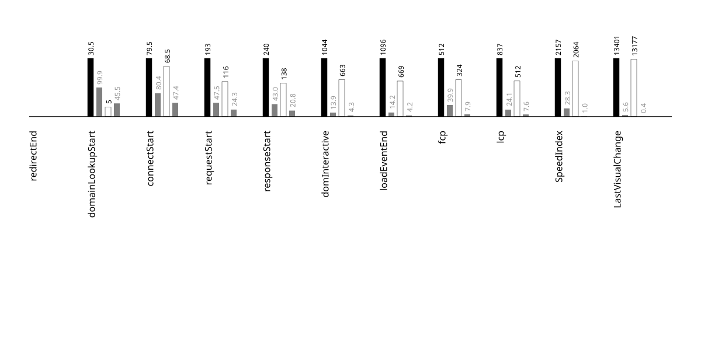

## metadata
{::nomarkdown}
<?xml version="1.0" encoding="utf-8"?>
<!DOCTYPE svg PUBLIC "-//W3C//DTD SVG 1.1//EN" "http://www.w3.org/Graphics/SVG/1.1/DTD/svg11.dtd">
<svg version="1.1"
     id="svg2" xml:space="preserve"
     xmlns="http://www.w3.org/2000/svg"
     xmlns:xlink="http://www.w3.org/1999/xlink"
     xmlns:html="http://www.w3.org/1999/xhtml"
x="0px" y="0px"
width="540.000000px" height="150.000000px"
viewBox="0 0 540.000000 150.000000" enable-background="new 0 0 540.000000 150.000000">

<g id="metadata">
<rect x="0.000000" y="0.000000" width="540.000000" height="150.000000"
 style="fill:rgb(200,200,200); fill-opacity:1; stroke:rgb(200,200,200); stroke-opacity:0; stroke-width:0.5" />
 <a href="https://greenmovil.clapuser.com/">
<text x="270.000000" y="50.000000" font-family="Atkinson Hyperlegible" font-size="24.000000pt" text-anchor="middle" text-align="center" font-weight="600" font-style="normal"  style="fill:rgb(0,0,255); fill-opacity:1; stroke:rgb(255,255,255); stroke-opacity:0; stroke-width:0.5">greenmovil_clapuser</text>
 </a>
<text x="275.000000" y="86.000000" font-family="Atkinson Hyperlegible" font-size="12.000000pt" text-anchor="middle" text-align="center" font-weight="400" font-style="normal"  style="fill:rgb(148,148,148); fill-opacity:1; stroke:rgb(255,255,255); stroke-opacity:0; stroke-width:0.5">preload</text>
<text x="270.000000" y="98.000000" font-family="Atkinson Hyperlegible" font-size="12.000000pt" text-anchor="middle" text-align="center" font-weight="500" font-style="normal"  style="fill:rgb(148,148,148); fill-opacity:1; stroke:rgb(255,255,255); stroke-opacity:0; stroke-width:0.5">2025-07-03</text>
<text x="275.000000" y="110.000000" font-family="Atkinson Hyperlegible" font-size="12.000000pt" text-anchor="middle" text-align="center" font-weight="500" font-style="normal"  style="fill:rgb(148,148,148); fill-opacity:1; stroke:rgb(255,255,255); stroke-opacity:0; stroke-width:0.5">android-15-ptablet-talkback</text>
<text x="337.500000" y="134.000000" font-family="Atkinson Hyperlegible" font-size="14.000000pt" text-anchor="start" text-align="left" font-weight="600" font-style="normal"  style="fill:rgb(255,255,255); fill-opacity:1; stroke:rgb(0,0,0); stroke-opacity:0; stroke-width:0.5">chrome</text>
<text x="202.500000" y="134.000000" font-family="Atkinson Hyperlegible" font-size="14.000000pt" text-anchor="end" text-align="right" font-weight="600" font-style="normal"  style="fill:rgb(0,0,0); fill-opacity:1; stroke:rgb(0,0,0); stroke-opacity:0; stroke-width:0.5">firefox</text>
</g>
</svg>

{:/}

---

## side by side video
{::nomarkdown}
<?xml version="1.0" encoding="utf-8"?>
<!DOCTYPE svg PUBLIC "-//W3C//DTD SVG 1.1//EN" "http://www.w3.org/Graphics/SVG/1.1/DTD/svg11.dtd">
<svg version="1.1"
     id="svg2" xml:space="preserve"
     xmlns="http://www.w3.org/2000/svg"
     xmlns:xlink="http://www.w3.org/1999/xlink"
     xmlns:html="http://www.w3.org/1999/xhtml"
x="0px" y="0px"
width="540.000000px" height="585.000000px"
viewBox="0 0 540.000000 585.000000" enable-background="new 0 0 540.000000 585.000000">

<g id="video_side_x_side">
<g>

<g id="video-wrapper" transform="scale(1,1)">

<foreignObject x="0.000000" y="0.000000" width="2160.000000" height="2340.000000">
 <video xmlns="http://www.w3.org/1999/xhtml"   width="540.000000" height="585.000000"  controls="" loop="false" muted="true"  >
<source src="../videos/2025-07-03-android-15-ptablet-talkback-greenmovil_clapuser-side-by-side.mp4" type="video/mp4" />
</video>
 </foreignObject></g></g>
</g>
</svg>

{:/}

---

## % visually complete by millisecond (SpeedIndex)
{::nomarkdown}
<?xml version="1.0" encoding="utf-8"?>
<!DOCTYPE svg PUBLIC "-//W3C//DTD SVG 1.1//EN" "http://www.w3.org/Graphics/SVG/1.1/DTD/svg11.dtd">
<svg version="1.1"
     id="svg2" xml:space="preserve"
     xmlns="http://www.w3.org/2000/svg"
     xmlns:xlink="http://www.w3.org/1999/xlink"
     xmlns:html="http://www.w3.org/1999/xhtml"
x="0px" y="0px"
width="900.000000px" height="600.000000px"
viewBox="0 0 900.000000 600.000000" enable-background="new 0 0 900.000000 600.000000">

<title>
2025-07-03-android-15-ptablet-talkback-greenmovil_clapuser_x_line_graph
</title>
<desc>
SpeedIndexProgress line graph for annotation
</desc>
 <g id="tic-x-annotation">
<text x="100.000000" y="512.000000" font-family="Apercu" font-size="7.000000pt" text-anchor="middle" text-align="center" dominant-baseline="central" font-weight="400" font-style="normal"  style="fill:rgb(118,118,118); fill-opacity:1; stroke:rgb(118,118,118); stroke-opacity:0; stroke-width:0.5">0.0s</text>
<text x="152.631579" y="512.000000" font-family="Apercu" font-size="7.000000pt" text-anchor="middle" text-align="center" dominant-baseline="central" font-weight="400" font-style="normal"  style="fill:rgb(118,118,118); fill-opacity:1; stroke:rgb(118,118,118); stroke-opacity:0; stroke-width:0.5">1.0s</text>
<text x="205.263158" y="512.000000" font-family="Apercu" font-size="7.000000pt" text-anchor="middle" text-align="center" dominant-baseline="central" font-weight="400" font-style="normal"  style="fill:rgb(118,118,118); fill-opacity:1; stroke:rgb(118,118,118); stroke-opacity:0; stroke-width:0.5">2.0s</text>
<text x="257.894737" y="512.000000" font-family="Apercu" font-size="7.000000pt" text-anchor="middle" text-align="center" dominant-baseline="central" font-weight="400" font-style="normal"  style="fill:rgb(118,118,118); fill-opacity:1; stroke:rgb(118,118,118); stroke-opacity:0; stroke-width:0.5">3.0s</text>
<text x="310.526316" y="512.000000" font-family="Apercu" font-size="7.000000pt" text-anchor="middle" text-align="center" dominant-baseline="central" font-weight="400" font-style="normal"  style="fill:rgb(118,118,118); fill-opacity:1; stroke:rgb(118,118,118); stroke-opacity:0; stroke-width:0.5">4.0s</text>
<text x="363.157895" y="512.000000" font-family="Apercu" font-size="7.000000pt" text-anchor="middle" text-align="center" dominant-baseline="central" font-weight="400" font-style="normal"  style="fill:rgb(118,118,118); fill-opacity:1; stroke:rgb(118,118,118); stroke-opacity:0; stroke-width:0.5">5.0s</text>
<text x="415.789474" y="512.000000" font-family="Apercu" font-size="7.000000pt" text-anchor="middle" text-align="center" dominant-baseline="central" font-weight="400" font-style="normal"  style="fill:rgb(118,118,118); fill-opacity:1; stroke:rgb(118,118,118); stroke-opacity:0; stroke-width:0.5">6.0s</text>
<text x="468.421053" y="512.000000" font-family="Apercu" font-size="7.000000pt" text-anchor="middle" text-align="center" dominant-baseline="central" font-weight="400" font-style="normal"  style="fill:rgb(118,118,118); fill-opacity:1; stroke:rgb(118,118,118); stroke-opacity:0; stroke-width:0.5">7.0s</text>
<text x="521.052632" y="512.000000" font-family="Apercu" font-size="7.000000pt" text-anchor="middle" text-align="center" dominant-baseline="central" font-weight="400" font-style="normal"  style="fill:rgb(118,118,118); fill-opacity:1; stroke:rgb(118,118,118); stroke-opacity:0; stroke-width:0.5">8.0s</text>
<text x="573.684211" y="512.000000" font-family="Apercu" font-size="7.000000pt" text-anchor="middle" text-align="center" dominant-baseline="central" font-weight="400" font-style="normal"  style="fill:rgb(118,118,118); fill-opacity:1; stroke:rgb(118,118,118); stroke-opacity:0; stroke-width:0.5">9.0s</text>
<text x="626.315789" y="512.000000" font-family="Apercu" font-size="7.000000pt" text-anchor="middle" text-align="center" dominant-baseline="central" font-weight="400" font-style="normal"  style="fill:rgb(118,118,118); fill-opacity:1; stroke:rgb(118,118,118); stroke-opacity:0; stroke-width:0.5">10.0s</text>
<text x="678.947368" y="512.000000" font-family="Apercu" font-size="7.000000pt" text-anchor="middle" text-align="center" dominant-baseline="central" font-weight="400" font-style="normal"  style="fill:rgb(118,118,118); fill-opacity:1; stroke:rgb(118,118,118); stroke-opacity:0; stroke-width:0.5">11.0s</text>
<text x="731.578947" y="512.000000" font-family="Apercu" font-size="7.000000pt" text-anchor="middle" text-align="center" dominant-baseline="central" font-weight="400" font-style="normal"  style="fill:rgb(118,118,118); fill-opacity:1; stroke:rgb(118,118,118); stroke-opacity:0; stroke-width:0.5">12.0s</text>
<text x="784.210526" y="512.000000" font-family="Apercu" font-size="7.000000pt" text-anchor="middle" text-align="center" dominant-baseline="central" font-weight="400" font-style="normal"  style="fill:rgb(118,118,118); fill-opacity:1; stroke:rgb(118,118,118); stroke-opacity:0; stroke-width:0.5">13.0s</text>
 </g> <g id="tic-y-annotation">
<text x="76.000000" y="460.000000" font-family="Apercu" font-size="7.000000pt" text-anchor="middle" text-align="center" dominant-baseline="central" font-weight="400" font-style="normal"  style="fill:rgb(118,118,118); fill-opacity:1; stroke:rgb(118,118,118); stroke-opacity:0; stroke-width:0.5">10%</text>
<text x="824.000000" y="460.000000" font-family="Apercu" font-size="7.000000pt" text-anchor="middle" text-align="center" dominant-baseline="central" font-weight="400" font-style="normal"  style="fill:rgb(118,118,118); fill-opacity:1; stroke:rgb(118,118,118); stroke-opacity:0; stroke-width:0.5">10%</text>
<text x="76.000000" y="420.000000" font-family="Apercu" font-size="7.000000pt" text-anchor="middle" text-align="center" dominant-baseline="central" font-weight="400" font-style="normal"  style="fill:rgb(118,118,118); fill-opacity:1; stroke:rgb(118,118,118); stroke-opacity:0; stroke-width:0.5">20%</text>
<text x="824.000000" y="420.000000" font-family="Apercu" font-size="7.000000pt" text-anchor="middle" text-align="center" dominant-baseline="central" font-weight="400" font-style="normal"  style="fill:rgb(118,118,118); fill-opacity:1; stroke:rgb(118,118,118); stroke-opacity:0; stroke-width:0.5">20%</text>
<text x="76.000000" y="380.000000" font-family="Apercu" font-size="7.000000pt" text-anchor="middle" text-align="center" dominant-baseline="central" font-weight="400" font-style="normal"  style="fill:rgb(118,118,118); fill-opacity:1; stroke:rgb(118,118,118); stroke-opacity:0; stroke-width:0.5">30%</text>
<text x="824.000000" y="380.000000" font-family="Apercu" font-size="7.000000pt" text-anchor="middle" text-align="center" dominant-baseline="central" font-weight="400" font-style="normal"  style="fill:rgb(118,118,118); fill-opacity:1; stroke:rgb(118,118,118); stroke-opacity:0; stroke-width:0.5">30%</text>
<text x="76.000000" y="340.000000" font-family="Apercu" font-size="7.000000pt" text-anchor="middle" text-align="center" dominant-baseline="central" font-weight="400" font-style="normal"  style="fill:rgb(118,118,118); fill-opacity:1; stroke:rgb(118,118,118); stroke-opacity:0; stroke-width:0.5">40%</text>
<text x="824.000000" y="340.000000" font-family="Apercu" font-size="7.000000pt" text-anchor="middle" text-align="center" dominant-baseline="central" font-weight="400" font-style="normal"  style="fill:rgb(118,118,118); fill-opacity:1; stroke:rgb(118,118,118); stroke-opacity:0; stroke-width:0.5">40%</text>
<text x="76.000000" y="300.000000" font-family="Apercu" font-size="7.000000pt" text-anchor="middle" text-align="center" dominant-baseline="central" font-weight="400" font-style="normal"  style="fill:rgb(118,118,118); fill-opacity:1; stroke:rgb(118,118,118); stroke-opacity:0; stroke-width:0.5">50%</text>
<text x="824.000000" y="300.000000" font-family="Apercu" font-size="7.000000pt" text-anchor="middle" text-align="center" dominant-baseline="central" font-weight="400" font-style="normal"  style="fill:rgb(118,118,118); fill-opacity:1; stroke:rgb(118,118,118); stroke-opacity:0; stroke-width:0.5">50%</text>
<text x="76.000000" y="260.000000" font-family="Apercu" font-size="7.000000pt" text-anchor="middle" text-align="center" dominant-baseline="central" font-weight="400" font-style="normal"  style="fill:rgb(118,118,118); fill-opacity:1; stroke:rgb(118,118,118); stroke-opacity:0; stroke-width:0.5">60%</text>
<text x="824.000000" y="260.000000" font-family="Apercu" font-size="7.000000pt" text-anchor="middle" text-align="center" dominant-baseline="central" font-weight="400" font-style="normal"  style="fill:rgb(118,118,118); fill-opacity:1; stroke:rgb(118,118,118); stroke-opacity:0; stroke-width:0.5">60%</text>
<text x="76.000000" y="220.000000" font-family="Apercu" font-size="7.000000pt" text-anchor="middle" text-align="center" dominant-baseline="central" font-weight="400" font-style="normal"  style="fill:rgb(118,118,118); fill-opacity:1; stroke:rgb(118,118,118); stroke-opacity:0; stroke-width:0.5">70%</text>
<text x="824.000000" y="220.000000" font-family="Apercu" font-size="7.000000pt" text-anchor="middle" text-align="center" dominant-baseline="central" font-weight="400" font-style="normal"  style="fill:rgb(118,118,118); fill-opacity:1; stroke:rgb(118,118,118); stroke-opacity:0; stroke-width:0.5">70%</text>
<text x="76.000000" y="180.000000" font-family="Apercu" font-size="7.000000pt" text-anchor="middle" text-align="center" dominant-baseline="central" font-weight="400" font-style="normal"  style="fill:rgb(118,118,118); fill-opacity:1; stroke:rgb(118,118,118); stroke-opacity:0; stroke-width:0.5">80%</text>
<text x="824.000000" y="180.000000" font-family="Apercu" font-size="7.000000pt" text-anchor="middle" text-align="center" dominant-baseline="central" font-weight="400" font-style="normal"  style="fill:rgb(118,118,118); fill-opacity:1; stroke:rgb(118,118,118); stroke-opacity:0; stroke-width:0.5">80%</text>
<text x="76.000000" y="140.000000" font-family="Apercu" font-size="7.000000pt" text-anchor="middle" text-align="center" dominant-baseline="central" font-weight="400" font-style="normal"  style="fill:rgb(118,118,118); fill-opacity:1; stroke:rgb(118,118,118); stroke-opacity:0; stroke-width:0.5">90%</text>
<text x="824.000000" y="140.000000" font-family="Apercu" font-size="7.000000pt" text-anchor="middle" text-align="center" dominant-baseline="central" font-weight="400" font-style="normal"  style="fill:rgb(118,118,118); fill-opacity:1; stroke:rgb(118,118,118); stroke-opacity:0; stroke-width:0.5">90%</text>
<text x="76.000000" y="100.000000" font-family="Apercu" font-size="7.000000pt" text-anchor="middle" text-align="center" dominant-baseline="central" font-weight="400" font-style="normal"  style="fill:rgb(118,118,118); fill-opacity:1; stroke:rgb(118,118,118); stroke-opacity:0; stroke-width:0.5">100%</text>
<text x="824.000000" y="100.000000" font-family="Apercu" font-size="7.000000pt" text-anchor="middle" text-align="center" dominant-baseline="central" font-weight="400" font-style="normal"  style="fill:rgb(118,118,118); fill-opacity:1; stroke:rgb(118,118,118); stroke-opacity:0; stroke-width:0.5">100%</text>
 </g> <g id="tic-y-lines-annotation">
<line x1="112.000000" y1="460.000000" x2="788.000000" y2="460.000000" style="fill:rgb(118,118,118); fill-opacity:0; stroke:rgb(230,230,230); stroke-opacity:1; stroke-width:1" />
<text x="152.631579" y="460.000000" font-family="Apercu" font-size="3.000000pt" text-anchor="middle" text-align="center" dominant-baseline="central" font-weight="400" font-style="normal"  style="fill:rgb(118,118,118); fill-opacity:1; stroke:rgb(118,118,118); stroke-opacity:0; stroke-width:0.5">10%</text>
<text x="205.263158" y="460.000000" font-family="Apercu" font-size="3.000000pt" text-anchor="middle" text-align="center" dominant-baseline="central" font-weight="400" font-style="normal"  style="fill:rgb(118,118,118); fill-opacity:1; stroke:rgb(118,118,118); stroke-opacity:0; stroke-width:0.5">10%</text>
<text x="257.894737" y="460.000000" font-family="Apercu" font-size="3.000000pt" text-anchor="middle" text-align="center" dominant-baseline="central" font-weight="400" font-style="normal"  style="fill:rgb(118,118,118); fill-opacity:1; stroke:rgb(118,118,118); stroke-opacity:0; stroke-width:0.5">10%</text>
<text x="310.526316" y="460.000000" font-family="Apercu" font-size="3.000000pt" text-anchor="middle" text-align="center" dominant-baseline="central" font-weight="400" font-style="normal"  style="fill:rgb(118,118,118); fill-opacity:1; stroke:rgb(118,118,118); stroke-opacity:0; stroke-width:0.5">10%</text>
<text x="363.157895" y="460.000000" font-family="Apercu" font-size="3.000000pt" text-anchor="middle" text-align="center" dominant-baseline="central" font-weight="400" font-style="normal"  style="fill:rgb(118,118,118); fill-opacity:1; stroke:rgb(118,118,118); stroke-opacity:0; stroke-width:0.5">10%</text>
<text x="415.789474" y="460.000000" font-family="Apercu" font-size="3.000000pt" text-anchor="middle" text-align="center" dominant-baseline="central" font-weight="400" font-style="normal"  style="fill:rgb(118,118,118); fill-opacity:1; stroke:rgb(118,118,118); stroke-opacity:0; stroke-width:0.5">10%</text>
<text x="468.421053" y="460.000000" font-family="Apercu" font-size="3.000000pt" text-anchor="middle" text-align="center" dominant-baseline="central" font-weight="400" font-style="normal"  style="fill:rgb(118,118,118); fill-opacity:1; stroke:rgb(118,118,118); stroke-opacity:0; stroke-width:0.5">10%</text>
<text x="521.052632" y="460.000000" font-family="Apercu" font-size="3.000000pt" text-anchor="middle" text-align="center" dominant-baseline="central" font-weight="400" font-style="normal"  style="fill:rgb(118,118,118); fill-opacity:1; stroke:rgb(118,118,118); stroke-opacity:0; stroke-width:0.5">10%</text>
<text x="573.684211" y="460.000000" font-family="Apercu" font-size="3.000000pt" text-anchor="middle" text-align="center" dominant-baseline="central" font-weight="400" font-style="normal"  style="fill:rgb(118,118,118); fill-opacity:1; stroke:rgb(118,118,118); stroke-opacity:0; stroke-width:0.5">10%</text>
<text x="626.315789" y="460.000000" font-family="Apercu" font-size="3.000000pt" text-anchor="middle" text-align="center" dominant-baseline="central" font-weight="400" font-style="normal"  style="fill:rgb(118,118,118); fill-opacity:1; stroke:rgb(118,118,118); stroke-opacity:0; stroke-width:0.5">10%</text>
<text x="678.947368" y="460.000000" font-family="Apercu" font-size="3.000000pt" text-anchor="middle" text-align="center" dominant-baseline="central" font-weight="400" font-style="normal"  style="fill:rgb(118,118,118); fill-opacity:1; stroke:rgb(118,118,118); stroke-opacity:0; stroke-width:0.5">10%</text>
<text x="731.578947" y="460.000000" font-family="Apercu" font-size="3.000000pt" text-anchor="middle" text-align="center" dominant-baseline="central" font-weight="400" font-style="normal"  style="fill:rgb(118,118,118); fill-opacity:1; stroke:rgb(118,118,118); stroke-opacity:0; stroke-width:0.5">10%</text>
<line x1="112.000000" y1="420.000000" x2="788.000000" y2="420.000000" style="fill:rgb(118,118,118); fill-opacity:0; stroke:rgb(230,230,230); stroke-opacity:1; stroke-width:1" />
<text x="152.631579" y="420.000000" font-family="Apercu" font-size="3.000000pt" text-anchor="middle" text-align="center" dominant-baseline="central" font-weight="400" font-style="normal"  style="fill:rgb(118,118,118); fill-opacity:1; stroke:rgb(118,118,118); stroke-opacity:0; stroke-width:0.5">20%</text>
<text x="205.263158" y="420.000000" font-family="Apercu" font-size="3.000000pt" text-anchor="middle" text-align="center" dominant-baseline="central" font-weight="400" font-style="normal"  style="fill:rgb(118,118,118); fill-opacity:1; stroke:rgb(118,118,118); stroke-opacity:0; stroke-width:0.5">20%</text>
<text x="257.894737" y="420.000000" font-family="Apercu" font-size="3.000000pt" text-anchor="middle" text-align="center" dominant-baseline="central" font-weight="400" font-style="normal"  style="fill:rgb(118,118,118); fill-opacity:1; stroke:rgb(118,118,118); stroke-opacity:0; stroke-width:0.5">20%</text>
<text x="310.526316" y="420.000000" font-family="Apercu" font-size="3.000000pt" text-anchor="middle" text-align="center" dominant-baseline="central" font-weight="400" font-style="normal"  style="fill:rgb(118,118,118); fill-opacity:1; stroke:rgb(118,118,118); stroke-opacity:0; stroke-width:0.5">20%</text>
<text x="363.157895" y="420.000000" font-family="Apercu" font-size="3.000000pt" text-anchor="middle" text-align="center" dominant-baseline="central" font-weight="400" font-style="normal"  style="fill:rgb(118,118,118); fill-opacity:1; stroke:rgb(118,118,118); stroke-opacity:0; stroke-width:0.5">20%</text>
<text x="415.789474" y="420.000000" font-family="Apercu" font-size="3.000000pt" text-anchor="middle" text-align="center" dominant-baseline="central" font-weight="400" font-style="normal"  style="fill:rgb(118,118,118); fill-opacity:1; stroke:rgb(118,118,118); stroke-opacity:0; stroke-width:0.5">20%</text>
<text x="468.421053" y="420.000000" font-family="Apercu" font-size="3.000000pt" text-anchor="middle" text-align="center" dominant-baseline="central" font-weight="400" font-style="normal"  style="fill:rgb(118,118,118); fill-opacity:1; stroke:rgb(118,118,118); stroke-opacity:0; stroke-width:0.5">20%</text>
<text x="521.052632" y="420.000000" font-family="Apercu" font-size="3.000000pt" text-anchor="middle" text-align="center" dominant-baseline="central" font-weight="400" font-style="normal"  style="fill:rgb(118,118,118); fill-opacity:1; stroke:rgb(118,118,118); stroke-opacity:0; stroke-width:0.5">20%</text>
<text x="573.684211" y="420.000000" font-family="Apercu" font-size="3.000000pt" text-anchor="middle" text-align="center" dominant-baseline="central" font-weight="400" font-style="normal"  style="fill:rgb(118,118,118); fill-opacity:1; stroke:rgb(118,118,118); stroke-opacity:0; stroke-width:0.5">20%</text>
<text x="626.315789" y="420.000000" font-family="Apercu" font-size="3.000000pt" text-anchor="middle" text-align="center" dominant-baseline="central" font-weight="400" font-style="normal"  style="fill:rgb(118,118,118); fill-opacity:1; stroke:rgb(118,118,118); stroke-opacity:0; stroke-width:0.5">20%</text>
<text x="678.947368" y="420.000000" font-family="Apercu" font-size="3.000000pt" text-anchor="middle" text-align="center" dominant-baseline="central" font-weight="400" font-style="normal"  style="fill:rgb(118,118,118); fill-opacity:1; stroke:rgb(118,118,118); stroke-opacity:0; stroke-width:0.5">20%</text>
<text x="731.578947" y="420.000000" font-family="Apercu" font-size="3.000000pt" text-anchor="middle" text-align="center" dominant-baseline="central" font-weight="400" font-style="normal"  style="fill:rgb(118,118,118); fill-opacity:1; stroke:rgb(118,118,118); stroke-opacity:0; stroke-width:0.5">20%</text>
<line x1="112.000000" y1="380.000000" x2="788.000000" y2="380.000000" style="fill:rgb(118,118,118); fill-opacity:0; stroke:rgb(230,230,230); stroke-opacity:1; stroke-width:1" />
<text x="152.631579" y="380.000000" font-family="Apercu" font-size="3.000000pt" text-anchor="middle" text-align="center" dominant-baseline="central" font-weight="400" font-style="normal"  style="fill:rgb(118,118,118); fill-opacity:1; stroke:rgb(118,118,118); stroke-opacity:0; stroke-width:0.5">30%</text>
<text x="205.263158" y="380.000000" font-family="Apercu" font-size="3.000000pt" text-anchor="middle" text-align="center" dominant-baseline="central" font-weight="400" font-style="normal"  style="fill:rgb(118,118,118); fill-opacity:1; stroke:rgb(118,118,118); stroke-opacity:0; stroke-width:0.5">30%</text>
<text x="257.894737" y="380.000000" font-family="Apercu" font-size="3.000000pt" text-anchor="middle" text-align="center" dominant-baseline="central" font-weight="400" font-style="normal"  style="fill:rgb(118,118,118); fill-opacity:1; stroke:rgb(118,118,118); stroke-opacity:0; stroke-width:0.5">30%</text>
<text x="310.526316" y="380.000000" font-family="Apercu" font-size="3.000000pt" text-anchor="middle" text-align="center" dominant-baseline="central" font-weight="400" font-style="normal"  style="fill:rgb(118,118,118); fill-opacity:1; stroke:rgb(118,118,118); stroke-opacity:0; stroke-width:0.5">30%</text>
<text x="363.157895" y="380.000000" font-family="Apercu" font-size="3.000000pt" text-anchor="middle" text-align="center" dominant-baseline="central" font-weight="400" font-style="normal"  style="fill:rgb(118,118,118); fill-opacity:1; stroke:rgb(118,118,118); stroke-opacity:0; stroke-width:0.5">30%</text>
<text x="415.789474" y="380.000000" font-family="Apercu" font-size="3.000000pt" text-anchor="middle" text-align="center" dominant-baseline="central" font-weight="400" font-style="normal"  style="fill:rgb(118,118,118); fill-opacity:1; stroke:rgb(118,118,118); stroke-opacity:0; stroke-width:0.5">30%</text>
<text x="468.421053" y="380.000000" font-family="Apercu" font-size="3.000000pt" text-anchor="middle" text-align="center" dominant-baseline="central" font-weight="400" font-style="normal"  style="fill:rgb(118,118,118); fill-opacity:1; stroke:rgb(118,118,118); stroke-opacity:0; stroke-width:0.5">30%</text>
<text x="521.052632" y="380.000000" font-family="Apercu" font-size="3.000000pt" text-anchor="middle" text-align="center" dominant-baseline="central" font-weight="400" font-style="normal"  style="fill:rgb(118,118,118); fill-opacity:1; stroke:rgb(118,118,118); stroke-opacity:0; stroke-width:0.5">30%</text>
<text x="573.684211" y="380.000000" font-family="Apercu" font-size="3.000000pt" text-anchor="middle" text-align="center" dominant-baseline="central" font-weight="400" font-style="normal"  style="fill:rgb(118,118,118); fill-opacity:1; stroke:rgb(118,118,118); stroke-opacity:0; stroke-width:0.5">30%</text>
<text x="626.315789" y="380.000000" font-family="Apercu" font-size="3.000000pt" text-anchor="middle" text-align="center" dominant-baseline="central" font-weight="400" font-style="normal"  style="fill:rgb(118,118,118); fill-opacity:1; stroke:rgb(118,118,118); stroke-opacity:0; stroke-width:0.5">30%</text>
<text x="678.947368" y="380.000000" font-family="Apercu" font-size="3.000000pt" text-anchor="middle" text-align="center" dominant-baseline="central" font-weight="400" font-style="normal"  style="fill:rgb(118,118,118); fill-opacity:1; stroke:rgb(118,118,118); stroke-opacity:0; stroke-width:0.5">30%</text>
<text x="731.578947" y="380.000000" font-family="Apercu" font-size="3.000000pt" text-anchor="middle" text-align="center" dominant-baseline="central" font-weight="400" font-style="normal"  style="fill:rgb(118,118,118); fill-opacity:1; stroke:rgb(118,118,118); stroke-opacity:0; stroke-width:0.5">30%</text>
<line x1="112.000000" y1="340.000000" x2="788.000000" y2="340.000000" style="fill:rgb(118,118,118); fill-opacity:0; stroke:rgb(230,230,230); stroke-opacity:1; stroke-width:1" />
<text x="152.631579" y="340.000000" font-family="Apercu" font-size="3.000000pt" text-anchor="middle" text-align="center" dominant-baseline="central" font-weight="400" font-style="normal"  style="fill:rgb(118,118,118); fill-opacity:1; stroke:rgb(118,118,118); stroke-opacity:0; stroke-width:0.5">40%</text>
<text x="205.263158" y="340.000000" font-family="Apercu" font-size="3.000000pt" text-anchor="middle" text-align="center" dominant-baseline="central" font-weight="400" font-style="normal"  style="fill:rgb(118,118,118); fill-opacity:1; stroke:rgb(118,118,118); stroke-opacity:0; stroke-width:0.5">40%</text>
<text x="257.894737" y="340.000000" font-family="Apercu" font-size="3.000000pt" text-anchor="middle" text-align="center" dominant-baseline="central" font-weight="400" font-style="normal"  style="fill:rgb(118,118,118); fill-opacity:1; stroke:rgb(118,118,118); stroke-opacity:0; stroke-width:0.5">40%</text>
<text x="310.526316" y="340.000000" font-family="Apercu" font-size="3.000000pt" text-anchor="middle" text-align="center" dominant-baseline="central" font-weight="400" font-style="normal"  style="fill:rgb(118,118,118); fill-opacity:1; stroke:rgb(118,118,118); stroke-opacity:0; stroke-width:0.5">40%</text>
<text x="363.157895" y="340.000000" font-family="Apercu" font-size="3.000000pt" text-anchor="middle" text-align="center" dominant-baseline="central" font-weight="400" font-style="normal"  style="fill:rgb(118,118,118); fill-opacity:1; stroke:rgb(118,118,118); stroke-opacity:0; stroke-width:0.5">40%</text>
<text x="415.789474" y="340.000000" font-family="Apercu" font-size="3.000000pt" text-anchor="middle" text-align="center" dominant-baseline="central" font-weight="400" font-style="normal"  style="fill:rgb(118,118,118); fill-opacity:1; stroke:rgb(118,118,118); stroke-opacity:0; stroke-width:0.5">40%</text>
<text x="468.421053" y="340.000000" font-family="Apercu" font-size="3.000000pt" text-anchor="middle" text-align="center" dominant-baseline="central" font-weight="400" font-style="normal"  style="fill:rgb(118,118,118); fill-opacity:1; stroke:rgb(118,118,118); stroke-opacity:0; stroke-width:0.5">40%</text>
<text x="521.052632" y="340.000000" font-family="Apercu" font-size="3.000000pt" text-anchor="middle" text-align="center" dominant-baseline="central" font-weight="400" font-style="normal"  style="fill:rgb(118,118,118); fill-opacity:1; stroke:rgb(118,118,118); stroke-opacity:0; stroke-width:0.5">40%</text>
<text x="573.684211" y="340.000000" font-family="Apercu" font-size="3.000000pt" text-anchor="middle" text-align="center" dominant-baseline="central" font-weight="400" font-style="normal"  style="fill:rgb(118,118,118); fill-opacity:1; stroke:rgb(118,118,118); stroke-opacity:0; stroke-width:0.5">40%</text>
<text x="626.315789" y="340.000000" font-family="Apercu" font-size="3.000000pt" text-anchor="middle" text-align="center" dominant-baseline="central" font-weight="400" font-style="normal"  style="fill:rgb(118,118,118); fill-opacity:1; stroke:rgb(118,118,118); stroke-opacity:0; stroke-width:0.5">40%</text>
<text x="678.947368" y="340.000000" font-family="Apercu" font-size="3.000000pt" text-anchor="middle" text-align="center" dominant-baseline="central" font-weight="400" font-style="normal"  style="fill:rgb(118,118,118); fill-opacity:1; stroke:rgb(118,118,118); stroke-opacity:0; stroke-width:0.5">40%</text>
<text x="731.578947" y="340.000000" font-family="Apercu" font-size="3.000000pt" text-anchor="middle" text-align="center" dominant-baseline="central" font-weight="400" font-style="normal"  style="fill:rgb(118,118,118); fill-opacity:1; stroke:rgb(118,118,118); stroke-opacity:0; stroke-width:0.5">40%</text>
<line x1="112.000000" y1="300.000000" x2="788.000000" y2="300.000000" style="fill:rgb(118,118,118); fill-opacity:0; stroke:rgb(230,230,230); stroke-opacity:1; stroke-width:1" />
<text x="152.631579" y="300.000000" font-family="Apercu" font-size="3.000000pt" text-anchor="middle" text-align="center" dominant-baseline="central" font-weight="400" font-style="normal"  style="fill:rgb(118,118,118); fill-opacity:1; stroke:rgb(118,118,118); stroke-opacity:0; stroke-width:0.5">50%</text>
<text x="205.263158" y="300.000000" font-family="Apercu" font-size="3.000000pt" text-anchor="middle" text-align="center" dominant-baseline="central" font-weight="400" font-style="normal"  style="fill:rgb(118,118,118); fill-opacity:1; stroke:rgb(118,118,118); stroke-opacity:0; stroke-width:0.5">50%</text>
<text x="257.894737" y="300.000000" font-family="Apercu" font-size="3.000000pt" text-anchor="middle" text-align="center" dominant-baseline="central" font-weight="400" font-style="normal"  style="fill:rgb(118,118,118); fill-opacity:1; stroke:rgb(118,118,118); stroke-opacity:0; stroke-width:0.5">50%</text>
<text x="310.526316" y="300.000000" font-family="Apercu" font-size="3.000000pt" text-anchor="middle" text-align="center" dominant-baseline="central" font-weight="400" font-style="normal"  style="fill:rgb(118,118,118); fill-opacity:1; stroke:rgb(118,118,118); stroke-opacity:0; stroke-width:0.5">50%</text>
<text x="363.157895" y="300.000000" font-family="Apercu" font-size="3.000000pt" text-anchor="middle" text-align="center" dominant-baseline="central" font-weight="400" font-style="normal"  style="fill:rgb(118,118,118); fill-opacity:1; stroke:rgb(118,118,118); stroke-opacity:0; stroke-width:0.5">50%</text>
<text x="415.789474" y="300.000000" font-family="Apercu" font-size="3.000000pt" text-anchor="middle" text-align="center" dominant-baseline="central" font-weight="400" font-style="normal"  style="fill:rgb(118,118,118); fill-opacity:1; stroke:rgb(118,118,118); stroke-opacity:0; stroke-width:0.5">50%</text>
<text x="468.421053" y="300.000000" font-family="Apercu" font-size="3.000000pt" text-anchor="middle" text-align="center" dominant-baseline="central" font-weight="400" font-style="normal"  style="fill:rgb(118,118,118); fill-opacity:1; stroke:rgb(118,118,118); stroke-opacity:0; stroke-width:0.5">50%</text>
<text x="521.052632" y="300.000000" font-family="Apercu" font-size="3.000000pt" text-anchor="middle" text-align="center" dominant-baseline="central" font-weight="400" font-style="normal"  style="fill:rgb(118,118,118); fill-opacity:1; stroke:rgb(118,118,118); stroke-opacity:0; stroke-width:0.5">50%</text>
<text x="573.684211" y="300.000000" font-family="Apercu" font-size="3.000000pt" text-anchor="middle" text-align="center" dominant-baseline="central" font-weight="400" font-style="normal"  style="fill:rgb(118,118,118); fill-opacity:1; stroke:rgb(118,118,118); stroke-opacity:0; stroke-width:0.5">50%</text>
<text x="626.315789" y="300.000000" font-family="Apercu" font-size="3.000000pt" text-anchor="middle" text-align="center" dominant-baseline="central" font-weight="400" font-style="normal"  style="fill:rgb(118,118,118); fill-opacity:1; stroke:rgb(118,118,118); stroke-opacity:0; stroke-width:0.5">50%</text>
<text x="678.947368" y="300.000000" font-family="Apercu" font-size="3.000000pt" text-anchor="middle" text-align="center" dominant-baseline="central" font-weight="400" font-style="normal"  style="fill:rgb(118,118,118); fill-opacity:1; stroke:rgb(118,118,118); stroke-opacity:0; stroke-width:0.5">50%</text>
<text x="731.578947" y="300.000000" font-family="Apercu" font-size="3.000000pt" text-anchor="middle" text-align="center" dominant-baseline="central" font-weight="400" font-style="normal"  style="fill:rgb(118,118,118); fill-opacity:1; stroke:rgb(118,118,118); stroke-opacity:0; stroke-width:0.5">50%</text>
<line x1="112.000000" y1="260.000000" x2="788.000000" y2="260.000000" style="fill:rgb(118,118,118); fill-opacity:0; stroke:rgb(230,230,230); stroke-opacity:1; stroke-width:1" />
<text x="152.631579" y="260.000000" font-family="Apercu" font-size="3.000000pt" text-anchor="middle" text-align="center" dominant-baseline="central" font-weight="400" font-style="normal"  style="fill:rgb(118,118,118); fill-opacity:1; stroke:rgb(118,118,118); stroke-opacity:0; stroke-width:0.5">60%</text>
<text x="205.263158" y="260.000000" font-family="Apercu" font-size="3.000000pt" text-anchor="middle" text-align="center" dominant-baseline="central" font-weight="400" font-style="normal"  style="fill:rgb(118,118,118); fill-opacity:1; stroke:rgb(118,118,118); stroke-opacity:0; stroke-width:0.5">60%</text>
<text x="257.894737" y="260.000000" font-family="Apercu" font-size="3.000000pt" text-anchor="middle" text-align="center" dominant-baseline="central" font-weight="400" font-style="normal"  style="fill:rgb(118,118,118); fill-opacity:1; stroke:rgb(118,118,118); stroke-opacity:0; stroke-width:0.5">60%</text>
<text x="310.526316" y="260.000000" font-family="Apercu" font-size="3.000000pt" text-anchor="middle" text-align="center" dominant-baseline="central" font-weight="400" font-style="normal"  style="fill:rgb(118,118,118); fill-opacity:1; stroke:rgb(118,118,118); stroke-opacity:0; stroke-width:0.5">60%</text>
<text x="363.157895" y="260.000000" font-family="Apercu" font-size="3.000000pt" text-anchor="middle" text-align="center" dominant-baseline="central" font-weight="400" font-style="normal"  style="fill:rgb(118,118,118); fill-opacity:1; stroke:rgb(118,118,118); stroke-opacity:0; stroke-width:0.5">60%</text>
<text x="415.789474" y="260.000000" font-family="Apercu" font-size="3.000000pt" text-anchor="middle" text-align="center" dominant-baseline="central" font-weight="400" font-style="normal"  style="fill:rgb(118,118,118); fill-opacity:1; stroke:rgb(118,118,118); stroke-opacity:0; stroke-width:0.5">60%</text>
<text x="468.421053" y="260.000000" font-family="Apercu" font-size="3.000000pt" text-anchor="middle" text-align="center" dominant-baseline="central" font-weight="400" font-style="normal"  style="fill:rgb(118,118,118); fill-opacity:1; stroke:rgb(118,118,118); stroke-opacity:0; stroke-width:0.5">60%</text>
<text x="521.052632" y="260.000000" font-family="Apercu" font-size="3.000000pt" text-anchor="middle" text-align="center" dominant-baseline="central" font-weight="400" font-style="normal"  style="fill:rgb(118,118,118); fill-opacity:1; stroke:rgb(118,118,118); stroke-opacity:0; stroke-width:0.5">60%</text>
<text x="573.684211" y="260.000000" font-family="Apercu" font-size="3.000000pt" text-anchor="middle" text-align="center" dominant-baseline="central" font-weight="400" font-style="normal"  style="fill:rgb(118,118,118); fill-opacity:1; stroke:rgb(118,118,118); stroke-opacity:0; stroke-width:0.5">60%</text>
<text x="626.315789" y="260.000000" font-family="Apercu" font-size="3.000000pt" text-anchor="middle" text-align="center" dominant-baseline="central" font-weight="400" font-style="normal"  style="fill:rgb(118,118,118); fill-opacity:1; stroke:rgb(118,118,118); stroke-opacity:0; stroke-width:0.5">60%</text>
<text x="678.947368" y="260.000000" font-family="Apercu" font-size="3.000000pt" text-anchor="middle" text-align="center" dominant-baseline="central" font-weight="400" font-style="normal"  style="fill:rgb(118,118,118); fill-opacity:1; stroke:rgb(118,118,118); stroke-opacity:0; stroke-width:0.5">60%</text>
<text x="731.578947" y="260.000000" font-family="Apercu" font-size="3.000000pt" text-anchor="middle" text-align="center" dominant-baseline="central" font-weight="400" font-style="normal"  style="fill:rgb(118,118,118); fill-opacity:1; stroke:rgb(118,118,118); stroke-opacity:0; stroke-width:0.5">60%</text>
<line x1="112.000000" y1="220.000000" x2="788.000000" y2="220.000000" style="fill:rgb(118,118,118); fill-opacity:0; stroke:rgb(230,230,230); stroke-opacity:1; stroke-width:1" />
<text x="152.631579" y="220.000000" font-family="Apercu" font-size="3.000000pt" text-anchor="middle" text-align="center" dominant-baseline="central" font-weight="400" font-style="normal"  style="fill:rgb(118,118,118); fill-opacity:1; stroke:rgb(118,118,118); stroke-opacity:0; stroke-width:0.5">70%</text>
<text x="205.263158" y="220.000000" font-family="Apercu" font-size="3.000000pt" text-anchor="middle" text-align="center" dominant-baseline="central" font-weight="400" font-style="normal"  style="fill:rgb(118,118,118); fill-opacity:1; stroke:rgb(118,118,118); stroke-opacity:0; stroke-width:0.5">70%</text>
<text x="257.894737" y="220.000000" font-family="Apercu" font-size="3.000000pt" text-anchor="middle" text-align="center" dominant-baseline="central" font-weight="400" font-style="normal"  style="fill:rgb(118,118,118); fill-opacity:1; stroke:rgb(118,118,118); stroke-opacity:0; stroke-width:0.5">70%</text>
<text x="310.526316" y="220.000000" font-family="Apercu" font-size="3.000000pt" text-anchor="middle" text-align="center" dominant-baseline="central" font-weight="400" font-style="normal"  style="fill:rgb(118,118,118); fill-opacity:1; stroke:rgb(118,118,118); stroke-opacity:0; stroke-width:0.5">70%</text>
<text x="363.157895" y="220.000000" font-family="Apercu" font-size="3.000000pt" text-anchor="middle" text-align="center" dominant-baseline="central" font-weight="400" font-style="normal"  style="fill:rgb(118,118,118); fill-opacity:1; stroke:rgb(118,118,118); stroke-opacity:0; stroke-width:0.5">70%</text>
<text x="415.789474" y="220.000000" font-family="Apercu" font-size="3.000000pt" text-anchor="middle" text-align="center" dominant-baseline="central" font-weight="400" font-style="normal"  style="fill:rgb(118,118,118); fill-opacity:1; stroke:rgb(118,118,118); stroke-opacity:0; stroke-width:0.5">70%</text>
<text x="468.421053" y="220.000000" font-family="Apercu" font-size="3.000000pt" text-anchor="middle" text-align="center" dominant-baseline="central" font-weight="400" font-style="normal"  style="fill:rgb(118,118,118); fill-opacity:1; stroke:rgb(118,118,118); stroke-opacity:0; stroke-width:0.5">70%</text>
<text x="521.052632" y="220.000000" font-family="Apercu" font-size="3.000000pt" text-anchor="middle" text-align="center" dominant-baseline="central" font-weight="400" font-style="normal"  style="fill:rgb(118,118,118); fill-opacity:1; stroke:rgb(118,118,118); stroke-opacity:0; stroke-width:0.5">70%</text>
<text x="573.684211" y="220.000000" font-family="Apercu" font-size="3.000000pt" text-anchor="middle" text-align="center" dominant-baseline="central" font-weight="400" font-style="normal"  style="fill:rgb(118,118,118); fill-opacity:1; stroke:rgb(118,118,118); stroke-opacity:0; stroke-width:0.5">70%</text>
<text x="626.315789" y="220.000000" font-family="Apercu" font-size="3.000000pt" text-anchor="middle" text-align="center" dominant-baseline="central" font-weight="400" font-style="normal"  style="fill:rgb(118,118,118); fill-opacity:1; stroke:rgb(118,118,118); stroke-opacity:0; stroke-width:0.5">70%</text>
<text x="678.947368" y="220.000000" font-family="Apercu" font-size="3.000000pt" text-anchor="middle" text-align="center" dominant-baseline="central" font-weight="400" font-style="normal"  style="fill:rgb(118,118,118); fill-opacity:1; stroke:rgb(118,118,118); stroke-opacity:0; stroke-width:0.5">70%</text>
<text x="731.578947" y="220.000000" font-family="Apercu" font-size="3.000000pt" text-anchor="middle" text-align="center" dominant-baseline="central" font-weight="400" font-style="normal"  style="fill:rgb(118,118,118); fill-opacity:1; stroke:rgb(118,118,118); stroke-opacity:0; stroke-width:0.5">70%</text>
<line x1="112.000000" y1="180.000000" x2="788.000000" y2="180.000000" style="fill:rgb(118,118,118); fill-opacity:0; stroke:rgb(230,230,230); stroke-opacity:1; stroke-width:1" />
<text x="152.631579" y="180.000000" font-family="Apercu" font-size="3.000000pt" text-anchor="middle" text-align="center" dominant-baseline="central" font-weight="400" font-style="normal"  style="fill:rgb(118,118,118); fill-opacity:1; stroke:rgb(118,118,118); stroke-opacity:0; stroke-width:0.5">80%</text>
<text x="205.263158" y="180.000000" font-family="Apercu" font-size="3.000000pt" text-anchor="middle" text-align="center" dominant-baseline="central" font-weight="400" font-style="normal"  style="fill:rgb(118,118,118); fill-opacity:1; stroke:rgb(118,118,118); stroke-opacity:0; stroke-width:0.5">80%</text>
<text x="257.894737" y="180.000000" font-family="Apercu" font-size="3.000000pt" text-anchor="middle" text-align="center" dominant-baseline="central" font-weight="400" font-style="normal"  style="fill:rgb(118,118,118); fill-opacity:1; stroke:rgb(118,118,118); stroke-opacity:0; stroke-width:0.5">80%</text>
<text x="310.526316" y="180.000000" font-family="Apercu" font-size="3.000000pt" text-anchor="middle" text-align="center" dominant-baseline="central" font-weight="400" font-style="normal"  style="fill:rgb(118,118,118); fill-opacity:1; stroke:rgb(118,118,118); stroke-opacity:0; stroke-width:0.5">80%</text>
<text x="363.157895" y="180.000000" font-family="Apercu" font-size="3.000000pt" text-anchor="middle" text-align="center" dominant-baseline="central" font-weight="400" font-style="normal"  style="fill:rgb(118,118,118); fill-opacity:1; stroke:rgb(118,118,118); stroke-opacity:0; stroke-width:0.5">80%</text>
<text x="415.789474" y="180.000000" font-family="Apercu" font-size="3.000000pt" text-anchor="middle" text-align="center" dominant-baseline="central" font-weight="400" font-style="normal"  style="fill:rgb(118,118,118); fill-opacity:1; stroke:rgb(118,118,118); stroke-opacity:0; stroke-width:0.5">80%</text>
<text x="468.421053" y="180.000000" font-family="Apercu" font-size="3.000000pt" text-anchor="middle" text-align="center" dominant-baseline="central" font-weight="400" font-style="normal"  style="fill:rgb(118,118,118); fill-opacity:1; stroke:rgb(118,118,118); stroke-opacity:0; stroke-width:0.5">80%</text>
<text x="521.052632" y="180.000000" font-family="Apercu" font-size="3.000000pt" text-anchor="middle" text-align="center" dominant-baseline="central" font-weight="400" font-style="normal"  style="fill:rgb(118,118,118); fill-opacity:1; stroke:rgb(118,118,118); stroke-opacity:0; stroke-width:0.5">80%</text>
<text x="573.684211" y="180.000000" font-family="Apercu" font-size="3.000000pt" text-anchor="middle" text-align="center" dominant-baseline="central" font-weight="400" font-style="normal"  style="fill:rgb(118,118,118); fill-opacity:1; stroke:rgb(118,118,118); stroke-opacity:0; stroke-width:0.5">80%</text>
<text x="626.315789" y="180.000000" font-family="Apercu" font-size="3.000000pt" text-anchor="middle" text-align="center" dominant-baseline="central" font-weight="400" font-style="normal"  style="fill:rgb(118,118,118); fill-opacity:1; stroke:rgb(118,118,118); stroke-opacity:0; stroke-width:0.5">80%</text>
<text x="678.947368" y="180.000000" font-family="Apercu" font-size="3.000000pt" text-anchor="middle" text-align="center" dominant-baseline="central" font-weight="400" font-style="normal"  style="fill:rgb(118,118,118); fill-opacity:1; stroke:rgb(118,118,118); stroke-opacity:0; stroke-width:0.5">80%</text>
<text x="731.578947" y="180.000000" font-family="Apercu" font-size="3.000000pt" text-anchor="middle" text-align="center" dominant-baseline="central" font-weight="400" font-style="normal"  style="fill:rgb(118,118,118); fill-opacity:1; stroke:rgb(118,118,118); stroke-opacity:0; stroke-width:0.5">80%</text>
<line x1="112.000000" y1="140.000000" x2="788.000000" y2="140.000000" style="fill:rgb(118,118,118); fill-opacity:0; stroke:rgb(230,230,230); stroke-opacity:1; stroke-width:1" />
<text x="152.631579" y="140.000000" font-family="Apercu" font-size="3.000000pt" text-anchor="middle" text-align="center" dominant-baseline="central" font-weight="400" font-style="normal"  style="fill:rgb(118,118,118); fill-opacity:1; stroke:rgb(118,118,118); stroke-opacity:0; stroke-width:0.5">90%</text>
<text x="205.263158" y="140.000000" font-family="Apercu" font-size="3.000000pt" text-anchor="middle" text-align="center" dominant-baseline="central" font-weight="400" font-style="normal"  style="fill:rgb(118,118,118); fill-opacity:1; stroke:rgb(118,118,118); stroke-opacity:0; stroke-width:0.5">90%</text>
<text x="257.894737" y="140.000000" font-family="Apercu" font-size="3.000000pt" text-anchor="middle" text-align="center" dominant-baseline="central" font-weight="400" font-style="normal"  style="fill:rgb(118,118,118); fill-opacity:1; stroke:rgb(118,118,118); stroke-opacity:0; stroke-width:0.5">90%</text>
<text x="310.526316" y="140.000000" font-family="Apercu" font-size="3.000000pt" text-anchor="middle" text-align="center" dominant-baseline="central" font-weight="400" font-style="normal"  style="fill:rgb(118,118,118); fill-opacity:1; stroke:rgb(118,118,118); stroke-opacity:0; stroke-width:0.5">90%</text>
<text x="363.157895" y="140.000000" font-family="Apercu" font-size="3.000000pt" text-anchor="middle" text-align="center" dominant-baseline="central" font-weight="400" font-style="normal"  style="fill:rgb(118,118,118); fill-opacity:1; stroke:rgb(118,118,118); stroke-opacity:0; stroke-width:0.5">90%</text>
<text x="415.789474" y="140.000000" font-family="Apercu" font-size="3.000000pt" text-anchor="middle" text-align="center" dominant-baseline="central" font-weight="400" font-style="normal"  style="fill:rgb(118,118,118); fill-opacity:1; stroke:rgb(118,118,118); stroke-opacity:0; stroke-width:0.5">90%</text>
<text x="468.421053" y="140.000000" font-family="Apercu" font-size="3.000000pt" text-anchor="middle" text-align="center" dominant-baseline="central" font-weight="400" font-style="normal"  style="fill:rgb(118,118,118); fill-opacity:1; stroke:rgb(118,118,118); stroke-opacity:0; stroke-width:0.5">90%</text>
<text x="521.052632" y="140.000000" font-family="Apercu" font-size="3.000000pt" text-anchor="middle" text-align="center" dominant-baseline="central" font-weight="400" font-style="normal"  style="fill:rgb(118,118,118); fill-opacity:1; stroke:rgb(118,118,118); stroke-opacity:0; stroke-width:0.5">90%</text>
<text x="573.684211" y="140.000000" font-family="Apercu" font-size="3.000000pt" text-anchor="middle" text-align="center" dominant-baseline="central" font-weight="400" font-style="normal"  style="fill:rgb(118,118,118); fill-opacity:1; stroke:rgb(118,118,118); stroke-opacity:0; stroke-width:0.5">90%</text>
<text x="626.315789" y="140.000000" font-family="Apercu" font-size="3.000000pt" text-anchor="middle" text-align="center" dominant-baseline="central" font-weight="400" font-style="normal"  style="fill:rgb(118,118,118); fill-opacity:1; stroke:rgb(118,118,118); stroke-opacity:0; stroke-width:0.5">90%</text>
<text x="678.947368" y="140.000000" font-family="Apercu" font-size="3.000000pt" text-anchor="middle" text-align="center" dominant-baseline="central" font-weight="400" font-style="normal"  style="fill:rgb(118,118,118); fill-opacity:1; stroke:rgb(118,118,118); stroke-opacity:0; stroke-width:0.5">90%</text>
<text x="731.578947" y="140.000000" font-family="Apercu" font-size="3.000000pt" text-anchor="middle" text-align="center" dominant-baseline="central" font-weight="400" font-style="normal"  style="fill:rgb(118,118,118); fill-opacity:1; stroke:rgb(118,118,118); stroke-opacity:0; stroke-width:0.5">90%</text>
<line x1="112.000000" y1="100.000000" x2="788.000000" y2="100.000000" style="fill:rgb(118,118,118); fill-opacity:0; stroke:rgb(230,230,230); stroke-opacity:1; stroke-width:1" />
<text x="152.631579" y="100.000000" font-family="Apercu" font-size="3.000000pt" text-anchor="middle" text-align="center" dominant-baseline="central" font-weight="400" font-style="normal"  style="fill:rgb(118,118,118); fill-opacity:1; stroke:rgb(118,118,118); stroke-opacity:0; stroke-width:0.5">100%</text>
<text x="205.263158" y="100.000000" font-family="Apercu" font-size="3.000000pt" text-anchor="middle" text-align="center" dominant-baseline="central" font-weight="400" font-style="normal"  style="fill:rgb(118,118,118); fill-opacity:1; stroke:rgb(118,118,118); stroke-opacity:0; stroke-width:0.5">100%</text>
<text x="257.894737" y="100.000000" font-family="Apercu" font-size="3.000000pt" text-anchor="middle" text-align="center" dominant-baseline="central" font-weight="400" font-style="normal"  style="fill:rgb(118,118,118); fill-opacity:1; stroke:rgb(118,118,118); stroke-opacity:0; stroke-width:0.5">100%</text>
<text x="310.526316" y="100.000000" font-family="Apercu" font-size="3.000000pt" text-anchor="middle" text-align="center" dominant-baseline="central" font-weight="400" font-style="normal"  style="fill:rgb(118,118,118); fill-opacity:1; stroke:rgb(118,118,118); stroke-opacity:0; stroke-width:0.5">100%</text>
<text x="363.157895" y="100.000000" font-family="Apercu" font-size="3.000000pt" text-anchor="middle" text-align="center" dominant-baseline="central" font-weight="400" font-style="normal"  style="fill:rgb(118,118,118); fill-opacity:1; stroke:rgb(118,118,118); stroke-opacity:0; stroke-width:0.5">100%</text>
<text x="415.789474" y="100.000000" font-family="Apercu" font-size="3.000000pt" text-anchor="middle" text-align="center" dominant-baseline="central" font-weight="400" font-style="normal"  style="fill:rgb(118,118,118); fill-opacity:1; stroke:rgb(118,118,118); stroke-opacity:0; stroke-width:0.5">100%</text>
<text x="468.421053" y="100.000000" font-family="Apercu" font-size="3.000000pt" text-anchor="middle" text-align="center" dominant-baseline="central" font-weight="400" font-style="normal"  style="fill:rgb(118,118,118); fill-opacity:1; stroke:rgb(118,118,118); stroke-opacity:0; stroke-width:0.5">100%</text>
<text x="521.052632" y="100.000000" font-family="Apercu" font-size="3.000000pt" text-anchor="middle" text-align="center" dominant-baseline="central" font-weight="400" font-style="normal"  style="fill:rgb(118,118,118); fill-opacity:1; stroke:rgb(118,118,118); stroke-opacity:0; stroke-width:0.5">100%</text>
<text x="573.684211" y="100.000000" font-family="Apercu" font-size="3.000000pt" text-anchor="middle" text-align="center" dominant-baseline="central" font-weight="400" font-style="normal"  style="fill:rgb(118,118,118); fill-opacity:1; stroke:rgb(118,118,118); stroke-opacity:0; stroke-width:0.5">100%</text>
<text x="626.315789" y="100.000000" font-family="Apercu" font-size="3.000000pt" text-anchor="middle" text-align="center" dominant-baseline="central" font-weight="400" font-style="normal"  style="fill:rgb(118,118,118); fill-opacity:1; stroke:rgb(118,118,118); stroke-opacity:0; stroke-width:0.5">100%</text>
<text x="678.947368" y="100.000000" font-family="Apercu" font-size="3.000000pt" text-anchor="middle" text-align="center" dominant-baseline="central" font-weight="400" font-style="normal"  style="fill:rgb(118,118,118); fill-opacity:1; stroke:rgb(118,118,118); stroke-opacity:0; stroke-width:0.5">100%</text>
<text x="731.578947" y="100.000000" font-family="Apercu" font-size="3.000000pt" text-anchor="middle" text-align="center" dominant-baseline="central" font-weight="400" font-style="normal"  style="fill:rgb(118,118,118); fill-opacity:1; stroke:rgb(118,118,118); stroke-opacity:0; stroke-width:0.5">100%</text>
 </g> <g id="polyline-firefox">
<polyline points="100,500 130.368,500 207.421,112 238.842,112 239.737,104 286.947,104 292.316,100 297.526,104 350.105,104 355.316,100 360.579,104 602.211,104 607.526,100 612.789,104 667.053,104 670.421,100 675.737,104 792.211,104 797.421,100 " stroke-dasharray="1 2" stroke-linecap="triangle"  style="fill:rgb(46,46,46); fill-opacity:0; stroke:rgb(46,46,46); stroke-opacity:1; stroke-width:1" />
 </g> <g id="markers-firefox">
 <path id="triangle-3.000000-120.000000" d="M 102.598 501.5 L 100 497 L 97.4019 501.5 L 102.598 501.5 " style="fill:rgb(46,46,46); fill-opacity:1; stroke:rgb(46,46,46); stroke-opacity:1; stroke-width:1"  onmouseover="showTooltip(event, 'firefox_scrn_00000')"  onmouseout="hideTooltip('firefox_scrn_00000')"   >
<title>
firefox
0%, 0ms
</title>
 </path>
<path id="triangle-3.000000-120.000000" d="M 132.966 501.5 L 130.368 497 L 127.77 501.5 L 132.966 501.5 " style="fill:rgb(46,46,46); fill-opacity:1; stroke:rgb(46,46,46); stroke-opacity:1; stroke-width:1"  onmouseover="showTooltip(event, 'firefox_scrn_00577')"  onmouseout="hideTooltip('firefox_scrn_00577')"   >
<title>
firefox
0%, 577ms
</title>
 </path>
<path id="triangle-3.000000-120.000000" d="M 210.019 113.5 L 207.421 109 L 204.823 113.5 L 210.019 113.5 " style="fill:rgb(46,46,46); fill-opacity:1; stroke:rgb(46,46,46); stroke-opacity:1; stroke-width:1"  onmouseover="showTooltip(event, 'firefox_scrn_02041')"  onmouseout="hideTooltip('firefox_scrn_02041')"   >
<title>
firefox
97%, 2041ms
</title>
 </path>
<path id="triangle-3.000000-120.000000" d="M 241.44 113.5 L 238.842 109 L 236.244 113.5 L 241.44 113.5 " style="fill:rgb(46,46,46); fill-opacity:1; stroke:rgb(46,46,46); stroke-opacity:1; stroke-width:1"  onmouseover="showTooltip(event, 'firefox_scrn_02638')"  onmouseout="hideTooltip('firefox_scrn_02638')"   >
<title>
firefox
97%, 2638ms
</title>
 </path>
<path id="triangle-3.000000-120.000000" d="M 242.335 105.5 L 239.737 101 L 237.139 105.5 L 242.335 105.5 " style="fill:rgb(46,46,46); fill-opacity:1; stroke:rgb(46,46,46); stroke-opacity:1; stroke-width:1"  onmouseover="showTooltip(event, 'firefox_scrn_02655')"  onmouseout="hideTooltip('firefox_scrn_02655')"   >
<title>
firefox
99%, 2655ms
</title>
 </path>
<path id="triangle-3.000000-120.000000" d="M 289.545 105.5 L 286.947 101 L 284.349 105.5 L 289.545 105.5 " style="fill:rgb(46,46,46); fill-opacity:1; stroke:rgb(46,46,46); stroke-opacity:1; stroke-width:1"  onmouseover="showTooltip(event, 'firefox_scrn_03552')"  onmouseout="hideTooltip('firefox_scrn_03552')"   >
<title>
firefox
99%, 3552ms
</title>
 </path>
<path id="triangle-3.000000-120.000000" d="M 294.914 101.5 L 292.316 97 L 289.718 101.5 L 294.914 101.5 " style="fill:rgb(46,46,46); fill-opacity:1; stroke:rgb(46,46,46); stroke-opacity:1; stroke-width:1"  onmouseover="showTooltip(event, 'firefox_scrn_03654')"  onmouseout="hideTooltip('firefox_scrn_03654')"   >
<title>
firefox
100%, 3654ms
</title>
 </path>
<path id="triangle-3.000000-120.000000" d="M 300.124 105.5 L 297.526 101 L 294.928 105.5 L 300.124 105.5 " style="fill:rgb(46,46,46); fill-opacity:1; stroke:rgb(46,46,46); stroke-opacity:1; stroke-width:1"  onmouseover="showTooltip(event, 'firefox_scrn_03753')"  onmouseout="hideTooltip('firefox_scrn_03753')"   >
<title>
firefox
99%, 3753ms
</title>
 </path>
<path id="triangle-3.000000-120.000000" d="M 352.703 105.5 L 350.105 101 L 347.507 105.5 L 352.703 105.5 " style="fill:rgb(46,46,46); fill-opacity:1; stroke:rgb(46,46,46); stroke-opacity:1; stroke-width:1"  onmouseover="showTooltip(event, 'firefox_scrn_04752')"  onmouseout="hideTooltip('firefox_scrn_04752')"   >
<title>
firefox
99%, 4752ms
</title>
 </path>
<path id="triangle-3.000000-120.000000" d="M 357.914 101.5 L 355.316 97 L 352.718 101.5 L 357.914 101.5 " style="fill:rgb(46,46,46); fill-opacity:1; stroke:rgb(46,46,46); stroke-opacity:1; stroke-width:1"  onmouseover="showTooltip(event, 'firefox_scrn_04851')"  onmouseout="hideTooltip('firefox_scrn_04851')"   >
<title>
firefox
100%, 4851ms
</title>
 </path>
<path id="triangle-3.000000-120.000000" d="M 363.177 105.5 L 360.579 101 L 357.981 105.5 L 363.177 105.5 " style="fill:rgb(46,46,46); fill-opacity:1; stroke:rgb(46,46,46); stroke-opacity:1; stroke-width:1"  onmouseover="showTooltip(event, 'firefox_scrn_04951')"  onmouseout="hideTooltip('firefox_scrn_04951')"   >
<title>
firefox
99%, 4951ms
</title>
 </path>
<path id="triangle-3.000000-120.000000" d="M 604.809 105.5 L 602.211 101 L 599.612 105.5 L 604.809 105.5 " style="fill:rgb(46,46,46); fill-opacity:1; stroke:rgb(46,46,46); stroke-opacity:1; stroke-width:1"  onmouseover="showTooltip(event, 'firefox_scrn_09542')"  onmouseout="hideTooltip('firefox_scrn_09542')"   >
<title>
firefox
99%, 9542ms
</title>
 </path>
<path id="triangle-3.000000-120.000000" d="M 610.124 101.5 L 607.526 97 L 604.928 101.5 L 610.124 101.5 " style="fill:rgb(46,46,46); fill-opacity:1; stroke:rgb(46,46,46); stroke-opacity:1; stroke-width:1"  onmouseover="showTooltip(event, 'firefox_scrn_09643')"  onmouseout="hideTooltip('firefox_scrn_09643')"   >
<title>
firefox
100%, 9643ms
</title>
 </path>
<path id="triangle-3.000000-120.000000" d="M 615.388 105.5 L 612.789 101 L 610.191 105.5 L 615.388 105.5 " style="fill:rgb(46,46,46); fill-opacity:1; stroke:rgb(46,46,46); stroke-opacity:1; stroke-width:1"  onmouseover="showTooltip(event, 'firefox_scrn_09743')"  onmouseout="hideTooltip('firefox_scrn_09743')"   >
<title>
firefox
99%, 9743ms
</title>
 </path>
<path id="triangle-3.000000-120.000000" d="M 669.651 105.5 L 667.053 101 L 664.455 105.5 L 669.651 105.5 " style="fill:rgb(46,46,46); fill-opacity:1; stroke:rgb(46,46,46); stroke-opacity:1; stroke-width:1"  onmouseover="showTooltip(event, 'firefox_scrn_10774')"  onmouseout="hideTooltip('firefox_scrn_10774')"   >
<title>
firefox
99%, 10774ms
</title>
 </path>
<path id="triangle-3.000000-120.000000" d="M 673.019 101.5 L 670.421 97 L 667.823 101.5 L 673.019 101.5 " style="fill:rgb(46,46,46); fill-opacity:1; stroke:rgb(46,46,46); stroke-opacity:1; stroke-width:1"  onmouseover="showTooltip(event, 'firefox_scrn_10838')"  onmouseout="hideTooltip('firefox_scrn_10838')"   >
<title>
firefox
100%, 10838ms
</title>
 </path>
<path id="triangle-3.000000-120.000000" d="M 678.335 105.5 L 675.737 101 L 673.139 105.5 L 678.335 105.5 " style="fill:rgb(46,46,46); fill-opacity:1; stroke:rgb(46,46,46); stroke-opacity:1; stroke-width:1"  onmouseover="showTooltip(event, 'firefox_scrn_10939')"  onmouseout="hideTooltip('firefox_scrn_10939')"   >
<title>
firefox
99%, 10939ms
</title>
 </path>
<path id="triangle-3.000000-120.000000" d="M 794.809 105.5 L 792.211 101 L 789.612 105.5 L 794.809 105.5 " style="fill:rgb(46,46,46); fill-opacity:1; stroke:rgb(46,46,46); stroke-opacity:1; stroke-width:1"  onmouseover="showTooltip(event, 'firefox_scrn_13152')"  onmouseout="hideTooltip('firefox_scrn_13152')"   >
<title>
firefox
99%, 13152ms
</title>
 </path>
<path id="triangle-3.000000-120.000000" d="M 800.019 101.5 L 797.421 97 L 794.823 101.5 L 800.019 101.5 " style="fill:rgb(46,46,46); fill-opacity:1; stroke:rgb(46,46,46); stroke-opacity:1; stroke-width:1"  onmouseover="showTooltip(event, 'firefox_scrn_13251')"  onmouseout="hideTooltip('firefox_scrn_13251')"   >
<title>
firefox
100%, 13251ms
</title>
 </path>
 </g> <g id="polyline-chrome">
<polyline points="100,500 202.316,120 214.526,120 215.474,116 219.684,108 220.737,108 221.684,104 225,104 226.895,100 229.474,100 232.947,104 283.737,104 289,100 294.263,104 472.842,104 478.053,100 483.316,104 598.895,104 604.158,100 609.368,104 725.842,104 731.105,100 736.421,104 788.789,104 794.105,100 " stroke-dasharray="3" stroke-linecap="round"  style="fill:rgb(148,148,148); fill-opacity:0; stroke:rgb(148,148,148); stroke-opacity:1; stroke-width:1" />
 </g> <g id="markers-chrome">
 <circle cx="100.000000" cy="500.000000" r="3.000000" style="fill:rgb(255,255,255); fill-opacity:1; stroke:rgb(148,148,148); stroke-opacity:1; stroke-width:1"  onmouseover="showTooltip(event, 'chrome_scrn_00000')"  onmouseout="hideTooltip('chrome_scrn_00000')"   >
<title>
chrome
0%, 0ms
</title>
 </circle>
<circle cx="202.315789" cy="120.000000" r="3.000000" style="fill:rgb(255,255,255); fill-opacity:1; stroke:rgb(148,148,148); stroke-opacity:1; stroke-width:1"  onmouseover="showTooltip(event, 'chrome_scrn_01944')"  onmouseout="hideTooltip('chrome_scrn_01944')"   >
<title>
chrome
95%, 1944ms
</title>
 </circle>
<circle cx="214.526316" cy="120.000000" r="3.000000" style="fill:rgb(255,255,255); fill-opacity:1; stroke:rgb(148,148,148); stroke-opacity:1; stroke-width:1"  onmouseover="showTooltip(event, 'chrome_scrn_02176')"  onmouseout="hideTooltip('chrome_scrn_02176')"   >
<title>
chrome
95%, 2176ms
</title>
 </circle>
<circle cx="215.473684" cy="116.000000" r="3.000000" style="fill:rgb(255,255,255); fill-opacity:1; stroke:rgb(148,148,148); stroke-opacity:1; stroke-width:1"  onmouseover="showTooltip(event, 'chrome_scrn_02194')"  onmouseout="hideTooltip('chrome_scrn_02194')"   >
<title>
chrome
96%, 2194ms
</title>
 </circle>
<circle cx="219.684211" cy="108.000000" r="3.000000" style="fill:rgb(255,255,255); fill-opacity:1; stroke:rgb(148,148,148); stroke-opacity:1; stroke-width:1"  onmouseover="showTooltip(event, 'chrome_scrn_02274')"  onmouseout="hideTooltip('chrome_scrn_02274')"   >
<title>
chrome
98%, 2274ms
</title>
 </circle>
<circle cx="220.736842" cy="108.000000" r="3.000000" style="fill:rgb(255,255,255); fill-opacity:1; stroke:rgb(148,148,148); stroke-opacity:1; stroke-width:1"  onmouseover="showTooltip(event, 'chrome_scrn_02294')"  onmouseout="hideTooltip('chrome_scrn_02294')"   >
<title>
chrome
98%, 2294ms
</title>
 </circle>
<circle cx="221.684211" cy="104.000000" r="3.000000" style="fill:rgb(255,255,255); fill-opacity:1; stroke:rgb(148,148,148); stroke-opacity:1; stroke-width:1"  onmouseover="showTooltip(event, 'chrome_scrn_02312')"  onmouseout="hideTooltip('chrome_scrn_02312')"   >
<title>
chrome
99%, 2312ms
</title>
 </circle>
<circle cx="225.000000" cy="104.000000" r="3.000000" style="fill:rgb(255,255,255); fill-opacity:1; stroke:rgb(148,148,148); stroke-opacity:1; stroke-width:1"  onmouseover="showTooltip(event, 'chrome_scrn_02375')"  onmouseout="hideTooltip('chrome_scrn_02375')"   >
<title>
chrome
99%, 2375ms
</title>
 </circle>
<circle cx="226.894737" cy="100.000000" r="3.000000" style="fill:rgb(255,255,255); fill-opacity:1; stroke:rgb(148,148,148); stroke-opacity:1; stroke-width:1"  onmouseover="showTooltip(event, 'chrome_scrn_02411')"  onmouseout="hideTooltip('chrome_scrn_02411')"   >
<title>
chrome
100%, 2411ms
</title>
 </circle>
<circle cx="229.473684" cy="100.000000" r="3.000000" style="fill:rgb(255,255,255); fill-opacity:1; stroke:rgb(148,148,148); stroke-opacity:1; stroke-width:1"  onmouseover="showTooltip(event, 'chrome_scrn_02460')"  onmouseout="hideTooltip('chrome_scrn_02460')"   >
<title>
chrome
100%, 2460ms
</title>
 </circle>
<circle cx="232.947368" cy="104.000000" r="3.000000" style="fill:rgb(255,255,255); fill-opacity:1; stroke:rgb(148,148,148); stroke-opacity:1; stroke-width:1"  onmouseover="showTooltip(event, 'chrome_scrn_02526')"  onmouseout="hideTooltip('chrome_scrn_02526')"   >
<title>
chrome
99%, 2526ms
</title>
 </circle>
<circle cx="283.736842" cy="104.000000" r="3.000000" style="fill:rgb(255,255,255); fill-opacity:1; stroke:rgb(148,148,148); stroke-opacity:1; stroke-width:1"  onmouseover="showTooltip(event, 'chrome_scrn_03491')"  onmouseout="hideTooltip('chrome_scrn_03491')"   >
<title>
chrome
99%, 3491ms
</title>
 </circle>
<circle cx="289.000000" cy="100.000000" r="3.000000" style="fill:rgb(255,255,255); fill-opacity:1; stroke:rgb(148,148,148); stroke-opacity:1; stroke-width:1"  onmouseover="showTooltip(event, 'chrome_scrn_03591')"  onmouseout="hideTooltip('chrome_scrn_03591')"   >
<title>
chrome
100%, 3591ms
</title>
 </circle>
<circle cx="294.263158" cy="104.000000" r="3.000000" style="fill:rgb(255,255,255); fill-opacity:1; stroke:rgb(148,148,148); stroke-opacity:1; stroke-width:1"  onmouseover="showTooltip(event, 'chrome_scrn_03691')"  onmouseout="hideTooltip('chrome_scrn_03691')"   >
<title>
chrome
99%, 3691ms
</title>
 </circle>
<circle cx="472.842105" cy="104.000000" r="3.000000" style="fill:rgb(255,255,255); fill-opacity:1; stroke:rgb(148,148,148); stroke-opacity:1; stroke-width:1"  onmouseover="showTooltip(event, 'chrome_scrn_07084')"  onmouseout="hideTooltip('chrome_scrn_07084')"   >
<title>
chrome
99%, 7084ms
</title>
 </circle>
<circle cx="478.052632" cy="100.000000" r="3.000000" style="fill:rgb(255,255,255); fill-opacity:1; stroke:rgb(148,148,148); stroke-opacity:1; stroke-width:1"  onmouseover="showTooltip(event, 'chrome_scrn_07183')"  onmouseout="hideTooltip('chrome_scrn_07183')"   >
<title>
chrome
100%, 7183ms
</title>
 </circle>
<circle cx="483.315789" cy="104.000000" r="3.000000" style="fill:rgb(255,255,255); fill-opacity:1; stroke:rgb(148,148,148); stroke-opacity:1; stroke-width:1"  onmouseover="showTooltip(event, 'chrome_scrn_07283')"  onmouseout="hideTooltip('chrome_scrn_07283')"   >
<title>
chrome
99%, 7283ms
</title>
 </circle>
<circle cx="598.894737" cy="104.000000" r="3.000000" style="fill:rgb(255,255,255); fill-opacity:1; stroke:rgb(148,148,148); stroke-opacity:1; stroke-width:1"  onmouseover="showTooltip(event, 'chrome_scrn_09479')"  onmouseout="hideTooltip('chrome_scrn_09479')"   >
<title>
chrome
99%, 9479ms
</title>
 </circle>
<circle cx="604.157895" cy="100.000000" r="3.000000" style="fill:rgb(255,255,255); fill-opacity:1; stroke:rgb(148,148,148); stroke-opacity:1; stroke-width:1"  onmouseover="showTooltip(event, 'chrome_scrn_09579')"  onmouseout="hideTooltip('chrome_scrn_09579')"   >
<title>
chrome
100%, 9579ms
</title>
 </circle>
<circle cx="609.368421" cy="104.000000" r="3.000000" style="fill:rgb(255,255,255); fill-opacity:1; stroke:rgb(148,148,148); stroke-opacity:1; stroke-width:1"  onmouseover="showTooltip(event, 'chrome_scrn_09678')"  onmouseout="hideTooltip('chrome_scrn_09678')"   >
<title>
chrome
99%, 9678ms
</title>
 </circle>
<circle cx="725.842105" cy="104.000000" r="3.000000" style="fill:rgb(255,255,255); fill-opacity:1; stroke:rgb(148,148,148); stroke-opacity:1; stroke-width:1"  onmouseover="showTooltip(event, 'chrome_scrn_11891')"  onmouseout="hideTooltip('chrome_scrn_11891')"   >
<title>
chrome
99%, 11891ms
</title>
 </circle>
<circle cx="731.105263" cy="100.000000" r="3.000000" style="fill:rgb(255,255,255); fill-opacity:1; stroke:rgb(148,148,148); stroke-opacity:1; stroke-width:1"  onmouseover="showTooltip(event, 'chrome_scrn_11991')"  onmouseout="hideTooltip('chrome_scrn_11991')"   >
<title>
chrome
100%, 11991ms
</title>
 </circle>
<circle cx="736.421053" cy="104.000000" r="3.000000" style="fill:rgb(255,255,255); fill-opacity:1; stroke:rgb(148,148,148); stroke-opacity:1; stroke-width:1"  onmouseover="showTooltip(event, 'chrome_scrn_12092')"  onmouseout="hideTooltip('chrome_scrn_12092')"   >
<title>
chrome
99%, 12092ms
</title>
 </circle>
<circle cx="788.789474" cy="104.000000" r="3.000000" style="fill:rgb(255,255,255); fill-opacity:1; stroke:rgb(148,148,148); stroke-opacity:1; stroke-width:1"  onmouseover="showTooltip(event, 'chrome_scrn_13087')"  onmouseout="hideTooltip('chrome_scrn_13087')"   >
<title>
chrome
99%, 13087ms
</title>
 </circle>
<circle cx="794.105263" cy="100.000000" r="3.000000" style="fill:rgb(255,255,255); fill-opacity:1; stroke:rgb(148,148,148); stroke-opacity:1; stroke-width:1"  onmouseover="showTooltip(event, 'chrome_scrn_13188')"  onmouseout="hideTooltip('chrome_scrn_13188')"   >
<title>
chrome
100%, 13188ms
</title>
 </circle>
 </g> <image  id="firefox_scrn_00000" href="../filmstrip/2025-07-03-android-15-ptablet-talkback-greenmovil_clapuser-firefox_00000.webp" x="0.000000" y="0.000000" width="200.000000" height="320.000000"
 visibility="hidden" crossorigin="anonymous"  />
<image  id="firefox_scrn_00577" href="../filmstrip/2025-07-03-android-15-ptablet-talkback-greenmovil_clapuser-firefox_00577.webp" x="0.000000" y="0.000000" width="200.000000" height="320.000000"
 visibility="hidden" crossorigin="anonymous"  />
<image  id="firefox_scrn_02041" href="../filmstrip/2025-07-03-android-15-ptablet-talkback-greenmovil_clapuser-firefox_02041.webp" x="0.000000" y="0.000000" width="200.000000" height="320.000000"
 visibility="hidden" crossorigin="anonymous"  />
<image  id="firefox_scrn_02638" href="../filmstrip/2025-07-03-android-15-ptablet-talkback-greenmovil_clapuser-firefox_02638.webp" x="0.000000" y="0.000000" width="200.000000" height="320.000000"
 visibility="hidden" crossorigin="anonymous"  />
<image  id="firefox_scrn_02655" href="../filmstrip/2025-07-03-android-15-ptablet-talkback-greenmovil_clapuser-firefox_02655.webp" x="0.000000" y="0.000000" width="200.000000" height="320.000000"
 visibility="hidden" crossorigin="anonymous"  />
<image  id="firefox_scrn_03552" href="../filmstrip/2025-07-03-android-15-ptablet-talkback-greenmovil_clapuser-firefox_03552.webp" x="0.000000" y="0.000000" width="200.000000" height="320.000000"
 visibility="hidden" crossorigin="anonymous"  />
<image  id="firefox_scrn_03654" href="../filmstrip/2025-07-03-android-15-ptablet-talkback-greenmovil_clapuser-firefox_03654.webp" x="0.000000" y="0.000000" width="200.000000" height="320.000000"
 visibility="hidden" crossorigin="anonymous"  />
<image  id="firefox_scrn_03753" href="../filmstrip/2025-07-03-android-15-ptablet-talkback-greenmovil_clapuser-firefox_03753.webp" x="0.000000" y="0.000000" width="200.000000" height="320.000000"
 visibility="hidden" crossorigin="anonymous"  />
<image  id="firefox_scrn_04752" href="../filmstrip/2025-07-03-android-15-ptablet-talkback-greenmovil_clapuser-firefox_04752.webp" x="0.000000" y="0.000000" width="200.000000" height="320.000000"
 visibility="hidden" crossorigin="anonymous"  />
<image  id="firefox_scrn_04851" href="../filmstrip/2025-07-03-android-15-ptablet-talkback-greenmovil_clapuser-firefox_04851.webp" x="0.000000" y="0.000000" width="200.000000" height="320.000000"
 visibility="hidden" crossorigin="anonymous"  />
<image  id="firefox_scrn_04951" href="../filmstrip/2025-07-03-android-15-ptablet-talkback-greenmovil_clapuser-firefox_04951.webp" x="0.000000" y="0.000000" width="200.000000" height="320.000000"
 visibility="hidden" crossorigin="anonymous"  />
<image  id="firefox_scrn_09542" href="../filmstrip/2025-07-03-android-15-ptablet-talkback-greenmovil_clapuser-firefox_09542.webp" x="0.000000" y="0.000000" width="200.000000" height="320.000000"
 visibility="hidden" crossorigin="anonymous"  />
<image  id="firefox_scrn_09643" href="../filmstrip/2025-07-03-android-15-ptablet-talkback-greenmovil_clapuser-firefox_09643.webp" x="0.000000" y="0.000000" width="200.000000" height="320.000000"
 visibility="hidden" crossorigin="anonymous"  />
<image  id="firefox_scrn_09743" href="../filmstrip/2025-07-03-android-15-ptablet-talkback-greenmovil_clapuser-firefox_09743.webp" x="0.000000" y="0.000000" width="200.000000" height="320.000000"
 visibility="hidden" crossorigin="anonymous"  />
<image  id="firefox_scrn_10774" href="../filmstrip/2025-07-03-android-15-ptablet-talkback-greenmovil_clapuser-firefox_10774.webp" x="0.000000" y="0.000000" width="200.000000" height="320.000000"
 visibility="hidden" crossorigin="anonymous"  />
<image  id="firefox_scrn_10838" href="../filmstrip/2025-07-03-android-15-ptablet-talkback-greenmovil_clapuser-firefox_10838.webp" x="0.000000" y="0.000000" width="200.000000" height="320.000000"
 visibility="hidden" crossorigin="anonymous"  />
<image  id="firefox_scrn_10939" href="../filmstrip/2025-07-03-android-15-ptablet-talkback-greenmovil_clapuser-firefox_10939.webp" x="0.000000" y="0.000000" width="200.000000" height="320.000000"
 visibility="hidden" crossorigin="anonymous"  />
<image  id="firefox_scrn_13152" href="../filmstrip/2025-07-03-android-15-ptablet-talkback-greenmovil_clapuser-firefox_13152.webp" x="0.000000" y="0.000000" width="200.000000" height="320.000000"
 visibility="hidden" crossorigin="anonymous"  />
<image  id="firefox_scrn_13251" href="../filmstrip/2025-07-03-android-15-ptablet-talkback-greenmovil_clapuser-firefox_13251.webp" x="0.000000" y="0.000000" width="200.000000" height="320.000000"
 visibility="hidden" crossorigin="anonymous"  />
 <image  id="chrome_scrn_00000" href="../filmstrip/2025-07-03-android-15-ptablet-talkback-greenmovil_clapuser-chrome_00000.webp" x="0.000000" y="0.000000" width="200.000000" height="320.000000"
 visibility="hidden" crossorigin="anonymous"  />
<image  id="chrome_scrn_01944" href="../filmstrip/2025-07-03-android-15-ptablet-talkback-greenmovil_clapuser-chrome_01944.webp" x="0.000000" y="0.000000" width="200.000000" height="320.000000"
 visibility="hidden" crossorigin="anonymous"  />
<image  id="chrome_scrn_02176" href="../filmstrip/2025-07-03-android-15-ptablet-talkback-greenmovil_clapuser-chrome_02176.webp" x="0.000000" y="0.000000" width="200.000000" height="320.000000"
 visibility="hidden" crossorigin="anonymous"  />
<image  id="chrome_scrn_02194" href="../filmstrip/2025-07-03-android-15-ptablet-talkback-greenmovil_clapuser-chrome_02194.webp" x="0.000000" y="0.000000" width="200.000000" height="320.000000"
 visibility="hidden" crossorigin="anonymous"  />
<image  id="chrome_scrn_02274" href="../filmstrip/2025-07-03-android-15-ptablet-talkback-greenmovil_clapuser-chrome_02274.webp" x="0.000000" y="0.000000" width="200.000000" height="320.000000"
 visibility="hidden" crossorigin="anonymous"  />
<image  id="chrome_scrn_02294" href="../filmstrip/2025-07-03-android-15-ptablet-talkback-greenmovil_clapuser-chrome_02294.webp" x="0.000000" y="0.000000" width="200.000000" height="320.000000"
 visibility="hidden" crossorigin="anonymous"  />
<image  id="chrome_scrn_02312" href="../filmstrip/2025-07-03-android-15-ptablet-talkback-greenmovil_clapuser-chrome_02312.webp" x="0.000000" y="0.000000" width="200.000000" height="320.000000"
 visibility="hidden" crossorigin="anonymous"  />
<image  id="chrome_scrn_02375" href="../filmstrip/2025-07-03-android-15-ptablet-talkback-greenmovil_clapuser-chrome_02375.webp" x="0.000000" y="0.000000" width="200.000000" height="320.000000"
 visibility="hidden" crossorigin="anonymous"  />
<image  id="chrome_scrn_02411" href="../filmstrip/2025-07-03-android-15-ptablet-talkback-greenmovil_clapuser-chrome_02411.webp" x="0.000000" y="0.000000" width="200.000000" height="320.000000"
 visibility="hidden" crossorigin="anonymous"  />
<image  id="chrome_scrn_02460" href="../filmstrip/2025-07-03-android-15-ptablet-talkback-greenmovil_clapuser-chrome_02460.webp" x="0.000000" y="0.000000" width="200.000000" height="320.000000"
 visibility="hidden" crossorigin="anonymous"  />
<image  id="chrome_scrn_02526" href="../filmstrip/2025-07-03-android-15-ptablet-talkback-greenmovil_clapuser-chrome_02526.webp" x="0.000000" y="0.000000" width="200.000000" height="320.000000"
 visibility="hidden" crossorigin="anonymous"  />
<image  id="chrome_scrn_03491" href="../filmstrip/2025-07-03-android-15-ptablet-talkback-greenmovil_clapuser-chrome_03491.webp" x="0.000000" y="0.000000" width="200.000000" height="320.000000"
 visibility="hidden" crossorigin="anonymous"  />
<image  id="chrome_scrn_03591" href="../filmstrip/2025-07-03-android-15-ptablet-talkback-greenmovil_clapuser-chrome_03591.webp" x="0.000000" y="0.000000" width="200.000000" height="320.000000"
 visibility="hidden" crossorigin="anonymous"  />
<image  id="chrome_scrn_03691" href="../filmstrip/2025-07-03-android-15-ptablet-talkback-greenmovil_clapuser-chrome_03691.webp" x="0.000000" y="0.000000" width="200.000000" height="320.000000"
 visibility="hidden" crossorigin="anonymous"  />
<image  id="chrome_scrn_07084" href="../filmstrip/2025-07-03-android-15-ptablet-talkback-greenmovil_clapuser-chrome_07084.webp" x="0.000000" y="0.000000" width="200.000000" height="320.000000"
 visibility="hidden" crossorigin="anonymous"  />
<image  id="chrome_scrn_07183" href="../filmstrip/2025-07-03-android-15-ptablet-talkback-greenmovil_clapuser-chrome_07183.webp" x="0.000000" y="0.000000" width="200.000000" height="320.000000"
 visibility="hidden" crossorigin="anonymous"  />
<image  id="chrome_scrn_07283" href="../filmstrip/2025-07-03-android-15-ptablet-talkback-greenmovil_clapuser-chrome_07283.webp" x="0.000000" y="0.000000" width="200.000000" height="320.000000"
 visibility="hidden" crossorigin="anonymous"  />
<image  id="chrome_scrn_09479" href="../filmstrip/2025-07-03-android-15-ptablet-talkback-greenmovil_clapuser-chrome_09479.webp" x="0.000000" y="0.000000" width="200.000000" height="320.000000"
 visibility="hidden" crossorigin="anonymous"  />
<image  id="chrome_scrn_09579" href="../filmstrip/2025-07-03-android-15-ptablet-talkback-greenmovil_clapuser-chrome_09579.webp" x="0.000000" y="0.000000" width="200.000000" height="320.000000"
 visibility="hidden" crossorigin="anonymous"  />
<image  id="chrome_scrn_09678" href="../filmstrip/2025-07-03-android-15-ptablet-talkback-greenmovil_clapuser-chrome_09678.webp" x="0.000000" y="0.000000" width="200.000000" height="320.000000"
 visibility="hidden" crossorigin="anonymous"  />
<image  id="chrome_scrn_11891" href="../filmstrip/2025-07-03-android-15-ptablet-talkback-greenmovil_clapuser-chrome_11891.webp" x="0.000000" y="0.000000" width="200.000000" height="320.000000"
 visibility="hidden" crossorigin="anonymous"  />
<image  id="chrome_scrn_11991" href="../filmstrip/2025-07-03-android-15-ptablet-talkback-greenmovil_clapuser-chrome_11991.webp" x="0.000000" y="0.000000" width="200.000000" height="320.000000"
 visibility="hidden" crossorigin="anonymous"  />
<image  id="chrome_scrn_12092" href="../filmstrip/2025-07-03-android-15-ptablet-talkback-greenmovil_clapuser-chrome_12092.webp" x="0.000000" y="0.000000" width="200.000000" height="320.000000"
 visibility="hidden" crossorigin="anonymous"  />
<image  id="chrome_scrn_13087" href="../filmstrip/2025-07-03-android-15-ptablet-talkback-greenmovil_clapuser-chrome_13087.webp" x="0.000000" y="0.000000" width="200.000000" height="320.000000"
 visibility="hidden" crossorigin="anonymous"  />
<image  id="chrome_scrn_13188" href="../filmstrip/2025-07-03-android-15-ptablet-talkback-greenmovil_clapuser-chrome_13188.webp" x="0.000000" y="0.000000" width="200.000000" height="320.000000"
 visibility="hidden" crossorigin="anonymous"  />

</svg>

{:/}

---

## navigation, paint, visual metrics

---
