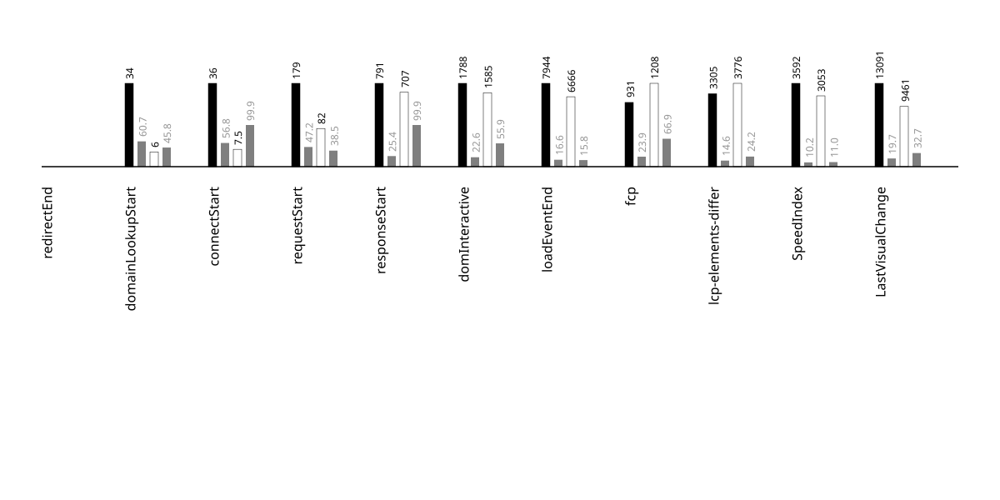

# metadata
{::nomarkdown}
<?xml version="1.0" encoding="utf-8"?>
<!DOCTYPE svg PUBLIC "-//W3C//DTD SVG 1.1//EN" "http://www.w3.org/Graphics/SVG/1.1/DTD/svg11.dtd">
<svg version="1.1"
     id="svg2" xml:space="preserve"
     xmlns="http://www.w3.org/2000/svg"
     xmlns:xlink="http://www.w3.org/1999/xlink"
     xmlns:html="http://www.w3.org/1999/xhtml"
x="0px" y="0px"
width="540.000000px" height="150.000000px"
viewBox="0 0 540.000000 150.000000" enable-background="new 0 0 540.000000 150.000000">

<title>
2025-07-03-android-15-ptablet-talkback-panske_tricka_heureka_sk_x_metadata
</title>
<desc>
test and device metadata
</desc>
<g id="metadata">
<rect x="0.000000" y="0.000000" width="540.000000" height="150.000000"
 style="fill:rgb(200,200,200); fill-opacity:1; stroke:rgb(200,200,200); stroke-opacity:0; stroke-width:0.5" />
 <a href="https://panske-tricka.heureka.sk/">
<text x="270.000000" y="50.000000" font-family="Atkinson Hyperlegible" font-size="24.000000pt" text-anchor="middle" text-align="center" font-weight="600" font-style="normal"  style="fill:rgb(0,0,255); fill-opacity:1; stroke:rgb(255,255,255); stroke-opacity:0; stroke-width:0.5">panske_tricka_heureka_sk</text>
 </a>
<text x="270.000000" y="86.000000" font-family="Atkinson Hyperlegible" font-size="12.000000pt" text-anchor="middle" text-align="center" font-weight="500" font-style="normal"  style="fill:rgb(148,148,148); fill-opacity:1; stroke:rgb(255,255,255); stroke-opacity:0; stroke-width:0.5">2025-07-03</text>
<text x="275.000000" y="98.000000" font-family="Atkinson Hyperlegible" font-size="12.000000pt" text-anchor="middle" text-align="center" font-weight="500" font-style="normal"  style="fill:rgb(148,148,148); fill-opacity:1; stroke:rgb(255,255,255); stroke-opacity:0; stroke-width:0.5">android-15-ptablet-talkback</text>
<text x="337.500000" y="122.000000" font-family="Atkinson Hyperlegible" font-size="14.000000pt" text-anchor="start" text-align="left" font-weight="600" font-style="normal"  style="fill:rgb(255,255,255); fill-opacity:1; stroke:rgb(0,0,0); stroke-opacity:0; stroke-width:0.5">chrome</text>
<text x="202.500000" y="122.000000" font-family="Atkinson Hyperlegible" font-size="14.000000pt" text-anchor="end" text-align="right" font-weight="600" font-style="normal"  style="fill:rgb(0,0,0); fill-opacity:1; stroke:rgb(0,0,0); stroke-opacity:0; stroke-width:0.5">firefox</text>
</g>

{:/}

---

## side by side video
{::nomarkdown}
<?xml version="1.0" encoding="utf-8"?>
<!DOCTYPE svg PUBLIC "-//W3C//DTD SVG 1.1//EN" "http://www.w3.org/Graphics/SVG/1.1/DTD/svg11.dtd">
<svg version="1.1"
     id="svg2" xml:space="preserve"
     xmlns="http://www.w3.org/2000/svg"
     xmlns:xlink="http://www.w3.org/1999/xlink"
     xmlns:html="http://www.w3.org/1999/xhtml"
x="0px" y="0px"
width="540.000000px" height="585.000000px"
viewBox="0 0 540.000000 585.000000" enable-background="new 0 0 540.000000 585.000000">

<title>
2025-07-03-android-15-ptablet-talkback-panske_tricka_heureka_sk_x_video
</title>
<desc>
side by side video of firefox by chrome
</desc>
<g id="video_side_x_side">
<g>

<g id="video-wrapper" transform="scale(1,1)">

<foreignObject x="0.000000" y="0.000000" width="2160.000000" height="2340.000000">
 <video xmlns="http://www.w3.org/1999/xhtml"   width="540.000000" height="585.000000"  controls="" loop="false" muted="true"  >
<source src="../videos/2025-07-03-android-15-ptablet-talkback-panske_tricka_heureka_sk-side-by-side.mp4" type="video/mp4" />
</video>
 </foreignObject></g></g>
</g>

{:/}

---

## % visually complete by millisecond (SpeedIndex)
{::nomarkdown}
<?xml version="1.0" encoding="utf-8"?>
<!DOCTYPE svg PUBLIC "-//W3C//DTD SVG 1.1//EN" "http://www.w3.org/Graphics/SVG/1.1/DTD/svg11.dtd">
<svg version="1.1"
     id="svg2" xml:space="preserve"
     xmlns="http://www.w3.org/2000/svg"
     xmlns:xlink="http://www.w3.org/1999/xlink"
     xmlns:html="http://www.w3.org/1999/xhtml"
x="0px" y="0px"
width="900.000000px" height="600.000000px"
viewBox="0 0 900.000000 600.000000" enable-background="new 0 0 900.000000 600.000000">

<title>
2025-07-03-android-15-ptablet-talkback-panske_tricka_heureka_sk_x_line_graph
</title>
 <g id="tic-x-annotation">
<text x="100.000000" y="512.000000" font-family="Apercu" font-size="7.000000pt" text-anchor="middle" text-align="center" dominant-baseline="central" font-weight="400" font-style="normal"  style="fill:rgb(118,118,118); fill-opacity:1; stroke:rgb(118,118,118); stroke-opacity:0; stroke-width:0.5">0.0s</text>
<text x="141.079812" y="512.000000" font-family="Apercu" font-size="7.000000pt" text-anchor="middle" text-align="center" dominant-baseline="central" font-weight="400" font-style="normal"  style="fill:rgb(118,118,118); fill-opacity:1; stroke:rgb(118,118,118); stroke-opacity:0; stroke-width:0.5">0.5s</text>
<text x="182.159624" y="512.000000" font-family="Apercu" font-size="7.000000pt" text-anchor="middle" text-align="center" dominant-baseline="central" font-weight="400" font-style="normal"  style="fill:rgb(118,118,118); fill-opacity:1; stroke:rgb(118,118,118); stroke-opacity:0; stroke-width:0.5">1.0s</text>
<text x="223.239437" y="512.000000" font-family="Apercu" font-size="7.000000pt" text-anchor="middle" text-align="center" dominant-baseline="central" font-weight="400" font-style="normal"  style="fill:rgb(118,118,118); fill-opacity:1; stroke:rgb(118,118,118); stroke-opacity:0; stroke-width:0.5">1.5s</text>
<text x="264.319249" y="512.000000" font-family="Apercu" font-size="7.000000pt" text-anchor="middle" text-align="center" dominant-baseline="central" font-weight="400" font-style="normal"  style="fill:rgb(118,118,118); fill-opacity:1; stroke:rgb(118,118,118); stroke-opacity:0; stroke-width:0.5">2.0s</text>
<text x="305.399061" y="512.000000" font-family="Apercu" font-size="7.000000pt" text-anchor="middle" text-align="center" dominant-baseline="central" font-weight="400" font-style="normal"  style="fill:rgb(118,118,118); fill-opacity:1; stroke:rgb(118,118,118); stroke-opacity:0; stroke-width:0.5">2.5s</text>
<text x="346.478873" y="512.000000" font-family="Apercu" font-size="7.000000pt" text-anchor="middle" text-align="center" dominant-baseline="central" font-weight="400" font-style="normal"  style="fill:rgb(118,118,118); fill-opacity:1; stroke:rgb(118,118,118); stroke-opacity:0; stroke-width:0.5">3.0s</text>
<text x="387.558685" y="512.000000" font-family="Apercu" font-size="7.000000pt" text-anchor="middle" text-align="center" dominant-baseline="central" font-weight="400" font-style="normal"  style="fill:rgb(118,118,118); fill-opacity:1; stroke:rgb(118,118,118); stroke-opacity:0; stroke-width:0.5">3.5s</text>
<text x="428.638498" y="512.000000" font-family="Apercu" font-size="7.000000pt" text-anchor="middle" text-align="center" dominant-baseline="central" font-weight="400" font-style="normal"  style="fill:rgb(118,118,118); fill-opacity:1; stroke:rgb(118,118,118); stroke-opacity:0; stroke-width:0.5">4.0s</text>
<text x="469.718310" y="512.000000" font-family="Apercu" font-size="7.000000pt" text-anchor="middle" text-align="center" dominant-baseline="central" font-weight="400" font-style="normal"  style="fill:rgb(118,118,118); fill-opacity:1; stroke:rgb(118,118,118); stroke-opacity:0; stroke-width:0.5">4.5s</text>
<text x="510.798122" y="512.000000" font-family="Apercu" font-size="7.000000pt" text-anchor="middle" text-align="center" dominant-baseline="central" font-weight="400" font-style="normal"  style="fill:rgb(118,118,118); fill-opacity:1; stroke:rgb(118,118,118); stroke-opacity:0; stroke-width:0.5">5.0s</text>
<text x="551.877934" y="512.000000" font-family="Apercu" font-size="7.000000pt" text-anchor="middle" text-align="center" dominant-baseline="central" font-weight="400" font-style="normal"  style="fill:rgb(118,118,118); fill-opacity:1; stroke:rgb(118,118,118); stroke-opacity:0; stroke-width:0.5">5.5s</text>
<text x="592.957746" y="512.000000" font-family="Apercu" font-size="7.000000pt" text-anchor="middle" text-align="center" dominant-baseline="central" font-weight="400" font-style="normal"  style="fill:rgb(118,118,118); fill-opacity:1; stroke:rgb(118,118,118); stroke-opacity:0; stroke-width:0.5">6.0s</text>
<text x="634.037559" y="512.000000" font-family="Apercu" font-size="7.000000pt" text-anchor="middle" text-align="center" dominant-baseline="central" font-weight="400" font-style="normal"  style="fill:rgb(118,118,118); fill-opacity:1; stroke:rgb(118,118,118); stroke-opacity:0; stroke-width:0.5">6.5s</text>
<text x="675.117371" y="512.000000" font-family="Apercu" font-size="7.000000pt" text-anchor="middle" text-align="center" dominant-baseline="central" font-weight="400" font-style="normal"  style="fill:rgb(118,118,118); fill-opacity:1; stroke:rgb(118,118,118); stroke-opacity:0; stroke-width:0.5">7.0s</text>
<text x="716.197183" y="512.000000" font-family="Apercu" font-size="7.000000pt" text-anchor="middle" text-align="center" dominant-baseline="central" font-weight="400" font-style="normal"  style="fill:rgb(118,118,118); fill-opacity:1; stroke:rgb(118,118,118); stroke-opacity:0; stroke-width:0.5">7.5s</text>
<text x="757.276995" y="512.000000" font-family="Apercu" font-size="7.000000pt" text-anchor="middle" text-align="center" dominant-baseline="central" font-weight="400" font-style="normal"  style="fill:rgb(118,118,118); fill-opacity:1; stroke:rgb(118,118,118); stroke-opacity:0; stroke-width:0.5">8.0s</text>
<text x="798.356808" y="512.000000" font-family="Apercu" font-size="7.000000pt" text-anchor="middle" text-align="center" dominant-baseline="central" font-weight="400" font-style="normal"  style="fill:rgb(118,118,118); fill-opacity:1; stroke:rgb(118,118,118); stroke-opacity:0; stroke-width:0.5">8.5s</text>
 </g> <g id="tic-y-annotation">
<text x="76.000000" y="460.000000" font-family="Apercu" font-size="7.000000pt" text-anchor="middle" text-align="center" dominant-baseline="central" font-weight="400" font-style="normal"  style="fill:rgb(118,118,118); fill-opacity:1; stroke:rgb(118,118,118); stroke-opacity:0; stroke-width:0.5">10%</text>
<text x="824.000000" y="460.000000" font-family="Apercu" font-size="7.000000pt" text-anchor="middle" text-align="center" dominant-baseline="central" font-weight="400" font-style="normal"  style="fill:rgb(118,118,118); fill-opacity:1; stroke:rgb(118,118,118); stroke-opacity:0; stroke-width:0.5">10%</text>
<text x="76.000000" y="420.000000" font-family="Apercu" font-size="7.000000pt" text-anchor="middle" text-align="center" dominant-baseline="central" font-weight="400" font-style="normal"  style="fill:rgb(118,118,118); fill-opacity:1; stroke:rgb(118,118,118); stroke-opacity:0; stroke-width:0.5">20%</text>
<text x="824.000000" y="420.000000" font-family="Apercu" font-size="7.000000pt" text-anchor="middle" text-align="center" dominant-baseline="central" font-weight="400" font-style="normal"  style="fill:rgb(118,118,118); fill-opacity:1; stroke:rgb(118,118,118); stroke-opacity:0; stroke-width:0.5">20%</text>
<text x="76.000000" y="380.000000" font-family="Apercu" font-size="7.000000pt" text-anchor="middle" text-align="center" dominant-baseline="central" font-weight="400" font-style="normal"  style="fill:rgb(118,118,118); fill-opacity:1; stroke:rgb(118,118,118); stroke-opacity:0; stroke-width:0.5">30%</text>
<text x="824.000000" y="380.000000" font-family="Apercu" font-size="7.000000pt" text-anchor="middle" text-align="center" dominant-baseline="central" font-weight="400" font-style="normal"  style="fill:rgb(118,118,118); fill-opacity:1; stroke:rgb(118,118,118); stroke-opacity:0; stroke-width:0.5">30%</text>
<text x="76.000000" y="340.000000" font-family="Apercu" font-size="7.000000pt" text-anchor="middle" text-align="center" dominant-baseline="central" font-weight="400" font-style="normal"  style="fill:rgb(118,118,118); fill-opacity:1; stroke:rgb(118,118,118); stroke-opacity:0; stroke-width:0.5">40%</text>
<text x="824.000000" y="340.000000" font-family="Apercu" font-size="7.000000pt" text-anchor="middle" text-align="center" dominant-baseline="central" font-weight="400" font-style="normal"  style="fill:rgb(118,118,118); fill-opacity:1; stroke:rgb(118,118,118); stroke-opacity:0; stroke-width:0.5">40%</text>
<text x="76.000000" y="300.000000" font-family="Apercu" font-size="7.000000pt" text-anchor="middle" text-align="center" dominant-baseline="central" font-weight="400" font-style="normal"  style="fill:rgb(118,118,118); fill-opacity:1; stroke:rgb(118,118,118); stroke-opacity:0; stroke-width:0.5">50%</text>
<text x="824.000000" y="300.000000" font-family="Apercu" font-size="7.000000pt" text-anchor="middle" text-align="center" dominant-baseline="central" font-weight="400" font-style="normal"  style="fill:rgb(118,118,118); fill-opacity:1; stroke:rgb(118,118,118); stroke-opacity:0; stroke-width:0.5">50%</text>
<text x="76.000000" y="260.000000" font-family="Apercu" font-size="7.000000pt" text-anchor="middle" text-align="center" dominant-baseline="central" font-weight="400" font-style="normal"  style="fill:rgb(118,118,118); fill-opacity:1; stroke:rgb(118,118,118); stroke-opacity:0; stroke-width:0.5">60%</text>
<text x="824.000000" y="260.000000" font-family="Apercu" font-size="7.000000pt" text-anchor="middle" text-align="center" dominant-baseline="central" font-weight="400" font-style="normal"  style="fill:rgb(118,118,118); fill-opacity:1; stroke:rgb(118,118,118); stroke-opacity:0; stroke-width:0.5">60%</text>
<text x="76.000000" y="220.000000" font-family="Apercu" font-size="7.000000pt" text-anchor="middle" text-align="center" dominant-baseline="central" font-weight="400" font-style="normal"  style="fill:rgb(118,118,118); fill-opacity:1; stroke:rgb(118,118,118); stroke-opacity:0; stroke-width:0.5">70%</text>
<text x="824.000000" y="220.000000" font-family="Apercu" font-size="7.000000pt" text-anchor="middle" text-align="center" dominant-baseline="central" font-weight="400" font-style="normal"  style="fill:rgb(118,118,118); fill-opacity:1; stroke:rgb(118,118,118); stroke-opacity:0; stroke-width:0.5">70%</text>
<text x="76.000000" y="180.000000" font-family="Apercu" font-size="7.000000pt" text-anchor="middle" text-align="center" dominant-baseline="central" font-weight="400" font-style="normal"  style="fill:rgb(118,118,118); fill-opacity:1; stroke:rgb(118,118,118); stroke-opacity:0; stroke-width:0.5">80%</text>
<text x="824.000000" y="180.000000" font-family="Apercu" font-size="7.000000pt" text-anchor="middle" text-align="center" dominant-baseline="central" font-weight="400" font-style="normal"  style="fill:rgb(118,118,118); fill-opacity:1; stroke:rgb(118,118,118); stroke-opacity:0; stroke-width:0.5">80%</text>
<text x="76.000000" y="140.000000" font-family="Apercu" font-size="7.000000pt" text-anchor="middle" text-align="center" dominant-baseline="central" font-weight="400" font-style="normal"  style="fill:rgb(118,118,118); fill-opacity:1; stroke:rgb(118,118,118); stroke-opacity:0; stroke-width:0.5">90%</text>
<text x="824.000000" y="140.000000" font-family="Apercu" font-size="7.000000pt" text-anchor="middle" text-align="center" dominant-baseline="central" font-weight="400" font-style="normal"  style="fill:rgb(118,118,118); fill-opacity:1; stroke:rgb(118,118,118); stroke-opacity:0; stroke-width:0.5">90%</text>
<text x="76.000000" y="100.000000" font-family="Apercu" font-size="7.000000pt" text-anchor="middle" text-align="center" dominant-baseline="central" font-weight="400" font-style="normal"  style="fill:rgb(118,118,118); fill-opacity:1; stroke:rgb(118,118,118); stroke-opacity:0; stroke-width:0.5">100%</text>
<text x="824.000000" y="100.000000" font-family="Apercu" font-size="7.000000pt" text-anchor="middle" text-align="center" dominant-baseline="central" font-weight="400" font-style="normal"  style="fill:rgb(118,118,118); fill-opacity:1; stroke:rgb(118,118,118); stroke-opacity:0; stroke-width:0.5">100%</text>
 </g> <g id="tic-y-lines-annotation">
<line x1="112.000000" y1="460.000000" x2="788.000000" y2="460.000000" style="fill:rgb(118,118,118); fill-opacity:0; stroke:rgb(230,230,230); stroke-opacity:1; stroke-width:1" />
<text x="141.079812" y="460.000000" font-family="Apercu" font-size="3.000000pt" text-anchor="middle" text-align="center" dominant-baseline="central" font-weight="400" font-style="normal"  style="fill:rgb(118,118,118); fill-opacity:1; stroke:rgb(118,118,118); stroke-opacity:0; stroke-width:0.5">10%</text>
<text x="182.159624" y="460.000000" font-family="Apercu" font-size="3.000000pt" text-anchor="middle" text-align="center" dominant-baseline="central" font-weight="400" font-style="normal"  style="fill:rgb(118,118,118); fill-opacity:1; stroke:rgb(118,118,118); stroke-opacity:0; stroke-width:0.5">10%</text>
<text x="223.239437" y="460.000000" font-family="Apercu" font-size="3.000000pt" text-anchor="middle" text-align="center" dominant-baseline="central" font-weight="400" font-style="normal"  style="fill:rgb(118,118,118); fill-opacity:1; stroke:rgb(118,118,118); stroke-opacity:0; stroke-width:0.5">10%</text>
<text x="264.319249" y="460.000000" font-family="Apercu" font-size="3.000000pt" text-anchor="middle" text-align="center" dominant-baseline="central" font-weight="400" font-style="normal"  style="fill:rgb(118,118,118); fill-opacity:1; stroke:rgb(118,118,118); stroke-opacity:0; stroke-width:0.5">10%</text>
<text x="305.399061" y="460.000000" font-family="Apercu" font-size="3.000000pt" text-anchor="middle" text-align="center" dominant-baseline="central" font-weight="400" font-style="normal"  style="fill:rgb(118,118,118); fill-opacity:1; stroke:rgb(118,118,118); stroke-opacity:0; stroke-width:0.5">10%</text>
<text x="346.478873" y="460.000000" font-family="Apercu" font-size="3.000000pt" text-anchor="middle" text-align="center" dominant-baseline="central" font-weight="400" font-style="normal"  style="fill:rgb(118,118,118); fill-opacity:1; stroke:rgb(118,118,118); stroke-opacity:0; stroke-width:0.5">10%</text>
<text x="387.558685" y="460.000000" font-family="Apercu" font-size="3.000000pt" text-anchor="middle" text-align="center" dominant-baseline="central" font-weight="400" font-style="normal"  style="fill:rgb(118,118,118); fill-opacity:1; stroke:rgb(118,118,118); stroke-opacity:0; stroke-width:0.5">10%</text>
<text x="428.638498" y="460.000000" font-family="Apercu" font-size="3.000000pt" text-anchor="middle" text-align="center" dominant-baseline="central" font-weight="400" font-style="normal"  style="fill:rgb(118,118,118); fill-opacity:1; stroke:rgb(118,118,118); stroke-opacity:0; stroke-width:0.5">10%</text>
<text x="469.718310" y="460.000000" font-family="Apercu" font-size="3.000000pt" text-anchor="middle" text-align="center" dominant-baseline="central" font-weight="400" font-style="normal"  style="fill:rgb(118,118,118); fill-opacity:1; stroke:rgb(118,118,118); stroke-opacity:0; stroke-width:0.5">10%</text>
<text x="510.798122" y="460.000000" font-family="Apercu" font-size="3.000000pt" text-anchor="middle" text-align="center" dominant-baseline="central" font-weight="400" font-style="normal"  style="fill:rgb(118,118,118); fill-opacity:1; stroke:rgb(118,118,118); stroke-opacity:0; stroke-width:0.5">10%</text>
<text x="551.877934" y="460.000000" font-family="Apercu" font-size="3.000000pt" text-anchor="middle" text-align="center" dominant-baseline="central" font-weight="400" font-style="normal"  style="fill:rgb(118,118,118); fill-opacity:1; stroke:rgb(118,118,118); stroke-opacity:0; stroke-width:0.5">10%</text>
<text x="592.957746" y="460.000000" font-family="Apercu" font-size="3.000000pt" text-anchor="middle" text-align="center" dominant-baseline="central" font-weight="400" font-style="normal"  style="fill:rgb(118,118,118); fill-opacity:1; stroke:rgb(118,118,118); stroke-opacity:0; stroke-width:0.5">10%</text>
<text x="634.037559" y="460.000000" font-family="Apercu" font-size="3.000000pt" text-anchor="middle" text-align="center" dominant-baseline="central" font-weight="400" font-style="normal"  style="fill:rgb(118,118,118); fill-opacity:1; stroke:rgb(118,118,118); stroke-opacity:0; stroke-width:0.5">10%</text>
<text x="675.117371" y="460.000000" font-family="Apercu" font-size="3.000000pt" text-anchor="middle" text-align="center" dominant-baseline="central" font-weight="400" font-style="normal"  style="fill:rgb(118,118,118); fill-opacity:1; stroke:rgb(118,118,118); stroke-opacity:0; stroke-width:0.5">10%</text>
<text x="716.197183" y="460.000000" font-family="Apercu" font-size="3.000000pt" text-anchor="middle" text-align="center" dominant-baseline="central" font-weight="400" font-style="normal"  style="fill:rgb(118,118,118); fill-opacity:1; stroke:rgb(118,118,118); stroke-opacity:0; stroke-width:0.5">10%</text>
<text x="757.276995" y="460.000000" font-family="Apercu" font-size="3.000000pt" text-anchor="middle" text-align="center" dominant-baseline="central" font-weight="400" font-style="normal"  style="fill:rgb(118,118,118); fill-opacity:1; stroke:rgb(118,118,118); stroke-opacity:0; stroke-width:0.5">10%</text>
<line x1="112.000000" y1="420.000000" x2="788.000000" y2="420.000000" style="fill:rgb(118,118,118); fill-opacity:0; stroke:rgb(230,230,230); stroke-opacity:1; stroke-width:1" />
<text x="141.079812" y="420.000000" font-family="Apercu" font-size="3.000000pt" text-anchor="middle" text-align="center" dominant-baseline="central" font-weight="400" font-style="normal"  style="fill:rgb(118,118,118); fill-opacity:1; stroke:rgb(118,118,118); stroke-opacity:0; stroke-width:0.5">20%</text>
<text x="182.159624" y="420.000000" font-family="Apercu" font-size="3.000000pt" text-anchor="middle" text-align="center" dominant-baseline="central" font-weight="400" font-style="normal"  style="fill:rgb(118,118,118); fill-opacity:1; stroke:rgb(118,118,118); stroke-opacity:0; stroke-width:0.5">20%</text>
<text x="223.239437" y="420.000000" font-family="Apercu" font-size="3.000000pt" text-anchor="middle" text-align="center" dominant-baseline="central" font-weight="400" font-style="normal"  style="fill:rgb(118,118,118); fill-opacity:1; stroke:rgb(118,118,118); stroke-opacity:0; stroke-width:0.5">20%</text>
<text x="264.319249" y="420.000000" font-family="Apercu" font-size="3.000000pt" text-anchor="middle" text-align="center" dominant-baseline="central" font-weight="400" font-style="normal"  style="fill:rgb(118,118,118); fill-opacity:1; stroke:rgb(118,118,118); stroke-opacity:0; stroke-width:0.5">20%</text>
<text x="305.399061" y="420.000000" font-family="Apercu" font-size="3.000000pt" text-anchor="middle" text-align="center" dominant-baseline="central" font-weight="400" font-style="normal"  style="fill:rgb(118,118,118); fill-opacity:1; stroke:rgb(118,118,118); stroke-opacity:0; stroke-width:0.5">20%</text>
<text x="346.478873" y="420.000000" font-family="Apercu" font-size="3.000000pt" text-anchor="middle" text-align="center" dominant-baseline="central" font-weight="400" font-style="normal"  style="fill:rgb(118,118,118); fill-opacity:1; stroke:rgb(118,118,118); stroke-opacity:0; stroke-width:0.5">20%</text>
<text x="387.558685" y="420.000000" font-family="Apercu" font-size="3.000000pt" text-anchor="middle" text-align="center" dominant-baseline="central" font-weight="400" font-style="normal"  style="fill:rgb(118,118,118); fill-opacity:1; stroke:rgb(118,118,118); stroke-opacity:0; stroke-width:0.5">20%</text>
<text x="428.638498" y="420.000000" font-family="Apercu" font-size="3.000000pt" text-anchor="middle" text-align="center" dominant-baseline="central" font-weight="400" font-style="normal"  style="fill:rgb(118,118,118); fill-opacity:1; stroke:rgb(118,118,118); stroke-opacity:0; stroke-width:0.5">20%</text>
<text x="469.718310" y="420.000000" font-family="Apercu" font-size="3.000000pt" text-anchor="middle" text-align="center" dominant-baseline="central" font-weight="400" font-style="normal"  style="fill:rgb(118,118,118); fill-opacity:1; stroke:rgb(118,118,118); stroke-opacity:0; stroke-width:0.5">20%</text>
<text x="510.798122" y="420.000000" font-family="Apercu" font-size="3.000000pt" text-anchor="middle" text-align="center" dominant-baseline="central" font-weight="400" font-style="normal"  style="fill:rgb(118,118,118); fill-opacity:1; stroke:rgb(118,118,118); stroke-opacity:0; stroke-width:0.5">20%</text>
<text x="551.877934" y="420.000000" font-family="Apercu" font-size="3.000000pt" text-anchor="middle" text-align="center" dominant-baseline="central" font-weight="400" font-style="normal"  style="fill:rgb(118,118,118); fill-opacity:1; stroke:rgb(118,118,118); stroke-opacity:0; stroke-width:0.5">20%</text>
<text x="592.957746" y="420.000000" font-family="Apercu" font-size="3.000000pt" text-anchor="middle" text-align="center" dominant-baseline="central" font-weight="400" font-style="normal"  style="fill:rgb(118,118,118); fill-opacity:1; stroke:rgb(118,118,118); stroke-opacity:0; stroke-width:0.5">20%</text>
<text x="634.037559" y="420.000000" font-family="Apercu" font-size="3.000000pt" text-anchor="middle" text-align="center" dominant-baseline="central" font-weight="400" font-style="normal"  style="fill:rgb(118,118,118); fill-opacity:1; stroke:rgb(118,118,118); stroke-opacity:0; stroke-width:0.5">20%</text>
<text x="675.117371" y="420.000000" font-family="Apercu" font-size="3.000000pt" text-anchor="middle" text-align="center" dominant-baseline="central" font-weight="400" font-style="normal"  style="fill:rgb(118,118,118); fill-opacity:1; stroke:rgb(118,118,118); stroke-opacity:0; stroke-width:0.5">20%</text>
<text x="716.197183" y="420.000000" font-family="Apercu" font-size="3.000000pt" text-anchor="middle" text-align="center" dominant-baseline="central" font-weight="400" font-style="normal"  style="fill:rgb(118,118,118); fill-opacity:1; stroke:rgb(118,118,118); stroke-opacity:0; stroke-width:0.5">20%</text>
<text x="757.276995" y="420.000000" font-family="Apercu" font-size="3.000000pt" text-anchor="middle" text-align="center" dominant-baseline="central" font-weight="400" font-style="normal"  style="fill:rgb(118,118,118); fill-opacity:1; stroke:rgb(118,118,118); stroke-opacity:0; stroke-width:0.5">20%</text>
<line x1="112.000000" y1="380.000000" x2="788.000000" y2="380.000000" style="fill:rgb(118,118,118); fill-opacity:0; stroke:rgb(230,230,230); stroke-opacity:1; stroke-width:1" />
<text x="141.079812" y="380.000000" font-family="Apercu" font-size="3.000000pt" text-anchor="middle" text-align="center" dominant-baseline="central" font-weight="400" font-style="normal"  style="fill:rgb(118,118,118); fill-opacity:1; stroke:rgb(118,118,118); stroke-opacity:0; stroke-width:0.5">30%</text>
<text x="182.159624" y="380.000000" font-family="Apercu" font-size="3.000000pt" text-anchor="middle" text-align="center" dominant-baseline="central" font-weight="400" font-style="normal"  style="fill:rgb(118,118,118); fill-opacity:1; stroke:rgb(118,118,118); stroke-opacity:0; stroke-width:0.5">30%</text>
<text x="223.239437" y="380.000000" font-family="Apercu" font-size="3.000000pt" text-anchor="middle" text-align="center" dominant-baseline="central" font-weight="400" font-style="normal"  style="fill:rgb(118,118,118); fill-opacity:1; stroke:rgb(118,118,118); stroke-opacity:0; stroke-width:0.5">30%</text>
<text x="264.319249" y="380.000000" font-family="Apercu" font-size="3.000000pt" text-anchor="middle" text-align="center" dominant-baseline="central" font-weight="400" font-style="normal"  style="fill:rgb(118,118,118); fill-opacity:1; stroke:rgb(118,118,118); stroke-opacity:0; stroke-width:0.5">30%</text>
<text x="305.399061" y="380.000000" font-family="Apercu" font-size="3.000000pt" text-anchor="middle" text-align="center" dominant-baseline="central" font-weight="400" font-style="normal"  style="fill:rgb(118,118,118); fill-opacity:1; stroke:rgb(118,118,118); stroke-opacity:0; stroke-width:0.5">30%</text>
<text x="346.478873" y="380.000000" font-family="Apercu" font-size="3.000000pt" text-anchor="middle" text-align="center" dominant-baseline="central" font-weight="400" font-style="normal"  style="fill:rgb(118,118,118); fill-opacity:1; stroke:rgb(118,118,118); stroke-opacity:0; stroke-width:0.5">30%</text>
<text x="387.558685" y="380.000000" font-family="Apercu" font-size="3.000000pt" text-anchor="middle" text-align="center" dominant-baseline="central" font-weight="400" font-style="normal"  style="fill:rgb(118,118,118); fill-opacity:1; stroke:rgb(118,118,118); stroke-opacity:0; stroke-width:0.5">30%</text>
<text x="428.638498" y="380.000000" font-family="Apercu" font-size="3.000000pt" text-anchor="middle" text-align="center" dominant-baseline="central" font-weight="400" font-style="normal"  style="fill:rgb(118,118,118); fill-opacity:1; stroke:rgb(118,118,118); stroke-opacity:0; stroke-width:0.5">30%</text>
<text x="469.718310" y="380.000000" font-family="Apercu" font-size="3.000000pt" text-anchor="middle" text-align="center" dominant-baseline="central" font-weight="400" font-style="normal"  style="fill:rgb(118,118,118); fill-opacity:1; stroke:rgb(118,118,118); stroke-opacity:0; stroke-width:0.5">30%</text>
<text x="510.798122" y="380.000000" font-family="Apercu" font-size="3.000000pt" text-anchor="middle" text-align="center" dominant-baseline="central" font-weight="400" font-style="normal"  style="fill:rgb(118,118,118); fill-opacity:1; stroke:rgb(118,118,118); stroke-opacity:0; stroke-width:0.5">30%</text>
<text x="551.877934" y="380.000000" font-family="Apercu" font-size="3.000000pt" text-anchor="middle" text-align="center" dominant-baseline="central" font-weight="400" font-style="normal"  style="fill:rgb(118,118,118); fill-opacity:1; stroke:rgb(118,118,118); stroke-opacity:0; stroke-width:0.5">30%</text>
<text x="592.957746" y="380.000000" font-family="Apercu" font-size="3.000000pt" text-anchor="middle" text-align="center" dominant-baseline="central" font-weight="400" font-style="normal"  style="fill:rgb(118,118,118); fill-opacity:1; stroke:rgb(118,118,118); stroke-opacity:0; stroke-width:0.5">30%</text>
<text x="634.037559" y="380.000000" font-family="Apercu" font-size="3.000000pt" text-anchor="middle" text-align="center" dominant-baseline="central" font-weight="400" font-style="normal"  style="fill:rgb(118,118,118); fill-opacity:1; stroke:rgb(118,118,118); stroke-opacity:0; stroke-width:0.5">30%</text>
<text x="675.117371" y="380.000000" font-family="Apercu" font-size="3.000000pt" text-anchor="middle" text-align="center" dominant-baseline="central" font-weight="400" font-style="normal"  style="fill:rgb(118,118,118); fill-opacity:1; stroke:rgb(118,118,118); stroke-opacity:0; stroke-width:0.5">30%</text>
<text x="716.197183" y="380.000000" font-family="Apercu" font-size="3.000000pt" text-anchor="middle" text-align="center" dominant-baseline="central" font-weight="400" font-style="normal"  style="fill:rgb(118,118,118); fill-opacity:1; stroke:rgb(118,118,118); stroke-opacity:0; stroke-width:0.5">30%</text>
<text x="757.276995" y="380.000000" font-family="Apercu" font-size="3.000000pt" text-anchor="middle" text-align="center" dominant-baseline="central" font-weight="400" font-style="normal"  style="fill:rgb(118,118,118); fill-opacity:1; stroke:rgb(118,118,118); stroke-opacity:0; stroke-width:0.5">30%</text>
<line x1="112.000000" y1="340.000000" x2="788.000000" y2="340.000000" style="fill:rgb(118,118,118); fill-opacity:0; stroke:rgb(230,230,230); stroke-opacity:1; stroke-width:1" />
<text x="141.079812" y="340.000000" font-family="Apercu" font-size="3.000000pt" text-anchor="middle" text-align="center" dominant-baseline="central" font-weight="400" font-style="normal"  style="fill:rgb(118,118,118); fill-opacity:1; stroke:rgb(118,118,118); stroke-opacity:0; stroke-width:0.5">40%</text>
<text x="182.159624" y="340.000000" font-family="Apercu" font-size="3.000000pt" text-anchor="middle" text-align="center" dominant-baseline="central" font-weight="400" font-style="normal"  style="fill:rgb(118,118,118); fill-opacity:1; stroke:rgb(118,118,118); stroke-opacity:0; stroke-width:0.5">40%</text>
<text x="223.239437" y="340.000000" font-family="Apercu" font-size="3.000000pt" text-anchor="middle" text-align="center" dominant-baseline="central" font-weight="400" font-style="normal"  style="fill:rgb(118,118,118); fill-opacity:1; stroke:rgb(118,118,118); stroke-opacity:0; stroke-width:0.5">40%</text>
<text x="264.319249" y="340.000000" font-family="Apercu" font-size="3.000000pt" text-anchor="middle" text-align="center" dominant-baseline="central" font-weight="400" font-style="normal"  style="fill:rgb(118,118,118); fill-opacity:1; stroke:rgb(118,118,118); stroke-opacity:0; stroke-width:0.5">40%</text>
<text x="305.399061" y="340.000000" font-family="Apercu" font-size="3.000000pt" text-anchor="middle" text-align="center" dominant-baseline="central" font-weight="400" font-style="normal"  style="fill:rgb(118,118,118); fill-opacity:1; stroke:rgb(118,118,118); stroke-opacity:0; stroke-width:0.5">40%</text>
<text x="346.478873" y="340.000000" font-family="Apercu" font-size="3.000000pt" text-anchor="middle" text-align="center" dominant-baseline="central" font-weight="400" font-style="normal"  style="fill:rgb(118,118,118); fill-opacity:1; stroke:rgb(118,118,118); stroke-opacity:0; stroke-width:0.5">40%</text>
<text x="387.558685" y="340.000000" font-family="Apercu" font-size="3.000000pt" text-anchor="middle" text-align="center" dominant-baseline="central" font-weight="400" font-style="normal"  style="fill:rgb(118,118,118); fill-opacity:1; stroke:rgb(118,118,118); stroke-opacity:0; stroke-width:0.5">40%</text>
<text x="428.638498" y="340.000000" font-family="Apercu" font-size="3.000000pt" text-anchor="middle" text-align="center" dominant-baseline="central" font-weight="400" font-style="normal"  style="fill:rgb(118,118,118); fill-opacity:1; stroke:rgb(118,118,118); stroke-opacity:0; stroke-width:0.5">40%</text>
<text x="469.718310" y="340.000000" font-family="Apercu" font-size="3.000000pt" text-anchor="middle" text-align="center" dominant-baseline="central" font-weight="400" font-style="normal"  style="fill:rgb(118,118,118); fill-opacity:1; stroke:rgb(118,118,118); stroke-opacity:0; stroke-width:0.5">40%</text>
<text x="510.798122" y="340.000000" font-family="Apercu" font-size="3.000000pt" text-anchor="middle" text-align="center" dominant-baseline="central" font-weight="400" font-style="normal"  style="fill:rgb(118,118,118); fill-opacity:1; stroke:rgb(118,118,118); stroke-opacity:0; stroke-width:0.5">40%</text>
<text x="551.877934" y="340.000000" font-family="Apercu" font-size="3.000000pt" text-anchor="middle" text-align="center" dominant-baseline="central" font-weight="400" font-style="normal"  style="fill:rgb(118,118,118); fill-opacity:1; stroke:rgb(118,118,118); stroke-opacity:0; stroke-width:0.5">40%</text>
<text x="592.957746" y="340.000000" font-family="Apercu" font-size="3.000000pt" text-anchor="middle" text-align="center" dominant-baseline="central" font-weight="400" font-style="normal"  style="fill:rgb(118,118,118); fill-opacity:1; stroke:rgb(118,118,118); stroke-opacity:0; stroke-width:0.5">40%</text>
<text x="634.037559" y="340.000000" font-family="Apercu" font-size="3.000000pt" text-anchor="middle" text-align="center" dominant-baseline="central" font-weight="400" font-style="normal"  style="fill:rgb(118,118,118); fill-opacity:1; stroke:rgb(118,118,118); stroke-opacity:0; stroke-width:0.5">40%</text>
<text x="675.117371" y="340.000000" font-family="Apercu" font-size="3.000000pt" text-anchor="middle" text-align="center" dominant-baseline="central" font-weight="400" font-style="normal"  style="fill:rgb(118,118,118); fill-opacity:1; stroke:rgb(118,118,118); stroke-opacity:0; stroke-width:0.5">40%</text>
<text x="716.197183" y="340.000000" font-family="Apercu" font-size="3.000000pt" text-anchor="middle" text-align="center" dominant-baseline="central" font-weight="400" font-style="normal"  style="fill:rgb(118,118,118); fill-opacity:1; stroke:rgb(118,118,118); stroke-opacity:0; stroke-width:0.5">40%</text>
<text x="757.276995" y="340.000000" font-family="Apercu" font-size="3.000000pt" text-anchor="middle" text-align="center" dominant-baseline="central" font-weight="400" font-style="normal"  style="fill:rgb(118,118,118); fill-opacity:1; stroke:rgb(118,118,118); stroke-opacity:0; stroke-width:0.5">40%</text>
<line x1="112.000000" y1="300.000000" x2="788.000000" y2="300.000000" style="fill:rgb(118,118,118); fill-opacity:0; stroke:rgb(230,230,230); stroke-opacity:1; stroke-width:1" />
<text x="141.079812" y="300.000000" font-family="Apercu" font-size="3.000000pt" text-anchor="middle" text-align="center" dominant-baseline="central" font-weight="400" font-style="normal"  style="fill:rgb(118,118,118); fill-opacity:1; stroke:rgb(118,118,118); stroke-opacity:0; stroke-width:0.5">50%</text>
<text x="182.159624" y="300.000000" font-family="Apercu" font-size="3.000000pt" text-anchor="middle" text-align="center" dominant-baseline="central" font-weight="400" font-style="normal"  style="fill:rgb(118,118,118); fill-opacity:1; stroke:rgb(118,118,118); stroke-opacity:0; stroke-width:0.5">50%</text>
<text x="223.239437" y="300.000000" font-family="Apercu" font-size="3.000000pt" text-anchor="middle" text-align="center" dominant-baseline="central" font-weight="400" font-style="normal"  style="fill:rgb(118,118,118); fill-opacity:1; stroke:rgb(118,118,118); stroke-opacity:0; stroke-width:0.5">50%</text>
<text x="264.319249" y="300.000000" font-family="Apercu" font-size="3.000000pt" text-anchor="middle" text-align="center" dominant-baseline="central" font-weight="400" font-style="normal"  style="fill:rgb(118,118,118); fill-opacity:1; stroke:rgb(118,118,118); stroke-opacity:0; stroke-width:0.5">50%</text>
<text x="305.399061" y="300.000000" font-family="Apercu" font-size="3.000000pt" text-anchor="middle" text-align="center" dominant-baseline="central" font-weight="400" font-style="normal"  style="fill:rgb(118,118,118); fill-opacity:1; stroke:rgb(118,118,118); stroke-opacity:0; stroke-width:0.5">50%</text>
<text x="346.478873" y="300.000000" font-family="Apercu" font-size="3.000000pt" text-anchor="middle" text-align="center" dominant-baseline="central" font-weight="400" font-style="normal"  style="fill:rgb(118,118,118); fill-opacity:1; stroke:rgb(118,118,118); stroke-opacity:0; stroke-width:0.5">50%</text>
<text x="387.558685" y="300.000000" font-family="Apercu" font-size="3.000000pt" text-anchor="middle" text-align="center" dominant-baseline="central" font-weight="400" font-style="normal"  style="fill:rgb(118,118,118); fill-opacity:1; stroke:rgb(118,118,118); stroke-opacity:0; stroke-width:0.5">50%</text>
<text x="428.638498" y="300.000000" font-family="Apercu" font-size="3.000000pt" text-anchor="middle" text-align="center" dominant-baseline="central" font-weight="400" font-style="normal"  style="fill:rgb(118,118,118); fill-opacity:1; stroke:rgb(118,118,118); stroke-opacity:0; stroke-width:0.5">50%</text>
<text x="469.718310" y="300.000000" font-family="Apercu" font-size="3.000000pt" text-anchor="middle" text-align="center" dominant-baseline="central" font-weight="400" font-style="normal"  style="fill:rgb(118,118,118); fill-opacity:1; stroke:rgb(118,118,118); stroke-opacity:0; stroke-width:0.5">50%</text>
<text x="510.798122" y="300.000000" font-family="Apercu" font-size="3.000000pt" text-anchor="middle" text-align="center" dominant-baseline="central" font-weight="400" font-style="normal"  style="fill:rgb(118,118,118); fill-opacity:1; stroke:rgb(118,118,118); stroke-opacity:0; stroke-width:0.5">50%</text>
<text x="551.877934" y="300.000000" font-family="Apercu" font-size="3.000000pt" text-anchor="middle" text-align="center" dominant-baseline="central" font-weight="400" font-style="normal"  style="fill:rgb(118,118,118); fill-opacity:1; stroke:rgb(118,118,118); stroke-opacity:0; stroke-width:0.5">50%</text>
<text x="592.957746" y="300.000000" font-family="Apercu" font-size="3.000000pt" text-anchor="middle" text-align="center" dominant-baseline="central" font-weight="400" font-style="normal"  style="fill:rgb(118,118,118); fill-opacity:1; stroke:rgb(118,118,118); stroke-opacity:0; stroke-width:0.5">50%</text>
<text x="634.037559" y="300.000000" font-family="Apercu" font-size="3.000000pt" text-anchor="middle" text-align="center" dominant-baseline="central" font-weight="400" font-style="normal"  style="fill:rgb(118,118,118); fill-opacity:1; stroke:rgb(118,118,118); stroke-opacity:0; stroke-width:0.5">50%</text>
<text x="675.117371" y="300.000000" font-family="Apercu" font-size="3.000000pt" text-anchor="middle" text-align="center" dominant-baseline="central" font-weight="400" font-style="normal"  style="fill:rgb(118,118,118); fill-opacity:1; stroke:rgb(118,118,118); stroke-opacity:0; stroke-width:0.5">50%</text>
<text x="716.197183" y="300.000000" font-family="Apercu" font-size="3.000000pt" text-anchor="middle" text-align="center" dominant-baseline="central" font-weight="400" font-style="normal"  style="fill:rgb(118,118,118); fill-opacity:1; stroke:rgb(118,118,118); stroke-opacity:0; stroke-width:0.5">50%</text>
<text x="757.276995" y="300.000000" font-family="Apercu" font-size="3.000000pt" text-anchor="middle" text-align="center" dominant-baseline="central" font-weight="400" font-style="normal"  style="fill:rgb(118,118,118); fill-opacity:1; stroke:rgb(118,118,118); stroke-opacity:0; stroke-width:0.5">50%</text>
<line x1="112.000000" y1="260.000000" x2="788.000000" y2="260.000000" style="fill:rgb(118,118,118); fill-opacity:0; stroke:rgb(230,230,230); stroke-opacity:1; stroke-width:1" />
<text x="141.079812" y="260.000000" font-family="Apercu" font-size="3.000000pt" text-anchor="middle" text-align="center" dominant-baseline="central" font-weight="400" font-style="normal"  style="fill:rgb(118,118,118); fill-opacity:1; stroke:rgb(118,118,118); stroke-opacity:0; stroke-width:0.5">60%</text>
<text x="182.159624" y="260.000000" font-family="Apercu" font-size="3.000000pt" text-anchor="middle" text-align="center" dominant-baseline="central" font-weight="400" font-style="normal"  style="fill:rgb(118,118,118); fill-opacity:1; stroke:rgb(118,118,118); stroke-opacity:0; stroke-width:0.5">60%</text>
<text x="223.239437" y="260.000000" font-family="Apercu" font-size="3.000000pt" text-anchor="middle" text-align="center" dominant-baseline="central" font-weight="400" font-style="normal"  style="fill:rgb(118,118,118); fill-opacity:1; stroke:rgb(118,118,118); stroke-opacity:0; stroke-width:0.5">60%</text>
<text x="264.319249" y="260.000000" font-family="Apercu" font-size="3.000000pt" text-anchor="middle" text-align="center" dominant-baseline="central" font-weight="400" font-style="normal"  style="fill:rgb(118,118,118); fill-opacity:1; stroke:rgb(118,118,118); stroke-opacity:0; stroke-width:0.5">60%</text>
<text x="305.399061" y="260.000000" font-family="Apercu" font-size="3.000000pt" text-anchor="middle" text-align="center" dominant-baseline="central" font-weight="400" font-style="normal"  style="fill:rgb(118,118,118); fill-opacity:1; stroke:rgb(118,118,118); stroke-opacity:0; stroke-width:0.5">60%</text>
<text x="346.478873" y="260.000000" font-family="Apercu" font-size="3.000000pt" text-anchor="middle" text-align="center" dominant-baseline="central" font-weight="400" font-style="normal"  style="fill:rgb(118,118,118); fill-opacity:1; stroke:rgb(118,118,118); stroke-opacity:0; stroke-width:0.5">60%</text>
<text x="387.558685" y="260.000000" font-family="Apercu" font-size="3.000000pt" text-anchor="middle" text-align="center" dominant-baseline="central" font-weight="400" font-style="normal"  style="fill:rgb(118,118,118); fill-opacity:1; stroke:rgb(118,118,118); stroke-opacity:0; stroke-width:0.5">60%</text>
<text x="428.638498" y="260.000000" font-family="Apercu" font-size="3.000000pt" text-anchor="middle" text-align="center" dominant-baseline="central" font-weight="400" font-style="normal"  style="fill:rgb(118,118,118); fill-opacity:1; stroke:rgb(118,118,118); stroke-opacity:0; stroke-width:0.5">60%</text>
<text x="469.718310" y="260.000000" font-family="Apercu" font-size="3.000000pt" text-anchor="middle" text-align="center" dominant-baseline="central" font-weight="400" font-style="normal"  style="fill:rgb(118,118,118); fill-opacity:1; stroke:rgb(118,118,118); stroke-opacity:0; stroke-width:0.5">60%</text>
<text x="510.798122" y="260.000000" font-family="Apercu" font-size="3.000000pt" text-anchor="middle" text-align="center" dominant-baseline="central" font-weight="400" font-style="normal"  style="fill:rgb(118,118,118); fill-opacity:1; stroke:rgb(118,118,118); stroke-opacity:0; stroke-width:0.5">60%</text>
<text x="551.877934" y="260.000000" font-family="Apercu" font-size="3.000000pt" text-anchor="middle" text-align="center" dominant-baseline="central" font-weight="400" font-style="normal"  style="fill:rgb(118,118,118); fill-opacity:1; stroke:rgb(118,118,118); stroke-opacity:0; stroke-width:0.5">60%</text>
<text x="592.957746" y="260.000000" font-family="Apercu" font-size="3.000000pt" text-anchor="middle" text-align="center" dominant-baseline="central" font-weight="400" font-style="normal"  style="fill:rgb(118,118,118); fill-opacity:1; stroke:rgb(118,118,118); stroke-opacity:0; stroke-width:0.5">60%</text>
<text x="634.037559" y="260.000000" font-family="Apercu" font-size="3.000000pt" text-anchor="middle" text-align="center" dominant-baseline="central" font-weight="400" font-style="normal"  style="fill:rgb(118,118,118); fill-opacity:1; stroke:rgb(118,118,118); stroke-opacity:0; stroke-width:0.5">60%</text>
<text x="675.117371" y="260.000000" font-family="Apercu" font-size="3.000000pt" text-anchor="middle" text-align="center" dominant-baseline="central" font-weight="400" font-style="normal"  style="fill:rgb(118,118,118); fill-opacity:1; stroke:rgb(118,118,118); stroke-opacity:0; stroke-width:0.5">60%</text>
<text x="716.197183" y="260.000000" font-family="Apercu" font-size="3.000000pt" text-anchor="middle" text-align="center" dominant-baseline="central" font-weight="400" font-style="normal"  style="fill:rgb(118,118,118); fill-opacity:1; stroke:rgb(118,118,118); stroke-opacity:0; stroke-width:0.5">60%</text>
<text x="757.276995" y="260.000000" font-family="Apercu" font-size="3.000000pt" text-anchor="middle" text-align="center" dominant-baseline="central" font-weight="400" font-style="normal"  style="fill:rgb(118,118,118); fill-opacity:1; stroke:rgb(118,118,118); stroke-opacity:0; stroke-width:0.5">60%</text>
<line x1="112.000000" y1="220.000000" x2="788.000000" y2="220.000000" style="fill:rgb(118,118,118); fill-opacity:0; stroke:rgb(230,230,230); stroke-opacity:1; stroke-width:1" />
<text x="141.079812" y="220.000000" font-family="Apercu" font-size="3.000000pt" text-anchor="middle" text-align="center" dominant-baseline="central" font-weight="400" font-style="normal"  style="fill:rgb(118,118,118); fill-opacity:1; stroke:rgb(118,118,118); stroke-opacity:0; stroke-width:0.5">70%</text>
<text x="182.159624" y="220.000000" font-family="Apercu" font-size="3.000000pt" text-anchor="middle" text-align="center" dominant-baseline="central" font-weight="400" font-style="normal"  style="fill:rgb(118,118,118); fill-opacity:1; stroke:rgb(118,118,118); stroke-opacity:0; stroke-width:0.5">70%</text>
<text x="223.239437" y="220.000000" font-family="Apercu" font-size="3.000000pt" text-anchor="middle" text-align="center" dominant-baseline="central" font-weight="400" font-style="normal"  style="fill:rgb(118,118,118); fill-opacity:1; stroke:rgb(118,118,118); stroke-opacity:0; stroke-width:0.5">70%</text>
<text x="264.319249" y="220.000000" font-family="Apercu" font-size="3.000000pt" text-anchor="middle" text-align="center" dominant-baseline="central" font-weight="400" font-style="normal"  style="fill:rgb(118,118,118); fill-opacity:1; stroke:rgb(118,118,118); stroke-opacity:0; stroke-width:0.5">70%</text>
<text x="305.399061" y="220.000000" font-family="Apercu" font-size="3.000000pt" text-anchor="middle" text-align="center" dominant-baseline="central" font-weight="400" font-style="normal"  style="fill:rgb(118,118,118); fill-opacity:1; stroke:rgb(118,118,118); stroke-opacity:0; stroke-width:0.5">70%</text>
<text x="346.478873" y="220.000000" font-family="Apercu" font-size="3.000000pt" text-anchor="middle" text-align="center" dominant-baseline="central" font-weight="400" font-style="normal"  style="fill:rgb(118,118,118); fill-opacity:1; stroke:rgb(118,118,118); stroke-opacity:0; stroke-width:0.5">70%</text>
<text x="387.558685" y="220.000000" font-family="Apercu" font-size="3.000000pt" text-anchor="middle" text-align="center" dominant-baseline="central" font-weight="400" font-style="normal"  style="fill:rgb(118,118,118); fill-opacity:1; stroke:rgb(118,118,118); stroke-opacity:0; stroke-width:0.5">70%</text>
<text x="428.638498" y="220.000000" font-family="Apercu" font-size="3.000000pt" text-anchor="middle" text-align="center" dominant-baseline="central" font-weight="400" font-style="normal"  style="fill:rgb(118,118,118); fill-opacity:1; stroke:rgb(118,118,118); stroke-opacity:0; stroke-width:0.5">70%</text>
<text x="469.718310" y="220.000000" font-family="Apercu" font-size="3.000000pt" text-anchor="middle" text-align="center" dominant-baseline="central" font-weight="400" font-style="normal"  style="fill:rgb(118,118,118); fill-opacity:1; stroke:rgb(118,118,118); stroke-opacity:0; stroke-width:0.5">70%</text>
<text x="510.798122" y="220.000000" font-family="Apercu" font-size="3.000000pt" text-anchor="middle" text-align="center" dominant-baseline="central" font-weight="400" font-style="normal"  style="fill:rgb(118,118,118); fill-opacity:1; stroke:rgb(118,118,118); stroke-opacity:0; stroke-width:0.5">70%</text>
<text x="551.877934" y="220.000000" font-family="Apercu" font-size="3.000000pt" text-anchor="middle" text-align="center" dominant-baseline="central" font-weight="400" font-style="normal"  style="fill:rgb(118,118,118); fill-opacity:1; stroke:rgb(118,118,118); stroke-opacity:0; stroke-width:0.5">70%</text>
<text x="592.957746" y="220.000000" font-family="Apercu" font-size="3.000000pt" text-anchor="middle" text-align="center" dominant-baseline="central" font-weight="400" font-style="normal"  style="fill:rgb(118,118,118); fill-opacity:1; stroke:rgb(118,118,118); stroke-opacity:0; stroke-width:0.5">70%</text>
<text x="634.037559" y="220.000000" font-family="Apercu" font-size="3.000000pt" text-anchor="middle" text-align="center" dominant-baseline="central" font-weight="400" font-style="normal"  style="fill:rgb(118,118,118); fill-opacity:1; stroke:rgb(118,118,118); stroke-opacity:0; stroke-width:0.5">70%</text>
<text x="675.117371" y="220.000000" font-family="Apercu" font-size="3.000000pt" text-anchor="middle" text-align="center" dominant-baseline="central" font-weight="400" font-style="normal"  style="fill:rgb(118,118,118); fill-opacity:1; stroke:rgb(118,118,118); stroke-opacity:0; stroke-width:0.5">70%</text>
<text x="716.197183" y="220.000000" font-family="Apercu" font-size="3.000000pt" text-anchor="middle" text-align="center" dominant-baseline="central" font-weight="400" font-style="normal"  style="fill:rgb(118,118,118); fill-opacity:1; stroke:rgb(118,118,118); stroke-opacity:0; stroke-width:0.5">70%</text>
<text x="757.276995" y="220.000000" font-family="Apercu" font-size="3.000000pt" text-anchor="middle" text-align="center" dominant-baseline="central" font-weight="400" font-style="normal"  style="fill:rgb(118,118,118); fill-opacity:1; stroke:rgb(118,118,118); stroke-opacity:0; stroke-width:0.5">70%</text>
<line x1="112.000000" y1="180.000000" x2="788.000000" y2="180.000000" style="fill:rgb(118,118,118); fill-opacity:0; stroke:rgb(230,230,230); stroke-opacity:1; stroke-width:1" />
<text x="141.079812" y="180.000000" font-family="Apercu" font-size="3.000000pt" text-anchor="middle" text-align="center" dominant-baseline="central" font-weight="400" font-style="normal"  style="fill:rgb(118,118,118); fill-opacity:1; stroke:rgb(118,118,118); stroke-opacity:0; stroke-width:0.5">80%</text>
<text x="182.159624" y="180.000000" font-family="Apercu" font-size="3.000000pt" text-anchor="middle" text-align="center" dominant-baseline="central" font-weight="400" font-style="normal"  style="fill:rgb(118,118,118); fill-opacity:1; stroke:rgb(118,118,118); stroke-opacity:0; stroke-width:0.5">80%</text>
<text x="223.239437" y="180.000000" font-family="Apercu" font-size="3.000000pt" text-anchor="middle" text-align="center" dominant-baseline="central" font-weight="400" font-style="normal"  style="fill:rgb(118,118,118); fill-opacity:1; stroke:rgb(118,118,118); stroke-opacity:0; stroke-width:0.5">80%</text>
<text x="264.319249" y="180.000000" font-family="Apercu" font-size="3.000000pt" text-anchor="middle" text-align="center" dominant-baseline="central" font-weight="400" font-style="normal"  style="fill:rgb(118,118,118); fill-opacity:1; stroke:rgb(118,118,118); stroke-opacity:0; stroke-width:0.5">80%</text>
<text x="305.399061" y="180.000000" font-family="Apercu" font-size="3.000000pt" text-anchor="middle" text-align="center" dominant-baseline="central" font-weight="400" font-style="normal"  style="fill:rgb(118,118,118); fill-opacity:1; stroke:rgb(118,118,118); stroke-opacity:0; stroke-width:0.5">80%</text>
<text x="346.478873" y="180.000000" font-family="Apercu" font-size="3.000000pt" text-anchor="middle" text-align="center" dominant-baseline="central" font-weight="400" font-style="normal"  style="fill:rgb(118,118,118); fill-opacity:1; stroke:rgb(118,118,118); stroke-opacity:0; stroke-width:0.5">80%</text>
<text x="387.558685" y="180.000000" font-family="Apercu" font-size="3.000000pt" text-anchor="middle" text-align="center" dominant-baseline="central" font-weight="400" font-style="normal"  style="fill:rgb(118,118,118); fill-opacity:1; stroke:rgb(118,118,118); stroke-opacity:0; stroke-width:0.5">80%</text>
<text x="428.638498" y="180.000000" font-family="Apercu" font-size="3.000000pt" text-anchor="middle" text-align="center" dominant-baseline="central" font-weight="400" font-style="normal"  style="fill:rgb(118,118,118); fill-opacity:1; stroke:rgb(118,118,118); stroke-opacity:0; stroke-width:0.5">80%</text>
<text x="469.718310" y="180.000000" font-family="Apercu" font-size="3.000000pt" text-anchor="middle" text-align="center" dominant-baseline="central" font-weight="400" font-style="normal"  style="fill:rgb(118,118,118); fill-opacity:1; stroke:rgb(118,118,118); stroke-opacity:0; stroke-width:0.5">80%</text>
<text x="510.798122" y="180.000000" font-family="Apercu" font-size="3.000000pt" text-anchor="middle" text-align="center" dominant-baseline="central" font-weight="400" font-style="normal"  style="fill:rgb(118,118,118); fill-opacity:1; stroke:rgb(118,118,118); stroke-opacity:0; stroke-width:0.5">80%</text>
<text x="551.877934" y="180.000000" font-family="Apercu" font-size="3.000000pt" text-anchor="middle" text-align="center" dominant-baseline="central" font-weight="400" font-style="normal"  style="fill:rgb(118,118,118); fill-opacity:1; stroke:rgb(118,118,118); stroke-opacity:0; stroke-width:0.5">80%</text>
<text x="592.957746" y="180.000000" font-family="Apercu" font-size="3.000000pt" text-anchor="middle" text-align="center" dominant-baseline="central" font-weight="400" font-style="normal"  style="fill:rgb(118,118,118); fill-opacity:1; stroke:rgb(118,118,118); stroke-opacity:0; stroke-width:0.5">80%</text>
<text x="634.037559" y="180.000000" font-family="Apercu" font-size="3.000000pt" text-anchor="middle" text-align="center" dominant-baseline="central" font-weight="400" font-style="normal"  style="fill:rgb(118,118,118); fill-opacity:1; stroke:rgb(118,118,118); stroke-opacity:0; stroke-width:0.5">80%</text>
<text x="675.117371" y="180.000000" font-family="Apercu" font-size="3.000000pt" text-anchor="middle" text-align="center" dominant-baseline="central" font-weight="400" font-style="normal"  style="fill:rgb(118,118,118); fill-opacity:1; stroke:rgb(118,118,118); stroke-opacity:0; stroke-width:0.5">80%</text>
<text x="716.197183" y="180.000000" font-family="Apercu" font-size="3.000000pt" text-anchor="middle" text-align="center" dominant-baseline="central" font-weight="400" font-style="normal"  style="fill:rgb(118,118,118); fill-opacity:1; stroke:rgb(118,118,118); stroke-opacity:0; stroke-width:0.5">80%</text>
<text x="757.276995" y="180.000000" font-family="Apercu" font-size="3.000000pt" text-anchor="middle" text-align="center" dominant-baseline="central" font-weight="400" font-style="normal"  style="fill:rgb(118,118,118); fill-opacity:1; stroke:rgb(118,118,118); stroke-opacity:0; stroke-width:0.5">80%</text>
<line x1="112.000000" y1="140.000000" x2="788.000000" y2="140.000000" style="fill:rgb(118,118,118); fill-opacity:0; stroke:rgb(230,230,230); stroke-opacity:1; stroke-width:1" />
<text x="141.079812" y="140.000000" font-family="Apercu" font-size="3.000000pt" text-anchor="middle" text-align="center" dominant-baseline="central" font-weight="400" font-style="normal"  style="fill:rgb(118,118,118); fill-opacity:1; stroke:rgb(118,118,118); stroke-opacity:0; stroke-width:0.5">90%</text>
<text x="182.159624" y="140.000000" font-family="Apercu" font-size="3.000000pt" text-anchor="middle" text-align="center" dominant-baseline="central" font-weight="400" font-style="normal"  style="fill:rgb(118,118,118); fill-opacity:1; stroke:rgb(118,118,118); stroke-opacity:0; stroke-width:0.5">90%</text>
<text x="223.239437" y="140.000000" font-family="Apercu" font-size="3.000000pt" text-anchor="middle" text-align="center" dominant-baseline="central" font-weight="400" font-style="normal"  style="fill:rgb(118,118,118); fill-opacity:1; stroke:rgb(118,118,118); stroke-opacity:0; stroke-width:0.5">90%</text>
<text x="264.319249" y="140.000000" font-family="Apercu" font-size="3.000000pt" text-anchor="middle" text-align="center" dominant-baseline="central" font-weight="400" font-style="normal"  style="fill:rgb(118,118,118); fill-opacity:1; stroke:rgb(118,118,118); stroke-opacity:0; stroke-width:0.5">90%</text>
<text x="305.399061" y="140.000000" font-family="Apercu" font-size="3.000000pt" text-anchor="middle" text-align="center" dominant-baseline="central" font-weight="400" font-style="normal"  style="fill:rgb(118,118,118); fill-opacity:1; stroke:rgb(118,118,118); stroke-opacity:0; stroke-width:0.5">90%</text>
<text x="346.478873" y="140.000000" font-family="Apercu" font-size="3.000000pt" text-anchor="middle" text-align="center" dominant-baseline="central" font-weight="400" font-style="normal"  style="fill:rgb(118,118,118); fill-opacity:1; stroke:rgb(118,118,118); stroke-opacity:0; stroke-width:0.5">90%</text>
<text x="387.558685" y="140.000000" font-family="Apercu" font-size="3.000000pt" text-anchor="middle" text-align="center" dominant-baseline="central" font-weight="400" font-style="normal"  style="fill:rgb(118,118,118); fill-opacity:1; stroke:rgb(118,118,118); stroke-opacity:0; stroke-width:0.5">90%</text>
<text x="428.638498" y="140.000000" font-family="Apercu" font-size="3.000000pt" text-anchor="middle" text-align="center" dominant-baseline="central" font-weight="400" font-style="normal"  style="fill:rgb(118,118,118); fill-opacity:1; stroke:rgb(118,118,118); stroke-opacity:0; stroke-width:0.5">90%</text>
<text x="469.718310" y="140.000000" font-family="Apercu" font-size="3.000000pt" text-anchor="middle" text-align="center" dominant-baseline="central" font-weight="400" font-style="normal"  style="fill:rgb(118,118,118); fill-opacity:1; stroke:rgb(118,118,118); stroke-opacity:0; stroke-width:0.5">90%</text>
<text x="510.798122" y="140.000000" font-family="Apercu" font-size="3.000000pt" text-anchor="middle" text-align="center" dominant-baseline="central" font-weight="400" font-style="normal"  style="fill:rgb(118,118,118); fill-opacity:1; stroke:rgb(118,118,118); stroke-opacity:0; stroke-width:0.5">90%</text>
<text x="551.877934" y="140.000000" font-family="Apercu" font-size="3.000000pt" text-anchor="middle" text-align="center" dominant-baseline="central" font-weight="400" font-style="normal"  style="fill:rgb(118,118,118); fill-opacity:1; stroke:rgb(118,118,118); stroke-opacity:0; stroke-width:0.5">90%</text>
<text x="592.957746" y="140.000000" font-family="Apercu" font-size="3.000000pt" text-anchor="middle" text-align="center" dominant-baseline="central" font-weight="400" font-style="normal"  style="fill:rgb(118,118,118); fill-opacity:1; stroke:rgb(118,118,118); stroke-opacity:0; stroke-width:0.5">90%</text>
<text x="634.037559" y="140.000000" font-family="Apercu" font-size="3.000000pt" text-anchor="middle" text-align="center" dominant-baseline="central" font-weight="400" font-style="normal"  style="fill:rgb(118,118,118); fill-opacity:1; stroke:rgb(118,118,118); stroke-opacity:0; stroke-width:0.5">90%</text>
<text x="675.117371" y="140.000000" font-family="Apercu" font-size="3.000000pt" text-anchor="middle" text-align="center" dominant-baseline="central" font-weight="400" font-style="normal"  style="fill:rgb(118,118,118); fill-opacity:1; stroke:rgb(118,118,118); stroke-opacity:0; stroke-width:0.5">90%</text>
<text x="716.197183" y="140.000000" font-family="Apercu" font-size="3.000000pt" text-anchor="middle" text-align="center" dominant-baseline="central" font-weight="400" font-style="normal"  style="fill:rgb(118,118,118); fill-opacity:1; stroke:rgb(118,118,118); stroke-opacity:0; stroke-width:0.5">90%</text>
<text x="757.276995" y="140.000000" font-family="Apercu" font-size="3.000000pt" text-anchor="middle" text-align="center" dominant-baseline="central" font-weight="400" font-style="normal"  style="fill:rgb(118,118,118); fill-opacity:1; stroke:rgb(118,118,118); stroke-opacity:0; stroke-width:0.5">90%</text>
<line x1="112.000000" y1="100.000000" x2="788.000000" y2="100.000000" style="fill:rgb(118,118,118); fill-opacity:0; stroke:rgb(230,230,230); stroke-opacity:1; stroke-width:1" />
<text x="141.079812" y="100.000000" font-family="Apercu" font-size="3.000000pt" text-anchor="middle" text-align="center" dominant-baseline="central" font-weight="400" font-style="normal"  style="fill:rgb(118,118,118); fill-opacity:1; stroke:rgb(118,118,118); stroke-opacity:0; stroke-width:0.5">100%</text>
<text x="182.159624" y="100.000000" font-family="Apercu" font-size="3.000000pt" text-anchor="middle" text-align="center" dominant-baseline="central" font-weight="400" font-style="normal"  style="fill:rgb(118,118,118); fill-opacity:1; stroke:rgb(118,118,118); stroke-opacity:0; stroke-width:0.5">100%</text>
<text x="223.239437" y="100.000000" font-family="Apercu" font-size="3.000000pt" text-anchor="middle" text-align="center" dominant-baseline="central" font-weight="400" font-style="normal"  style="fill:rgb(118,118,118); fill-opacity:1; stroke:rgb(118,118,118); stroke-opacity:0; stroke-width:0.5">100%</text>
<text x="264.319249" y="100.000000" font-family="Apercu" font-size="3.000000pt" text-anchor="middle" text-align="center" dominant-baseline="central" font-weight="400" font-style="normal"  style="fill:rgb(118,118,118); fill-opacity:1; stroke:rgb(118,118,118); stroke-opacity:0; stroke-width:0.5">100%</text>
<text x="305.399061" y="100.000000" font-family="Apercu" font-size="3.000000pt" text-anchor="middle" text-align="center" dominant-baseline="central" font-weight="400" font-style="normal"  style="fill:rgb(118,118,118); fill-opacity:1; stroke:rgb(118,118,118); stroke-opacity:0; stroke-width:0.5">100%</text>
<text x="346.478873" y="100.000000" font-family="Apercu" font-size="3.000000pt" text-anchor="middle" text-align="center" dominant-baseline="central" font-weight="400" font-style="normal"  style="fill:rgb(118,118,118); fill-opacity:1; stroke:rgb(118,118,118); stroke-opacity:0; stroke-width:0.5">100%</text>
<text x="387.558685" y="100.000000" font-family="Apercu" font-size="3.000000pt" text-anchor="middle" text-align="center" dominant-baseline="central" font-weight="400" font-style="normal"  style="fill:rgb(118,118,118); fill-opacity:1; stroke:rgb(118,118,118); stroke-opacity:0; stroke-width:0.5">100%</text>
<text x="428.638498" y="100.000000" font-family="Apercu" font-size="3.000000pt" text-anchor="middle" text-align="center" dominant-baseline="central" font-weight="400" font-style="normal"  style="fill:rgb(118,118,118); fill-opacity:1; stroke:rgb(118,118,118); stroke-opacity:0; stroke-width:0.5">100%</text>
<text x="469.718310" y="100.000000" font-family="Apercu" font-size="3.000000pt" text-anchor="middle" text-align="center" dominant-baseline="central" font-weight="400" font-style="normal"  style="fill:rgb(118,118,118); fill-opacity:1; stroke:rgb(118,118,118); stroke-opacity:0; stroke-width:0.5">100%</text>
<text x="510.798122" y="100.000000" font-family="Apercu" font-size="3.000000pt" text-anchor="middle" text-align="center" dominant-baseline="central" font-weight="400" font-style="normal"  style="fill:rgb(118,118,118); fill-opacity:1; stroke:rgb(118,118,118); stroke-opacity:0; stroke-width:0.5">100%</text>
<text x="551.877934" y="100.000000" font-family="Apercu" font-size="3.000000pt" text-anchor="middle" text-align="center" dominant-baseline="central" font-weight="400" font-style="normal"  style="fill:rgb(118,118,118); fill-opacity:1; stroke:rgb(118,118,118); stroke-opacity:0; stroke-width:0.5">100%</text>
<text x="592.957746" y="100.000000" font-family="Apercu" font-size="3.000000pt" text-anchor="middle" text-align="center" dominant-baseline="central" font-weight="400" font-style="normal"  style="fill:rgb(118,118,118); fill-opacity:1; stroke:rgb(118,118,118); stroke-opacity:0; stroke-width:0.5">100%</text>
<text x="634.037559" y="100.000000" font-family="Apercu" font-size="3.000000pt" text-anchor="middle" text-align="center" dominant-baseline="central" font-weight="400" font-style="normal"  style="fill:rgb(118,118,118); fill-opacity:1; stroke:rgb(118,118,118); stroke-opacity:0; stroke-width:0.5">100%</text>
<text x="675.117371" y="100.000000" font-family="Apercu" font-size="3.000000pt" text-anchor="middle" text-align="center" dominant-baseline="central" font-weight="400" font-style="normal"  style="fill:rgb(118,118,118); fill-opacity:1; stroke:rgb(118,118,118); stroke-opacity:0; stroke-width:0.5">100%</text>
<text x="716.197183" y="100.000000" font-family="Apercu" font-size="3.000000pt" text-anchor="middle" text-align="center" dominant-baseline="central" font-weight="400" font-style="normal"  style="fill:rgb(118,118,118); fill-opacity:1; stroke:rgb(118,118,118); stroke-opacity:0; stroke-width:0.5">100%</text>
<text x="757.276995" y="100.000000" font-family="Apercu" font-size="3.000000pt" text-anchor="middle" text-align="center" dominant-baseline="central" font-weight="400" font-style="normal"  style="fill:rgb(118,118,118); fill-opacity:1; stroke:rgb(118,118,118); stroke-opacity:0; stroke-width:0.5">100%</text>
 </g> <g id="polyline-firefox">
<polyline points="100,500 149.789,500 269.906,256 339.413,256 340.81,248 364.143,248 368.087,244 377.7,244 380.493,236 510.552,236 573.075,228 611.526,228 625.164,104 632.559,104 634.777,100 637.899,100 638.967,104 779.542,104 800,100 " stroke-dasharray="1 2" stroke-linecap="triangle"  style="fill:rgb(46,46,46); fill-opacity:0; stroke:rgb(46,46,46); stroke-opacity:1; stroke-width:1" />
 </g> <g id="markers-firefox">
 <path id="triangle-3.000000-120.000000" d="M 102.598 501.5 L 100 497 L 97.4019 501.5 L 102.598 501.5 " style="fill:rgb(46,46,46); fill-opacity:1; stroke:rgb(46,46,46); stroke-opacity:1; stroke-width:1"  onmouseover="showTooltip(event, 'firefox_scrn_00000')"  onmouseout="hideTooltip('firefox_scrn_00000')"   >
<title>
firefox
0%, 0ms
</title>
 </path>
<path id="triangle-3.000000-120.000000" d="M 152.387 501.5 L 149.789 497 L 147.191 501.5 L 152.387 501.5 " style="fill:rgb(46,46,46); fill-opacity:1; stroke:rgb(46,46,46); stroke-opacity:1; stroke-width:1"  onmouseover="showTooltip(event, 'firefox_scrn_00606')"  onmouseout="hideTooltip('firefox_scrn_00606')"   >
<title>
firefox
0%, 606ms
</title>
 </path>
<path id="triangle-3.000000-120.000000" d="M 272.504 257.5 L 269.906 253 L 267.308 257.5 L 272.504 257.5 " style="fill:rgb(46,46,46); fill-opacity:1; stroke:rgb(46,46,46); stroke-opacity:1; stroke-width:1"  onmouseover="showTooltip(event, 'firefox_scrn_02068')"  onmouseout="hideTooltip('firefox_scrn_02068')"   >
<title>
firefox
61%, 2068ms
</title>
 </path>
<path id="triangle-3.000000-120.000000" d="M 342.011 257.5 L 339.413 253 L 336.815 257.5 L 342.011 257.5 " style="fill:rgb(46,46,46); fill-opacity:1; stroke:rgb(46,46,46); stroke-opacity:1; stroke-width:1"  onmouseover="showTooltip(event, 'firefox_scrn_02914')"  onmouseout="hideTooltip('firefox_scrn_02914')"   >
<title>
firefox
61%, 2914ms
</title>
 </path>
<path id="triangle-3.000000-120.000000" d="M 343.408 249.5 L 340.81 245 L 338.212 249.5 L 343.408 249.5 " style="fill:rgb(46,46,46); fill-opacity:1; stroke:rgb(46,46,46); stroke-opacity:1; stroke-width:1"  onmouseover="showTooltip(event, 'firefox_scrn_02931')"  onmouseout="hideTooltip('firefox_scrn_02931')"   >
<title>
firefox
63%, 2931ms
</title>
 </path>
<path id="triangle-3.000000-120.000000" d="M 366.741 249.5 L 364.143 245 L 361.545 249.5 L 366.741 249.5 " style="fill:rgb(46,46,46); fill-opacity:1; stroke:rgb(46,46,46); stroke-opacity:1; stroke-width:1"  onmouseover="showTooltip(event, 'firefox_scrn_03215')"  onmouseout="hideTooltip('firefox_scrn_03215')"   >
<title>
firefox
63%, 3215ms
</title>
 </path>
<path id="triangle-3.000000-120.000000" d="M 370.685 245.5 L 368.087 241 L 365.489 245.5 L 370.685 245.5 " style="fill:rgb(46,46,46); fill-opacity:1; stroke:rgb(46,46,46); stroke-opacity:1; stroke-width:1"  onmouseover="showTooltip(event, 'firefox_scrn_03263')"  onmouseout="hideTooltip('firefox_scrn_03263')"   >
<title>
firefox
64%, 3263ms
</title>
 </path>
<path id="triangle-3.000000-120.000000" d="M 380.298 245.5 L 377.7 241 L 375.101 245.5 L 380.298 245.5 " style="fill:rgb(46,46,46); fill-opacity:1; stroke:rgb(46,46,46); stroke-opacity:1; stroke-width:1"  onmouseover="showTooltip(event, 'firefox_scrn_03380')"  onmouseout="hideTooltip('firefox_scrn_03380')"   >
<title>
firefox
64%, 3380ms
</title>
 </path>
<path id="triangle-3.000000-120.000000" d="M 383.091 237.5 L 380.493 233 L 377.895 237.5 L 383.091 237.5 " style="fill:rgb(46,46,46); fill-opacity:1; stroke:rgb(46,46,46); stroke-opacity:1; stroke-width:1"  onmouseover="showTooltip(event, 'firefox_scrn_03414')"  onmouseout="hideTooltip('firefox_scrn_03414')"   >
<title>
firefox
66%, 3414ms
</title>
 </path>
<path id="triangle-3.000000-120.000000" d="M 513.15 237.5 L 510.552 233 L 507.954 237.5 L 513.15 237.5 " style="fill:rgb(46,46,46); fill-opacity:1; stroke:rgb(46,46,46); stroke-opacity:1; stroke-width:1"  onmouseover="showTooltip(event, 'firefox_scrn_04997')"  onmouseout="hideTooltip('firefox_scrn_04997')"   >
<title>
firefox
66%, 4997ms
</title>
 </path>
<path id="triangle-3.000000-120.000000" d="M 575.673 229.5 L 573.075 225 L 570.477 229.5 L 575.673 229.5 " style="fill:rgb(46,46,46); fill-opacity:1; stroke:rgb(46,46,46); stroke-opacity:1; stroke-width:1"  onmouseover="showTooltip(event, 'firefox_scrn_05758')"  onmouseout="hideTooltip('firefox_scrn_05758')"   >
<title>
firefox
68%, 5758ms
</title>
 </path>
<path id="triangle-3.000000-120.000000" d="M 614.124 229.5 L 611.526 225 L 608.928 229.5 L 614.124 229.5 " style="fill:rgb(46,46,46); fill-opacity:1; stroke:rgb(46,46,46); stroke-opacity:1; stroke-width:1"  onmouseover="showTooltip(event, 'firefox_scrn_06226')"  onmouseout="hideTooltip('firefox_scrn_06226')"   >
<title>
firefox
68%, 6226ms
</title>
 </path>
<path id="triangle-3.000000-120.000000" d="M 627.762 105.5 L 625.164 101 L 622.566 105.5 L 627.762 105.5 " style="fill:rgb(46,46,46); fill-opacity:1; stroke:rgb(46,46,46); stroke-opacity:1; stroke-width:1"  onmouseover="showTooltip(event, 'firefox_scrn_06392')"  onmouseout="hideTooltip('firefox_scrn_06392')"   >
<title>
firefox
99%, 6392ms
</title>
 </path>
<path id="triangle-3.000000-120.000000" d="M 635.157 105.5 L 632.559 101 L 629.961 105.5 L 635.157 105.5 " style="fill:rgb(46,46,46); fill-opacity:1; stroke:rgb(46,46,46); stroke-opacity:1; stroke-width:1"  onmouseover="showTooltip(event, 'firefox_scrn_06482')"  onmouseout="hideTooltip('firefox_scrn_06482')"   >
<title>
firefox
99%, 6482ms
</title>
 </path>
<path id="triangle-3.000000-120.000000" d="M 637.375 101.5 L 634.777 97 L 632.179 101.5 L 637.375 101.5 " style="fill:rgb(46,46,46); fill-opacity:1; stroke:rgb(46,46,46); stroke-opacity:1; stroke-width:1"  onmouseover="showTooltip(event, 'firefox_scrn_06509')"  onmouseout="hideTooltip('firefox_scrn_06509')"   >
<title>
firefox
100%, 6509ms
</title>
 </path>
<path id="triangle-3.000000-120.000000" d="M 640.497 101.5 L 637.899 97 L 635.301 101.5 L 640.497 101.5 " style="fill:rgb(46,46,46); fill-opacity:1; stroke:rgb(46,46,46); stroke-opacity:1; stroke-width:1"  onmouseover="showTooltip(event, 'firefox_scrn_06547')"  onmouseout="hideTooltip('firefox_scrn_06547')"   >
<title>
firefox
100%, 6547ms
</title>
 </path>
<path id="triangle-3.000000-120.000000" d="M 641.565 105.5 L 638.967 101 L 636.369 105.5 L 641.565 105.5 " style="fill:rgb(46,46,46); fill-opacity:1; stroke:rgb(46,46,46); stroke-opacity:1; stroke-width:1"  onmouseover="showTooltip(event, 'firefox_scrn_06560')"  onmouseout="hideTooltip('firefox_scrn_06560')"   >
<title>
firefox
99%, 6560ms
</title>
 </path>
<path id="triangle-3.000000-120.000000" d="M 782.14 105.5 L 779.542 101 L 776.944 105.5 L 782.14 105.5 " style="fill:rgb(46,46,46); fill-opacity:1; stroke:rgb(46,46,46); stroke-opacity:1; stroke-width:1"  onmouseover="showTooltip(event, 'firefox_scrn_08271')"  onmouseout="hideTooltip('firefox_scrn_08271')"   >
<title>
firefox
99%, 8271ms
</title>
 </path>
<path id="triangle-3.000000-120.000000" d="M 802.598 101.5 L 800 97 L 797.402 101.5 L 802.598 101.5 " style="fill:rgb(46,46,46); fill-opacity:1; stroke:rgb(46,46,46); stroke-opacity:1; stroke-width:1"  onmouseover="showTooltip(event, 'firefox_scrn_08520')"  onmouseout="hideTooltip('firefox_scrn_08520')"   >
<title>
firefox
100%, 8520ms
</title>
 </path>
 </g> <g id="polyline-chrome">
<polyline points="100,500 259.8,240 339.002,240 352.641,228 362.089,228 370.305,224 375.81,208 416.89,208 418.369,204 563.216,204 564.531,108 565.845,104 567.242,104 568.638,100 642.336,100 647.84,104 773.545,104 779.131,100 " stroke-dasharray="3" stroke-linecap="round"  style="fill:rgb(148,148,148); fill-opacity:0; stroke:rgb(148,148,148); stroke-opacity:1; stroke-width:1" />
 </g> <g id="markers-chrome">
 <circle cx="100.000000" cy="500.000000" r="3.000000" style="fill:rgb(255,255,255); fill-opacity:1; stroke:rgb(148,148,148); stroke-opacity:1; stroke-width:1"  onmouseover="showTooltip(event, 'chrome_scrn_00000')"  onmouseout="hideTooltip('chrome_scrn_00000')"   >
<title>
chrome
0%, 0ms
</title>
 </circle>
<circle cx="259.800469" cy="240.000000" r="3.000000" style="fill:rgb(255,255,255); fill-opacity:1; stroke:rgb(148,148,148); stroke-opacity:1; stroke-width:1"  onmouseover="showTooltip(event, 'chrome_scrn_01945')"  onmouseout="hideTooltip('chrome_scrn_01945')"   >
<title>
chrome
65%, 1945ms
</title>
 </circle>
<circle cx="339.002347" cy="240.000000" r="3.000000" style="fill:rgb(255,255,255); fill-opacity:1; stroke:rgb(148,148,148); stroke-opacity:1; stroke-width:1"  onmouseover="showTooltip(event, 'chrome_scrn_02909')"  onmouseout="hideTooltip('chrome_scrn_02909')"   >
<title>
chrome
65%, 2909ms
</title>
 </circle>
<circle cx="352.640845" cy="228.000000" r="3.000000" style="fill:rgb(255,255,255); fill-opacity:1; stroke:rgb(148,148,148); stroke-opacity:1; stroke-width:1"  onmouseover="showTooltip(event, 'chrome_scrn_03075')"  onmouseout="hideTooltip('chrome_scrn_03075')"   >
<title>
chrome
68%, 3075ms
</title>
 </circle>
<circle cx="362.089202" cy="228.000000" r="3.000000" style="fill:rgb(255,255,255); fill-opacity:1; stroke:rgb(148,148,148); stroke-opacity:1; stroke-width:1"  onmouseover="showTooltip(event, 'chrome_scrn_03190')"  onmouseout="hideTooltip('chrome_scrn_03190')"   >
<title>
chrome
68%, 3190ms
</title>
 </circle>
<circle cx="370.305164" cy="224.000000" r="3.000000" style="fill:rgb(255,255,255); fill-opacity:1; stroke:rgb(148,148,148); stroke-opacity:1; stroke-width:1"  onmouseover="showTooltip(event, 'chrome_scrn_03290')"  onmouseout="hideTooltip('chrome_scrn_03290')"   >
<title>
chrome
69%, 3290ms
</title>
 </circle>
<circle cx="375.809859" cy="208.000000" r="3.000000" style="fill:rgb(255,255,255); fill-opacity:1; stroke:rgb(148,148,148); stroke-opacity:1; stroke-width:1"  onmouseover="showTooltip(event, 'chrome_scrn_03357')"  onmouseout="hideTooltip('chrome_scrn_03357')"   >
<title>
chrome
73%, 3357ms
</title>
 </circle>
<circle cx="416.889671" cy="208.000000" r="3.000000" style="fill:rgb(255,255,255); fill-opacity:1; stroke:rgb(148,148,148); stroke-opacity:1; stroke-width:1"  onmouseover="showTooltip(event, 'chrome_scrn_03857')"  onmouseout="hideTooltip('chrome_scrn_03857')"   >
<title>
chrome
73%, 3857ms
</title>
 </circle>
<circle cx="418.368545" cy="204.000000" r="3.000000" style="fill:rgb(255,255,255); fill-opacity:1; stroke:rgb(148,148,148); stroke-opacity:1; stroke-width:1"  onmouseover="showTooltip(event, 'chrome_scrn_03875')"  onmouseout="hideTooltip('chrome_scrn_03875')"   >
<title>
chrome
74%, 3875ms
</title>
 </circle>
<circle cx="563.215962" cy="204.000000" r="3.000000" style="fill:rgb(255,255,255); fill-opacity:1; stroke:rgb(148,148,148); stroke-opacity:1; stroke-width:1"  onmouseover="showTooltip(event, 'chrome_scrn_05638')"  onmouseout="hideTooltip('chrome_scrn_05638')"   >
<title>
chrome
74%, 5638ms
</title>
 </circle>
<circle cx="564.530516" cy="108.000000" r="3.000000" style="fill:rgb(255,255,255); fill-opacity:1; stroke:rgb(148,148,148); stroke-opacity:1; stroke-width:1"  onmouseover="showTooltip(event, 'chrome_scrn_05654')"  onmouseout="hideTooltip('chrome_scrn_05654')"   >
<title>
chrome
98%, 5654ms
</title>
 </circle>
<circle cx="565.845070" cy="104.000000" r="3.000000" style="fill:rgb(255,255,255); fill-opacity:1; stroke:rgb(148,148,148); stroke-opacity:1; stroke-width:1"  onmouseover="showTooltip(event, 'chrome_scrn_05670')"  onmouseout="hideTooltip('chrome_scrn_05670')"   >
<title>
chrome
99%, 5670ms
</title>
 </circle>
<circle cx="567.241784" cy="104.000000" r="3.000000" style="fill:rgb(255,255,255); fill-opacity:1; stroke:rgb(148,148,148); stroke-opacity:1; stroke-width:1"  onmouseover="showTooltip(event, 'chrome_scrn_05687')"  onmouseout="hideTooltip('chrome_scrn_05687')"   >
<title>
chrome
99%, 5687ms
</title>
 </circle>
<circle cx="568.638498" cy="100.000000" r="3.000000" style="fill:rgb(255,255,255); fill-opacity:1; stroke:rgb(148,148,148); stroke-opacity:1; stroke-width:1"  onmouseover="showTooltip(event, 'chrome_scrn_05704')"  onmouseout="hideTooltip('chrome_scrn_05704')"   >
<title>
chrome
100%, 5704ms
</title>
 </circle>
<circle cx="642.335681" cy="100.000000" r="3.000000" style="fill:rgb(255,255,255); fill-opacity:1; stroke:rgb(148,148,148); stroke-opacity:1; stroke-width:1"  onmouseover="showTooltip(event, 'chrome_scrn_06601')"  onmouseout="hideTooltip('chrome_scrn_06601')"   >
<title>
chrome
100%, 6601ms
</title>
 </circle>
<circle cx="647.840376" cy="104.000000" r="3.000000" style="fill:rgb(255,255,255); fill-opacity:1; stroke:rgb(148,148,148); stroke-opacity:1; stroke-width:1"  onmouseover="showTooltip(event, 'chrome_scrn_06668')"  onmouseout="hideTooltip('chrome_scrn_06668')"   >
<title>
chrome
99%, 6668ms
</title>
 </circle>
<circle cx="773.544601" cy="104.000000" r="3.000000" style="fill:rgb(255,255,255); fill-opacity:1; stroke:rgb(148,148,148); stroke-opacity:1; stroke-width:1"  onmouseover="showTooltip(event, 'chrome_scrn_08198')"  onmouseout="hideTooltip('chrome_scrn_08198')"   >
<title>
chrome
99%, 8198ms
</title>
 </circle>
<circle cx="779.131455" cy="100.000000" r="3.000000" style="fill:rgb(255,255,255); fill-opacity:1; stroke:rgb(148,148,148); stroke-opacity:1; stroke-width:1"  onmouseover="showTooltip(event, 'chrome_scrn_08266')"  onmouseout="hideTooltip('chrome_scrn_08266')"   >
<title>
chrome
100%, 8266ms
</title>
 </circle>
 </g> <image  id="firefox_scrn_00000" href="../filmstrip/2025-07-03-android-15-ptablet-talkback-panske_tricka_heureka_sk-firefox_00000.webp" x="0.000000" y="0.000000" width="200.000000" height="320.000000"
 visibility="hidden" crossorigin="anonymous"  />
<image  id="firefox_scrn_00606" href="../filmstrip/2025-07-03-android-15-ptablet-talkback-panske_tricka_heureka_sk-firefox_00606.webp" x="0.000000" y="0.000000" width="200.000000" height="320.000000"
 visibility="hidden" crossorigin="anonymous"  />
<image  id="firefox_scrn_02068" href="../filmstrip/2025-07-03-android-15-ptablet-talkback-panske_tricka_heureka_sk-firefox_02068.webp" x="0.000000" y="0.000000" width="200.000000" height="320.000000"
 visibility="hidden" crossorigin="anonymous"  />
<image  id="firefox_scrn_02914" href="../filmstrip/2025-07-03-android-15-ptablet-talkback-panske_tricka_heureka_sk-firefox_02914.webp" x="0.000000" y="0.000000" width="200.000000" height="320.000000"
 visibility="hidden" crossorigin="anonymous"  />
<image  id="firefox_scrn_02931" href="../filmstrip/2025-07-03-android-15-ptablet-talkback-panske_tricka_heureka_sk-firefox_02931.webp" x="0.000000" y="0.000000" width="200.000000" height="320.000000"
 visibility="hidden" crossorigin="anonymous"  />
<image  id="firefox_scrn_03215" href="../filmstrip/2025-07-03-android-15-ptablet-talkback-panske_tricka_heureka_sk-firefox_03215.webp" x="0.000000" y="0.000000" width="200.000000" height="320.000000"
 visibility="hidden" crossorigin="anonymous"  />
<image  id="firefox_scrn_03263" href="../filmstrip/2025-07-03-android-15-ptablet-talkback-panske_tricka_heureka_sk-firefox_03263.webp" x="0.000000" y="0.000000" width="200.000000" height="320.000000"
 visibility="hidden" crossorigin="anonymous"  />
<image  id="firefox_scrn_03380" href="../filmstrip/2025-07-03-android-15-ptablet-talkback-panske_tricka_heureka_sk-firefox_03380.webp" x="0.000000" y="0.000000" width="200.000000" height="320.000000"
 visibility="hidden" crossorigin="anonymous"  />
<image  id="firefox_scrn_03414" href="../filmstrip/2025-07-03-android-15-ptablet-talkback-panske_tricka_heureka_sk-firefox_03414.webp" x="0.000000" y="0.000000" width="200.000000" height="320.000000"
 visibility="hidden" crossorigin="anonymous"  />
<image  id="firefox_scrn_04997" href="../filmstrip/2025-07-03-android-15-ptablet-talkback-panske_tricka_heureka_sk-firefox_04997.webp" x="0.000000" y="0.000000" width="200.000000" height="320.000000"
 visibility="hidden" crossorigin="anonymous"  />
<image  id="firefox_scrn_05758" href="../filmstrip/2025-07-03-android-15-ptablet-talkback-panske_tricka_heureka_sk-firefox_05758.webp" x="0.000000" y="0.000000" width="200.000000" height="320.000000"
 visibility="hidden" crossorigin="anonymous"  />
<image  id="firefox_scrn_06226" href="../filmstrip/2025-07-03-android-15-ptablet-talkback-panske_tricka_heureka_sk-firefox_06226.webp" x="0.000000" y="0.000000" width="200.000000" height="320.000000"
 visibility="hidden" crossorigin="anonymous"  />
<image  id="firefox_scrn_06392" href="../filmstrip/2025-07-03-android-15-ptablet-talkback-panske_tricka_heureka_sk-firefox_06392.webp" x="0.000000" y="0.000000" width="200.000000" height="320.000000"
 visibility="hidden" crossorigin="anonymous"  />
<image  id="firefox_scrn_06482" href="../filmstrip/2025-07-03-android-15-ptablet-talkback-panske_tricka_heureka_sk-firefox_06482.webp" x="0.000000" y="0.000000" width="200.000000" height="320.000000"
 visibility="hidden" crossorigin="anonymous"  />
<image  id="firefox_scrn_06509" href="../filmstrip/2025-07-03-android-15-ptablet-talkback-panske_tricka_heureka_sk-firefox_06509.webp" x="0.000000" y="0.000000" width="200.000000" height="320.000000"
 visibility="hidden" crossorigin="anonymous"  />
<image  id="firefox_scrn_06547" href="../filmstrip/2025-07-03-android-15-ptablet-talkback-panske_tricka_heureka_sk-firefox_06547.webp" x="0.000000" y="0.000000" width="200.000000" height="320.000000"
 visibility="hidden" crossorigin="anonymous"  />
<image  id="firefox_scrn_06560" href="../filmstrip/2025-07-03-android-15-ptablet-talkback-panske_tricka_heureka_sk-firefox_06560.webp" x="0.000000" y="0.000000" width="200.000000" height="320.000000"
 visibility="hidden" crossorigin="anonymous"  />
<image  id="firefox_scrn_08271" href="../filmstrip/2025-07-03-android-15-ptablet-talkback-panske_tricka_heureka_sk-firefox_08271.webp" x="0.000000" y="0.000000" width="200.000000" height="320.000000"
 visibility="hidden" crossorigin="anonymous"  />
<image  id="firefox_scrn_08520" href="../filmstrip/2025-07-03-android-15-ptablet-talkback-panske_tricka_heureka_sk-firefox_08520.webp" x="0.000000" y="0.000000" width="200.000000" height="320.000000"
 visibility="hidden" crossorigin="anonymous"  />
 <image  id="chrome_scrn_00000" href="../filmstrip/2025-07-03-android-15-ptablet-talkback-panske_tricka_heureka_sk-chrome_00000.webp" x="0.000000" y="0.000000" width="200.000000" height="320.000000"
 visibility="hidden" crossorigin="anonymous"  />
<image  id="chrome_scrn_01945" href="../filmstrip/2025-07-03-android-15-ptablet-talkback-panske_tricka_heureka_sk-chrome_01945.webp" x="0.000000" y="0.000000" width="200.000000" height="320.000000"
 visibility="hidden" crossorigin="anonymous"  />
<image  id="chrome_scrn_02909" href="../filmstrip/2025-07-03-android-15-ptablet-talkback-panske_tricka_heureka_sk-chrome_02909.webp" x="0.000000" y="0.000000" width="200.000000" height="320.000000"
 visibility="hidden" crossorigin="anonymous"  />
<image  id="chrome_scrn_03075" href="../filmstrip/2025-07-03-android-15-ptablet-talkback-panske_tricka_heureka_sk-chrome_03075.webp" x="0.000000" y="0.000000" width="200.000000" height="320.000000"
 visibility="hidden" crossorigin="anonymous"  />
<image  id="chrome_scrn_03190" href="../filmstrip/2025-07-03-android-15-ptablet-talkback-panske_tricka_heureka_sk-chrome_03190.webp" x="0.000000" y="0.000000" width="200.000000" height="320.000000"
 visibility="hidden" crossorigin="anonymous"  />
<image  id="chrome_scrn_03290" href="../filmstrip/2025-07-03-android-15-ptablet-talkback-panske_tricka_heureka_sk-chrome_03290.webp" x="0.000000" y="0.000000" width="200.000000" height="320.000000"
 visibility="hidden" crossorigin="anonymous"  />
<image  id="chrome_scrn_03357" href="../filmstrip/2025-07-03-android-15-ptablet-talkback-panske_tricka_heureka_sk-chrome_03357.webp" x="0.000000" y="0.000000" width="200.000000" height="320.000000"
 visibility="hidden" crossorigin="anonymous"  />
<image  id="chrome_scrn_03857" href="../filmstrip/2025-07-03-android-15-ptablet-talkback-panske_tricka_heureka_sk-chrome_03857.webp" x="0.000000" y="0.000000" width="200.000000" height="320.000000"
 visibility="hidden" crossorigin="anonymous"  />
<image  id="chrome_scrn_03875" href="../filmstrip/2025-07-03-android-15-ptablet-talkback-panske_tricka_heureka_sk-chrome_03875.webp" x="0.000000" y="0.000000" width="200.000000" height="320.000000"
 visibility="hidden" crossorigin="anonymous"  />
<image  id="chrome_scrn_05638" href="../filmstrip/2025-07-03-android-15-ptablet-talkback-panske_tricka_heureka_sk-chrome_05638.webp" x="0.000000" y="0.000000" width="200.000000" height="320.000000"
 visibility="hidden" crossorigin="anonymous"  />
<image  id="chrome_scrn_05654" href="../filmstrip/2025-07-03-android-15-ptablet-talkback-panske_tricka_heureka_sk-chrome_05654.webp" x="0.000000" y="0.000000" width="200.000000" height="320.000000"
 visibility="hidden" crossorigin="anonymous"  />
<image  id="chrome_scrn_05670" href="../filmstrip/2025-07-03-android-15-ptablet-talkback-panske_tricka_heureka_sk-chrome_05670.webp" x="0.000000" y="0.000000" width="200.000000" height="320.000000"
 visibility="hidden" crossorigin="anonymous"  />
<image  id="chrome_scrn_05687" href="../filmstrip/2025-07-03-android-15-ptablet-talkback-panske_tricka_heureka_sk-chrome_05687.webp" x="0.000000" y="0.000000" width="200.000000" height="320.000000"
 visibility="hidden" crossorigin="anonymous"  />
<image  id="chrome_scrn_05704" href="../filmstrip/2025-07-03-android-15-ptablet-talkback-panske_tricka_heureka_sk-chrome_05704.webp" x="0.000000" y="0.000000" width="200.000000" height="320.000000"
 visibility="hidden" crossorigin="anonymous"  />
<image  id="chrome_scrn_06601" href="../filmstrip/2025-07-03-android-15-ptablet-talkback-panske_tricka_heureka_sk-chrome_06601.webp" x="0.000000" y="0.000000" width="200.000000" height="320.000000"
 visibility="hidden" crossorigin="anonymous"  />
<image  id="chrome_scrn_06668" href="../filmstrip/2025-07-03-android-15-ptablet-talkback-panske_tricka_heureka_sk-chrome_06668.webp" x="0.000000" y="0.000000" width="200.000000" height="320.000000"
 visibility="hidden" crossorigin="anonymous"  />
<image  id="chrome_scrn_08198" href="../filmstrip/2025-07-03-android-15-ptablet-talkback-panske_tricka_heureka_sk-chrome_08198.webp" x="0.000000" y="0.000000" width="200.000000" height="320.000000"
 visibility="hidden" crossorigin="anonymous"  />
<image  id="chrome_scrn_08266" href="../filmstrip/2025-07-03-android-15-ptablet-talkback-panske_tricka_heureka_sk-chrome_08266.webp" x="0.000000" y="0.000000" width="200.000000" height="320.000000"
 visibility="hidden" crossorigin="anonymous"  />

{:/}

---

## navigation, paint, visual metrics

---
